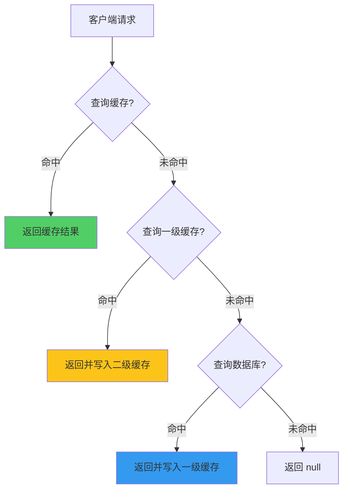
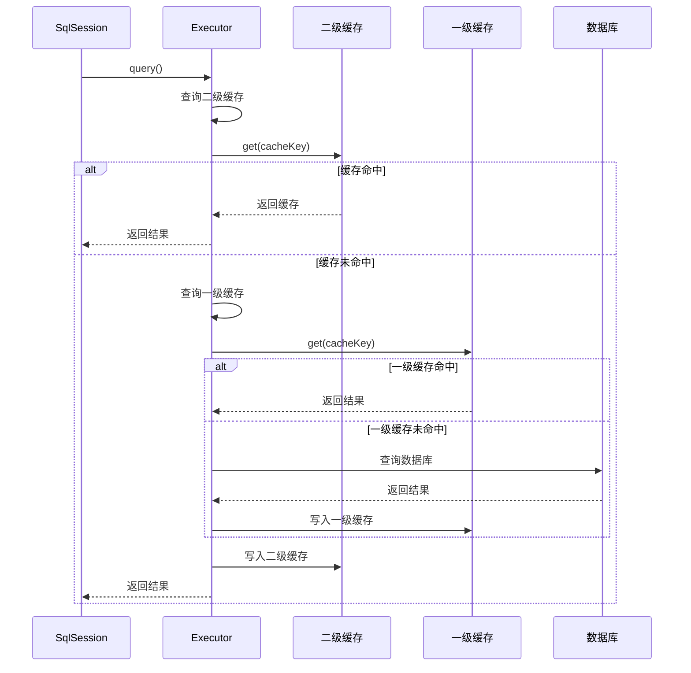
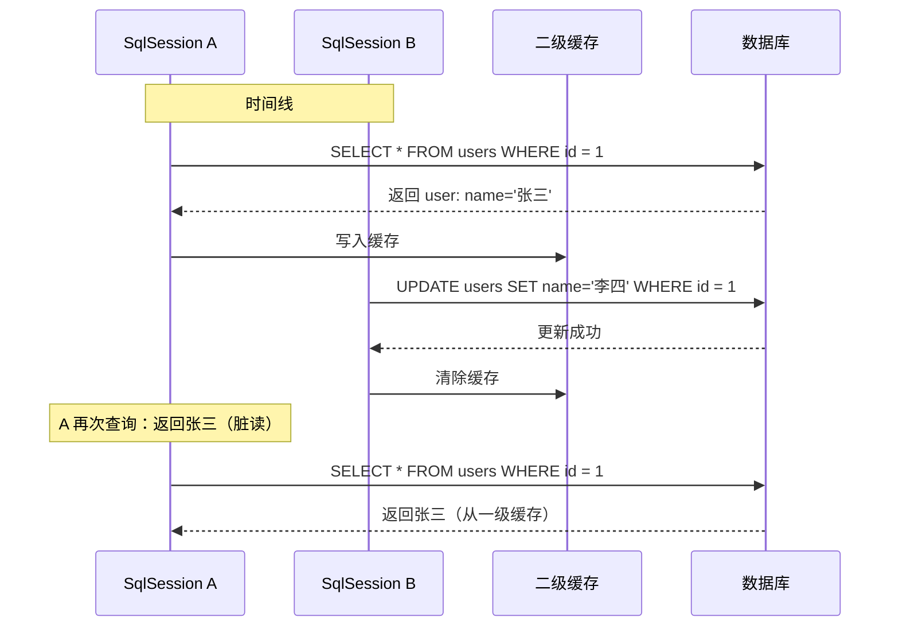

# MyBatis 一级缓存与二级缓存

**目标级别**：P5/P6

## 开场：缓存带来的问题

面试官问：「MyBatis 缓存有什么作用？一级缓存和二级缓存有什么区别？」你说：「一级缓存是 SqlSession 级别的，二级缓存是应用级别的。」面试官追问：「为什么有时候查询结果和数据库不一致？缓存什么时候会失效？」

MyBatis 缓存是面试中的高频题，也是一个容易踩坑的地方。理解缓存机制，才能避免数据不一致问题。

## 面试官最关心的 3 个问题（快速自测）

1. **🔴 MyBatis 一级缓存和二级缓存的区别是什么？**
2. **🔴 为什么有时候查询结果和数据库不一致？**
3. **🟡 二级缓存的失效时机是什么？**

## 一、缓存概述

### 1.1 缓存架构



### 1.2 缓存对比

| 维度 | 一级缓存 | 二级缓存 |
|------|---------|---------|
| 作用域 | SqlSession | Mapper 级别 |
| 存储位置 | 内存 | 磁盘/内存 |
| 默认开启 | ✅ | ❌ |
| 失效条件 | 会话结束 | 刷新配置 |

## 二、一级缓存

### 2.1 原理

MyBatis 在 `BaseExecutor` 中实现一级缓存：

```java title="BaseExecutor.java"
public abstract class BaseExecutor implements Executor {
    
    // 一级缓存：PerpetualCache
    protected final Cache cache = new PerpetualCache("localCache");
    
    @Override
    public <E> List<E> query(MappedStatement ms, Object parameter, 
                             RowBounds rowBounds, ResultHandler resultHandler) {
        
        BoundSql boundSql = ms.getBoundSql(parameter);
        CacheKey key = createCacheKey(ms, parameter, rowBounds, boundSql);
        
        return query(ms, parameter, rowBounds, resultHandler, key, boundSql);
    }
    
    @Override
    public <E> List<E> query(MappedStatement ms, Object parameter, 
                             RowBounds rowBounds, ResultHandler resultHandler,
                             CacheKey key, BoundSql boundSql) {
        
        // 1. 查询一级缓存
        List<E> list = cache.get(key);
        if (list != null) {
            return list;  // 缓存命中
        }
        
        // 2. 缓存未命中，查询数据库
        list = queryFromDatabase(ms, parameter, rowBounds, resultHandler, key, boundSql);
        
        // 3. 结果写入缓存
        cache.put(key, list);
        
        return list;
    }
}
```

### 2.2 缓存键

```java title="BaseExecutor.java"
@Override
public CacheKey createCacheKey(MappedStatement ms, Object parameter, 
                                RowBounds rowBounds, BoundSql boundSql) {
    
    CacheKey cacheKey = new CacheKey();
    
    // 1. MappedStatement 的 id
    cacheKey.update(ms.getId());
    
    // 2. 分页参数
    cacheKey.update(rowBounds.getOffset());
    cacheKey.update(rowBounds.getLimit());
    
    // 3. SQL 语句
    cacheKey.update(boundSql.getSql());
    
    // 4. 参数值
    cacheKey.update(parameter);
    
    return cacheKey;
}
```

### 2.3 缓存失效

一级缓存在以下情况会失效：

```mermaid
graph TD
    A[一级缓存] --> B[commit()]
    A --> C[rollback()]
    A --> D[close()]
    A --> E[clearLocalCache()]
    A --> F[执行 update 操作]
    
    style B fill:#ff6b6b
    style C fill:#ff6b6b
    style D fill:#ff6b6b
    style F fill:#ff6b6b
```

| 操作 | 缓存行为 |
|------|---------|
| commit() | 清空一级缓存 |
| rollback() | 清空一级缓存 |
| close() | 清空一级缓存 |
| update() | 清空一级缓存 |

## 三、二级缓存

### 3.1 开启二级缓存

```xml title="Mapper.xml"
<mapper namespace="com.example.mapper.UserMapper">
    
    <!-- 开启二级缓存 -->
    <cache eviction="LRU" flushInterval="60000" size="256"/>
    
</mapper>
```

```java
@CacheNamespace(eviction = LruCache.class, flushInterval = 60000, size = 256)
public interface UserMapper {
    @Select("SELECT * FROM users WHERE id = #{id}")
    User selectById(Long id);
}
```

### 3.2 二级缓存工作原理



### 3.3 二级缓存配置

```xml
<cache
    eviction="FIFO"           <!-- 缓存淘汰策略：LRU/FIFO/SOFT/WEAK -->
    flushInterval="60000"     <!-- 刷新间隔（毫秒） -->
    size="256"               <!-- 缓存对象数量 -->
    readOnly="false"         <!-- 是否只读 -->
/>
```

| 属性 | 说明 | 可选值 |
|------|------|--------|
| eviction | 淘汰策略 | LRU、FIFO、SOFT、WEAK |
| flushInterval | 刷新间隔 | 毫秒数 |
| size | 缓存数量 | 正整数 |
| readOnly | 是否只读 | true/false |
| blocking | 是否阻塞 | true/false |

## 四、缓存问题

### 4.1 脏读问题



### 4.2 解决方案

```java
// 方案一：更新后清除缓存
@Update("UPDATE users SET name=#{name} WHERE id = #{id}")
@Options(flushCache = Options.FlushCachePolicy.TRUE)
void updateUser(User user);
```

```xml
<!-- Mapper.xml -->
<update id="updateUser">
    UPDATE users SET name=#{name} WHERE id = #{id}
    <!-- 刷新缓存 -->
    <flushCache>true</flushCache>
</update>
```

## 五、面试高频追问

### 追问链 1：缓存失效时机

> **第一层**：一级缓存什么时候失效？
> 
> commit()、rollback()、close()、update() 时失效。

> **第二层**：二级缓存什么时候失效？
> 
> Mapper 的 update 操作、flushCache 配置的刷新间隔。

> **第三层**：二级缓存可以存到 Redis 吗？
> 
> 可以，使用第三方缓存实现，如 MyBatis-Redis。

### 追问链 2：缓存一致性问题

> **第一层**：如何避免缓存脏读？
> 
> 更新后清除缓存，使用 @FlushCache 注解。

> **第二层**：分布式环境下如何保证缓存一致？
> 
> 使用分布式缓存（Redis），配合缓存更新策略。

> **第三层**：缓存和事务的关系？
> 
> 二级缓存的写入在事务提交后执行。

### 追问链 3：性能优化

> **第一层**：如何选择缓存淘汰策略？
> 
> - LRU：最近最少使用（默认）
> - FIFO：先进先出
> - SOFT：软引用
> - WEAK：弱引用

> **第二层**：缓存大小设置多少合适？
> 
> 根据应用内存和查询量设置，建议 256-1024。

> **第三层**：readOnly=true 和 false 的区别？
> 
> true：返回缓存对象引用，性能高但不安全
> false：返回拷贝对象，性能低但安全

## 六、常见错误与陷阱

### 错误 1：分布式环境下使用本地缓存

```java
// ⚠️ 错误：多实例环境下，一级缓存不同步
@Service
public class UserService {
    
    @Autowired
    private UserMapper userMapper;
    
    public User getUser(Long id) {
        // 不同实例的缓存不同，可能返回不同结果
        return userMapper.selectById(id);
    }
}
```

### 错误 2：缓存未及时刷新

```xml
<!-- ⚠️ 错误：未配置 flushCache -->
<update id="updateUser">
    UPDATE users SET name=#{name} WHERE id = #{id}
</update>
```

### 错误 3：忽略二级缓存的副作用

```java
@CacheNamespace(readWrite = false)  // ⚠️ 只读缓存，修改会出问题
public interface UserMapper {
    @Update("UPDATE users SET name=#{name} WHERE id = #{id}")
    int updateUser(User user);
}
```

## 七、对比总结

### 缓存对比表

| 维度 | 一级缓存 | 二级缓存 |
|------|---------|---------|
| 作用域 | SqlSession | Mapper |
| 存储位置 | 内存 | 内存/磁盘 |
| 默认开启 | ✅ | ❌ |
| 失效条件 | 会话结束 | 刷新间隔/更新 |
| 线程安全 | ❌ | ✅ |
| 适用场景 | 单次会话 | 多会话共享 |

### 淘汰策略对比

| 策略 | 说明 | 适用场景 |
|------|------|---------|
| LRU | 最近最少使用（默认） | 大多数场景 |
| FIFO | 先进先出 | 批量处理 |
| SOFT | 软引用 | 内存敏感 |
| WEAK | 弱引用 | 内存敏感 |

## 八、实战应用

### 8.1 使用 Redis 作为二级缓存

```xml
<dependency>
    <groupId>org.mybatis.caches</groupId>
    <artifactId>mybatis-redis</artifactId>
    <version>1.0.0-beta2</version>
</dependency>
```

```xml
<cache type="org.mybatis.caches.redis.RedisCache"/>
```

### 8.2 禁用特定查询的缓存

```java
@Select("SELECT * FROM users WHERE id = #{id}")
@Options FlushCachePolicy = FlushCachePolicy.FALSE
User selectById(Long id);
```

### 8.3 使用缓存注解

```java
@Cacheable(cacheNames = "users", key = "#id")
User selectById(Long id);

@CacheEvict(cacheNames = "users", key = "#user.id")
void updateUser(User user);

@CacheEvict(cacheNames = "users", allEntries = true)
void deleteAllUsers();
```

> **💡 加分回答**：MyBatis-Plus 提供了更强大的缓存机制，支持自动缓存刷新、缓存追踪等功能，值得深入学习。

## 下一步

恭喜你完成了 Spring 25 题的学习！建议继续复习 Java 核心知识或数据库相关专题。
