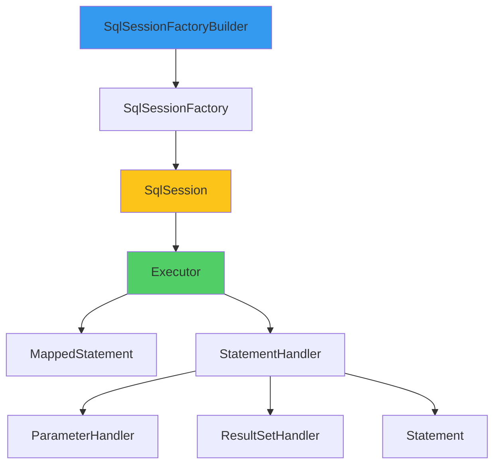
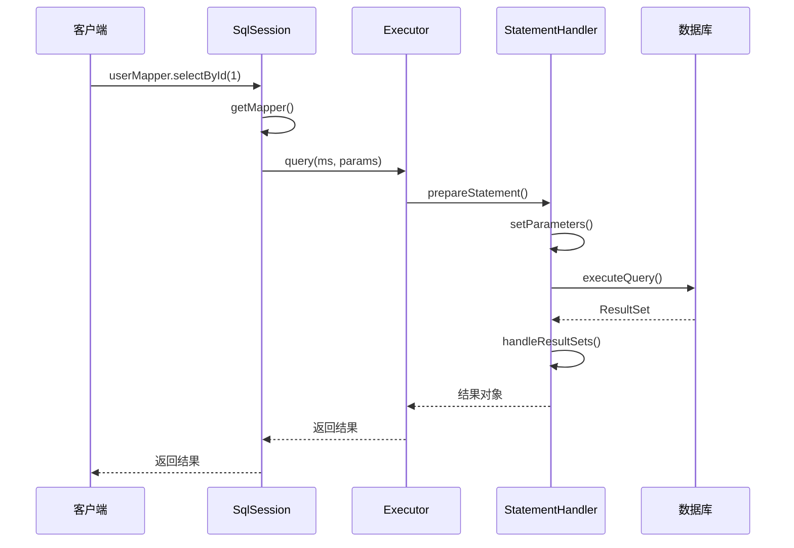
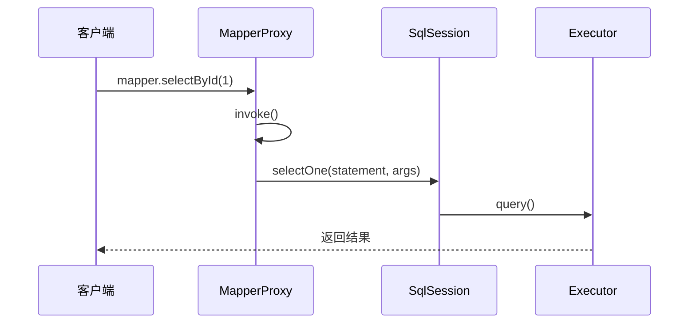
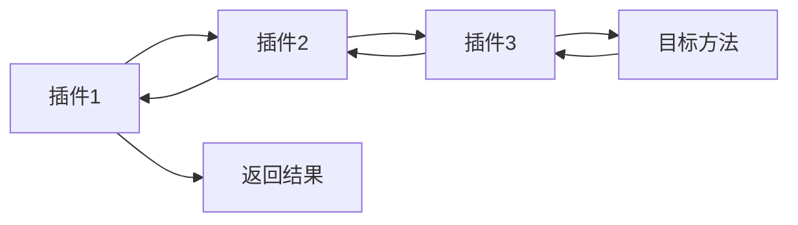

# MyBatis 执行流程

**目标级别**：P5/P6

## 开场：从 SQL 到结果

面试官问：「MyBatis 的执行流程是什么？」你说：「发送 SQL，返回结果。」面试官追问：「那 Mapper 接口是怎么被调用的？SqlSession 和 MapperProxy 是什么关系？」

MyBatis 是 Java 后端开发中最常用的 ORM 框架，理解它的执行流程，有助于排查问题和优化性能。

## 面试官最关心的 3 个问题（快速自测）

1. **🟡 MyBatis 的核心组件有哪些？**
2. **🟡 Mapper 接口是如何被调用的？**
3. **🟡 SqlSession 和 SqlSessionFactory 的关系是什么？**

## 一、核心组件

### 1.1 组件一览

| 组件 | 说明 |
|------|------|
| SqlSessionFactoryBuilder | 构建 SqlSessionFactory |
| SqlSessionFactory | 创建 SqlSession |
| SqlSession | SQL 执行会话 |
| Executor | SQL 执行器 |
| MappedStatement | 映射语句 |
| MapperProxy | Mapper 接口代理 |

### 1.2 架构图



## 二、执行流程

### 2.1 完整流程



### 2.2 源码流程

```java
// 1. 获取 SqlSession
SqlSession session = sqlSessionFactory.openSession();

// 2. 获取 Mapper
UserMapper mapper = session.getMapper(UserMapper.class);

// 3. 调用方法
User user = mapper.selectById(1);

// 4. 关闭 SqlSession
session.close();
```

## 三、核心组件详解

### 3.1 SqlSessionFactoryBuilder

```java title="SqlSessionFactoryBuilder.java"
public SqlSessionFactory build(InputStream inputStream) {
    // 使用 XML 配置构建器
    XMLConfigBuilder parser = new XMLConfigBuilder(inputStream);
    return build(parser.parse());
}

public SqlSessionFactory build(Configuration config) {
    return new DefaultSqlSessionFactory(config);
}
```

### 3.2 SqlSessionFactory

```java title="SqlSessionFactory.java"
public interface SqlSessionFactory {
    SqlSession openSession();
    SqlSession openSession(boolean autoCommit);
    SqlSession openSession(Connection connection);
}
```

### 3.3 SqlSession

```java title="SqlSession.java"
public interface SqlSession {
    <T> T selectOne(String statement);
    <T> T selectOne(String statement, Object parameter);
    <T> T getMapper(Class<T> type);
    void commit();
    void rollback();
    void close();
}
```

### 3.4 Executor

```java title="Executor.java"
public interface Executor {
    <E> List<E> query(MappedStatement ms, Object parameter, 
                      RowBounds rowBounds, ResultHandler resultHandler);
    int update(MappedStatement ms, Object parameter);
    int insert(MappedStatement ms, Object parameter);
    int delete(MappedStatement ms, Object parameter);
}
```

## 四、Mapper 代理机制

### 4.1 MapperProxy

```java title="MapperProxy.java"
public class MapperProxy<T> implements InvocationHandler {
    
    @Override
    public Object invoke(Object proxy, Method method, Object[] args) throws Throwable {
        if (Object.class.equals(method.getDeclaringClass())) {
            return method.invoke(this, args);
        }
        
        // 执行 SQL
        return sqlSession.selectOne(statement, args);
    }
}
```

### 4.2 MapperProxyFactory

```java title="MapperProxyFactory.java"
public class MapperProxyFactory<T> {
    
    public T newInstance(SqlSession sqlSession) {
        MapperProxy<T> proxy = new MapperProxy<>(sqlSession, mapperInterface);
        return (T) Proxy.newProxyInstance(
            mapperInterface.getClassLoader(),
            new Class[]{mapperInterface},
            proxy
        );
    }
}
```

### 4.3 调用流程



## 五、SQL 执行过程

### 5.1 Statement 准备

```java title="SimpleExecutor.java"
public <E> List<E> doQuery(MappedStatement ms, Object parameter, 
                          RowBounds rowBounds, ResultHandler resultHandler) {
    Statement stmt = null;
    
    try {
        // 1. 获取配置
        Configuration configuration = ms.getConfiguration();
        
        // 2. 创建 StatementHandler
        StatementHandler handler = configuration.newStatementHandler(
            ms, parameter, rowBounds, resultHandler);
        
        // 3. 准备 Statement
        stmt = prepareStatement(handler, ms.getStatementLog());
        
        // 4. 执行查询
        return handler.query(stmt, resultHandler);
        
    } finally {
        closeStatement(stmt);
    }
}

private Statement prepareStatement(StatementHandler handler, Log statementLog) {
    Statement stmt;
    
    // 获取连接
    Connection connection = getConnection(statementLog);
    
    // 创建 Statement
    stmt = handler.prepare(connection);
    
    // 设置参数
    handler.parameterize(stmt);
    
    return stmt;
}
```

### 5.2 参数处理

```java title="ParameterHandler.java"
public interface ParameterHandler {
    Object getParameterObject();
    void setParameters(PreparedStatement ps);
}
```

### 5.3 结果处理

```java title="ResultSetHandler.java"
public interface ResultSetHandler {
    <E> List<E> handleResultSets(Statement stmt);
    <E> Map<K, V> handleMapResults(MappedStatement ms, ResultSet rs);
}
```

## 六、插件机制

### 6.1 插件原理

```java title="Interceptor.java"
@Intercepts({
    @Signature(type = Executor.class, method = "query", 
              args = {MappedStatement.class, Object.class, RowBounds.class}),
    @Signature(type = StatementHandler.class, method = "prepare", 
              args = {Connection.class})
})
public class MyPlugin implements Interceptor {
    
    @Override
    public Object intercept(Invocation invocation) throws Throwable {
        // 在方法执行前后添加逻辑
        Object result = invocation.proceed();
        return result;
    }
}
```

### 6.2 插件链



## 七、面试高频追问

### 追问链 1：SqlSession 线程安全

> **第一层**：SqlSession 是线程安全的吗？
> 
> 不是，SqlSession 不是线程安全的。

> **第二层**：为什么？
> 
> SqlSession 包含数据库连接，不是线程安全的。

> **第三层**：如何正确使用 SqlSession？
> 
> 在方法内获取，用完后关闭。

### 追问链 2：Mapper 代理原理

> **第一层**：Mapper 接口为什么不需要实现类？
> 
> MyBatis 使用 JDK 动态代理生成实现类。

> **第二层**：代理对象在哪里创建？
> 
> 在 SqlSession.getMapper() 方法中。

> **第三层**：Mapper 方法如何找到对应的 SQL？
> 
> 通过 Mapper 注解或 XML 映射文件的 namespace + method id。

### 追问链 3：执行器类型

> **第一层**：MyBatis 有哪些执行器？
> 
> SimpleExecutor、ReuseExecutor、BatchExecutor。

> **第二层**：它们有什么区别？
> 
> - SimpleExecutor：每次执行创建新的 Statement
> - ReuseExecutor：重用 Statement
> - BatchExecutor：批量执行 SQL

> **第三层**：如何选择执行器？
> 
> 在配置文件中设置 `defaultExecutorType`。

## 八、常见错误与陷阱

### 错误 1：SqlSession 未关闭

```java
// ⚠️ 错误：SqlSession 未关闭
public User getUser(Long id) {
    SqlSession session = sqlSessionFactory.openSession();
    UserMapper mapper = session.getMapper(UserMapper.class);
    return mapper.selectById(id);
}

// ✅ 正确：使用 try-finally
public User getUser(Long id) {
    SqlSession session = sqlSessionFactory.openSession();
    try {
        UserMapper mapper = session.getMapper(UserMapper.class);
        return mapper.selectById(id);
    } finally {
        session.close();
    }
}

// ✅ 最佳：使用 try-with-resources
public User getUser(Long id) {
    try (SqlSession session = sqlSessionFactory.openSession()) {
        UserMapper mapper = session.getMapper(UserMapper.class);
        return mapper.selectById(id);
    }
}
```

### 错误 2：忘记提交事务

```java
// ⚠️ 错误：未提交事务
public void insert(User user) {
    SqlSession session = sqlSessionFactory.openSession();
    UserMapper mapper = session.getMapper(UserMapper.class);
    mapper.insert(user);
    // ⚠️ 没有提交，数据不会保存
}

// ✅ 正确：显式提交
public void insert(User user) {
    SqlSession session = sqlSessionFactory.openSession();
    try {
        UserMapper mapper = session.getMapper(UserMapper.class);
        mapper.insert(user);
        session.commit();  // 提交事务
    } finally {
        session.close();
    }
}
```

## 九、对比总结

### 执行器对比

| 执行器 | 说明 | 适用场景 |
|-------|------|---------|
| SimpleExecutor | 每次创建新 Statement | 大多数场景 |
| ReuseExecutor | 重用 Statement | 多次执行相同 SQL |
| BatchExecutor | 批量执行 | 批量插入/更新 |

### SqlSession 使用方式对比

| 方式 | 说明 | 推荐程度 |
|------|------|---------|
| SqlSessionDaoSupport | 继承基类 | 不推荐 |
| SqlSessionTemplate | 注入模板 | 推荐 |
| MapperScannerConfigurer | 自动扫描 | 推荐 |

## 十、实战应用

### 10.1 通用 BaseMapper

```java
public interface BaseMapper<T> {
    
    @Select("SELECT * FROM ${tableName} WHERE id = #{id}")
    T selectById(@Param("tableName") String tableName, 
                 @Param("id") Long id);
    
    @Insert("INSERT INTO ${tableName} VALUES (#{entity})")
    int insert(@Param("tableName") String tableName, 
               @Param("entity") T entity);
}
```

### 10.2 分页插件使用

```java
public class PagePlugin implements Interceptor {
    
    @Override
    public Object intercept(Invocation invocation) throws Throwable {
        Object[] args = invocation.getArgs();
        MappedStatement ms = (MappedStatement) args[0];
        Object parameter = args[1];
        BoundSql boundSql = ms.getBoundSql(parameter);
        
        String sql = boundSql.getSql();
        // 改造 SQL 实现分页
        sql = sql + " LIMIT " + pageOffset + "," + pageSize;
        
        return invocation.proceed();
    }
}
```

> **💡 加分回答**：MyBatis-Plus 在 MyBatis 基础上提供了更强大的功能，如通用 CRUD、分页插件、逻辑删除等，值得深入学习。

## 下一步

理解 MyBatis 缓存机制，请阅读 [MyBatis 一级缓存与二级缓存](/questions/spring/mybatis-cache)。
