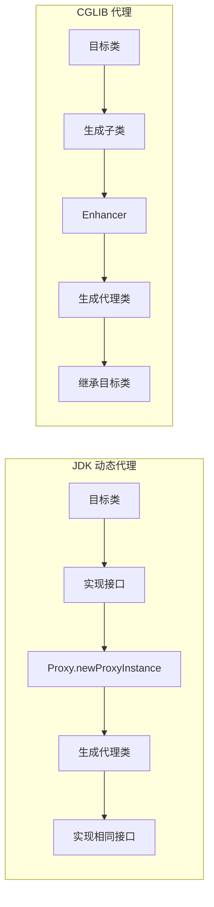
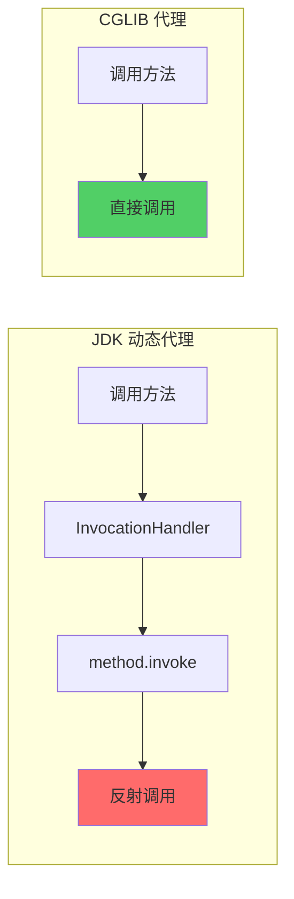

# JDK 动态代理 vs CGLIB

**目标级别**：P5/P6

## 开场：为什么 Spring 最终选择了 CGLIB

面试官问：「Spring AOP 默认使用哪种代理方式？」你说：「CGLIB。」面试官追问：「为什么不用 JDK 动态代理？两者各有什么优缺点？」

这道题考察的是你对 Spring 代理机制的理解深度。JDK 动态代理和 CGLIB 不是简单的「哪个更好」，而是适用场景不同。

## 面试官最关心的 3 个问题（快速自测）

1. **🔴 JDK 动态代理和 CGLIB 的核心区别是什么？**
2. **🔴 Spring 为什么默认选择 CGLIB 而不是 JDK 动态代理？**
3. **🟡 什么情况下必须使用 JDK 动态代理而不是 CGLIB？**

## 一、两种代理方式对比

### 1.1 基本原理对比



### 1.2 核心区别表

| 维度 | JDK 动态代理 | CGLIB 代理 |
|------|-------------|-----------|
| 实现原理 | 实现接口 | 继承类 |
| 目标类要求 | 必须实现接口 | 不能是 final |
| 代理对象类型 | 与目标类实现相同接口 | 目标类的子类 |
| 性能 | 反射调用 | 直接调用 |
| 字节码生成 | JDK 提供 | 第三方库 |
| 构造器调用 | 不调用 | 调用（super()） |
| Spring 默认 | ❌ | ✅ |

## 二、JDK 动态代理详解

### 2.1 核心代码

```java
public class JdkDynamicProxyDemo {
    
    public static void main(String[] args) {
        // 1. 创建目标对象
        UserService target = new UserServiceImpl();
        
        // 2. 创建InvocationHandler
        InvocationHandler handler = new InvocationHandler() {
            @Override
            public Object invoke(Object proxy, Method method, Object[] args) 
                    throws Throwable {
                // 前置通知
                System.out.println("Before: " + method.getName());
                
                // 调用目标方法
                Object result = method.invoke(target, args);
                
                // 后置通知
                System.out.println("After: " + method.getName());
                
                return result;
            }
        };
        
        // 3. 生成代理对象
        UserService proxy = (UserService) Proxy.newProxyInstance(
            target.getClass().getClassLoader(),      // 类加载器
            target.getClass().getInterfaces(),       // 目标类实现的接口
            handler                                  // InvocationHandler
        );
        
        // 4. 调用代理方法
        proxy.saveUser();
    }
}
```

### 2.2 生成的代理类结构

```java
// 生成的代理类（简化版）
public final class $Proxy0 extends Proxy implements UserService {
    
    private InvocationHandler h;
    
    public $Proxy0(InvocationHandler h) {
        this.h = h;
    }
    
    @Override
    public void saveUser() {
        try {
            // 调用InvocationHandler.invoke()
            h.invoke(this, m3, null);
        } catch (RuntimeException e) {
            throw e;
        } catch (Throwable e) {
            // ...
        }
    }
    
    // 所有方法都类似
}
```

```mermaid
classDiagram
    class Proxy {
        -InvocationHandler h
    }
    
    class UserService {
        <<interface>>
        +void saveUser()
    }
    
    class "$Proxy0" {
        -InvocationHandler h
        +void saveUser()
    }
    
    Proxy <|-- "$Proxy0"
    UserService <|.. "$Proxy0"
    
    note for "$Proxy0" "生成的代理类"
```

### 2.3 局限性

```java
// 场景：目标类没有实现接口
@Service
public class UserService {  // ⚠️ 没有实现任何接口
    public void saveUser() { }
}

// 使用 JDK 动态代理会失败
UserService proxy = (UserService) Proxy.newProxyInstance(
    target.getClass().getClassLoader(),
    target.getClass().getInterfaces(),  // ⚠️ 返回空数组！
    handler
);
```

## 三、CGLIB 代理详解

### 3.1 核心代码

```java
public class CglibProxyDemo {
    
    public static void main(String[] args) {
        // 1. 创建目标对象
        UserService target = new UserService();
        
        // 2. 创建 Enhancer
        Enhancer enhancer = new Enhancer();
        enhancer.setSuperclass(UserService.class);  // 设置父类
        enhancer.setCallback(new MethodInterceptor() {
            @Override
            public Object intercept(Object obj, Method method, Object[] args,
                                  MethodProxy proxy) throws Throwable {
                // 前置通知
                System.out.println("Before: " + method.getName());
                
                // 调用目标方法（使用代理方法，不是反射）
                Object result = proxy.invokeSuper(obj, args);
                
                // 后置通知
                System.out.println("After: " + method.getName());
                
                return result;
            }
        });
        
        // 3. 生成代理对象
        UserService proxy = (UserService) enhancer.create();
        
        // 4. 调用代理方法
        proxy.saveUser();
    }
}
```

### 3.2 生成的代理类结构

```mermaid
classDiagram
    class UserService {
        +void saveUser()
    }
    
    class "UserService$$EnhancerByCGLIB$$xxxx" {
        -MethodInterceptor callback
        +void saveUser()
        #void saveUser$代理()
    }
    
    UserService <|-- "UserService$$EnhancerByCGLIB$$xxxx"
    
    note for "UserService$$EnhancerByCGLIB$$xxxx" "生成的CGLIB代理类"
```

### 3.3 局限性

```java
// ⚠️ 场景一：final 类无法代理
public final class FinalService { }  // CGLIB 无法代理

// ⚠️ 场景二：final 方法无法覆盖
public class UserService {
    public final void saveUser() { }  // CGLIB 无法增强
}
```

## 四、Spring 的选择策略

### 4.1 Spring 5.x 的选择逻辑

```java title="ProxyFactory.java"
public class ProxyFactory {
    
    public Object getProxy() {
        // 1. 如果指定了接口，优先使用 JDK 代理
        if (interfacesExist()) {
            // 使用 JDK 动态代理
            return createJdkDynamicProxy();
        }
        
        // 2. 否则使用 CGLIB
        return createCglibProxy();
    }
}
```

**Spring 的默认行为**：

- **有接口**：`proxyTargetClass = false` → JDK 动态代理
- **无接口**：`proxyTargetClass = true` → CGLIB 代理
- **Spring Boot 2.0+**：默认 `proxyTargetClass = true`

### 4.2 为什么 Spring Boot 2.0+ 默认 CGLIB

| 原因 | 说明 |
|------|------|
| 无需接口 | 大多数 Bean 没有实现接口，CGLIB 更通用 |
| 性能更好 | CGLIB 直接调用，JDK 代理通过反射 |
| 保持一致性 | 无论是否有接口，行为一致 |

### 4.3 强制使用 JDK 代理

```java
// 方法一：@EnableAspectJAutoProxy
@Configuration
@EnableAspectJAutoProxy(proxyTargetClass = false)
public class AppConfig { }

// 方法二：Spring Boot 配置
spring:
  aop:
    proxy-target-class: false
```

## 五、性能对比

### 5.1 性能测试数据（参考）

| 场景 | JDK 动态代理 | CGLIB | 差异 |
|------|------------|-------|------|
| 方法调用（100万次） | ~300ms | ~150ms | CGLIB 快 50% |
| 首次创建 | ~50ms | ~100ms | JDK 快 50% |
| 内存占用 | 较小 | 较大 | JDK 更好 |

> **注意**：实际性能差异取决于具体场景和 JVM 版本，现代 JVM 对反射做了大量优化。

### 5.2 性能差异原因



## 六、面试高频追问

### 追问链 1：构造器调用问题

> **第一层**：CGLIB 代理会调用目标类的构造器吗？
> 
> 会。CGLIB 通过继承实现，构造器通过 `super()` 调用。

> **第二层**：为什么 JDK 代理不需要调用构造器？
> 
> JDK 代理通过组合实现，不是继承，所以不需要调用目标类的构造器。

> **第三层**：这会导致什么问题？
> 
> 如果目标类的构造器有副作用（如初始化日志、创建资源），CGLIB 会触发这些副作用，JDK 代理不会。

### 追问链 2：方法调用方式

> **第一层**：JDK 代理和 CGLIB 的方法调用有什么区别？
> 
> JDK 代理使用 `method.invoke(target, args)` 反射调用，CGLIB 使用 `proxy.invokeSuper(obj, args)` 直接调用。

> **第二层**：为什么 CGLIB 性能更好？
> 
> 因为 `invokeSuper` 生成的是直接方法调用字节码，不需要反射。

> **第三层**：反射调用为什么慢？
> 
> 反射调用需要检查访问权限、参数类型转换、方法查找等步骤。

### 追问链 3：Spring AOP 的代理选择

> **第一层**：Spring 如何决定使用哪种代理？
> 
> Spring 使用 `DefaultAopProxyFactory` 创建代理，根据配置和目标类决定。

> **第二层**：@Async 注解使用哪种代理？
> 
> `@Async` 默认使用 CGLIB，除非 `proxyTargetClass = false`。

> **第三层**：为什么？
> 
> 因为 Spring 无法保证所有被 @Async 标注的类都实现了接口。

## 七、常见错误与陷阱

### 错误 1：假设代理类类型

```java
@Service
public class UserService {
    public void saveUser() { }
}

// 错误：假设代理类型
UserService proxy = context.getBean(UserService.class);
if (proxy instanceof UserService) {  // ⚠️ 永远是 true
    // 实际可能是 UserService$$CGLIB$$xxx
}

// 正确：使用 AopUtils
if (AopUtils.isAopProxy(proxy)) {
    // 是代理对象
}
```

### 错误 2：final 方法无法增强

```java
@Service
public class UserService {
    
    @Transactional
    public final void saveUser() {  // ⚠️ final 方法无法被增强
        // 事务不会生效
    }
}
```

### 错误 3：循环依赖与代理

```java
@Service
public class A {
    @Autowired
    private B b;
    
    @Async
    public void methodA() { }
}

@Service
public class B {
    @Autowired
    private A a;
}
```

> **⚠️ 陷阱**：@Async 和循环依赖结合时，可能导致代理创建失败。

## 八、对比总结

### JDK 动态代理适用场景

| 场景 | 说明 |
|------|------|
| 目标类实现了接口 | 典型的业务服务类 |
| 追求代码简洁 | 不需要额外依赖 |
| 接口经常变化 | 代理更灵活 |

### CGLIB 代理适用场景

| 场景 | 说明 |
|------|------|
| 目标类没有实现接口 | 工具类、POJO |
| 追求性能 | 高并发场景 |
| 需要拦截 protected/private | CGLIB 可增强（需设置） |

### 选择建议

```java
// 绝大多数场景：使用 Spring 默认（Spring Boot 2.0+ 是 CGLIB）

// 特定场景：强制使用 JDK 代理
@EnableAspectJAutoProxy(proxyTargetClass = false)
public class Config { }
```

## 九、实战应用

### 9.1 自定义 JDK 代理工厂

```java
public class JdkProxyFactory {
    
    public static <T> T createProxy(T target, Advice advice) {
        return (T) Proxy.newProxyInstance(
            target.getClass().getClassLoader(),
            target.getClass().getInterfaces(),
            (proxy, method, args) -> {
                advice.before(method);
                Object result = method.invoke(target, args);
                advice.after(method);
                return result;
            }
        );
    }
}
```

### 9.2 自定义 CGLIB 代理工厂

```java
public class CglibProxyFactory {
    
    public static <T> T createProxy(Class<T> clazz, Advice advice) {
        Enhancer enhancer = new Enhancer();
        enhancer.setSuperclass(clazz);
        enhancer.setCallback((MethodInterceptor) (obj, method, args, proxy) -> {
            advice.before(method);
            Object result = proxy.invokeSuper(obj, args);
            advice.after(method);
            return result;
        });
        return clazz.cast(enhancer.create());
    }
}
```

### 9.3 Spring 配置选择

```java
@Configuration
public class AopConfig {
    
    @Bean
    @ConditionalOnProperty(name = "aop.proxy-type", havingValue = "jdk")
    public Advisor jdkAdvisor() {
        return new JdkRegexpMethodPointcutAdvisor();
    }
    
    @Bean
    @ConditionalOnProperty(name = "aop.proxy-type", havingValue = "cglib", 
                          matchIfMissing = true)
    public Advisor cglibAdvisor() {
        return new CglibRegexpMethodPointcutAdvisor();
    }
}
```

> **💡 加分回答**：Spring 5.x 引入了 `proxyFactoryBean()` 方法，可以更灵活地控制代理创建过程。

## 下一步

理解 Spring AOP 通知的执行顺序，请阅读 [通知执行顺序](/questions/spring/advice-order)。
