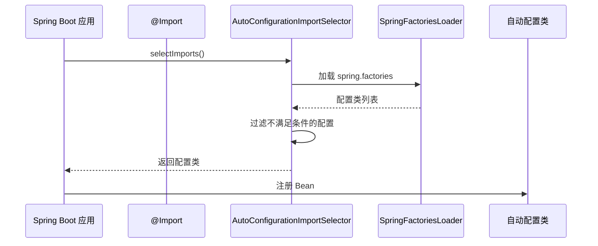

# Spring Boot Starter 原理

**目标级别**：P6

## 开场：一行依赖的奥秘

面试官问：「Spring Boot Starter 是什么？它是怎么工作的？」你说：「Starter 是一组依赖，方便引入。」面试官追问：「那 Starter 中的自动配置是怎么生效的？为什么只要引入依赖就能用？」

Spring Boot Starter 是 Spring Boot 的核心特性之一。理解 Starter 原理，才能理解「零配置」是如何实现的。

## 面试官最关心的 3 个问题（快速自测）

1. **🟡 Spring Boot Starter 由哪几部分组成？**
2. **🟡 Starter 中的自动配置是如何生效的？**
3. **🟡 如何创建一个自定义 Starter？**

## 一、Starter 组成

### 1.1 核心组件

| 组件 | 说明 | 命名规范 |
|------|------|---------|
| Starter POM | 依赖管理器 | spring-boot-starter-* |
| AutoConfigure | 自动配置模块 | *-spring-boot-autoconfigure |
| AutoConfigure | 配置属性模块 | *-spring-boot-configuration |

### 1.2 架构图

```mermaid
flowchart TD
    A[用户项目] --> B[Starter POM]
    B --> C[AutoConfigure 模块]
    B --> D[其他依赖]
    
    C --> E[自动配置类]
    C --> F[配置属性类]
    C --> G[spring.factories]
    
    E --> H[@Configuration]
    E --> I[@Conditional]
    
    style A fill:#339af0
    style C fill:#51cf66
```

### 1.3 官方 Starter 命名

| Starter | 用途 |
|---------|------|
| spring-boot-starter-web | Web 开发 |
| spring-boot-starter-data-jpa | JPA 数据访问 |
| spring-boot-starter-data-redis | Redis 支持 |
| spring-boot-starter-validation | 参数校验 |
| spring-boot-starter-actuator | 监控端点 |

## 二、Starter 原理

### 2.1 自动配置生效流程



### 2.2 spring.factories 配置

``` properties title="META-INF/spring.factories"
org.springframework.boot.autoconfigure.EnableAutoConfiguration=\
com.example.autoconfigure.MyAutoConfiguration
```

### 2.3 自动配置类结构

```java
@Configuration
@ConditionalOnClass(MyService.class)           // 条件：MyService 类存在
@ConditionalOnProperty(                          // 条件：配置属性存在
    prefix = "my.service",
    name = "enabled",
    havingValue = "true",
    matchIfMissing = true
)
@EnableConfigurationProperties(MyProperties.class)  // 启用配置属性
public class MyAutoConfiguration {
    
    @Bean
    @ConditionalOnMissingBean                    // 条件：不存在该 Bean
    public MyService myService(MyProperties properties) {
        return new MyServiceImpl(properties);
    }
}
```

## 三、自定义 Starter

### 3.1 项目结构

```
my-service-spring-boot-starter/
├── pom.xml
└── src/main/
    ├── java/
    │   └── com/example/autoconfigure/
    │       ├── MyServiceAutoConfiguration.java
    │       └── MyProperties.java
    └── resources/
        └── META-INF/
            └── spring.factories
```

### 3.2 依赖配置

```xml title="pom.xml"
<project>
    <groupId>com.example</groupId>
    <artifactId>my-service-spring-boot-starter</artifactId>
    <version>1.0.0</version>
    
    <dependencies>
        <dependency>
            <groupId>org.springframework.boot</groupId>
            <artifactId>spring-boot-autoconfigure</artifactId>
        </dependency>
    </dependencies>
</project>
```

### 3.3 配置属性类

```java
@ConfigurationProperties(prefix = "my.service")
public class MyProperties {
    
    private String host = "localhost";
    private int port = 8080;
    private boolean enabled = true;
    
    // getters and setters
}
```

### 3.4 自动配置类

```java
@Configuration
@ConditionalOnClass(MyService.class)
@ConditionalOnProperty(
    prefix = "my.service",
    name = "enabled",
    havingValue = "true",
    matchIfMissing = true
)
@EnableConfigurationProperties(MyProperties.class)
public class MyServiceAutoConfiguration {
    
    private final MyProperties properties;
    
    public MyServiceAutoConfiguration(MyProperties properties) {
        this.properties = properties;
    }
    
    @Bean
    @ConditionalOnMissingBean
    public MyService myService() {
        return new MyServiceImpl(properties);
    }
}
```

### 3.5 spring.factories

``` properties title="META-INF/spring.factories"
org.springframework.boot.autoconfigure.EnableAutoConfiguration=\
com.example.autoconfigure.MyServiceAutoConfiguration
```

## 四、Starter 使用

### 4.1 引入 Starter

```xml
<dependency>
    <groupId>com.example</groupId>
    <artifactId>my-service-spring-boot-starter</artifactId>
    <version>1.0.0</version>
</dependency>
```

### 4.2 配置属性

```yaml
my:
  service:
    host: localhost
    port: 8080
    enabled: true
```

### 4.3 使用

```java
@Service
public class UserService {
    
    @Autowired
    private MyService myService;
    
    public void doSomething() {
        myService.execute();
    }
}
```

## 五、源码解析

### 5.1 Starter 自动配置加载

```java title="AutoConfigurationImportSelector.java"
protected List<String> getCandidateConfigurations(
        AnnotationMetadata metadata, 
        AnnotationAttributes attributes) {
    
    // 加载 META-INF/spring.factories 中的配置
    List<String> configurations = SpringFactoriesLoader.loadFactoryNames(
        EnableAutoConfiguration.class, 
        getBeanClassLoader()
    );
    
    return configurations;
}
```

### 5.2 条件注解处理

```java title="ConfigurationClassFilter.java"
private List<String> filter(List<String> configurationClasses, 
                           AutoConfigurationMetadata metadata) {
    
    // 遍历每个配置类
    for (String candidate : configurationClasses) {
        // 检查所有 @Conditional 注解
        if (matches(candidate, metadata)) {
            result.add(candidate);
        }
    }
    
    return result;
}
```

## 六、面试高频追问

### 追问链 1：Starter 命名规范

> **第一层**：Spring Boot Starter 的命名规范是什么？
> 
> 官方 Starter：`spring-boot-starter-*`
> 第三方 Starter：`*-spring-boot-starter`

> **第二层**：为什么要区分官方和第三方命名？
> 
> 官方 Starter 有特殊处理，第三方 Starter 使用不同前缀区分。

> **第三层**：如果使用了错误的命名会怎样？
> 
> 不会被特殊处理，可能无法正确自动配置。

### 追问链 2：@EnableConfigurationProperties

> **第一层**：@EnableConfigurationProperties 做了什么？
> 
> 启用 @ConfigurationProperties 标注的配置属性类，并注册为 Bean。

> **第二层**：和 @ConfigurationPropertiesScan 有什么区别？
> 
> @EnableConfigurationProperties 在配置类上使用，@ConfigurationPropertiesScan 在启动类上使用。

> **第三层**：为什么不直接用 @Component？
> 
> @Component 会立即注册，@EnableConfigurationProperties 可以配合 @Conditional。

### 追问链 3：Starter 依赖管理

> **第一层**：Spring Boot Starter Parent 做了什么？
> 
> 统一管理依赖版本，提供默认配置。

> **第二层**：为什么要用 Starter Parent？
> 
> 避免版本冲突，简化依赖管理。

> **第三层**：如果不用 Starter Parent 怎么办？
> 
> 需要手动管理依赖版本。

## 七、常见错误与陷阱

### 错误 1：spring.factories 位置错误

``` properties
# ⚠️ 错误
src/main/java/META-INF/spring.factories

# ✅ 正确
src/main/resources/META-INF/spring.factories
```

### 错误 2：依赖传递

```xml
<!-- ⚠️ 错误：不应包含具体实现 -->
<dependency>
    <groupId>com.example</groupId>
    <artifactId>my-service-core</artifactId>
</dependency>
```

### 错误 3：缺少 @Conditional

```java
@Configuration  // ⚠️ 缺少条件注解
public class MyAutoConfiguration {
    @Bean
    public MyService myService() {
        return new MyServiceImpl();
    }
}
```

## 八、对比总结

### Starter 对比

| 维度 | 官方 Starter | 自定义 Starter |
|------|-------------|---------------|
| 命名 | spring-boot-starter-* | *-spring-boot-starter |
| 自动配置 | 官方维护 | 自定义 |
| 条件检查 | 完善 | 需要完善 |

### 自动配置条件对比

| 条件 | 适用场景 |
|------|---------|
| @ConditionalOnClass | 检查类是否存在 |
| @ConditionalOnBean | 检查 Bean 是否存在 |
| @ConditionalOnProperty | 检查配置属性 |
| @ConditionalOnMissingBean | 避免重复配置 |

## 九、实战应用

### 9.1 完整 Starter 示例

```java
// 1. Properties 类
@ConfigurationProperties(prefix = "my.service")
public class MyServiceProperties {
    private String url = "http://localhost:8080";
    private int timeout = 5000;
}

// 2. 自动配置类
@Configuration
@ConditionalOnClass(MyService.class)
@ConditionalOnProperty(prefix = "my.service", name = "enabled", matchIfMissing = true)
@EnableConfigurationProperties(MyServiceProperties.class)
public class MyServiceAutoConfiguration {
    
    @Bean
    @ConditionalOnMissingBean
    public MyService myService(MyServiceProperties properties) {
        return new MyServiceImpl(properties);
    }
}

// 3. spring.factories
org.springframework.boot.autoconfigure.EnableAutoConfiguration=\
com.example.autoconfigure.MyServiceAutoConfiguration
```

### 9.2 多环境配置

```java
@Configuration
@Profile("prod")
public class ProdAutoConfiguration {
    // 生产环境配置
}

@Configuration
@Profile("dev")
public class DevAutoConfiguration {
    // 开发环境配置
}
```

> **💡 加分回答**：Spring Boot 3.0 改进了 Starter 的配置方式，使用 `AutoConfiguration.imports` 文件替代 `spring.factories`。

## 下一步

深入了解如何自定义 Starter，请阅读 [自定义 Starter 实现](/questions/spring/custom-starter)。
