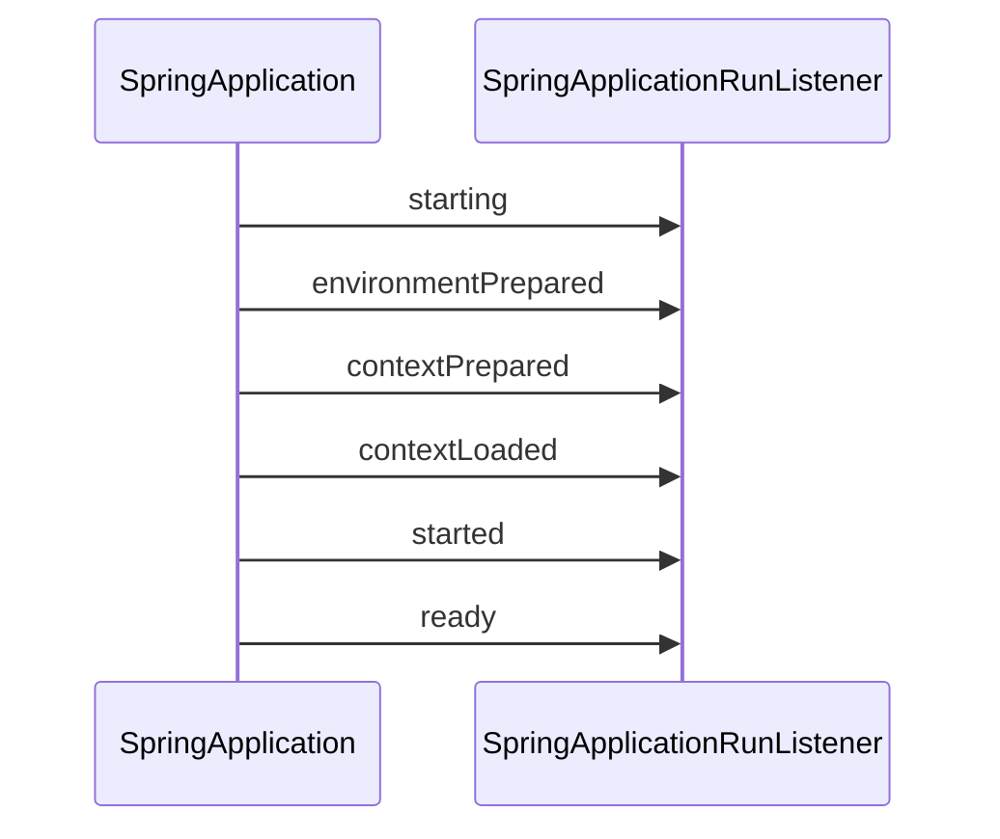

# Spring Boot 启动流程

**目标级别**：P5/P6

## 开场：从 main 方法开始

面试官问：「Spring Boot 应用的启动流程是什么？」你说：「从 main 方法开始。」面试官追问：「那 SpringApplication.run() 做了什么？Spring Boot 是如何启动内嵌 Tomcat 的？」

Spring Boot 的启动流程是面试中的高频题。理解启动流程，才能理解 Spring Boot 的设计原理。

## 面试官最关心的 3 个问题（快速自测）

1. **🟡 SpringApplication.run() 的完整流程是什么？**
2. **🟡 Spring Boot 是如何启动内嵌 Web 容器的？**
3. **🟡 Spring Boot 的事件机制是如何工作的？**

## 一、启动流程总览

### 1.1 核心流程

```mermaid
flowchart TD
    A[SpringApplication.run()] --> B[创建 SpringApplication]
    B --> C[推断应用类型]
    C --> D[加载 spring.factories]
    D --> E[设置初始配置]
    E --> F[执行 run()]
    
    F --> G[准备 Environment]
    G --> H[创建容器]
    H --> I[刷新容器]
    I --> J[执行 Runner]
    J --> K[应用启动完成]
    
    style A fill:#339af0
    style K fill:#51cf66
```

### 1.2 详细步骤

| 阶段 | 说明 |
|------|------|
| 1. 创建 SpringApplication | 推断应用类型，加载初始化器 |
| 2. 准备 Environment | 加载配置文件 |
| 3. 创建容器 | 创建 ApplicationContext |
| 4. 刷新容器 | 启动 Web 服务器 |
| 5. 执行 Runner | 执行 CommandLineRunner |

## 二、源码解析

### 2.1 SpringApplication.run()

```java title="SpringApplication.java"
public static ConfigurableApplicationContext run(Class<?> primarySource, 
                                                 String... args) {
    return new SpringApplication(primarySource).run(args);
}

public ConfigurableApplicationContext run(String... args) {
    // 1. 创建并启动计时器
    StopWatch stopWatch = new StopWatch();
    stopWatch.start();
    
    // 2. 创建 BootstrapContext
    BootstrapContext bootstrapContext = createBootstrapContext();
    
    // 3. 配置 Headless 属性
    configureHeadlessProperty();
    
    // 4. 获取并启动监听器
    SpringApplicationRunListeners listeners = getRunListenersAndStart();
    
    // 5. 准备 Environment
    ConfigurableEnvironment environment = prepareEnvironment(listeners, bootstrapContext);
    
    // 6. 打印 Banner
    Banner printedBanner = printBanner(environment);
    
    // 7. 创建容器
    ConfigurableApplicationContext context = createApplicationContext();
    
    // 8. 准备容器
    prepareContext(bootstrapContext, context, environment, listeners);
    
    // 9. 刷新容器
    refreshContext(context);
    
    // 10. 刷新后处理
    afterRefresh(context, args);
    
    // 11. 停止计时器并返回
    stopWatch.stop();
    
    return context;
}
```

### 2.2 创建 SpringApplication

```java title="SpringApplication.java"
public SpringApplication(ResourceLoader resourceLoader, Class<?>... primarySources) {
    this.resourceLoader = resourceLoader;
    
    // 1. 推断应用类型
    this.webApplicationType = WebApplicationType.deduceFromClasspath();
    
    // 2. 设置初始引导器
    this.setInitializers(getSpringFactoriesInstances(ApplicationContextInitializer.class));
    
    // 3. 设置监听器
    this.setListeners(getSpringFactoriesInstances(ApplicationListener.class));
    
    // 4. 推断主类
    this.mainApplicationClass = deduceMainApplicationClass();
}
```

## 三、应用类型推断

### 3.1 三种应用类型

```java enum WebApplicationType
public enum WebApplicationType {
    NONE,        // 非 Web 应用
    SERVLET,     // Servlet Web 应用
    REACTIVE     // Reactive Web 应用
}
```

### 3.2 推断逻辑

```java title="WebApplicationType.java"
static WebApplicationType deduceFromClasspath() {
    // 检查 Reactive 相关类
    if (ClassUtils.isPresent(WEBFLUX_INDICATOR_CLASS, null) &&
        !ClassUtils.isPresent(WEBMVC_INDICATOR_CLASS, null) &&
        !ClassUtils.isPresent(JERSEY_INDICATOR_CLASS, null)) {
        return REACTIVE;
    }
    
    // 检查 Servlet 相关类
    for (String className : SERVLET_INDICATOR_CLASSES) {
        if (!ClassUtils.isPresent(className, null)) {
            return NONE;
        }
    }
    
    return SERVLET;
}
```

## 四、容器创建

### 4.1 创建策略

```java title="SpringApplication.java"
protected ConfigurableApplicationContext createApplicationContext() {
    Class<?> contextClass = this.applicationContextClass;
    
    if (contextClass == null) {
        switch (this.webApplicationType) {
            case SERVLET:
                contextClass = Class.forName(DEFAULT_SERVLET_WEB_CONTEXT_CLASS);
                break;
            case REACTIVE:
                contextClass = Class.forName(DEFAULT_REACTIVE_WEB_CONTEXT_CLASS);
                break;
            default:
                contextClass = AnnotationConfigApplicationContext.class;
        }
    }
    
    return (ConfigurableApplicationContext) 
        BeanUtils.instantiateClass(contextClass);
}
```

### 4.2 容器类型

| 应用类型 | 容器类型 |
|---------|---------|
| 非 Web | AnnotationConfigApplicationContext |
| Servlet Web | AnnotationConfigServletWebServerApplicationContext |
| Reactive | AnnotationConfigReactiveWebServerApplicationContext |

## 五、容器刷新

### 5.1 refresh() 核心流程

```java title="AbstractApplicationContext.java"
public void refresh() throws BeansException {
    // 1. 准备 BeanFactory
    prepareBeanFactory(beanFactory);
    
    // 2. 子类扩展
    postProcessBeanFactory(beanFactory);
    
    // 3. 执行 BeanFactoryPostProcessor
    invokeBeanFactoryPostProcessors(beanFactory);
    
    // 4. 注册 BeanPostProcessor
    registerBeanPostProcessors(beanFactory);
    
    // 5. 初始化 MessageSource
    initMessageSource();
    
    // 6. 初始化事件广播器
    initApplicationEventMulticaster();
    
    // 7. 初始化特定容器
    onRefresh();
    
    // 8. 注册监听器
    registerListeners();
    
    // 9. 实例化所有 Bean
    finishBeanFactoryInitialization(beanFactory);
    
    // 10. 刷新完成
    finishRefresh();
}
```

### 5.2 Web 服务器启动

```java title="ServletWebServerApplicationContext.java"
protected void onRefresh() {
    super.onRefresh();
    
    // 创建 Web 服务器
    createWebServer();
}

private void createWebServer() {
    WebServer webServer = this.webServer;
    if (webServer == null) {
        // 获取 Web 工厂
        ServletWebServerFactory factory = getWebServerFactory();
        
        // 创建 Web 服务器
        this.webServer = factory.getWebServer(getSelfInitializer());
        this.webServer.start();
    }
}
```

## 六、事件机制

### 6.1 启动事件序列



### 6.2 事件列表

| 事件 | 说明 | 典型用途 |
|------|------|---------|
| ApplicationStartingEvent | 应用启动中 | 初始化日志 |
| ApplicationEnvironmentPreparedEvent | Environment 准备完成 | 修改配置源 |
| ApplicationContextInitializedEvent | 容器初始化完成 | 加载 Bean 定义 |
| ApplicationPreparedEvent | 容器刷新前 | 注册 Bean |
| ApplicationStartedEvent | 容器刷新完成 | 执行 Runner |
| ApplicationReadyEvent | 应用就绪 | 通知外部系统 |

### 6.3 自定义监听器

```java
// 方式一：实现接口
@Component
public class MyApplicationListener implements ApplicationListener<ApplicationReadyEvent> {
    
    @Override
    public void onApplicationEvent(ApplicationReadyEvent event) {
        System.out.println("应用已就绪");
    }
}

// 方式二：使用 @EventListener
@Component
public class MyEventHandler {
    
    @EventListener
    public void handleApplicationReady(ApplicationReadyEvent event) {
        System.out.println("应用已就绪");
    }
}
```

## 七、Runner 执行

### 7.1 CommandLineRunner

```java
@Component
public class MyCommandLineRunner implements CommandLineRunner {
    
    @Override
    public void run(String... args) {
        System.out.println("CommandLineRunner 执行");
    }
}
```

### 7.2 ApplicationRunner

```java
@Component
public class MyApplicationRunner implements ApplicationRunner {
    
    @Override
    public void run(ApplicationArguments args) {
        System.out.println("ApplicationRunner 执行");
    }
}
```

### 7.3 执行顺序

```java
// 指定执行顺序
@Component
@Order(1)
public class FirstRunner implements CommandLineRunner {
    @Override
    public void run(String... args) {
        System.out.println("第一个 Runner");
    }
}

@Component
@Order(2)
public class SecondRunner implements CommandLineRunner {
    @Override
    public void run(String... args) {
        System.out.println("第二个 Runner");
    }
}
```

## 八、面试高频追问

### 追问链 1：内嵌 Tomcat 启动

> **第一层**：Spring Boot 是如何启动内嵌 Tomcat 的？
> 
> 通过 `ServletWebServerApplicationContext` 创建 Tomcat。

> **第二层**：Tomcat 是在哪个阶段启动的？
> 
> 在容器刷新的 `onRefresh()` 阶段。

> **第三层**：如何替换内嵌 Tomcat 为 Jetty？
> 
> 排除 Tomcat 依赖，添加 Jetty 依赖。

### 追问链 2：Bean 加载顺序

> **第一层**：Bean 的加载顺序如何？
> 
> 按 BeanDefinition 的注册顺序。

> **第二层**：如何控制 Bean 的加载顺序？
> 
> 使用 @DependsOn 或 @Order。

> **第三层**：自动配置类和用户配置类的加载顺序？
> 
> 用户配置类优先。

### 追问链 3：启动失败处理

> **第一层**：Spring Boot 启动失败时发生了什么？
> 
> 发布 `ApplicationFailedEvent` 事件。

> **第二层**：如何获取启动失败的原因？
> 
> 注册 `ApplicationFailedEvent` 监听器。

> **第三层**：启动失败后如何清理资源？
> 
> `SpringApplicationRunListeners` 会执行清理。

## 九、常见错误与陷阱

### 错误 1：Bean 依赖顺序问题

```java
@Component
public class BeanA {
    @Autowired
    private BeanB beanB;  // ⚠️ BeanB 可能还未创建
}
```

### 错误 2：Runner 中访问未初始化 Bean

```java
@Component
public class BadRunner implements CommandLineRunner {
    
    @Autowired
    private UserService userService;
    
    @Override
    public void run(String... args) {
        // ⚠️ 某些 Bean 可能还未初始化
        userService.getUser();
    }
}
```

### 错误 3：启动事件使用不当

```java
@Component
public class BadListener implements ApplicationListener<ApplicationStartedEvent> {
    // ⚠️ ApplicationStartedEvent 在 Runner 之前触发
    // 某些 Bean 可能还未初始化
}
```

## 十、对比总结

### Spring vs Spring Boot 启动

| 维度 | Spring 传统应用 | Spring Boot 应用 |
|------|----------------|-----------------|
| 入口 | web.xml + ContextLoaderListener | SpringApplication.run() |
| 容器创建 | 手动创建 | 自动创建 |
| Web 服务器 | 外部 Tomcat | 内嵌 Tomcat |
| 配置 | XML + Annotation | 约定大于配置 |

### 容器类型对比

| 容器 | Web 类型 | 适用场景 |
|------|---------|---------|
| AnnotationConfigApplicationContext | 非 Web | 普通应用 |
| AnnotationConfigServletWebServerApplicationContext | Servlet | Servlet Web 应用 |
| AnnotationConfigReactiveWebServerApplicationContext | Reactive | Reactive Web 应用 |

## 十一、实战应用

### 11.1 自定义 Banner

``` properties title="src/main/resources/banner.txt"
 ____  _       _     _ _
| __ )(_) __ _(_) __| (_)_ __   __ _
|  _ \| |/ _` | |/ _` | | '_ \ / _` |
| |_) | | (_| | | (_| | | | | | (_| |
|____/|_|\__,_|_|\__,_|_|_| |_|\__, |
                               |___/
${application.version}
```

### 11.2 禁用 Banner

```java
public static void main(String[] args) {
    SpringApplication app = new SpringApplication(MyApplication.class);
    app.setBannerMode(Banner.Mode.OFF);
    app.run(args);
}
```

> **💡 加分回答**：Spring Boot 3.0 引入了 `@SpringBootApplication` 的新特性，支持更细粒度的自动配置排除和更清晰的配置结构。

## 下一步

理解 Spring Boot Actuator 监控，请阅读 [Spring Boot Actuator 监控](/questions/spring/actuator)。
