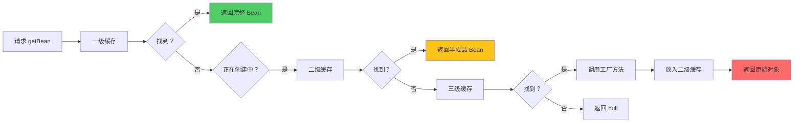
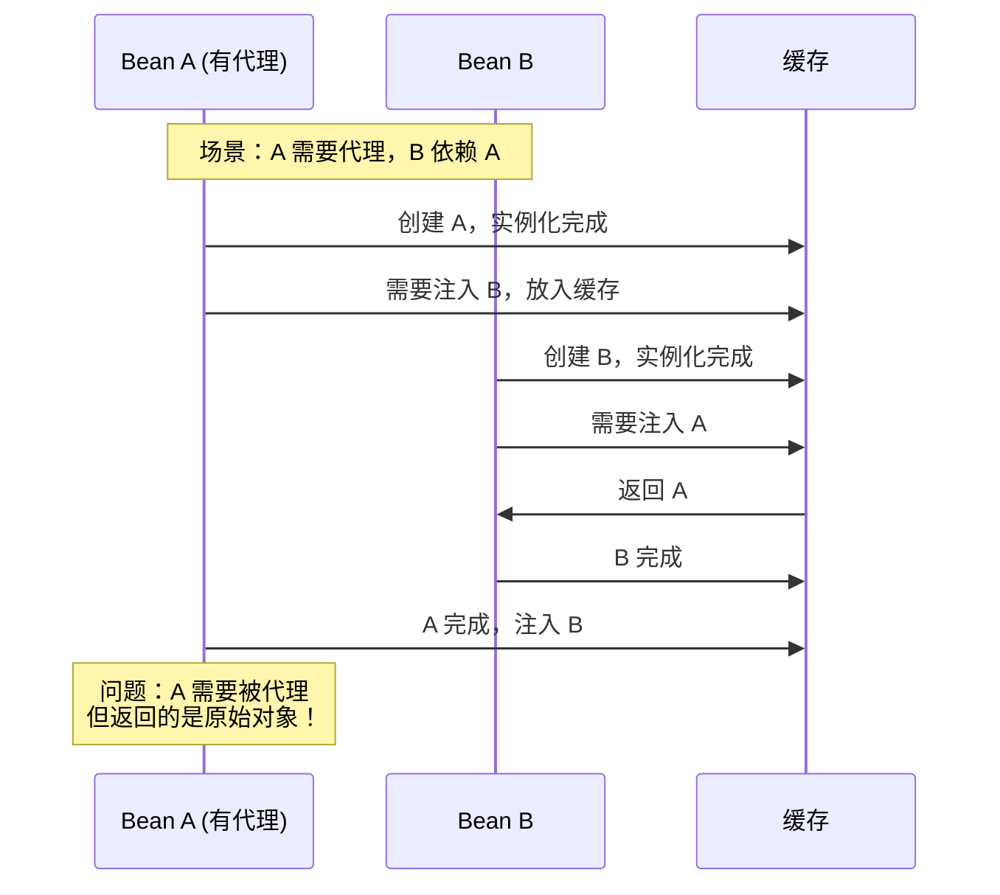
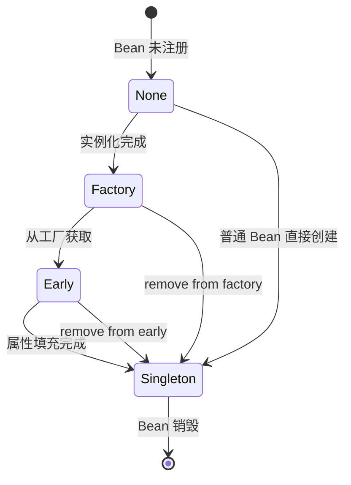
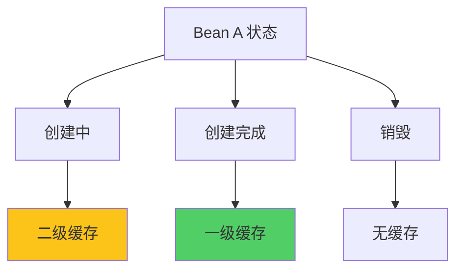

# 为什么需要三级缓存

**目标级别**：P6/P7

## 开场：深入理解 Spring 设计

面试官问：「Spring 为什么需要三级缓存？」你说：「为了解决循环依赖。」面试官追问：「那为什么不能只用两级缓存？三级缓存的第三个缓存到底解决了什么问题？」

这道题是 Spring 面试中的 **P7 高频深挖题**。很多人能背出三级缓存的作用，却说不清三级缓存的**设计动机**和**核心价值**。

## 面试官最关心的 3 个问题（快速自测）

1. **🔴 三级缓存中，一级、二级、三级缓存分别存储什么内容？**
2. **🔴 为什么需要三级缓存？两级缓存够吗？**
3. **🟡 如果没有三级缓存，代理对象会被创建几次？会产生什么问题？**

如果这三个问题不能完整回答，请认真阅读本文。

## 一、三级缓存的数据结构

### 1.1 缓存的物理存储

```java title="DefaultSingletonBeanRegistry.java"
public class DefaultSingletonBeanRegistry extends SimpleAliasRegistry {
    
    /** 一级缓存：完全成品的 singleton Bean */
    private final Map<String, Object> singletonObjects = 
        new ConcurrentHashMap<>(256);
    
    /** 二级缓存：提前暴露的 Bean（未完成属性填充和初始化） */
    private final Map<String, Object> earlySingletonObjects = 
        new ConcurrentHashMap<>(16);
    
    /** 三级缓存：Bean 工厂，用于创建代理对象 */
    private final Map<String, ObjectFactory<?>> singletonFactories = 
        new HashMap<>(16);
    
    /** 正在创建中的 Bean 名称集合 */
    private final Set<String> singletonsCurrentlyInCreation = 
        Collections.newSetFromMap(new ConcurrentHashMap<>(16));
}
```

### 1.2 三级缓存的访问顺序



## 二、核心问题：为什么需要三级缓存

### 2.1 假设场景：只用两级缓存

假设我们只有一级和二级缓存，尝试解决循环依赖：



**问题**：返回的是 A 的原始对象，而不是代理对象！

### 2.2 两级缓存的缺陷

| 缺陷 | 说明 |
|------|------|
| **无法处理代理** | 如果 Bean 需要 AOP 代理，两级缓存只能返回原始对象 |
| **代理被创建多次** | 每次从缓存获取可能调用不同的工厂方法 |
| **不一致性** | 不同线程可能获取到不同的对象 |

### 2.3 三级缓存的解决方案

```java title="DefaultSingletonBeanRegistry.java"
protected Object getSingleton(String beanName, boolean allowEarlyReference) {
    // 1. 一级缓存：正式 Bean
    Object singleton = singletonObjects.get(beanName);
    if (singleton == null && isSingletonCurrentlyInCreation(beanName)) {
        // 2. 二级缓存：早期 Bean
        singleton = earlySingletonObjects.get(beanName);
        if (singleton == null && allowEarlyReference) {
            // 3. 三级缓存：工厂
            synchronized (singletonObjects) {
                singleton = earlySingletonObjects.get(beanName);
                if (singleton == null) {
                    ObjectFactory<?> factory = singletonFactories.get(beanName);
                    if (factory != null) {
                        // 调用工厂获取对象（可能是代理）
                        singleton = factory.getObject();
                        // 放入二级缓存
                        earlySingletonObjects.put(beanName, singleton);
                        // 从三级缓存移除
                        singletonFactories.remove(beanName);
                    }
                }
            }
        }
    }
    return singleton;
}
```

**关键点**：

1. **工厂方法延迟执行**：代理对象的创建被延迟到真正需要的时候
2. **只创建一次**：通过二级缓存确保工厂方法只被调用一次
3. **幂等性保证**：无论从哪个线程、哪个路径获取，都返回同一个对象

## 三、三级缓存的协作机制

### 3.1 完整时序图

```mermaid
sequenceDiagram
    participant User as 用户
    participant GF as getSingleton()
    participant L1 as 一级缓存
    participant L2 as 二级缓存
    participant L3 as 三级缓存
    participant Factory as 工厂方法
    participant Create as 创建 Bean
    
    User->>GF: getBean("a")
    GF->>L1: 获取 a
    L1-->>GF: null
    GF->>L2: 获取 a
    L2-->>GF: null
    GF->>L3: 获取 a
    L3-->>GF: 找到工厂
    GF->>Factory: 调用工厂
    Factory-->>GF: 返回原始对象
    GF->>L2: 放入二级缓存
    GF->>L3: 移除
    GF-->>Create: 返回对象
    
    Note over L1,L2,L3: 此时 a 在二级缓存中
    Note over L1,L2,L3: 一级缓存中没有 a
```

### 3.2 Bean 创建后的缓存更新

```mermaid
sequenceDiagram
    participant Create as 创建 Bean A
    participant L1 as 一级缓存
    participant L2 as 二级缓存
    participant L3 as 三级缓存
    
    Create->>Create: 实例化完成
    Create->>L3: 放入三级缓存（工厂）
    Create->>Create: 属性填充
    Create->>Create: 初始化完成
    Create->>L1: 放入一级缓存
    Create->>L2: 检查二级缓存
    Note over L2: 如果有 a，需要验证
    Create->>L3: 移除三级缓存
    
    Note over L1,L2: 完成后：一级缓存有，二级三级没有
```

### 3.3 缓存状态转换图



## 四、代理对象的创建时机

### 4.1 正常情况：初始化时创建代理

```java title="AbstractAutowireCapableBeanFactory.java"
protected Object initializeBean(String beanName, Object bean, RootBeanDefinition mbd) {
    // 执行初始化方法
    invokeAwareMethods(beanName, bean);
    
    // 前置处理器
    wrappedBean = applyBeanPostProcessorsBeforeInitialization(wrappedBean, beanName);
    
    // 初始化方法
    invokeInitMethods(beanName, wrappedBean, mbd);
    
    // 后置处理器（创建代理）
    wrappedBean = applyBeanPostProcessorsAfterInitialization(wrappedBean, beanName);
    
    return wrappedBean;
}
```

### 4.2 循环依赖情况：提前暴露代理

```java title="AbstractAutowireCapableBeanFactory.java"
protected Object doCreateBean(String beanName, RootBeanDefinition mbd, Object[] args) {
    // 1. 创建实例
    BeanWrapper instanceWrapper = createBeanInstance(beanName, mbd, args);
    Object bean = instanceWrapper.getWrapperInstance();
    
    // 2. 提前暴露（解决循环依赖）
    boolean earlySingletonExposure = (mbd.isSingleton() && 
                                       allowCircularReferences &&
                                       isSingletonCurrentlyInCreation(beanName));
    if (earlySingletonExposure) {
        // 放入三级缓存，工厂方法会决定是否创建代理
        addSingletonFactory(beanName, () -> getEarlyBeanReference(beanName, mbd, bean));
    }
    
    // 3. 填充属性（可能触发循环依赖）
    populateBean(beanName, mbd, instanceWrapper);
    
    // 4. 初始化
    initializeBean(beanName, bean, mbd);
    
    return bean;
}
```

### 4.3 早期引用与代理的关系

```java title="AbstractAutoCreateAfterInstantiationBeanPostProcessor.java"
protected Object getEarlyBeanReference(String beanName, RootBeanDefinition mbd, Object bean) {
    // 检查是否有后置处理器需要处理早期引用
    Object exposedObject = bean;
    for (BeanPostProcessor bp : getBeanPostProcessors()) {
        if (bp instanceof SmartInstantiationAwareBeanPostProcessor) {
            SmartInstantiationAwareBeanPostProcessor bpp = 
                (SmartInstantiationAwareBeanPostProcessor) bp;
            exposedObject = bpp.getEarlyBeanReference(exposedObject, beanName);
        }
    }
    return exposedObject;
}
```

**关键**：只有实现了 `SmartInstantiationAwareBeanPostProcessor` 的后置处理器（如 `@Async` 注解处理器）才会在这里创建代理。

## 五、面试高频追问

### 追问链 1：代理对象会被创建几次

> **第一层**：如果没有三级缓存，代理对象会被创建几次？
> 
> 在循环依赖场景下，可能被创建多次。

> **第二层**：为什么会有多次创建？
> 
> 因为没有二级缓存作为屏障，每次获取 Bean 时都可能调用工厂方法。

> **第三层**：多次创建代理会有什么后果？
> 
> 1. 内存浪费
> 2. 对象身份不一致（`==` 比较失败）
> 3. 事务、缓存等切面逻辑执行多次

### 追问链 2：为什么需要移除三级缓存

> **第一层**：Bean 创建完成后，为什么要从三级缓存移除？
> 
> 因为三级缓存只用于解决循环依赖，Bean 创建完成后不需要了。

> **第二层**：不移除会有什么后果？
> 
> 1. 占用内存
> 2. 可能导致后续获取 Bean 时拿到过期对象

> **第三层**：Spring 是如何确保线程安全的？
> 
> 使用 `synchronized` 同步 `singletonObjects`，并且二级缓存和三级缓存的读写是原子的。

### 追问链 3：一级缓存的作用

> **第一层**：为什么需要一级缓存？
> 
> 存储完全成品的 Bean，供其他 Bean 使用。

> **第二层**：为什么不能直接用二级缓存？
> 
> 二级缓存存储的是半成品Bean，可能还在初始化中，直接使用可能导致问题。

> **第三层**：Bean 在一级缓存中时，还在二级缓存中存在吗？
> 
> 不存在。Bean 创建完成后会从二级、三级缓存移除，只保留在一级缓存中。

## 六、常见错误与陷阱

### 错误 1：认为三级缓存同时存在

> **⚠️ 陷阱**：认为三级缓存会同时存储 Bean 的三个状态。

正确理解：任何一个 Bean 在任意时刻只会出现在一个缓存中。



### 错误 2：忽略线程安全

> **⚠️ 陷阱**：认为缓存操作天然是线程安全的。

Spring 使用 `synchronized` 保证线程安全：

```java
synchronized (singletonObjects) {
    // 原子操作
    singleton = earlySingletonObjects.get(beanName);
    if (singleton == null) {
        ObjectFactory<?> factory = singletonFactories.get(beanName);
        if (factory != null) {
            singleton = factory.getObject();
            earlySingletonObjects.put(beanName, singleton);
            singletonFactories.remove(beanName);
        }
    }
}
```

### 错误 3：混淆缓存和数据结构

> **⚠️ 陷阱**：把三级缓存当作普通 Map 使用。

Spring 三级缓存是专为解决循环依赖设计的，有严格的访问规则：
1. 先访问一级，再访问二级，最后访问三级
2. 三级缓存只进不出（创建时添加，验证时移除）
3. 二级缓存是临时存储，验证完成后移除

## 七、设计思想总结

### 三级缓存的设计哲学

| 缓存 | 设计目的 | 特点 |
|------|---------|------|
| 一级缓存 | 存储正式 Bean | 读写频繁 |
| 二级缓存 | 防止重复创建 | 读写隔离 |
| 三级缓存 | 延迟代理创建 | 只写不读 |

### 核心原则

1. **单一职责**：每个缓存只负责一个职责
2. **延迟加载**：代理对象的创建尽可能延迟
3. **幂等性**：无论调用多少次，结果一致

> **💡 加分回答**：Spring 三级缓存的设计体现了「**开闭原则**」——对扩展开放，对修改关闭。添加新的后置处理器（如新的 AOP 实现）不需要修改缓存逻辑。

## 下一步

理解构造器注入为什么无法解决循环依赖，请阅读 [构造器注入循环依赖](/questions/spring/constructor-circular)。
