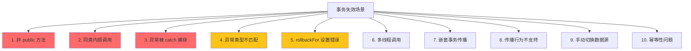
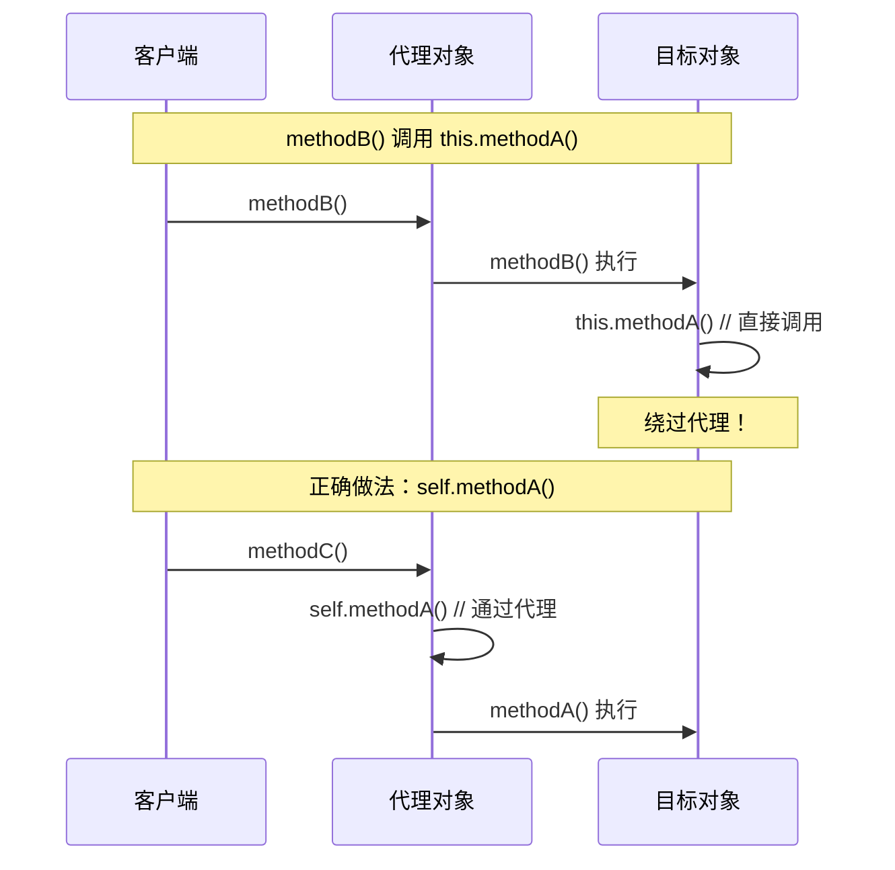

# @Transactional 失效场景

**目标级别**：P6

## 开场：为什么事务不生效

面试官问：「你在 service 方法上加了 @Transactional，测试环境没问题，生产环境数据库真的回滚了吗？」你说：「应该回滚了吧……」面试官追问：「你怎么确定？如果方法内部抛出异常但被 catch 捕获了呢？」

@Transactional 是 Spring 中最常用的注解之一，但它的失效场景很多。理解这些失效场景，才能避免生产环境中的事务问题。

## 面试官最关心的 3 个问题（快速自测）

1. **🔴 为什么在同一个类中调用 this 方法会导致事务失效？**
2. **🔴 @Transactional 的 rollbackFor 默认值是什么？哪些异常不会触发回滚？**
3. **🟡 为什么 private 方法上的 @Transactional 不会生效？**

## 一、@Transactional 失效场景一览

### 1.1 十大失效场景



## 二、核心失效场景详解

### 2.1 非 public 方法

**原因**：Spring AOP 只拦截 public 方法执行。

```java
@Service
public class UserService {
    
    @Transactional
    public void saveUser() {  // ✅ 生效
        // 事务生效
    }
    
    @Transactional
    protected void saveUserProtected() {  // ❌ 不生效
        // 事务不生效
    }
    
    @Transactional
    private void saveUserPrivate() {  // ❌ 不生效
        // 事务不生效
    }
}
```

**源码验证**：

```java title="TransactionInterceptor.java"
public class TransactionInterceptor extends TransactionAspectSupport {
    
    @Override
    public Object invoke(MethodInvocation invocation) {
        // 检查方法修饰符
        Method method = invocation.getMethod();
        if (!Modifier.isPublic(method.getModifiers())) {
            return invocation.proceed();  // 直接执行，不拦截
        }
        // 事务逻辑...
    }
}
```

### 2.2 同类内部调用（自调用）

**原因**：this 调用绕过了代理对象，直接调用目标方法。

```java
@Service
public class UserService {
    
    @Autowired
    private UserDao userDao;
    
    // ✅ 通过代理调用，事务生效
    public void methodA() {
        userDao.save();  // 代理调用
    }
    
    // ❌ this 调用，事务失效
    public void methodB() {
        this.methodA();  // 直接调用，跳过代理
    }
    
    // ✅ 正确做法
    @Autowired
    private UserService self;
    
    public void methodC() {
        self.methodA();  // 通过代理调用
    }
}
```



### 2.3 异常被 catch 捕获

**原因**：Spring 事务管理器只能感知到抛出的异常，catch 后异常被吞掉了。

```java
@Service
public class UserService {
    
    @Transactional
    public void saveUser() {
        try {
            // 业务逻辑
            userDao.save();
        } catch (Exception e) {
            // ⚠️ 异常被吞掉，事务不会回滚
            log.error("保存失败", e);
        }
    }
}

// 正确做法
@Service
public class UserService {
    
    @Transactional(rollbackFor = Exception.class)
    public void saveUser() throws Exception {
        try {
            userDao.save();
        } catch (Exception e) {
            // 需要重新抛出，或手动回滚
            throw e;  // 重新抛出
        }
    }
}
```

### 2.4 异常类型不匹配

**原因**：默认只对 RuntimeException 和 Error 回滚。

```java
@Service
public class UserService {
    
    @Transactional  // ⚠️ 默认只回滚 RuntimeException
    public void saveUser() throws IOException {
        // 抛出 IOException，不会回滚！
        throw new IOException("文件不存在");
    }
}

// 正确做法
@Service
public class UserService {
    
    @Transactional(rollbackFor = Exception.class)  // ✅ 回滚所有异常
    public void saveUser() throws IOException {
        throw new IOException("文件不存在");
    }
}
```

### 2.5 多线程调用

**原因**：事务绑定在当前线程，子线程使用不同的数据库连接。

```java
@Service
public class UserService {
    
    @Autowired
    private UserDao userDao;
    
    @Transactional
    public void saveUserInThread() {
        userDao.save();  // 主线程事务
        
        new Thread(() -> {
            userDao.save();  // ⚠️ 子线程，可能不在主线程事务中
        }).start();
    }
}
```

### 2.6 嵌套事务传播

```java
@Service
public class UserService {
    
    @Transactional
    public void methodA() {
        userDao.saveA();
        methodB();  // 嵌套事务
        userDao.saveB();
    }
    
    @Transactional(propagation = Propagation.REQUIRES_NEW)
    public void methodB() {
        // ⚠️ 可能导致外层事务挂起
        userDao.saveB();
        throw new RuntimeException("B 失败");
    }
}
```

## 三、正确使用姿势

### 3.1 基本用法

```java
@Service
public class UserService {
    
    @Transactional  // 默认 rollbackFor = RuntimeException.class
    public void saveUser(User user) {
        userDao.save(user);
    }
}
```

### 3.2 指定回滚异常

```java
@Transactional(rollbackFor = {Exception.class, IOException.class})
public void saveUser(User user) throws Exception {
    // 所有 Exception 都会触发回滚
}
```

### 3.3 指定不回滚异常

```java
@Transactional(noRollbackFor = {BusinessException.class})
public void saveUser(User user) {
    // BusinessException 不会触发回滚
}
```

### 3.4 解决自调用问题

```java
@Service
public class UserService {
    
    @Autowired
    private ApplicationContext ctx;
    
    @Transactional
    public void methodA() {
        // 方式一：通过 ApplicationContext
        UserService self = ctx.getBean(UserService.class);
        self.methodB();
        
        // 方式二：注入自身
        // self.methodB();
    }
    
    @Transactional
    public void methodB() {
        // 事务生效
    }
}
```

```java
@Service
public class UserService {
    
    @Autowired
    private UserService self;  // 自己注入自己
    
    @Transactional
    public void methodA() {
        self.methodB();  // 通过代理调用
    }
    
    @Transactional
    public void methodB() {
        // 事务生效
    }
}
```

### 3.5 使用编程式事务

```java
@Service
public class UserService {
    
    @Autowired
    private PlatformTransactionManager transactionManager;
    
    public void saveUser() {
        TransactionTemplate template = new TransactionTemplate(transactionManager);
        
        template.execute(status -> {
            try {
                userDao.save();
                return true;
            } catch (Exception e) {
                status.setRollbackOnly();  // 手动回滚
                return false;
            }
        });
    }
}
```

## 四、源码解析

### 4.1 事务拦截器

```java title="TransactionInterceptor.java"
public class TransactionInterceptor extends TransactionAspectSupport {
    
    @Override
    public Object invoke(MethodInvocation invocation) throws Throwable {
        // 获取事务属性
        TransactionAttribute attr = getTransactionAttributeSource()
            .getTransactionAttribute(invocation.getMethod(), invocation.getThis().getClass());
        
        // 创建或获取事务
        TransactionInfo info = createTransactionIfNecessary(attr, invocation);
        
        Object retVal;
        try {
            retVal = invocation.proceed();  // 执行目标方法
            commitTransactionAfterReturning(info);
        } catch (Throwable ex) {
            // 异常处理：决定是否回滚
            completeTransactionAfterThrowing(info, ex);
            throw ex;
        }
        
        commitTransactionAfterReturning(info);
        return retVal;
    }
}
```

### 4.2 回滚决策

```java title="TransactionAspectSupport.java"
protected void completeTransactionAfterThrowing(TransactionInfo info, Throwable ex) {
    // 检查是否回滚
    if (info.transactionAttribute.rollbackOn(ex)) {
        try {
            info.getTransactionManager().rollback(info.getTransactionStatus());
        } catch (Exception e) {
            throw new IllegalStateException(e);
        }
    } else {
        // 不回滚
        commitTransactionAfterReturning(info);
    }
}

// rollbackOn 默认实现
@Override
public boolean rollbackOn(Throwable ex) {
    return (ex instanceof RuntimeException || ex instanceof Error);
}
```

## 五、面试高频追问

### 追问链 1：为什么 AOP 代理能拦截方法调用

> **第一层**：为什么 Spring AOP 能拦截方法调用？
> 
> 因为 Spring 创建了目标类的代理对象，所有外部调用都经过代理。

> **第二层**：那为什么同类内部调用不行？
> 
> 因为同类内部调用使用 this 直接调用目标方法，绕过了代理。

> **第三层**：有没有办法让同类内部调用也走代理？
> 
> 有：自己注入自己，或者使用 AspectJ 织入（编译时/加载时织入）。

### 追问链 2：事务传播与回滚

> **第一层**：REQUIRES_NEW 和 REQUIRED 有什么区别？
> 
> REQUIRED：加入当前事务；REQUIRES_NEW：挂起当前事务，创建新事务。

> **第二层**：REQUIRES_NEW 会导致什么问题？
> 
> 外层事务挂起，可能导致外层事务的锁失效。

> **第三层**：嵌套事务 NESTED 和 REQUIRED 有什么区别？
> 
> NESTED 使用 Savepoint，可以部分回滚；REQUIRED 不能部分回滚。

### 追问链 3：Spring 事务的原理

> **第一层**：@Transactional 是如何生效的？
> 
> 通过 TransactionInterceptor 拦截方法调用，在方法前后执行事务管理逻辑。

> **第二层**：事务管理器如何决定回滚？
> 
> 通过 rollbackOn 方法检查异常类型。

> **第三层**：Spring Boot 如何自动配置事务管理器？
> 
> 通过 DataSourceTransactionManagerAutoConfiguration 自动配置。

## 六、常见错误与陷阱

### 错误 1：误以为所有异常都回滚

```java
@Service
public class BadService {
    
    @Transactional  // ⚠️ 默认只回滚 RuntimeException
    public void save() throws IOException {
        throw new IOException();  // 不会回滚！
    }
}
```

### 错误 2：在 Controller 层加事务

```java
@RestController
public class UserController {
    
    @Autowired
    private UserService userService;
    
    @PostMapping("/user")
    @Transactional  // ⚠️ 事务不会生效
    public void saveUser(@RequestBody User user) {
        userService.save(user);
    }
}
```

### 错误 3：事务范围过大

```java
@Service
public class BadService {
    
    @Transactional  // ⚠️ 整个方法在一个事务中
    public void batchSave(List<User> users) {
        for (User user : users) {
            userDao.save(user);  // 批量操作，事务过大
        }
    }
}
```

## 七、对比总结

### 失效场景对比

| 失效场景 | 原因 | 解决方案 |
|---------|------|---------|
| 非 public 方法 | AOP 不拦截 | 改为 public |
| 同类内部调用 | 绕过代理 | 注入自身 |
| 异常被 catch | 异常被吞掉 | 重新抛出 |
| 异常类型不匹配 | rollbackFor 默认值 | 指定 rollbackFor |
| 多线程 | 线程隔离 | 不用事务 |
| 传播行为不当 | 事务策略错误 | 选择合适的传播行为 |

### 传播行为对比

| 传播行为 | 说明 | 场景 |
|---------|------|------|
| REQUIRED | 加入当前事务 | 大多数场景 |
| REQUIRES_NEW | 创建新事务 | 日志记录 |
| NESTED | 嵌套事务 | 部分回滚 |
| SUPPORTS | 支持当前事务 | 查询方法 |
| MANDATORY | 必须有事务 | 强制要求 |
| NOT_SUPPORTED | 不使用事务 | 非事务操作 |
| NEVER | 不能有事务 | 强制非事务 |

## 八、扩展知识

### 8.1 事务与锁的关系

```java
@Service
public class UserService {
    
    @Transactional
    public void transfer(Long fromId, Long toId, BigDecimal amount) {
        // 事务中的锁
        Account from = accountDao.findById(fromId);  // FOR UPDATE
        Account to = accountDao.findById(toId);     // FOR UPDATE
        
        from.setBalance(from.getBalance().subtract(amount));
        to.setBalance(to.getBalance().add(amount));
        
        accountDao.save(from);
        accountDao.save(to);
    }
}
```

### 8.2 事务与乐观锁

```java
@Service
public class UserService {
    
    @Transactional
    public void updateUser(Long id, String name) {
        User user = userDao.findById(id);
        user.setName(name);
        user.setVersion(user.getVersion() + 1);  // 乐观锁版本号
        int affected = userDao.update(user);
        
        if (affected == 0) {
            throw new OptimisticLockException("数据已被修改");
        }
    }
}
```

> **💡 加分回答**：Spring 的声明式事务基于 AOP 代理，在高并发场景下可能存在性能问题。如果对性能要求极高，可以考虑使用编程式事务或 JTA。

## 下一步

深入理解 Spring 事务的传播行为，请阅读 [事务传播行为](/questions/spring/transaction-propagation)。
