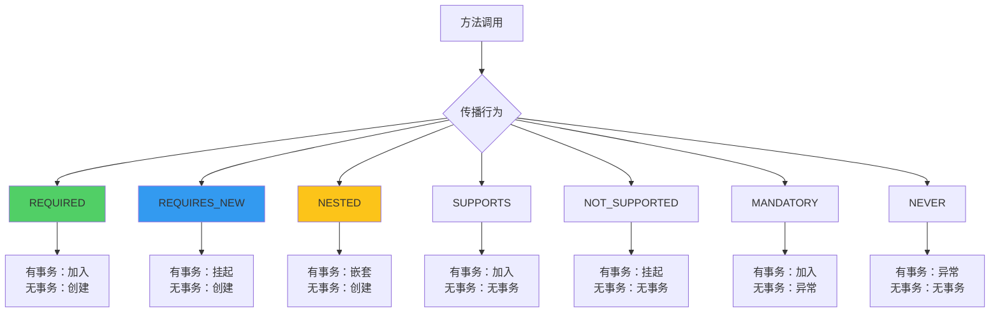
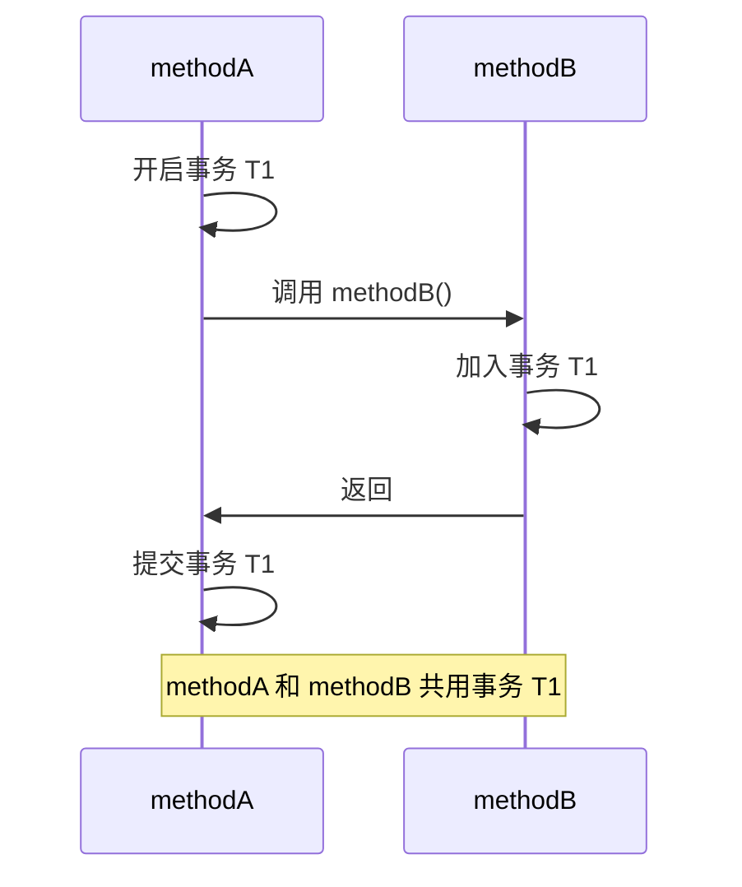
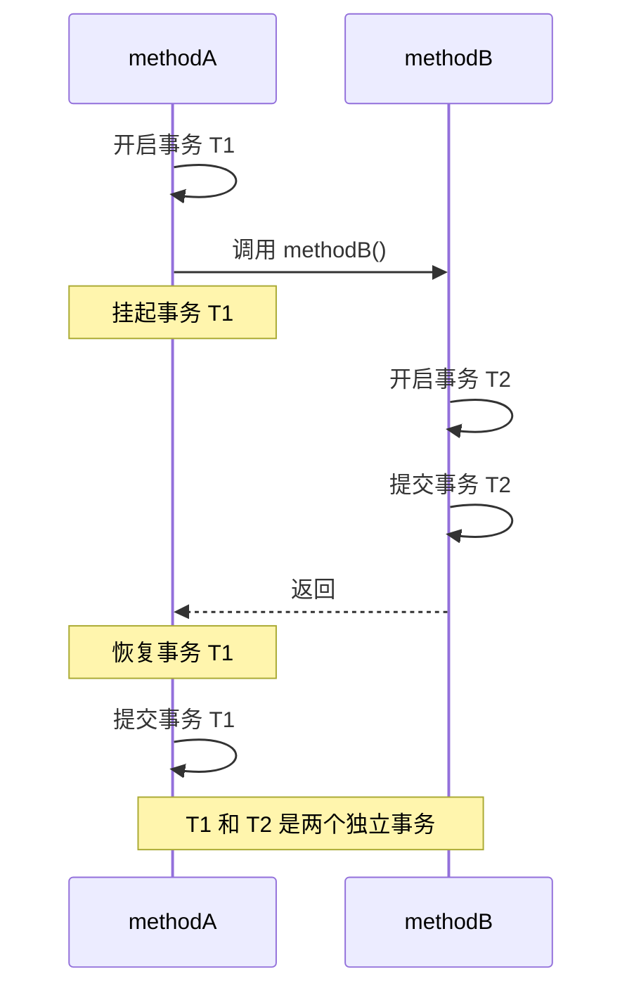
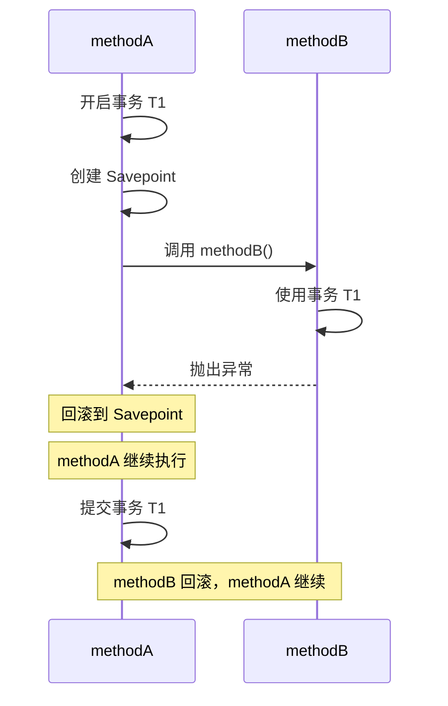
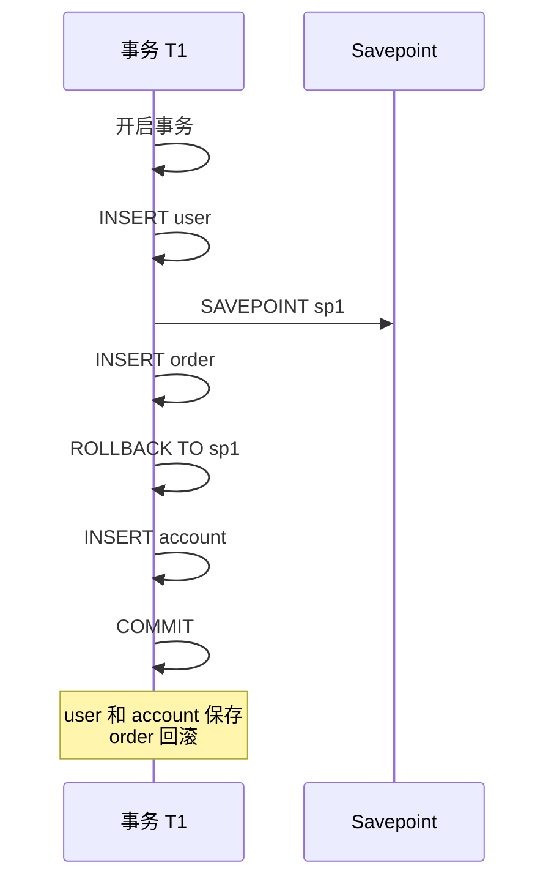

# 事务传播行为

**目标级别**：P5/P6

## 开场：嵌套事务的困惑

面试官问：「事务传播行为有哪些？REQUIRES_NEW 和 REQUIRED 有什么区别？」你说：「REQUIRED 加入当前事务，REQUIRES_NEW 创建新事务。」面试官追问：「那如果外层事务回滚了，REQUIRES_NEW 的事务会怎样？」

事务传播行为是 Spring 事务中最复杂的部分，也是面试中容易被深挖的地方。理解传播行为，才能正确设计事务边界。

## 面试官最关心的 3 个问题（快速自测）

1. **🔴 Spring 有哪些事务传播行为？它们之间有什么区别？**
2. **🔴 REQUIRED 和 REQUIRES_NEW 的核心区别是什么？**
3. **🟡 NESTED 嵌套事务和 REQUIRED 有什么区别？如何实现部分回滚？**

## 一、七种传播行为

### 1.1 传播行为一览

| 传播行为 | 说明 | 常用场景 |
|---------|------|---------|
| REQUIRED | 加入当前事务 | 大多数场景 |
| REQUIRES_NEW | 创建新事务 | 日志记录 |
| NESTED | 嵌套事务 | 部分回滚 |
| SUPPORTS | 支持当前事务 | 查询方法 |
| NOT_SUPPORTED | 不使用事务 | 非事务操作 |
| MANDATORY | 必须有事务 | 强制要求 |
| NEVER | 不能有事务 | 强制非事务 |

### 1.2 传播行为对比图



## 二、核心传播行为详解

### 2.1 REQUIRED（默认）

**行为**：加入当前事务，如果没有则创建新事务。

```java
@Service
public class UserService {
    
    @Transactional
    public void methodA() {
        userDao.save();  // 使用 methodA 的事务
        
        // 加入 methodA 的事务
        orderService.methodB();
    }
}

@Service
public class OrderService {
    
    @Transactional(propagation = Propagation.REQUIRED)  // 默认值
    public void methodB() {
        orderDao.save();  // 使用 methodA 的事务
    }
}
```



### 2.2 REQUIRES_NEW

**行为**：每次都创建新事务，如果已有事务则挂起。

```java
@Service
public class UserService {
    
    @Transactional
    public void methodA() {
        userDao.save();  // 事务 T1
        
        orderService.methodB();  // 方法B创建新事务
    }
}

@Service
public class OrderService {
    
    @Transactional(propagation = Propagation.REQUIRES_NEW)
    public void methodB() {
        // 创建新事务 T2
        orderDao.save();
        // 提交事务 T2
    }
}
```



### 2.3 NESTED

**行为**：在当前事务中嵌套执行，如果已有事务则创建 Savepoint。

```java
@Service
public class UserService {
    
    @Transactional
    public void methodA() {
        userDao.save();  // 事务 T1
        
        try {
            orderService.methodB();  // 嵌套事务
        } catch (Exception e) {
            // methodB 回滚，但 methodA 继续
            log.error("订单保存失败", e);
        }
        
        // 继续执行
        accountService.process();
    }
}

@Service
public class OrderService {
    
    @Transactional(propagation = Propagation.NESTED)
    public void methodB() {
        orderDao.save();  // 嵌套事务
        throw new RuntimeException("订单保存失败");
    }
}
```



## 三、REQUIRED vs REQUIRES_NEW

### 3.1 核心区别

| 维度 | REQUIRED | REQUIRES_NEW |
|------|---------|--------------|
| 事务数量 | 共享一个事务 | 每个方法独立事务 |
| 回滚影响 | 外层方法一起回滚 | 互不影响 |
| 性能 | 较好（一个连接） | 较差（多个连接） |
| 适用场景 | 业务强一致性 | 日志等独立操作 |

### 3.2 使用场景对比

**REQUIRED 适用场景**：

```java
@Service
public class OrderService {
    
    @Transactional(propagation = Propagation.REQUIRED)
    public void createOrder(Order order) {
        // 订单保存
        orderDao.save(order);
        
        // 库存扣减 - 需要和订单在同一个事务
        inventoryService.deduct(order.getItems());
        
        // 积分增加 - 需要和订单在同一个事务
        pointsService.addPoints(order.getUserId(), order.getPoints());
    }
}
```

**REQUIRES_NEW 适用场景**：

```java
@Service
public class UserService {
    
    @Transactional
    public void registerUser(User user) {
        userDao.save(user);  // 主业务
        
        // 日志需要独立事务，不影响主业务
        logService.log("用户注册: " + user.getId());
    }
}

@Service
public class LogService {
    
    @Transactional(propagation = Propagation.REQUIRES_NEW)
    public void log(String message) {
        // 即使主事务回滚，日志也需要保存
        logDao.save(message);
    }
}
```

## 四、NESTED 嵌套事务

### 4.1 Savepoint 机制

NESTED 使用数据库的 Savepoint 机制实现部分回滚：



### 4.2 NESTED vs REQUIRED

| 维度 | NESTED | REQUIRED |
|------|--------|---------|
| 回滚粒度 | 部分回滚 | 整体回滚 |
| 性能 | 较好（Savepoint） | 最好 |
| 适用场景 | 可选子操作 | 不可分子操作 |
| 支持数据库 | 大多数 | 所有 |

### 4.3 NESTED 使用限制

```java
@Service
public class OrderService {
    
    @Transactional(propagation = Propagation.REQUIRED)
    public void createOrder(Order order) {
        // NESTED 不能用于不支持 Savepoint 的数据源
        // 如：MySQL MyISAM 引擎不支持
        
        // 使用 NESTED
        orderItemService.saveItems(order.getItems());
    }
}

@Service
public class OrderItemService {
    
    @Transactional(propagation = Propagation.NESTED)
    public void saveItems(List<OrderItem> items) {
        for (OrderItem item : items) {
            orderItemDao.save(item);
        }
    }
}
```

## 五、其他传播行为

### 5.1 SUPPORTS

```java
@Transactional(propagation = Propagation.SUPPORTS)
public List<User> getUsers() {
    // 如果有事务则加入，没有则无事务
    return userDao.findAll();
}
```

### 5.2 NOT_SUPPORTED

```java
@Transactional(propagation = Propagation.NOT_SUPPORTED)
public void sendEmail() {
    // 挂起当前事务，以非事务方式执行
    emailService.send();
}
```

### 5.3 MANDATORY

```java
@Transactional(propagation = Propagation.MANDATORY)
public void updateUser(User user) {
    // 必须有事务，否则抛异常
    userDao.update(user);
}
```

### 5.4 NEVER

```java
@Transactional(propagation = Propagation.NEVER)
public void process() {
    // 不能有事务，否则抛异常
}
```

## 六、面试高频追问

### 追问链 1：REQUIRES_NEW 的问题

> **第一层**：REQUIRES_NEW 会导致什么问题？
> 
> 挂起当前事务，创建新事务，可能导致锁顺序问题。

> **第二层**：什么情况下会出现死锁？
> 
> 如果 REQUIRES_NEW 方法和主事务访问相同的资源，可能出现锁等待。

> **第三层**：如何避免 REQUIRES_NEW 的问题？
> 
> 1. 确保 REQUIRES_NEW 方法访问的资源不与主事务冲突
> 2. 使用 NESTED 替代
> 3. 重构代码，避免嵌套事务

### 追问链 2：NESTED 的数据库支持

> **第一层**：NESTED 依赖什么机制？
> 
> 依赖数据库的 Savepoint 机制。

> **第二层**：哪些数据库支持 Savepoint？
> 
> 大多数关系型数据库都支持：MySQL、Oracle、PostgreSQL、SQL Server。

> **第三层**：如果数据库不支持 Savepoint 会怎样？
> 
> Spring 会回退到 REQUIRED 行为。

### 追问链 3：事务回滚与提交

> **第一层**：外层事务回滚，REQUIRES_NEW 的事务会怎样？
> 
> REQUIRES_NEW 的事务不受影响，已经提交。

> **第二层**：REQUIRES_NEW 的事务回滚，外层事务会怎样？
> 
> REQUIRES_NEW 的事务回滚不影响外层，外层继续执行。

> **第三层**：内层 NESTED 回滚，外层会怎样？
> 
> 回滚到 Savepoint，外层可以继续执行。

## 七、常见错误与陷阱

### 错误 1：误用 REQUIRES_NEW

```java
@Service
public class BadService {
    
    @Transactional
    public void methodA() {
        userDao.save();
        
        // ⚠️ REQUIRES_NEW 会挂起事务
        // 如果库存服务访问相同的表，可能导致问题
        inventoryService.deduct();
    }
}
```

### 错误 2：NESTED 不支持所有数据库

```java
@Service
public class BadService {
    
    @Transactional
    public void methodA() {
        // ⚠️ MySQL MyISAM 不支持 Savepoint
        // 会自动降级为 REQUIRED
        itemService.saveItems();
    }
}
```

### 错误 3：忽略传播行为的默认值

```java
@Service
public class UserService {
    
    @Transactional  // ⚠️ 默认 REQUIRED
    public void methodA() {
        this.methodB();  // 同一类内部调用，事务不生效
    }
    
    @Transactional  // 被忽略
    public void methodB() {
        // 实际在 methodA 的事务中
    }
}
```

## 八、对比总结

### 传播行为对比表

| 行为 | 有事务时 | 无事务时 | 回滚影响 | 常用场景 |
|------|--------|--------|---------|---------|
| REQUIRED | 加入 | 创建 | 全部回滚 | 大多数场景 |
| REQUIRES_NEW | 挂起/创建 | 创建 | 独立回滚 | 日志 |
| NESTED | 嵌套/Savepoint | 创建 | 部分回滚 | 可选操作 |
| SUPPORTS | 加入 | 无事务 | 跟随外层 | 查询 |
| NOT_SUPPORTED | 挂起 | 无事务 | 无 | 非事务操作 |
| MANDATORY | 加入 | 异常 | 跟随外层 | 强制要求 |
| NEVER | 异常 | 无事务 | 无 | 强制非事务 |

### 选择建议

| 场景 | 推荐传播行为 |
|------|------------|
| 业务强一致性 | REQUIRED |
| 日志、审计 | REQUIRES_NEW |
| 可选子操作 | NESTED |
| 只读查询 | SUPPORTS |
| 非事务操作 | NOT_SUPPORTED |

## 九、实战应用

### 9.1 日志记录场景

```java
@Service
public class OrderService {
    
    @Transactional(propagation = Propagation.REQUIRED)
    public void createOrder(Order order) {
        // 主业务
        orderDao.save(order);
        inventoryService.deduct(order.getItems());
        
        // 日志独立事务，不影响主业务
        logService.logOrderCreated(order);
    }
}

@Service
public class LogService {
    
    @Transactional(propagation = Propagation.REQUIRES_NEW)
    public void logOrderCreated(Order order) {
        logDao.save(new OrderLog(order.getId(), "订单创建"));
    }
}
```

### 9.2 发送消息场景

```java
@Service
public class UserService {
    
    @Transactional
    public void registerUser(User user) {
        userDao.save(user);
        
        // 消息发送使用 REQUIRES_NEW
        // 即使消息发送失败，用户注册不应回滚
        messageService.sendWelcome(user);
    }
}

@Service
public class MessageService {
    
    @Transactional(propagation = Propagation.REQUIRES_NEW)
    public void sendWelcome(User user) {
        try {
            smsService.send(user.getPhone(), "欢迎注册");
        } catch (Exception e) {
            // 消息发送失败不影响主事务
            log.error("发送欢迎消息失败", e);
        }
    }
}
```

> **💡 加分回答**：在实际项目中，REQUIRES_NEW 会增加数据库连接数，在高并发场景下需要注意连接池配置。

## 下一步

理解声明式事务和编程式事务的区别，请阅读 [声明式事务与编程式事务](/questions/spring/tx-declarative-programmatic)。
