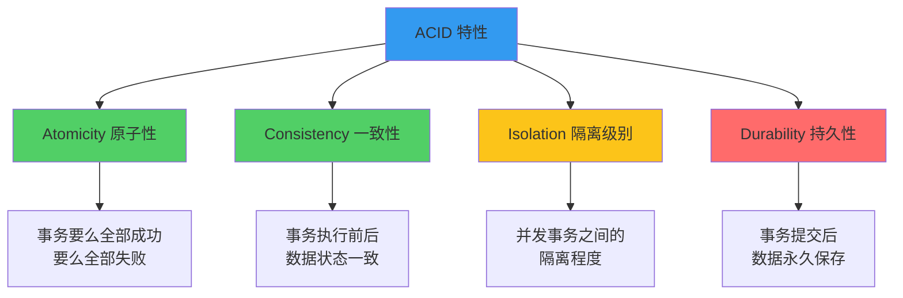
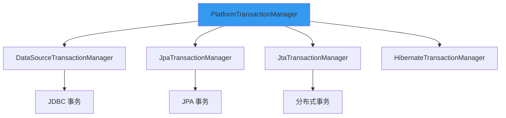
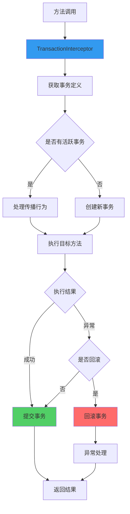

# Spring 事务管理

**目标级别**：P5/P6

## 开场：从一个问题开始

面试官问：「Spring 的事务管理是如何实现的？」你说：「通过 AOP 代理。」面试官追问：「那 @Transactional 注解在什么时候被解析？事务的开启、提交、回滚分别在哪个阶段执行的？」

Spring 事务是 Java 后端开发中最常用的功能之一，但很多人只会配置，不理解原理。这道题考察的是你对 Spring AOP 和事务机制的理解深度。

## 面试官最关心的 3 个问题（快速自测）

1. **🔴 Spring 事务的原理是什么？事务的开启、提交、回滚分别在什么时候执行？**
2. **🟡 Spring 支持哪些事务传播行为？它们之间有什么区别？**
3. **🟡 编程式事务和声明式事务各有什么优缺点？**

## 一、Spring 事务核心概念

### 1.1 ACID 特性



### 1.2 Spring 事务抽象



## 二、事务管理原理

### 2.1 核心组件

| 组件 | 说明 |
|------|------|
| PlatformTransactionManager | 事务管理器接口 |
| TransactionDefinition | 事务定义（传播行为、隔离级别等） |
| TransactionStatus | 事务状态 |
| TransactionInterceptor | 事务拦截器 |

### 2.2 事务流程图



### 2.3 源码解析

#### TransactionInterceptor

```java title="TransactionInterceptor.java"
public class TransactionInterceptor extends TransactionAspectSupport {
    
    @Override
    public Object invoke(MethodInvocation invocation) throws Throwable {
        // 获取事务属性
        TransactionAttribute attr = getTransactionAttributeSource()
            .getTransactionAttribute(invocation.getMethod(), invocation.getThis().getClass());
        
        // 获取事务管理器
        PlatformTransactionManager tm = determineTransactionManager(attr);
        
        // 创建或加入事务
        TransactionInfo info = createTransactionIfNecessary(tm, attr, invocation.getMethod());
        
        Object retVal;
        try {
            // 执行目标方法
            retVal = invocation.proceed();
            // 正常返回，提交事务
            commitTransactionAfterReturning(info);
        } catch (Throwable ex) {
            // 异常回滚
            completeTransactionAfterThrowing(info, ex);
            throw ex;
        } finally {
            // 清理事务信息
            cleanupTransactionInfo(info);
        }
        
        return retVal;
    }
}
```

#### 提交事务

```java title="TransactionAspectSupport.java"
protected void commitTransactionAfterReturning(TransactionInfo info) {
    if (info != null && info.hasTransaction()) {
        if (info.isNewTransaction()) {
            info.getTransactionManager().commit(info.getTransactionStatus());
        }
    }
}
```

#### 回滚事务

```java title="TransactionAspectSupport.java"
protected void completeTransactionAfterThrowing(TransactionInfo info, Throwable ex) {
    if (info != null && info.hasTransaction()) {
        if (info.getTransactionAttribute().rollbackOn(ex)) {
            try {
                info.getTransactionManager().rollback(info.getTransactionStatus());
            } catch (Exception e) {
                throw new IllegalStateException("Transaction rollback failed", e);
            }
        } else {
            // 不回滚，提交
            commitTransactionAfterReturning(info);
        }
    }
}
```

## 三、@Transactional 注解详解

### 3.1 注解属性

```java
@Transactional(
    value = "transactionManager",      // 事务管理器 Bean 名称
    propagation = Propagation.REQUIRED, // 传播行为
    isolation = Isolation.DEFAULT,      // 隔离级别
    timeout = -1,                      // 超时时间（秒）
    readOnly = false,                  // 是否只读
    rollbackFor = {},                  // 回滚的异常类型
    rollbackForClassName = {},         // 回滚的异常类名
    noRollbackFor = {},                // 不回滚的异常类型
    noRollbackForClassName = {}        // 不回滚的异常类名
)
```

### 3.2 属性说明

| 属性 | 类型 | 默认值 | 说明 |
|------|------|--------|------|
| propagation | Propagation | REQUIRED | 传播行为 |
| isolation | Isolation | DEFAULT | 隔离级别 |
| timeout | int | -1 | 超时时间（秒） |
| readOnly | boolean | false | 是否只读 |
| rollbackFor | Class[] | RuntimeException, Error | 回滚异常类型 |
| noRollbackFor | Class[] | - | 不回滚异常类型 |

### 3.3 基本用法

```java
@Service
public class UserService {
    
    @Transactional
    public void saveUser(User user) {
        userDao.save(user);
        orderService.createDefaultOrder(user);
    }
}
```

## 四、事务管理器

### 4.1 内置事务管理器

| 事务管理器 | 适用场景 |
|-----------|---------|
| DataSourceTransactionManager | JDBC |
| JpaTransactionManager | JPA |
| HibernateTransactionManager | Hibernate |
| JtaTransactionManager | 分布式事务 |
| TransactionTemplate | 编程式事务 |

### 4.2 配置示例

```java
@Configuration
public class TransactionConfig {
    
    @Bean
    public PlatformTransactionManager transactionManager(DataSource dataSource) {
        return new DataSourceTransactionManager(dataSource);
    }
}
```

```yaml
spring:
  datasource:
    url: jdbc:mysql://localhost:3306/test
    driver-class-name: com.mysql.cj.jdbc.Driver
    username: root
    password: 123456
```

## 五、事务的隔离级别

### 5.1 隔离级别对比

| 隔离级别 | 脏读 | 不可重复读 | 幻读 |
|---------|------|-----------|------|
| READ_UNCOMMITTED | 可能 | 可能 | 可能 |
| READ_COMMITTED | ❌ | 可能 | 可能 |
| REPEATABLE_READ | ❌ | ❌ | 可能 |
| SERIALIZABLE | ❌ | ❌ | ❌ |

### 5.2 各数据库默认隔离级别

| 数据库 | 默认隔离级别 |
|-------|------------|
| MySQL | REPEATABLE_READ |
| Oracle | READ_COMMITTED |
| SQL Server | READ_COMMITTED |
| PostgreSQL | READ_COMMITTED |

## 六、面试高频追问

### 追问链 1：事务何时开始和结束

> **第一层**：Spring 事务何时开始？
> 
> 在第一个数据库操作执行时开启事务。

> **第二层**：事务何时提交或回滚？
> 
> 方法正常返回时提交，抛出未捕获异常时回滚。

> **第三层**：Spring 事务和数据库事务的关系是什么？
> 
> Spring 事务是对数据库事务的封装，一个 Spring 事务包含一个或多个数据库事务。

### 追问链 2：@Transactional 注解位置

> **第一层**：@Transactional 可以加在哪些地方？
> 
> 类上、接口上、方法上。

> **第二层**：类上和方法上的区别是什么？
> 
> 类上：所有 public 方法都有事务；方法上：只有该方法有事务。

> **第三层**：为什么推荐加在实现类而不是接口上？
> 
> 因为使用 JDK 代理时，接口上的注解不会被代理类继承。

### 追问链 3：事务和锁的关系

> **第一层**：Spring 事务和数据库锁有什么关系？
> 
> 事务控制数据的一致性，锁控制并发访问。

> **第二层**：事务中的查询是否加锁？
> 
> 普通查询不加锁，使用 SELECT FOR UPDATE 才加锁。

> **第三层**：如何避免长事务导致的锁等待？
> 
> 1. 减小事务范围
> 2. 使用乐观锁
> 3. 合理设计索引

## 七、常见错误与陷阱

### 错误 1：类内部方法调用

```java
@Service
public class UserService {
    
    @Transactional
    public void methodA() {
        this.methodB();  // ⚠️ 事务失效！
    }
    
    @Transactional
    public void methodB() {
        // 事务不生效
    }
}
```

### 错误 2：rollbackFor 设置错误

```java
@Service
public class UserService {
    
    @Transactional  // ⚠️ 默认只回滚 RuntimeException
    public void save() throws IOException {
        throw new IOException();  // 不会回滚！
    }
}

// 正确做法
@Service
public class UserService {
    
    @Transactional(rollbackFor = Exception.class)
    public void save() throws IOException {
        throw new IOException();  // 会回滚
    }
}
```

### 错误 3：长事务

```java
@Service
public class BadService {
    
    @Transactional  // ⚠️ 整个方法在一个事务中
    public void batchImport(List<ExcelRow> rows) {
        for (ExcelRow row : rows) {
            processRow(row);  // 大量数据，可能导致长事务
        }
    }
}
```

## 八、对比总结

### 编程式 vs 声明式事务

| 维度 | 编程式事务 | 声明式事务 |
|------|-----------|-----------|
| 代码侵入 | 高 | 低 |
| 灵活性 | 高 | 中 |
| 事务范围 | 精确控制 | 粗粒度 |
| 推荐场景 | 复杂场景 | 简单场景 |

### 事务管理器对比

| 事务管理器 | 适用场景 | 性能 |
|-----------|---------|------|
| DataSourceTransactionManager | JDBC | 高 |
| JpaTransactionManager | JPA | 中 |
| JtaTransactionManager | 分布式 | 低 |

## 下一步

深入理解 Spring 事务的传播行为，请阅读 [事务传播行为](/questions/spring/transaction-propagation)。
