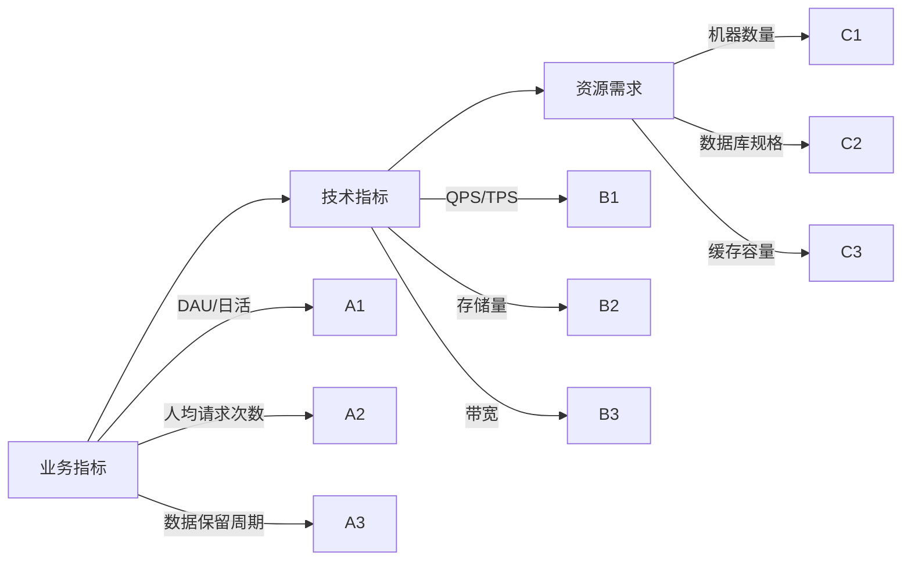
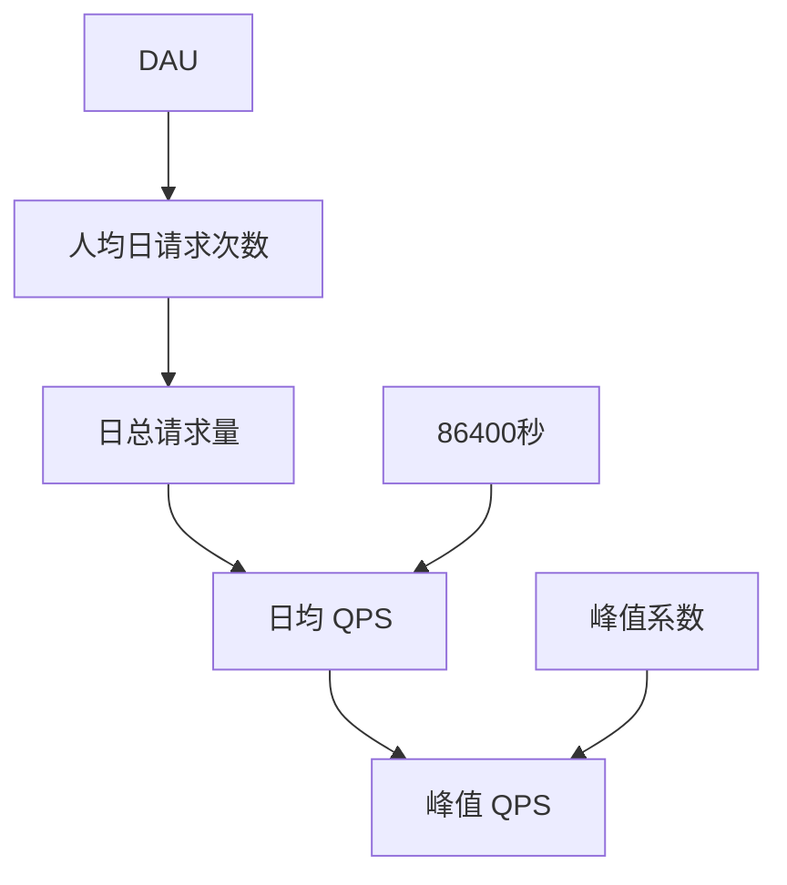
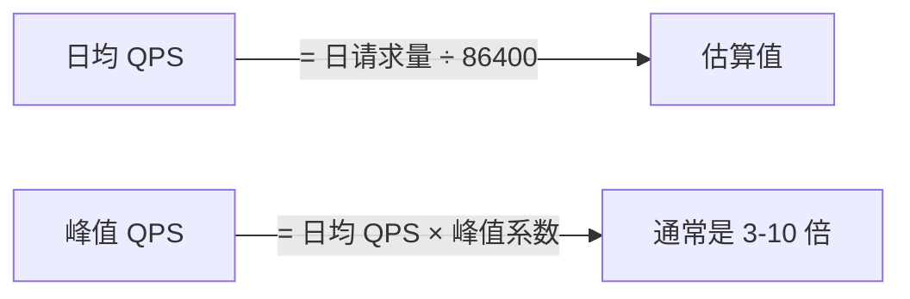
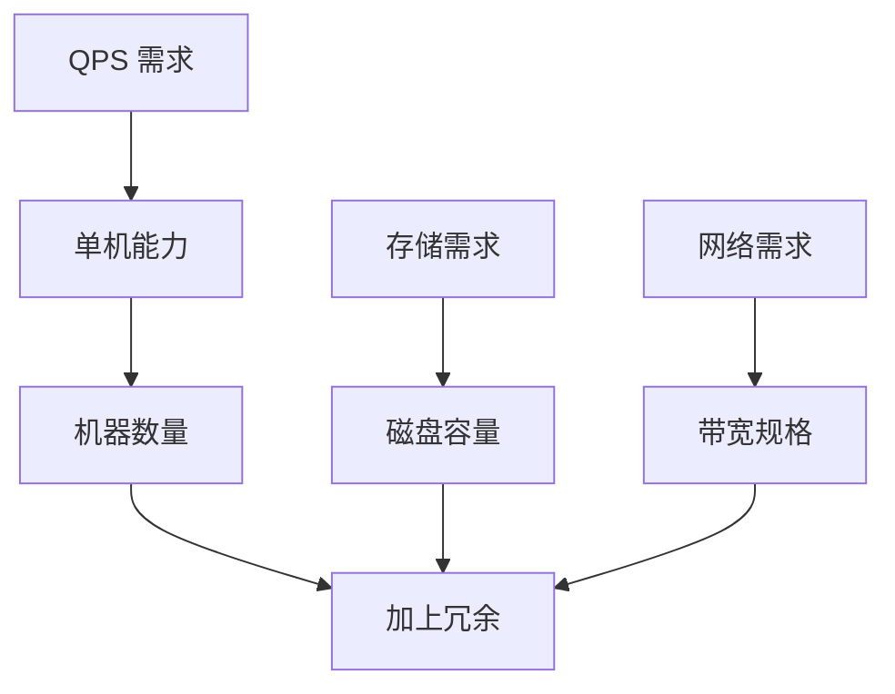

# 容量估算方法

**目标级别**：P6/P7

---

面试官问：「你觉得这个系统需要多少台服务器？」——这是在考察你是否有工程量级感。

容量估算是系统设计的第一步，但也是最容易出错的地方。很多候选人要么估算得过于简单，要么算得太细反而抓不住重点。面试官想看的不是你算得有多精确，而是你会不会估算、能不能抓住主要矛盾。

## 核心估算模型

### 估算的本质

容量估算的本质是：**把业务指标转化为技术资源**。



### 估算的四个维度

| 维度 | 公式 | 说明 |
| --- | --- | --- |
| **QPS** | 日请求量 ÷ 86400 × 峰值系数 | 衡量并发能力 |
| **存储量** | 单条数据大小 × 数据量 × 保留周期 | 衡量存储成本 |
| **带宽** | QPS × 单次请求大小 × 8 ÷ 1000 | 衡量网络需求 |
| **机器数** | QPS ÷ 单机能力 | 衡量部署规模 |

## 估算流程详解

### 第一步：从用户规模出发

用户规模是所有估算的起点：

| 规模 | 日活估算 | 适用场景 |
| --- | --- | --- |
| 小型 | 10 万以下 | 创业公司、内部工具 |
| 中型 | 10-100 万 | 成长型产品 |
| 大型 | 100-1000 万 | 成熟产品 |
| 超大型 | 1000 万以上 | 头部产品 |

**估算公式**：

```
DAU = 总用户数 × 活跃率
活跃率通常取 10%-30%（根据产品形态调整）
```

### 第二步：估算访问量



**关键公式**：



| 参数 | 典型值 | 说明 |
| --- | --- | --- |
| 人均日请求次数 | 5-50 次 | 根据业务类型调整 |
| 峰值系数 | 3-10 倍 | 早晚高峰、整点活动 |

### 第三步：估算存储量

**存储量 = 单条数据大小 × 数据量 × 保留周期**

| 数据类型 | 单条大小 | 估算方法 |
| --- | --- | --- |
| 用户信息 | 100-500 字节 | 字段数量 × 平均长度 |
| 行为日志 | 200-500 字节 | 具体字段相加 |
| 媒体文件 | 按实际大小 | 图片、视频单独计算 |

### 第四步：计算资源需求



## 实战估算案例

### 案例一：短链系统

**需求背景**：设计一个短链系统，支持短链生成和跳转

**Step 1：假设规模**

| 参数 | 假设值 | 依据 |
| --- | --- | --- |
| 总用户数 | 1 亿 | 中大型产品 |
| DAU | 1000 万 | 按 10% 活跃率 |
| 人均生成 | 5 条/天 | 中等使用频率 |
| 人均访问 | 20 次/天 | 跳转访问 |

**Step 2：计算 QPS**

| 指标 | 计算 | 结果 |
| --- | --- | --- |
| 日生成量 | 1000万 × 5 | 5000 万 |
| 日访问量 | 1000万 × 20 | 20 亿 |
| 生成 QPS | 5000万 ÷ 86400 | ~6000 |
| 访问 QPS | 20亿 ÷ 86400 | ~23000 |
| 总 QPS | 6000 + 23000 | ~30000 |
| 峰值 QPS | 30000 × 5 | ~15 万 |

**Step 3：计算存储**

| 指标 | 计算 | 结果 |
| --- | --- | --- |
| 单条短链 | 短码6字节 + URL200字节 + 元数据100字节 | ~300 字节 |
| 每日新增 | 5000万 × 300字节 | 15 GB |
| 一年存储 | 15GB × 365 | ~5.5 TB |

**Step 4：计算机器**

| 组件 | 单机能力 | 数量 | 备注 |
| --- | --- | --- | --- |
| API 服务器 | 2000 QPS | 75 台 | 含冗余 |
| MySQL（写） | 2000 QPS | 8 台 | 主从 |
| MySQL（读） | 5000 QPS | 6 台 | 读写分离 |
| Redis | 10 万 QPS | 2 台 | 缓存热点 |

### 案例二：Feed 流系统

**需求背景**：设计一个微博 Feed 流系统

**Step 1：假设规模**

| 参数 | 假设值 | 依据 |
| --- | --- | --- |
| 总用户数 | 5 亿 | 大型社交平台 |
| DAU | 2 亿 | 按 40% 活跃率 |
| 关注数 | 200 人 | 平均水平 |
| Feed 条数 | 50 条/人 | 首页展示量 |

**Step 2：计算 QPS**

| 指标 | 计算 | 结果 |
| --- | --- | --- |
| 日请求量 | 2亿 × 20 次 | 40 亿 |
| 请求 QPS | 40亿 ÷ 86400 | ~5 万 |
| 峰值 QPS | 5万 × 5 | ~25 万 |

**Step 3：计算存储**

| 指标 | 单条大小 | 日增量 | 年存储 |
| --- | --- | --- | --- |
| 微博内容 | 500 字节 | 1 亿条 × 500B | 180 TB |
| 用户 Feed | 50字节 | 2亿 × 50 × 200条 | 3.6 PB |
| 评论/点赞 | 100 字节 | 5 亿条 | 18 TB |

### 案例三：秒杀系统

**需求背景**：设计一个秒杀系统，支持商品秒杀

**Step 1：假设规模**

| 参数 | 假设值 | 依据 |
| --- | --- | --- |
| 参与用户 | 100 万 | 活动预热 |
| 同时在线 | 10 万 | 峰值并发 |
| 商品数量 | 1000 件 | 稀缺商品 |
| 持续时间 | 1 小时 | 活动窗口 |

**Step 2：计算 QPS**

| 指标 | 计算 | 结果 |
| --- | --- | --- |
| 峰值 QPS | 10万 | 瞬间涌入 |
| 访问 QPS | 100万 ÷ 3600 | ~300/秒 |

**Step 3：计算资源**

| 场景 | 正常状态 | 秒杀瞬间 | 需要扩容吗？ |
| --- | --- | --- | --- |
| 访问商品页 | 100 QPS | 10 万 QPS | **必须扩容** |
| 点击购买 | 10 QPS | 5 万 QPS | **必须扩容** |
| 支付成功 | 5 QPS | 100 QPS | 可接受 |

## 常见估算错误

### ⚠️ 错误一：忘记峰值系数

> 候选人：「日均 QPS 1 万，我用 5 台机器就够了」
> 面试官：「峰值是 10 倍呢？」
> 候选人：「...」

**正确做法**：始终考虑峰值，峰值系数通常取 3-10 倍。

### ⚠️ 错误二：存储不计算增量

> 候选人：「1TB 存储够用了」
> 面试官：「那一年呢？」
> 候选人：「...」

**正确做法**：存储要算增量，考虑数据保留周期。

### ⚠️ 错误三：单机能力估计不准

| 组件 | 典型单机能力 | 说明 |
| --- | --- | --- |
| Web 服务器 | 1000-2000 QPS | 取决于 CPU 和网络 |
| MySQL | 3000-5000 QPS | 简单查询 |
| Redis | 10-20 万 QPS | 取决于 value 大小 |
| Kafka | 10 万/分区 | 写入能力 |

### ⚠️ 错误四：单位搞混

```
1 MB = 1024 KB = 1024² B = 1,048,576 B
1 GB = 1024 MB = 1024³ B = 1,073,741,824 B

1 Mb = 1024 Kb = 1024² b = 1,048,576 b
1 Gb = 1024 Mb = 1024³ b = 1,073,741,824 b
```

⚠️ 注意：B = Byte，b = bit。带宽常用 bit，存储常用 Byte。

## 估算公式速查表

### 用户量级速算

| DAU | 日请求量（按 20 次/人） | 日均 QPS | 峰值 QPS（×5） |
| --- | --- | --- | --- |
| 10 万 | 200 万 | 23 | 115 |
| 100 万 | 2000 万 | 230 | 1150 |
| 1000 万 | 2 亿 | 2300 | 11500 |
| 1 亿 | 20 亿 | 23000 | 115000 |
| 10 亿 | 200 亿 | 230000 | 1150000 |

### 存储速算

| 日增量 | 保留 30 天 | 保留 180 天 | 保留 1 年 |
| --- | --- | --- | --- |
| 1 GB | 30 GB | 180 GB | 365 GB |
| 10 GB | 300 GB | 1.8 TB | 3.6 TB |
| 100 GB | 3 TB | 18 TB | 36 TB |
| 1 TB | 30 TB | 180 TB | 365 TB |

### 机器数量速算

| QPS 需求 | Web 服务器（2000 QPS/台） | MySQL（3000 QPS/台） | Redis（15万 QPS/台） |
| --- | --- | --- | --- |
| 1 万 | 5 台 | 4 台 | 1 台 |
| 10 万 | 50 台 | 34 台 | 1 台 |
| 100 万 | 500 台 | 334 台 | 7 台 |

## 面试话术模板

```
「我来估算一下这个系统的规模：

首先假设日活 1000 万...
按人均日请求 20 次计算，日总请求量是 2 亿次...
折算成 QPS 是 2 亿 ÷ 86400 ≈ 2300...
考虑峰值系数 5 倍，峰值 QPS 约 1 万...

存储方面，单条数据假设 300 字节...
每天新增 2 亿 × 300 ≈ 60GB...
保留 30 天需要 1.8TB...

基于这个规模：
- Web 服务器需要 10-15 台
- MySQL 需要 4-6 台做读写分离
- Redis 需要 2 台做缓存

这个估算可能偏保守，实际可以根据具体情况调整。」
```

---

> 💡 **面试官视角**：容量估算考察的是你的工程量级感。不需要精确到个位数，但要有数量级的概念。面试官会从你的估算过程中判断你是否真正理解系统的瓶颈在哪里。
