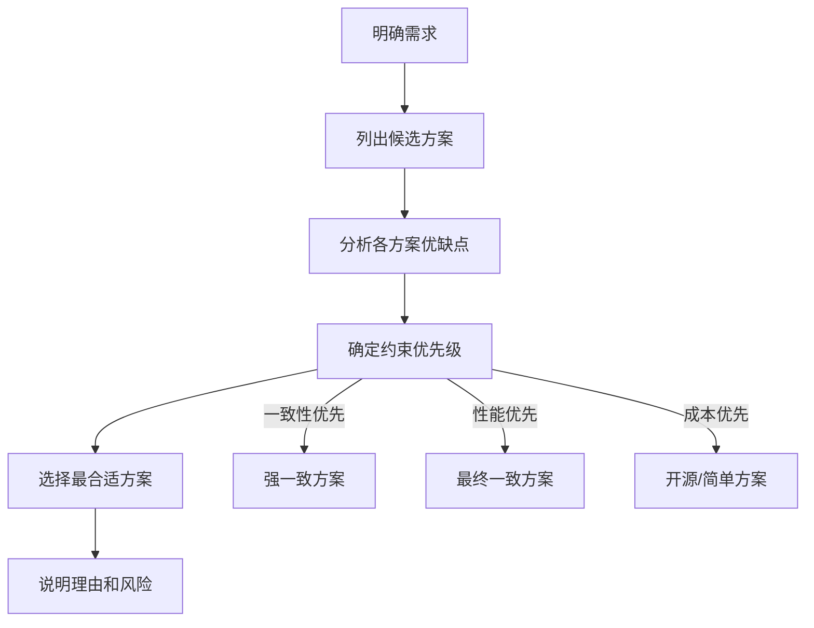
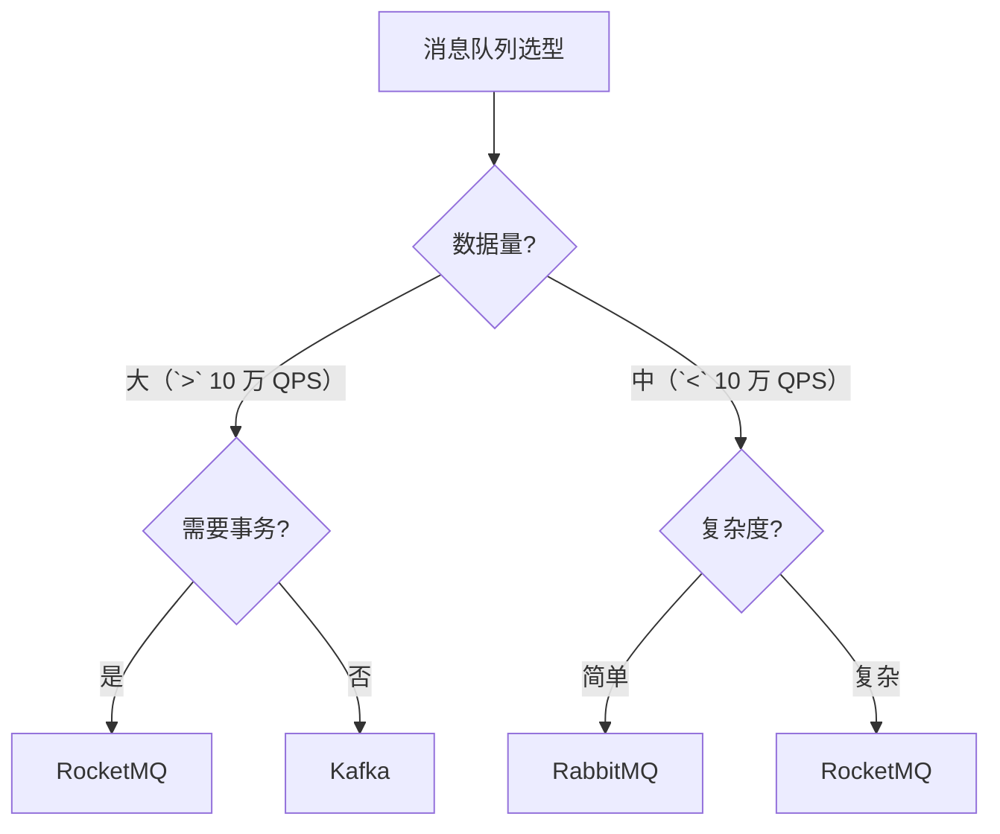

# 系统设计组件选型

**目标级别**：P6/P7

---

面试官问：「如果让你设计一个高性能系统，怎么选型？」——这道题考察的是你对各种组件的理解深度和工程判断力。

系统设计时，组件选型是关键决策。选错了轻则性能差，重则架构重构。面试官会追问「为什么选这个」「有什么替代方案」「trade-off 是什么」等深层问题。

## 面试题速览

| 题号 | 问题 | 频率 | 难度 |
| --- | --- | --- | --- |
| 01 | 存储组件怎么选？ | 🔴 高频 | P6 |
| 02 | 缓存组件怎么选？ | 🔴 高频 | P6 |
| 03 | 消息队列怎么选？ | 🔴 高频 | P6 |
| 04 | 搜索引擎怎么选？ | 🟡 中频 | P6 |
| 05 | 选型的决策框架是什么？ | 🟡 中频 | P6 |

## 一、选型的核心原则

### 选型决策框架



### 选型维度

| 维度 | 说明 | 重要性 |
| --- | --- | --- |
| **功能** | 能否满足核心需求 | 必须 |
| **性能** | QPS、延迟能否达标 | 高 |
| **可用性** | 能否保证 SLA | 高 |
| **扩展性** | 数据量增长能否应对 | 中 |
| **运维成本** | 团队能否驾驭 | 中 |
| **成本** | 采购/运维成本 | 中 |

## 二、存储组件选型

### 关系型数据库

| 产品 | 适用场景 | 优点 | 缺点 |
| --- | --- | --- | --- |
| **MySQL** | 通用场景，中小型数据 | 生态好，运维成熟 | 并发有限 |
| **PostgreSQL** | 复杂查询，GIS 场景 | 功能丰富 | 社区相对小 |
| **TiDB** | 大数据量，分库分表 | 水平扩展 | 运维复杂 |
| **OceanBase** | 金融场景 | 高可靠 | 闭源 |

### NoSQL 数据库

| 产品 | 数据模型 | 适用场景 | 一致性 |
| --- | --- | --- | --- |
| **MongoDB** | 文档 | 日志、内容管理 | 最终一致 |
| **HBase** | 列族 | 大数据存储 | 最终一致 |
| **Cassandra** | 列族 | 时序数据 | 最终一致 |
| **Neo4j** | 图 | 社交关系 | 强一致 |

### 选型决策树

```mermaid
flowchart TD
    A["需要事务?"] --> B{"是"}
    B --> C["关系型数据库"]
    
    A --> D{"数据结构?"}
    D -->|"文档"| E["MongoDB"]
    D -->|"KV"| F["Redis"]
    D -->|"宽表"| G["HBase/Cassandra"]
    D -->|"图"| H["Neo4j"]
    
    C --> I{"数据量?"}
    I -->|"`<` 1 亿"| J["MySQL"]
    I -->|"`>` 1 亿"| K["TiDB/分库分表"]
```

## 三、缓存组件选型

### Redis vs Memcached

| 维度 | Redis | Memcached |
| --- | --- | --- |
| **数据结构** | String/Hash/List/Set/ZSet | 仅 String |
| **持久化** | 支持 RDB/AOF | 不支持 |
| **主从复制** | 支持 | 不支持 |
| **集群模式** | Cluster、哨兵 | 无 |
| **Lua 脚本** | 支持 | 不支持 |
| **内存效率** | 中等 | 高 |
| **适用场景** | 复杂数据结构 | 简单缓存 |

### Redis 集群模式对比

| 模式 | 原理 | 优点 | 缺点 |
| --- | --- | --- | --- |
| **主从** | 1 主 N 从 | 简单 | 无自动故障转移 |
| **哨兵** | 主从 + 监控 | 自动切换 | 写无法扩展 |
| **Cluster** | 分片 + 主从 | 水平扩展 | 运维复杂 |

### 缓存策略对比

| 策略 | 原理 | 适用场景 | 一致性 |
| --- | --- | --- | --- |
| **Cache Aside** | 先读缓存，未命中读库 | 读多 | 可能不一致 |
| **Write Through** | 写库同时写缓存 | 写少 | 强一致 |
| **Write Behind** | 异步写缓存 | 写多 | 可能丢失 |

## 四、消息队列选型

### 消息队列对比

| 产品 | 开发语言 | 单机 QPS | 持久化 | 事务 | 适用场景 |
| --- | --- | --- | --- | --- | --- |
| **Kafka** | Scala | 100 万 | 支持 | 弱 | 大数据、流处理 |
| **RocketMQ** | Java | 50 万 | 支持 | 强 | 电商交易 |
| **RabbitMQ** | Erlang | 10 万 | 支持 | 弱 | 中小型系统 |
| **Pulsar** | Java | 100 万 | 支持 | 强 | 云原生 |

### 选型决策



### Kafka vs RocketMQ

| 维度 | Kafka | RocketMQ |
| --- | --- | --- |
| **吞吐量** | 极高 | 高 |
| **延迟** | 低 | 低 |
| **事务支持** | 弱（单分区） | 强 |
| **顺序消息** | 单分区有序 | 支持分区有序 |
| **延迟消息** | 不支持 | 支持 |
| **死信队列** | 不支持 | 支持 |
| **运维成本** | 高 | 中 |

## 五、搜索引擎选型

### 搜索引擎对比

| 产品 | 开发语言 | 适用场景 | 优点 | 缺点 |
| --- | --- | --- | --- | --- |
| **Elasticsearch** | Java | 全文检索、日志 | 功能全面 | 资源消耗大 |
| **Solr** | Java | 全文检索 | 性能好 | 功能较少 |
| **Meilisearch** | Rust | 小型搜索 | 轻量 | 功能少 |

### ES vs 关系型数据库

| 维度 | Elasticsearch | MySQL |
| --- | --- | --- |
| **全文搜索** | 原生支持 | 需要 LIKE |
| **分词** | 支持多种分词器 | 不支持 |
| **相关性排序** | 支持 | 不支持 |
| **聚合分析** | 支持 | 有限 |
| **写入性能** | 高 | 中 |
| **事务** | 不支持 | 支持 |
| **数据量** | TB 级 | GB 级 |

## 六、全文检索深入对比

### 数据库 vs 搜索引擎

| 场景 | 推荐方案 | 说明 |
| --- | --- | --- |
| **精确查询** | 数据库 | 索引精确 |
| **模糊搜索** | 搜索引擎 | 分词 + 倒排索引 |
| **排序分页** | 两者皆可 | 数据库略优 |
| **多条件筛选** | 两者皆可 | ES 聚合更灵活 |
| **实时性要求高** | 数据库 | ES 有延迟 |

### ⚠️ 面试官挖坑点

**陷阱一：什么场景都用 ES**

> 面试官：「所有查询都走 ES 行不行？」
>
> 错误回答：「行，ES 什么都能查」
>
> 正确回答：不行。ES 不适合精确查询（如金额精确匹配）和事务场景。应该用「数据库 + ES」的方案：数据库做精确查询和持久化，ES 做全文检索。

**陷阱二：缓存就是 Redis**

> 面试官：「缓存一定要用 Redis 吗？」
>
> 错误回答：「对，Redis 最流行」
>
> 正确回答：不是。看场景：本地缓存（Caffeine/Guava）适合数据量小、变化频率高的热点数据；Redis 适合需要跨节点共享的数据；分布式缓存还要考虑数据一致性问题。

## 七、实战选型案例

### 案例一：短链系统选型

| 组件 | 选型 | 理由 |
| --- | --- | --- |
| **存储** | MySQL + Redis | MySQL 持久化，Redis 做缓存 |
| **ID 生成** | 雪花算法 | 高性能、无依赖 |
| **缓存** | Redis Cluster | 高可用、高 QPS |

### 案例二：IM 系统选型

| 组件 | 选型 | 理由 |
| --- | --- | --- |
| **长连接** | Netty | 高性能、NIO |
| **消息存储** | MongoDB | 文档模型、水平扩展 |
| **在线状态** | Redis | O(1) 读写 |
| **消息队列** | Kafka | 高吞吐、解耦 |

### 案例三：Feed 流系统选型

| 组件 | 选型 | 理由 |
| --- | --- | --- |
| **Timeline** | Redis List | 简单高效 |
| **Feed 存储** | MySQL + HBase | 持久化 + 大数据 |
| **搜索** | Elasticsearch | 内容检索 |
| **推荐** | Flink + Redis | 实时计算 |

## 八、组件版本选择

### 版本选择原则

| 原则 | 说明 | 示例 |
| --- | --- | --- |
| **稳定优先** | 生产环境用稳定版本 | 不追最新 |
| **LTS 优先** | 选择有长期支持的版本 | MySQL 8.0 LTS |
| **兼容性** | 与其他组件兼容 | JDK 版本匹配 |
| **社区活跃** | 社区活跃度高 | 有问题能找到答案 |

### 版本对照表

| 组件 | 推荐版本 | 说明 |
| --- | --- | --- |
| Java | JDK 17+ | LTS，支持新特性 |
| MySQL | 8.0 | 性能提升，新特性 |
| Redis | 7.0+ | 多线程，集群优化 |
| Kafka | 3.0+ | KRaft 模式 |
| ES | 8.0+ | 安全性提升 |
| Spring Boot | 3.0+ | JDK 17+ |

## 九、面试高频追问

### 第一层：存储选型

> **问题**：MySQL 和 MongoDB 怎么选？
>
> **参考答案**：
> 看场景选。MySQL 适合：需要事务的业务、数据结构固定的场景、对数据一致性要求高的场景。MongoDB 适合：数据结构灵活（无固定 schema）、需要快速迭代、内容管理（日志、文章）。简单说：结构化数据用 MySQL，文档型数据用 MongoDB。

### 第二层：缓存选型

> **问题**：Redis 和本地缓存怎么选？
>
> **参考答案**：
> 结合使用。本地缓存（如 Caffeine）适合：数据量小（MB 级）、访问极频繁（QPS 百万级）、数据不需要跨节点共享。Redis 适合：数据量大（GB 级）、需要跨节点共享、需要持久化。两者结合：本地缓存做热点数据兜底，Redis 做共享数据。

### 第三层：消息队列选型

> **问题**：Kafka 和 RocketMQ 怎么选？
>
> **参考答案**：
> 数据量 `>` 10 万 QPS、追求吞吐量、用在大数据场景选 Kafka。数据量中等、追求事务可靠性、需要延迟消息选 RocketMQ。简单原则：Kafka 是大数据的事实标准，RocketMQ 是交易场景的首选。

## 十、综合对比

| 类型 | 推荐方案 | 备选方案 | 适用场景 |
| --- | --- | --- | --- |
| **关系数据库** | MySQL | PostgreSQL | 通用场景 |
| **NoSQL** | MongoDB | HBase | 文档/大数据 |
| **缓存** | Redis | Caffeine | 缓存层 |
| **消息队列** | RocketMQ | Kafka | 交易/大数据 |
| **搜索引擎** | Elasticsearch | - | 全文检索 |
| **分布式锁** | Redis | ZooKeeper | 锁服务 |
| **配置中心** | Apollo | Nacos | 配置管理 |
| **任务调度** | XXL-Job | PowerJob | 定时任务 |

## 十一、扩展思考

### 问题一：要不要引入中间件

> 中间件虽好，但增加运维复杂度和成本。
>
> **判断标准**：
> - 团队是否有能力运维这个中间件？
> - 带来的收益是否大于成本？
> - 有没有更简单的替代方案？

### 问题二：如何应对技术栈多样性

> 每个团队用不同的中间件，维护成本高。
>
> **解决方案**：
> - 制定技术栈标准，限定可选组件
> - 核心组件统一，不同团队共享
> - 非核心组件按需引入

---

> 💡 **面试官视角**：组件选型考察的是你的工程判断力。面试官希望你说出选择背后的 trade-off，而不是简单背答案。关键是理解每个场景下「为什么选这个」，而不是「这个最好」。
