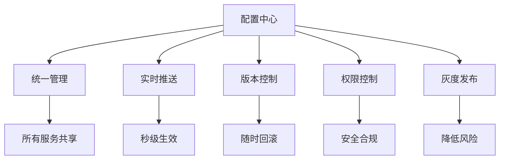
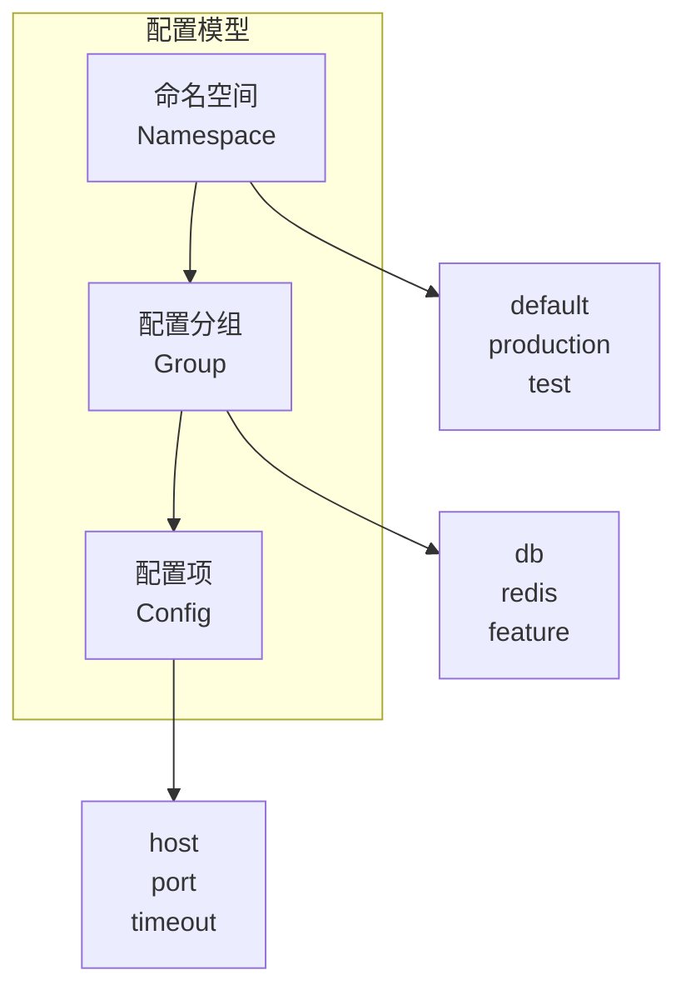
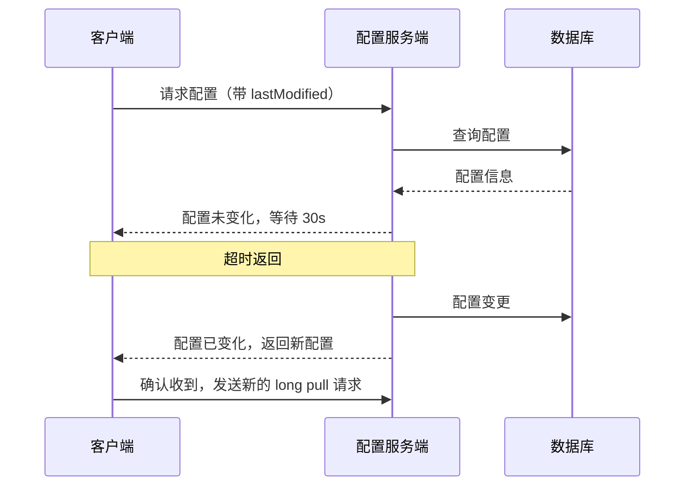
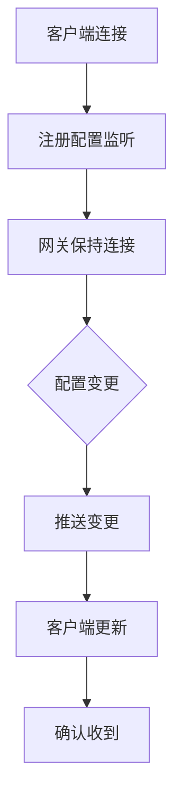
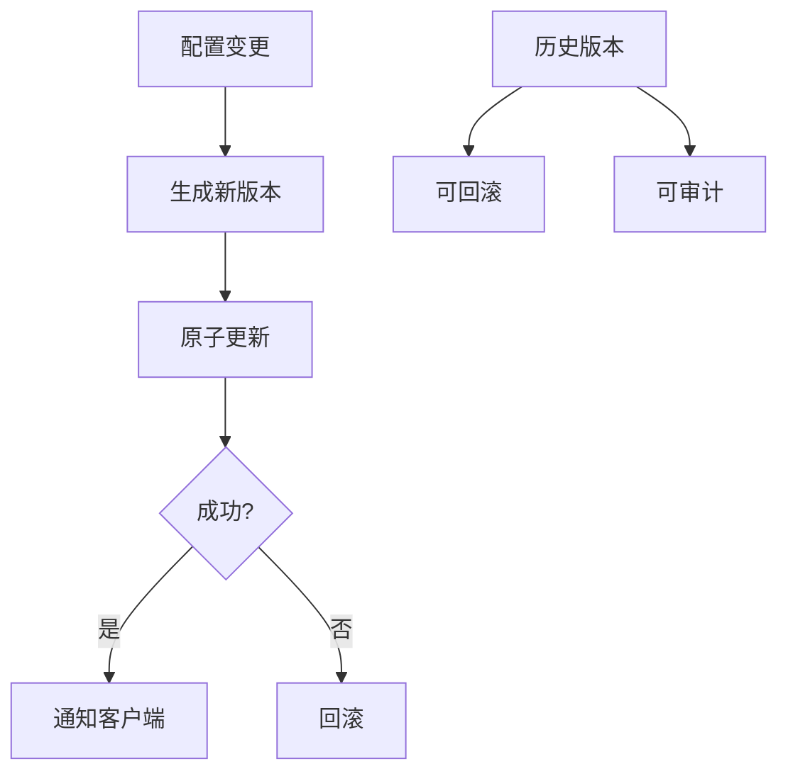
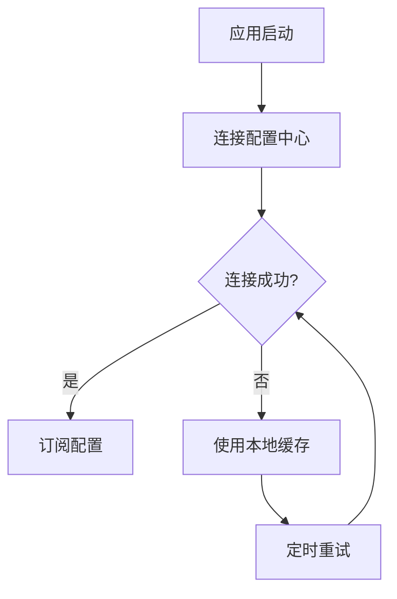

# 配置中心设计

**目标级别**：P6/P7

---

面试官问：「如果让你设计一个配置中心，怎么做？」——这道题考察的是你对配置管理、高可用、实时推送的理解。

配置中心是现代微服务架构的基础设施。面试官不会只问「怎么存储配置」，而是会追问「怎么实现配置推送」「配置变更怎么保证原子性」「如何处理配置回滚」等深层问题。

## 面试题速览

| 题号 | 问题 | 频率 | 难度 |
| --- | --- | --- | --- |
| 01 | 配置中心要解决什么问题？ | 🔴 高频 | P5 |
| 02 | 配置中心有哪些核心功能？ | 🔴 高频 | P6 |
| 03 | 配置怎么实现实时推送？ | 🔴 高频 | P6 |
| 04 | 如何保证配置的一致性？ | 🟡 中频 | P6 |
| 05 | 配置中心的高可用怎么设计？ | 🟡 中频 | P6 |

## 一、配置中心要解决什么问题

### 配置管理的问题

| 问题 | 说明 | 后果 |
| --- | --- | --- |
| **配置分散** | 各服务配置在代码库中 | 修改困难、难以追溯 |
| **配置不一致** | 不同环境的配置不同 | 测试没问题但上线报错 |
| **配置不可见** | 配置值不知道在哪改 | 改错配置导致故障 |
| **配置变更慢** | 修改配置需要重启服务 | 发布周期长 |
| **配置泄露** | 数据库密码写在代码里 | 安全风险 |

### 配置中心价值



## 二、核心功能设计

### 配置类型

| 类型 | 说明 | 示例 |
| --- | --- | --- |
| **静态配置** | 运行时不变的配置 | 数据库连接信息 |
| **动态配置** | 运行时可动态调整 | 熔断阈值、功能开关 |
| **敏感配置** | 加密存储的敏感信息 | 数据库密码、API 密钥 |
| **环境配置** | 不同环境不同值 | Dev/Staging/Prod |

### 配置模型



```sql
-- 配置表设计
CREATE TABLE config (
    id BIGINT PRIMARY KEY AUTO_INCREMENT,
    namespace VARCHAR(64) NOT NULL COMMENT '命名空间',
    `group` VARCHAR(64) NOT NULL COMMENT '配置分组',
    config_key VARCHAR(128) NOT NULL COMMENT '配置项',
    config_value TEXT NOT NULL COMMENT '配置值',
    config_type TINYINT DEFAULT 0 COMMENT '0-普通 1-敏感',
    version INT DEFAULT 1 COMMENT '版本号',
    created_at DATETIME,
    updated_at DATETIME,
    UNIQUE KEY uk_namespace_group_key (namespace, `group`, config_key),
    INDEX idx_namespace (namespace)
);

-- 配置历史表
CREATE TABLE config_history (
    id BIGINT PRIMARY KEY AUTO_INCREMENT,
    config_id BIGINT NOT NULL,
    old_value TEXT,
    new_value TEXT,
    operator VARCHAR(64),
    operate_type VARCHAR(32),
    created_at DATETIME
);
```

## 三、配置推送机制

### 推送 vs 拉取

| 方案 | 原理 | 优点 | 缺点 |
| --- | --- | --- | --- |
| **长轮询** | 客户端定时询问 | 实现简单 | 有延迟、浪费资源 |
| **长连接** | 服务端保持连接 | 实时性好 | 实现复杂、连接多 |
| **WebSocket** | 双向通信 | 实时性好 | 需要维护连接 |
| **SSE** | 服务端推送事件 | 实现简单 | 单向 |

### 长轮询实现



```java
public class ConfigLongPollingService {
    
    private static final long LONG_POLL_TIMEOUT = 30_000; // 30 秒
    
    public ConfigVO getConfig(String namespace, String group, String key, long lastModified) {
        // 1. 先查本地缓存
        ConfigVO cached = localCache.get(namespace, group, key);
        if (cached != null && cached.getVersion() > lastModified) {
            return cached;
        }
        
        // 2. 查数据库
        ConfigVO dbConfig = configDAO.select(namespace, group, key);
        
        // 3. 有变化则立即返回
        if (dbConfig.getVersion() > lastModified) {
            return dbConfig;
        }
        
        // 4. 无变化，阻塞等待（最长 30 秒）
        return waitForChange(namespace, group, key, lastModified, LONG_POLL_TIMEOUT);
    }
    
    // 配置变更通知
    public void notifyChange(String namespace, String group, String key) {
        // 通知等待的客户端
        pendingRequests.remove(namespace, group, key);
    }
}
```

### 长连接推送（推荐）



```java
public class ConfigPushService {
    
    private ConcurrentHashMap<String, List<ClientConnection>> listeners = new ConcurrentHashMap<>();
    
    // 客户端注册监听
    public void register(String namespace, String group, ClientConnection conn) {
        String key = namespace + ":" + group;
        listeners.computeIfAbsent(key, k -> new ArrayList<>()).add(conn);
    }
    
    // 配置变更时推送
    public void pushChange(String namespace, String group, ConfigChange change) {
        String key = namespace + ":" + group;
        List<ClientConnection> conns = listeners.get(key);
        if (conns != null) {
            for (ClientConnection conn : conns) {
                conn.send(change);
            }
        }
    }
}
```

## 四、配置一致性保证

### 问题场景

| 问题 | 说明 | 后果 |
| --- | --- | --- |
| **配置错乱** | 修改时并发导致值不一致 | 服务行为异常 |
| **配置丢失** | 删除配置后未生效 | 服务报错 |
| **配置回滚** | 改错了想恢复 | 无法回滚 |

### 解决方案：版本控制



```java
public class ConfigService {
    
    @Transactional
    public void updateConfig(ConfigUpdateRequest request) {
        // 1. 查询当前配置
        Config current = configDAO.select(request.getNamespace(), request.getGroup(), request.getKey());
        
        // 2. 保存历史版本
        ConfigHistory history = new ConfigHistory();
        history.setConfigId(current.getId());
        history.setOldValue(current.getValue());
        history.setNewValue(request.getNewValue());
        history.setOperator(request.getOperator());
        configHistoryDAO.insert(history);
        
        // 3. 原子更新配置
        current.setValue(request.getNewValue());
        current.setVersion(current.getVersion() + 1);
        configDAO.update(current);
        
        // 4. 通知客户端
        notifyClient(request.getNamespace(), request.getGroup(), request.getKey());
    }
    
    // 回滚到指定版本
    public void rollback(Long configId, Integer targetVersion) {
        ConfigHistory history = configHistoryDAO.selectByConfigIdAndVersion(configId, targetVersion);
        Config current = configDAO.selectById(configId);
        
        // 用历史值覆盖当前值
        current.setValue(history.getOldValue());
        current.setVersion(current.getVersion() + 1);
        configDAO.update(current);
        
        notifyClient(current.getNamespace(), current.getGroup(), current.getConfigKey());
    }
}
```

### ⚠️ 面试官挖坑点

**陷阱一：客户端缓存不一致**

> 面试官：「服务端配置更新了，客户端怎么保证拿到最新配置？」
>
> 错误回答：「客户端每次都查服务端」
>
> 正确回答：不能每次都查，性能太差。应该用推送 + 缓存结合：推送通知客户端配置变了，客户端更新本地缓存。如果缓存和网络都查不到，才查数据库。

**陷阱二：配置原子性**

> 面试官：「如果要同时更新多个配置项，怎么保证原子性？」
>
> 错误回答：「按顺序更新就行」
>
> 正确回答：不是原子操作，可能部分成功部分失败。应该用事务保证：要么全部成功，要么全部回滚。也可以用配置组，每个组是原子更新的最小单位。

## 五、高可用设计

### 客户端高可用



```java
public class ConfigClient {
    
    private static final String BACKUP_FILE = "config.backup.json";
    
    public Config getConfig(String key) {
        try {
            // 优先从配置中心获取
            Config config = configCenter.get(key);
            // 缓存到本地
            saveToLocalCache(config);
            return config;
        } catch (Exception e) {
            // 配置中心不可用，从本地缓存获取
            return readFromLocalCache(key);
        }
    }
    
    public void onConfigChange(ConfigChange change) {
        // 收到配��变更通知，更新本地缓存
        localCache.put(change.getKey(), change.getNewValue());
    }
}
```

### 服务端高可用

| 方案 | 说明 | 适用场景 |
| --- | --- | --- |
| **主备** | 一主一备，主挂备接管 | 小规模 |
| **集群** | 多节点集群，通过 ZooKeeper 选主 | 生产环境 |
| **数据多副本** | 数据在多节点同步 | 高可靠要求 |

## 六、配置中心产品对比

| 产品 | 开发语言 | 特点 | 适用场景 |
| --- | --- | --- | --- |
| **Apollo** | Java | 功能全面，配置回滚，权限控制 | 大型企业 |
| **Nacos** | Java | 配置+注册中心二合一 | 中小企业 |
| **Spring Cloud Config** | Java | Spring 生态集成 | Spring 项目 |
| **Consul** | Go | 配置+服务发现 | 微服务 |
| **Etcd** | Go | KV 存储，配置存储 | K8s 生态 |
| **自研** | - | 完全可控，按需定制 | 大厂 |

## 七、面试高频追问

### 第一层：配置推送原理

> **问题**：配置中心是怎么实现配置实时推送的？
>
> **参考答案**：
> 有两种主要方式：长轮询和长连接。长轮询是客户端定时问服务端「配置变了吗」，服务端如果有变化就立即返回，没有就等 30 秒再返回。长连接是客户端保持一个 HTTP 连接，服务端有变更时通过这个连接推送。长连接更实时，推荐使用。

### 第二层：配置一致性

> **问题**：配置更新后，怎么保证所有服务都拿到最新配置？
>
> **参考答案**：
> 三个层面：1）服务端用版本号控制，客户端带版本号请求，无变化则等待；2）变更时通过长连接推送通知客户端；3）客户端本地缓存 + 推送双重保障。服务端保证原子更新，客户端保证缓存不失效。

### 第三层：配置回滚

> **问题**：配置改错了怎么回滚？
>
> **参考答案**：
> 配置中心应该有版本控制。每次修改生成新版本，保存旧版本记录。需要回滚时，用历史版本的值覆盖当前值，然后通知客户端刷新。如果配置中心不支持版本控制，可以考虑用 Git 管理配置文件。

## 八、综合对比

| 维度 | Apollo | Nacos | 自研 |
| --- | --- | --- | --- |
| **功能完善度** | 完整 | 较完整 | 按需 |
| **运维成本** | 高 | 中 | 低 |
| **扩展性** | 一般 | 一般 | 高 |
| **社区活跃** | 高 | 高 | 无 |
| **适合规模** | 大型 | 中型 | 按需 |
| **配置回滚** | 支持 | 支持 | 需实现 |

---

> 💡 **面试官视角**：配置中心考察的是你对「配置管理」和「实时推送」的理解。Apollo 是标准��案，但要能说出长轮询/长连接的区别、版本控制的实现、高可用的设计。