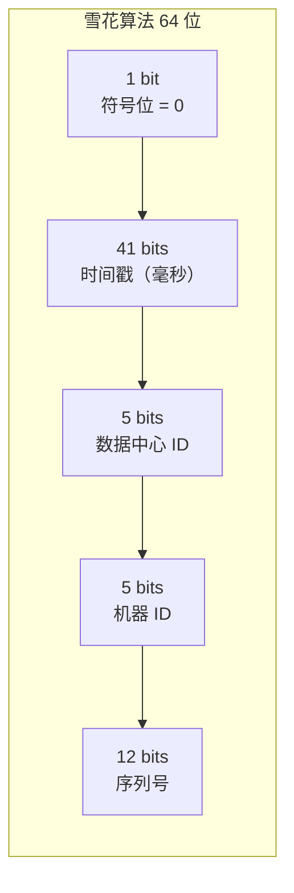
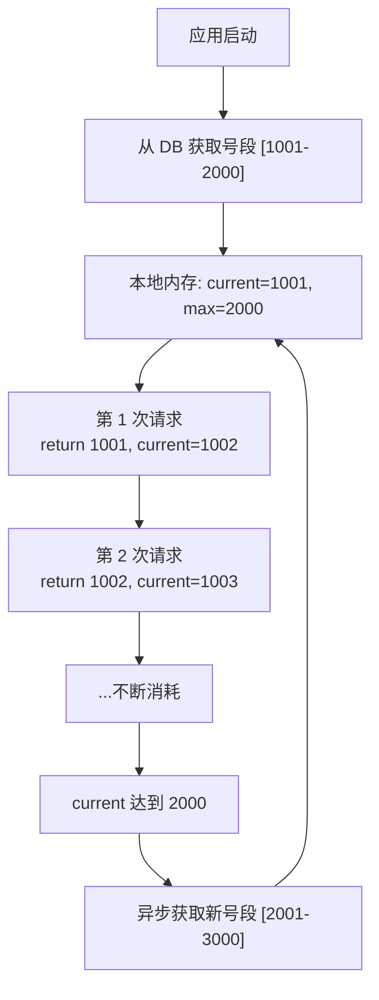
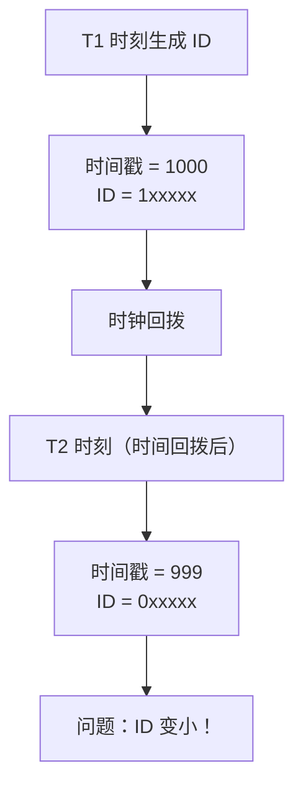

# 分布式 ID 生成器

**目标级别**：P6/P7

---

面试官问：「如果让你设计一个分布式 ID 生成器，怎么做？」——这道题考察的是你对分布式系统一致性、高性能、有序性的理解。

分布式 ID 是很多系统的基础设施，如订单号、消息 ID、用户 ID 等。面试官不会只问「用什么算法」，而是会追问「怎么保证唯一」「怎么保证有序」「怎么应对时钟回拨」等深层问题。

## 面试题速览

| 题号 | 问题 | 频率 | 难度 |
| --- | --- | --- | --- |
| 01 | 分布式 ID 有哪些要求？ | 🔴 高频 | P5 |
| 02 | 雪花算法的结构是什么？ | 🔴 高频 | P6 |
| 03 | 号段模式怎么实现？ | 🟡 中频 | P6 |
| 04 | 时钟回拨怎么处理？ | 🔴 高频 | P6 |
| 05 | 怎么选择 ID 生成方案？ | 🟡 中频 | P6 |

## 一、分布式 ID 的要求

### 核心要求

| 要求 | 说明 | 重要性 |
| --- | --- | --- |
| **全局唯一** | 不同机器生成的 ID 不能重复 | 必须 |
| **趋势递增** | 新 ID 比旧 ID 大，便于索引 | 高 |
| **单调递增** | 新 ID 严格大于旧 ID（可选） | 中 |
| **高性能** | QPS 要高，不能成为瓶颈 | 高 |
| **高可用** | 不能有单点故障 | 高 |
| **可排序** | ID 大小反映时间顺序 | 高 |

### ⚠️ 常见陷阱

**陷阱一：只用 UUID**

> 面试官：「UUID 能满足分布式 ID 的要求吗？」
>
> 错误回答：「能，UUID 全球唯一」
>
> 正确回答：UUID 有问题：1）无序，写入 InnoDB 会造成页分裂；2）存储大，36 个字符；3）不可读，无法从 ID 推断业务含义。UUID 只适合不要求有序、不需要排序的场景。

## 二、常见方案对比

| 方案 | 唯一性 | 有序性 | 性能 | 依赖 | 适用场景 |
| --- | --- | --- | --- | --- | --- |
| **UUID** | ✅ | ❌ | 高 | 无 | 分布式节点 ID |
| **数据库自增** | ✅ | ✅ | 中 | MySQL | 单机、小规模 |
| **雪花算法** | ✅ | ✅ | 高 | 无 | 生产环境推荐 |
| **号段模式** | ✅ | ✅ | 高 | DB/Redis | 分库分表场景 |
| **Redis INCR** | ✅ | ✅ | 高 | Redis | 有 Redis 基础 |
| **ZooKeeper** | ✅ | ✅ | 低 | ZK | 强依赖 ZK |

## 三、雪花算法详解

### 算法结构



### 各部分详解

| 字段 | 位数 | 取值范围 | 说明 |
| --- | --- | --- | --- |
| **符号位** | 1 | 0 | 固定为 0 |
| **时间戳** | 41 | 0-2^41-1 | 可用 69 年（从 epoch 开始） |
| **数据中心 ID** | 5 | 0-31 | 最多 32 个数据中心 |
| **机器 ID** | 5 | 0-31 | 每数据中心最多 32 台机器 |
| **序列号** | 12 | 0-4095 | 每毫秒最多 4096 个 ID |

### 时间戳设计

```
可用时间 = (2^41 - 1) 毫秒 ≈ 69 年
默认 epoch = 2021-01-01 00:00:00（可自定义）
最大时间 = epoch + 69 年 = 2090 年
```

### ⚠️ 面试官挖坑点

**陷阱一：时间戳用秒还是毫秒？**

> 面试官：「时间戳用秒级够用吗？」
>
> 错误回答：「够用，秒级已经很高了」
>
> 正确回答：不够。秒级时间戳每秒只能生成 4096 个 ID（序列号 12 位），在高并发场景下会 ID 碰撞。必须用毫秒级时间戳。

**陷阱二：时间戳溢出**

> 面试官：「41 位时间戳什么时候会溢出？」
>
> 错误回答：「永远不会」
>
> 正确回答：从 epoch 算起，41 位毫秒时间戳可以用 69 年。如果 epoch 是 2021 年，��大时间是 2090 年。设计时要选择合适的 epoch，并提前规划迁移方案。

## 四、号段模式

### 核心思想

批量从数据库获取 ID 段，减少数据库压力。



### 数据库实现

```sql
CREATE TABLE id_generator (
    id BIGINT PRIMARY KEY AUTO_INCREMENT,
    biz_tag VARCHAR(32) NOT NULL COMMENT '业务标识',
    max_id BIGINT NOT NULL COMMENT '当前最大 ID',
    step INT NOT NULL COMMENT '步长',
    VERSION INT NOT NULL DEFAULT 0 COMMENT '乐观锁版本',
    created_at DATETIME DEFAULT CURRENT_TIMESTAMP,
    updated_at DATETIME DEFAULT CURRENT_TIMESTAMP ON UPDATE CURRENT_TIMESTAMP,
    UNIQUE KEY uk_biz_tag (biz_tag)
);

-- 初始化
INSERT INTO id_generator (biz_tag, max_id, step) VALUES ('order', 1000, 1000);

-- 获取 ID（每次获取步长）
UPDATE id_generator 
SET max_id = max_id + step, VERSION = VERSION + 1 
WHERE biz_tag = 'order' AND VERSION = #{oldVersion};
```

### Redis 实现

```java
public class SegmentIdGenerator {
    
    private static final long STEP = 1000;
    private AtomicLong current = new AtomicLong(0);
    private AtomicLong max = new AtomicLong(0);
    private RedissonClient redisson;
    
    public long getId(String bizTag) {
        if (current.get() >= max.get()) {
            refresh(bizTag);
        }
        return current.getAndIncrement();
    }
    
    private void refresh(String bizTag) {
        String key = "id:generator:" + bizTag;
        long newMax = redisson.getAtomicLong(key).addAndGet(STEP);
        current.set(newMax - STEP);
        max.set(newMax);
    }
}
```

## 五、时钟回拨问题

### 问题分析

服务器时钟回拨会导致时间戳变小，新生成的 ID 可能小于之前生成的 ID。



### 解决方案

| 方案 | 原理 | 优点 | 缺点 |
| --- | --- | --- | --- |
| **拒绝生成** | 检测到回拨直接抛异常 | 简单 | 影响服务 |
| **等待追赶** | 等待时钟追上再生成 | 不丢 ID | 有延迟 |
| **历史序列号** | 回拨后从中断处继续 | 连续 | 实现复杂 |
| **备用时间戳** | 序列号复用不同时间 | 兼容性高 | 可能碰撞 |

### 推荐实现

```java
public class SnowflakeIdGenerator {
    
    private final long twepoch = 1609459200000L;
    private final long workerIdBits = 10L;
    private final long sequenceBits = 12L;
    
    private final long maxWorkerId = ~(-1L << workerIdBits);
    private final long sequenceMask = ~(-1L << sequenceBits);
    private final long workerIdShift = sequenceBits;
    private final long timestampLeftShift = sequenceBits + workerIdBits;
    
    private final long workerId;
    private volatile long sequence = 0L;
    private volatile long lastTimestamp = -1L;
    
    // 允许的最大回拨时间（毫秒）
    private static final long MAX_BACKOFF = 10L;
    
    public synchronized long nextId() {
        long timestamp = System.currentTimeMillis();
        
        // 时钟回拨处理
        if (timestamp < lastTimestamp) {
            long offset = lastTimestamp - timestamp;
            if (offset <= MAX_BACKOFF) {
                // 等待追上
                timestamp = lastTimestamp;
            } else {
                // 回拨过大，使用备用时间戳
                timestamp = lastTimestamp + 1;
            }
        }
        
        if (timestamp == lastTimestamp) {
            sequence = (sequence + 1) & sequenceMask;
            if (sequence == 0) {
                // 当前毫秒序列号用完，等待下一毫秒
                timestamp = tilNextMillis(lastTimestamp);
            }
        } else {
            sequence = 0L;
        }
        
        lastTimestamp = timestamp;
        
        return ((timestamp - twepoch) << timestampLeftShift)
             | (workerId << workerIdShift)
             | sequence;
    }
    
    private long tilNextMillis(long lastTimestamp) {
        long timestamp = System.currentTimeMillis();
        while (timestamp <= lastTimestamp) {
            timestamp = System.currentTimeMillis();
        }
        return timestamp;
    }
}
```

## 六、机器 ID 分配

### 分配方案对比

| 方案 | 实现 | 优点 | 缺点 |
| --- | --- | --- | --- |
| **配置文件** | 启动时读取 | 简单 | 运维成本高 |
| **ZooKeeper** | 注册获取 | 自动分配 | 引入 ZK |
| **Etcd** | 服务发现 | 自动分配 | 引入 Etcd |
| **IP + 进程** | 计算生成 | 无外部依赖 | 可能冲突 |
| **Snowflake-proxy** | 独立服务 | 高可用 | 增加复杂度 |

### 无中心分配方案

```java
public class WorkerIdAssigner {
    
    /**
     * 根据 IP 和进程号计算 workerId
     * 相同机器相同进程生成相同 workerId
     */
    public static long assignWorkerId() {
        try {
            InetAddress ip = InetAddress.getLocalHost();
            byte[] ipBytes = ip.getAddress();
            
            // IP 的后两个字节
            long ipValue = (ipBytes[2] & 0xFF) << 8 | (ipBytes[3] & 0xFF);
            
            // JVM 进程 ID
            long pid = ProcessHandle.current().pid();
            
            // 组合计算 workerId
            long workerId = (ipValue << 16) | (pid & 0xFFFF);
            
            return workerId & 0x3FF; // 限制在 0-1023
        } catch (UnknownHostException e) {
            throw new RuntimeException("获取本机 IP 失败", e);
        }
    }
}
```

## 七、性能对比

### 各方案性能

| 方案 | 单机 QPS | 单次延迟 | 瓶颈 |
| --- | --- | --- | --- |
| 数据库自增 | 3,000 | 1-5ms | 数据库 |
| 雪花算法 | 100 万 | `<` 1μs | 无 |
| 号段模式 | 500 万 | `<` 1μs | 无（内存操作） |
| Redis INCR | 10 万 | 0.1-0.5ms | Redis |

### 性能测试

```java
public class IdGeneratorBenchmark {
    
    public static void main(String[] args) {
        SnowflakeIdGenerator generator = new SnowflakeIdGenerator(1);
        
        long start = System.currentTimeMillis();
        int count = 0;
        
        for (int i = 0; i < 10000000; i++) {
            generator.nextId();
            count++;
        }
        
        long elapsed = System.currentTimeMillis() - start;
        System.out.printf("生成了 %d 个 ID，耗时 %d ms，QPS = %d%n", 
            count, elapsed, count * 1000 / elapsed);
    }
}

// 输出示例：
// 生成了 10000000 个 ID，耗时 1234 ms，QPS = 8110000
```

## 八、面试高频追问

### 第一层：雪花算法原理

> **问题**：雪花算法是怎么生成 ID 的？
>
> **参考答案**：
> 雪花算法生成 64 位长整型 ID。结构是：第一位符号位固定为 0，中间 41 位是时间戳（毫秒级从 epoch 算起），然后 10 位是机器 ID（包括 5 位数据中心 ID 和 5 位机器 ID），最后 12 位是序列号。核心思想是：同一毫秒内靠序列号区分，不同毫秒靠时间戳区分，不同机器靠机器 ID 区分。

### 第二层：时钟回拨

> **问题**：时钟回拨怎么处理？
>
> **参考答案**：
> 时钟回拨会导致 ID 变小甚至重复。处理方案有几种：1）拒绝生成，检测到回拨抛异常，但会影响服务；2）等待追赶，等待时钟追上再生成；3）使用备用时间戳，不依赖系统时钟；4）记录历史序列号，回拨后从中断处继续。生产环境推荐综合方案：小幅回拨等待追赶，大幅回拨用备用时间戳并告警。

### 第三层：机器 ID 分配

> **问题**：雪花算法的机器 ID 怎么分配？
>
> **参考答案**：
> 有几种方式：配置文件手动指定（运维成本高但简单）；ZooKeeper/Etcd 注册获取（自动但引入依赖）；根据 IP + 进程号计算（无外部依赖但可能冲突）；独立 Snowflake-proxy 服务（高可用但增加架构复杂度）。Twitter 原生用 ZK，生产环境可以选配置中心或独立服务。

## 九、综合对比

| 维度 | UUID | 数据库自增 | 雪花算法 | 号段模式 |
| --- | --- | --- | --- | --- |
| **唯一性** | ✅ | ✅ | ✅ | ✅ |
| **有序性** | ❌ | ✅ | ✅ | ✅ |
| **性能** | 高 | 低 | 高 | 很高 |
| **依赖** | 无 | MySQL | 无 | DB/Redis |
| **可预测性** | 无 | 连续 | 近似有序 | 连续 |
| **存储** | 36B | 8B | 8B | 8B |
| **适用场景** | 内部节点 | 小规模 | 生产环境 | 分库分表 |

## 十、扩展思考

### 问题一：如何实现分段获取？

> 号段模式需要每次获取一个号段，怎么实现高性能？
>
> **解决方案**：
> - 异步预取：当 current 达到一定阈值时，异步获取新号段
> - 双 Buffer：维护两个号段，一个用完直接切换
> - 批量更新：用 Redis 的 INCRBY 原子操作获取号段

### 问题二：如何保证高可用？

> 发号器是单点怎么办？
>
> **解决方案**：
> - 多实例：每个实例用不同的 workerId，互不干扰
> - 主备切换：主挂后备接管，用 ZooKeeper 做选主
> - 降级策略：服务不可用时抛出异常，让业务降级

---

> 💡 **面试官视角**：分布式 ID 生成器考察的是你对「分布式一致性」和「性能」的理解。雪花算法是标准答案，但要能说出时钟回拨、机器 ID 分配、号段模式等延伸问题。
