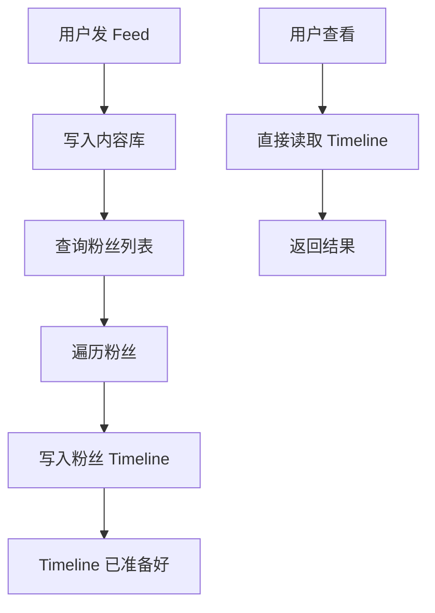
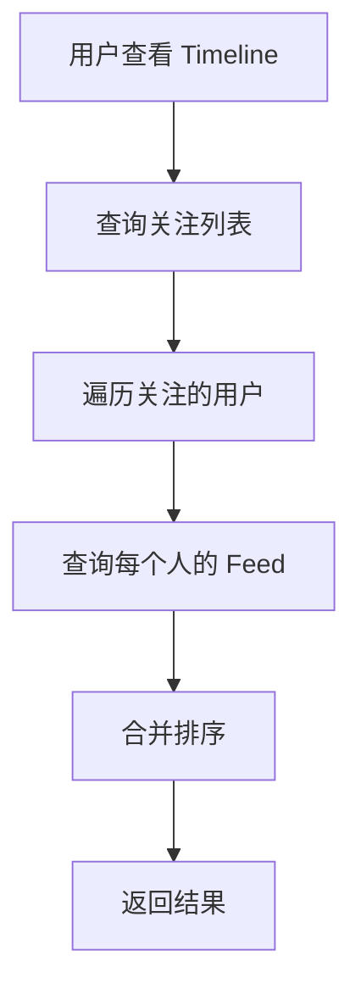
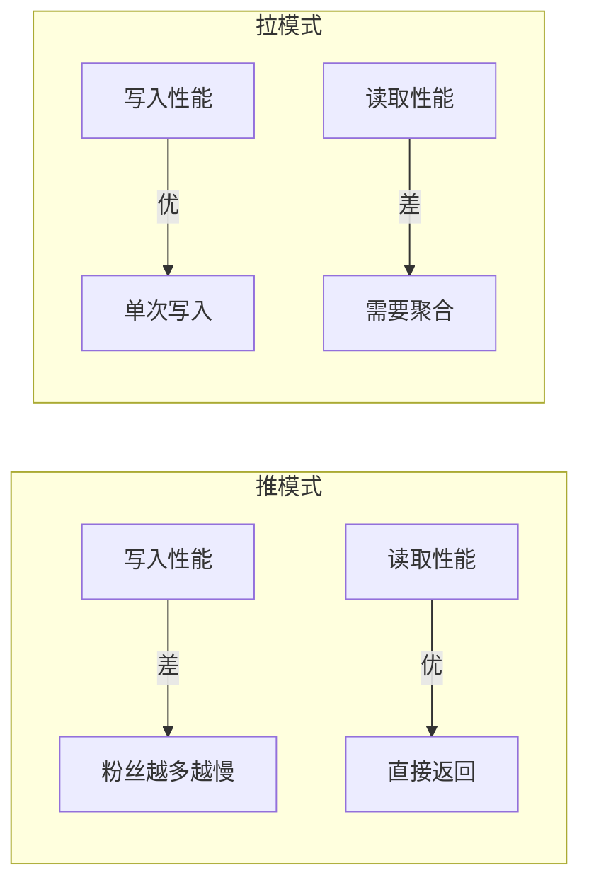
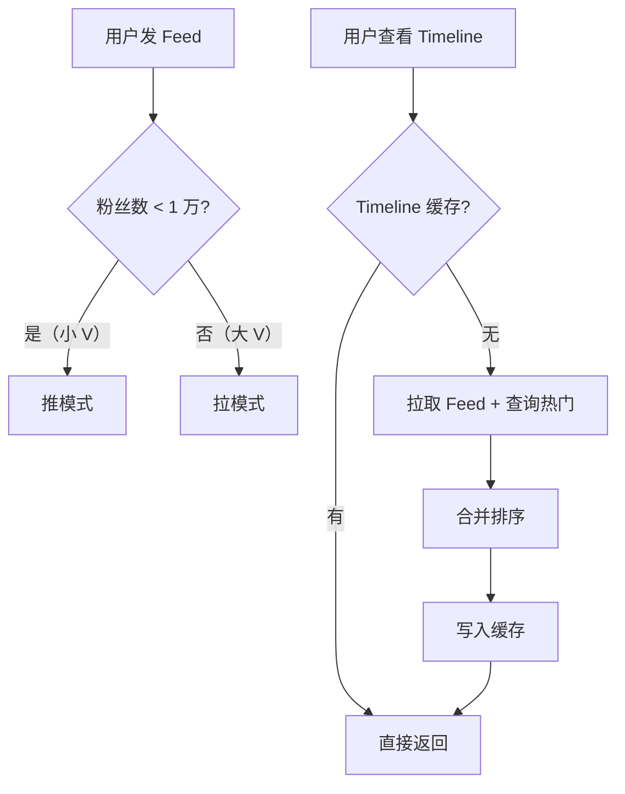

# Feed 流推拉模式对比

**目标级别**：P6/P7

---

上一讲我们讲了 Feed 流的整体设计，这一讲专门聊聊**推模式和拉模式**的深度对比——这是 Feed 流系统最核心的设计决策。

面试官问：「微博的关注页用的是推模式还是拉模式？」——很多人答不上来，或者只能说出表面区别。面试官会从存储成本、读取性能、大 V 处理等多个角度追问，考察你对 Feed 流架构的深度理解。

## 面试题速览

| 题号 | 问题 | 频率 | 难度 |
| --- | --- | --- | --- |
| 01 | 推模式和拉模式的本质区别是什么？ | 🔴 高频 | P5 |
| 02 | 两种模式在读写性能上有什么差异？ | 🔴 高频 | P6 |
| 03 | 如何处理大 V 的 Feed 分发？ | 🔴 高频 | P6 |
| 04 | 混合模式怎么设计？ | 🟡 中频 | P6 |
| 05 | 两种模式分别用什么数据结构存储？ | 🟡 中频 | P6 |

## 一、两种模式的本质

### 推模式（Push）：空间换时间

在用户发 Feed 时，主动推送给所有粉丝的 Timeline。



### 拉模式（Pull）：时间换空间

在用户查看 Timeline 时，实时从所有关注者的 Feed 中拉取并聚合。



### ⚠️ 核心区别

| 维度 | 推模式 | 拉模式 |
| --- | --- | --- |
| **核心思想** | 写时计算，读时快速 | 读时计算，写时快速 |
| **计算时机** | 发 Feed 时（写时） | 看 Feed 时（读时） |
| **存储内容** | 每用户一份 Timeline | 一份源 Feed |
| **时间戳位置** | 写入时固定 | 读取时动态计算 |

## 二、读写性能对比

### 写入性能

| 指标 | 推模式 | 拉模式 |
| --- | --- | --- |
| **单条 Feed 写入** | N 次（N=粉丝数） | 1 次 |
| **写入延迟** | 高（遍历粉丝） | 低（单次写入） |
| **大 V 影响** | 极大（粉丝数百万） | 无影响 |
| **写 QPS** | 低 | 高 |

### 读取性能

| 指标 | 推模式 | 拉模式 |
| --- | --- | --- |
| **读取延迟** | 低（直接返回） | 高（需聚合计算） |
| **读取 QPS** | 高 | 低 |
| **计算量** | 无 | 高（N 个关注者的 Feed） |
| **缓存友好** | 是 | 否 |

### 性能曲线



## 三、存储成本对比

### 推模式存储

每条 Feed 存储 N 份（N=粉丝数）。

| 指标 | 估算 |
| --- | --- |
| 单条 Feed 大小 | 100B |
| 单用户 Timeline 长度 | 1000 条 |
| 100 万用户，每用户 100 个粉丝 | 1 亿条 Feed 副本 |
| 存储总量 | 100B × 1 亿 `=` 10 GB |

### 拉模式存储

每条 Feed 只存储 1 份。

| 指标 | 估算 |
| --- | --- |
| 单条 Feed 大小 | 100B |
| 日 Feed 总量 | 1 亿条 |
| 存储总量 | 100B × 1 亿 `=` 10 GB |

### 对比表

| 维度 | 推模式 | 拉模式 |
| --- | --- | --- |
| **Feed 源数据** | 1 份 | 1 份 |
| **Timeline 副本** | N 份 | 0 份（无缓存） |
| **总存储量** | 高 | 低 |
| **冷热分离** | 容易 | 难 |

## 四、大 V 问题深度分析

### 问题场景

| 大 V 类型 | 粉丝数 | 推模式写入次数 |
| --- | --- | --- |
| 普通 KOL | 1 万 | 1 万次 |
| 头部博主 | 100 万 | 100 万次 |
| 明星账号 | 5000 万 | 5000 万次 |

假设写入速度 1 万次/秒，5000 万粉丝的明星发一条 Feed：

- 推模式耗时：5000 秒 `≈` 1.4 小时
- 拉模式耗时：忽略不计

### ⚠️ 面试官挖坑点

**陷阱一：推模式可以优化吗？**

> 面试官：「推模式写入这么慢，有什么优化方案？」
>
> 错误回答：「没有，只能按顺序写入」
>
> 正确回答：有几种优化方向：1）异步队列写入，不阻塞主流程；2）分层分发，优先推给小 V，离线粉丝拉取时再计算；3）热点 Feed 进缓存，粉丝拉取时直接查询；4）CDN 预热，大 V 发 Feed 后预加载到 CDN。

**陷阱二：拉模式不用考虑大 V？**

> 面试官：「拉模式不需要推送给粉丝，是不是就不用管大 V 了？」
>
> 错误回答：「对，大 V 没问题」
>
> 正确回答：不对。拉模式虽然写入没问题，但读取时的问题更大。假设用户关注了 1000 人，其中包括大 V，拉取时要查大 V 的最新 Feed。如果大 V 有 5000 万粉丝，每次拉取都要查他的 Feed 吗？需要用缓存优化热点 Feed。

## 五、混合模式设计

### 核心思想

不同类型的用户采用不同的分发策略。



### 分层策略

| 用户类型 | 粉丝数 | 分发策略 | 理由 |
| --- | --- | --- | --- |
| **普通用户** | `<` 1000 | 推模式 | 写入次数可控 |
| **小 KOL** | 1000-1 万 | 推模式 | 粉丝数不大 |
| **中 KOL** | 1 万-100 万 | 混合模式 | 部分推部分拉 |
| **大 V** | `>` 100 万 | 拉模式 | 推不起 |
| **明星** | `>` 1000 万 | 拉模式 + 缓存 | 必须拉模式 |

### 阈值设计

```java
public class FeedDispatcher {
    
    private static final long PUSH_THRESHOLD = 10000;  // 粉丝数阈值
    
    public void dispatch(Feed feed, Long userId) {
        int fanCount = followDAO.countFans(userId);
        
        if (fanCount < PUSH_THRESHOLD) {
            // 小 V：推模式
            pushToFans(feed, userId);
        } else {
            // 大 V：不主动推��，只缓存热门
            cacheAsHotFeed(feed);
        }
    }
}
```

## 六、数据结构设计

### 推模式数据结构

```bash
# Redis List 存储 Timeline
KEY: timeline:{userId}
VALUE: [feedId1, feedId2, feedId3, ...]

# 操作示例
LPUSH timeline:10001 "feed_123" "feed_122" ...
LTRIM timeline:10001 0 999  # 只保留 1000 条
LRANGE timeline:10001 0 19  # 分页获取
```

```java
public class PushTimelineService {
    
    public void pushFeed(Long fanId, String feedId) {
        String key = "timeline:" + fanId;
        redisTemplate.opsForList().lpush(key, feedId);
        redisTemplate.opsForList().ltrim(key, 0, 999);
    }
}
```

### 拉模式数据结构

```sql
-- Feed 内容表（源数据）
CREATE TABLE feed (
    id BIGINT PRIMARY KEY,
    feed_id VARCHAR(64) NOT NULL,
    user_id BIGINT NOT NULL,
    content TEXT,
    created_at DATETIME,
    INDEX idx_user_time (user_id, created_at DESC)
);

-- 用户关注表
CREATE TABLE user_follow (
    user_id BIGINT NOT NULL,
    follow_id BIGINT NOT NULL,
    INDEX idx_follow_id (follow_id)
);
```

```java
public class PullTimelineService {
    
    public List<Feed> pullTimeline(Long userId, int limit) {
        // 1. 查询关注列表
        List<Long> follows = followDAO.selectFollows(userId);
        
        // 2. 查询每个关注者的最新 Feed
        List<Feed> feeds = feedDAO.selectByUsers(follows, limit);
        
        // 3. 按时间排序
        return feeds.stream()
            .sorted(Comparator.comparing(Feed::getCreatedAt).reversed())
            .limit(limit)
            .collect(Collectors.toList());
    }
}
```

## 七、两种模式的选择决策树

```mermaid
flowchart TD
    A["开始"] --> B{"用户规模?"}
    B -->|"`<` 100 万"| C["推模式为主"]
    B -->|"`>` 100 万"| D{"大 V 比例?"}
    
    D -->|"大 V 少"| E["混合模式"]
    D -->|"大 V 多"| F["拉模式为主"]
    
    C --> G{"实时性要求?"}
    G -->|"高"| H["推模式 + 异步队列"]
    G -->|"一般"| I["推模式 + 批量"]
    
    E --> J["小 V 推，大 V 拉"]
    F --> K["大 V 拉 + 热点缓存"]
```

| 场景 | 推荐模式 | 说明 |
| --- | --- | --- |
| 朋友圈（强互动） | 推模式 | 读取多，实时性要求高 |
| 微博关注页 | 混合模式 | 需要兼顾大小 V |
| 微博推荐页 | 拉模式 | 排序计算为主，实时性要求低 |
| 抖音推荐 | 拉模式 | 算法排序，个性化推荐 |

## 八、面试高频追问

### 第一层：推拉模式区别

> **问题**：推模式和拉模式的本质区别是什么？
>
> **参考答案**：
> 推模式是在写时计算，发 Feed 时就推送给粉丝的 Timeline；拉模式是在读时计算，用户查看时再从关注者的 Feed 中聚合。推模式读快写慢，拉模式写快读慢。推模式用空间换时间，拉模式用时间换空间。

### 第二层：大 V 问题

> **问题**：怎么解决推模式的大 V 问题？
>
> **参考答案**：
> 大 V 发 Feed 不能直接推给所有粉丝。解决方案：1）分层分发，粉丝多的不主动推送；2）异步队列，不阻塞主流程；3）热点缓存，大 V 的 Feed 进缓存，拉取时直接查；4）CDN 预热。核心思路是读写平衡，在读取性能和写入压力间做权衡。

### 第三层：混合模式实现

> **问题**：混合模式怎么设计？
>
> **参考答案**：
> 按粉丝数设定阈值：粉丝数 `<` 1 万的用推模式，写入粉丝的 Timeline；粉丝数 `>` 1 万的用拉模式，不主动推送，但把 Feed 标记为热门。拉取 Timeline 时，先查本地缓存，再查热门 Feed，合并排序后返回。

## 九、综合对比

| 维度 | 推模式 | 拉模式 | 混合模式 |
| --- | --- | --- | --- |
| **写入性能** | 差 | 优 | 中 |
| **读取性能** | 优 | 差 | 中 |
| **存储成本** | 高 | 低 | 中 |
| **大 V 友好** | 否 | 是 | 是 |
| **小 V 友好** | 是 | 否 | 是 |
| **实时性** | 高 | 低 | 中 |
| **实现复杂度** | 低 | 中 | 高 |
| **缓存友好** | 是 | 否 | 是 |
| **适用产品** | 朋友圈 | 推荐页 | 微博关注 |

## 十、扩展思考

### 问题一：如何保证 Feed 顺序？

> 推模式写入 Timeline 时，不同粉丝的 Timeline 可能写入时间不同，导致顺序不一致。
>
> **解决方案**：
> - 用 Feed 的创建时间排序，不按写入时间排序
> - Timeline 只做去重和分页，顺序由 Feed 时间戳决定
> - 定期重写 Timeline，按时间戳重新排序

### 问题二：如何处理用户关注列表变化？

> 用户取消关注后，Timeline 中的旧 Feed 要删除吗？
>
> **解决方案**：
> - 简单方案：不删除，下次拉取时过滤
> - 精确方案：取消关注时清理 Timeline（成本高）
> - 折中方案：定期重建 Timeline

---

> 💡 **面试官视角**：推拉模式的选择是 Feed 流系统的核心决策。面试官会考察你能不能说出两种模式各自的 trade-off，以及在不同场景下如何选择。关键是理解「读写平衡」的���想。
