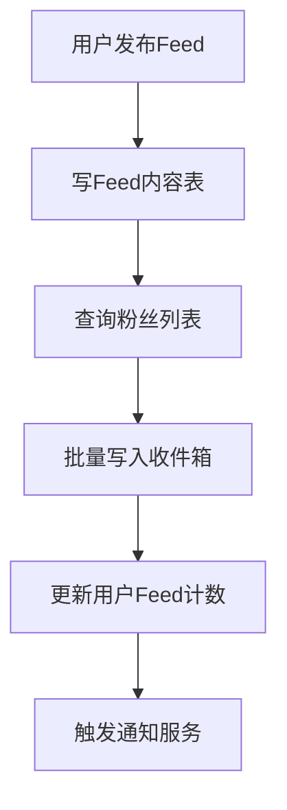
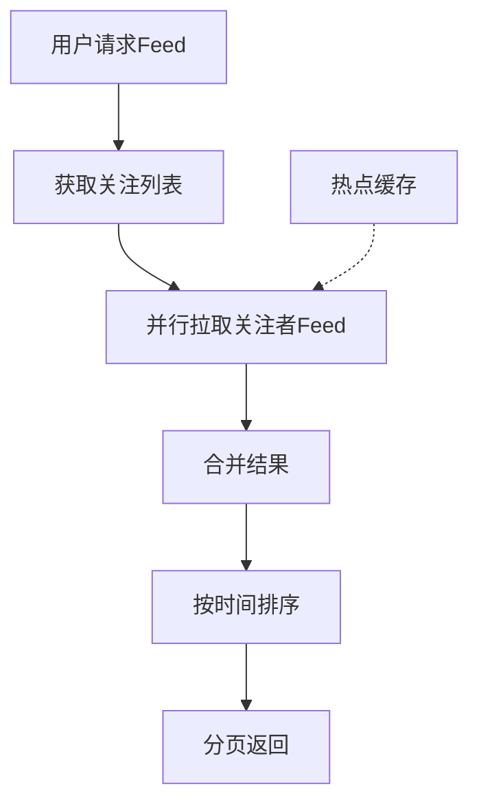

# Feed 流推拉模式对比

2012年，Twitter的工程师们做了一次艰难的技术决策：把Feed流从推模式改成拉模式。

当时的背景是：Twitter的用户增长超过了系统承载能力。大V们的每一次发言，都会在全球范围内触发海量推送。系统不堪重负，用户的Timeline经常出现几分钟的延迟。

改造完成后，Twitter从"主动推送"变成了"主动拉取"。写入压力骤降，但读取压力暴增。用户怨声载道——刷新一下Feed要等十几秒。

这是一个经典的**技术债务 vs 用户体验**的权衡案例。

【架构权衡】

没有完美的Feed流架构，只有适合业务特征的架构。推模式、拉模式、混合模式各有优劣：推模式写入压力大，拉模式读取压力大，混合模式实现复杂。选择什么模式，取决于你的**用户结构**（大V多不多）、**数据特征**（内容冷热分布）、**业务需求**（实时性要求）。

## 一、三种模式原理 🔴

### 1.1 推模式（Push）

```
推模式：发布时主动推送给所有粉丝

工作流程：
1. 用户A发布内容
2. 系统查询A的所有粉丝（如500人）
3. 将Feed ID写入每个粉丝的收件箱
4. 粉丝读取时直接从收件箱获取

存储结构：
收件箱 = [FeedID1, FeedID2, FeedID3...]

性能特征：
- 写入成本 = O(粉丝数)
- 读取成本 = O(1)
- 总成本 = 写入 × 发布频率
```

### 1.2 拉模式（Pull）

```
拉模式：读取时实时聚合所有关注对象的Feed

工作流程：
1. 用户A请求Feed流
2. 系统查询A关注的所有人（如500人）
3. 获取每个被关注者的最新Feed（如每人20条）
4. 合并10000条Feed，按时间排序
5. 分页返回前100条

存储结构：
每个用户的Feed = [用户ID的所有Feed]

性能特征：
- 写入成本 = O(1)
- 读取成本 = O(关注数 × 每关注Feed数)
- 总成本 = 读取 × 读取频率
```

### 1.3 混合模式

```
混合模式：根据用户类型选择推/拉

大V阈值：粉丝数 > 100万

工作流程：
1. 普通用户发布 → 推送到粉丝收件箱
2. 大V用户发布 → 只写自己的Timeline
3. 粉丝读取 → 聚合自己的收件箱 + 大V的Timeline

性能特征：
- 写入成本 = O(普通用户粉丝数)
- 读取成本 = O(收件箱 + 大V数)
- 总成本：平衡推拉开销
```

### 1.4 模式对比表

| 维度 | 推模式 | 拉模式 | 混合模式 |
| --- | --- | --- | --- |
| 写入成本 | 高（O粉丝数） | 低（O1） | 中（O普通粉丝数） |
| 读取成本 | 低（O1） | 高（O关注数） | 中 |
| 大V友好度 | 差（推送爆炸） | 好（无写入压力） | 好 |
| 普通用户友好度 | 好（读取快） | 差（读取慢） | 好 |
| 实现复杂度 | 低 | 低 | 高 |
| 存储成本 | 高（收件箱） | 低 | 中 |

【面试官心理】

面试官问推拉模式，通常想看你能不能根据业务特征选择合适的模式。能回答"大V用拉、普通用推"的候选人，说明理解了问题的本质；能说出具体阈值（如"100万粉丝"）的候选人，说明有量化分析能力；能提到"混合模式实现复杂"的候选人，说明考虑到了工程成本。

## 二、推模式详解 🔴

### 2.1 实现架构



### 2.2 收件箱设计

```
收件箱存储方案：

方案1：Redis List
- 优点：读取快、支持分页
- 缺点：容量有限（单key < 2GB）
- 适用：小规模（粉丝数 < 1万）

方案2：MySQL分表
- 优点：容量无限、支持复杂查询
- 缺点：读取需要跨表
- 适用：大规模

方案3：MySQL + Redis缓存
- 优点：热数据在Redis，冷数据在MySQL
- 缺点：需要维护一致性
- 适用：超大规模

收件箱key设计：
key = inbox:{user_id}
field = feed_id
score = timestamp（用于排序）
```

### 2.3 推送优化

```
推送优化策略：

1. 异步推送
   - 发布后发送MQ，异步推送
   - 不阻塞发布接口
   - 缺点：Feed不是立即可见

2. 批量推送
   - 粉丝按1000人一批写入
   - 减少数据库IO次数
   - 缺点：推送有延迟

3. 延迟推送
   - 高峰期延迟到低峰期推送
   - 平滑系统压力
   - 缺点：用户体验差

4. 优先级推送
   - 在线用户优先推送
   - 离线用户上线后拉取
   - 缺点：需要维护在线状态
```

## 三、拉模式详解 🟡

### 3.1 实现架构



### 3.2 拉取优化

```
拉取优化策略：

1. 并行拉取
   - 关注者的Feed并行查询
   - 用CountDownLatch聚合结果
   - 缺点：需要线程池资源

2. 热点缓存
   - 热门用户的Feed缓存到Redis
   - 命中率 > 80%时效果明显
   - 缺点：缓存维护成本

3. 限制范围
   - 每个被关注者最多取N条
   - N通常设为10-20
   - 缺点：可能漏掉重要内容

4. 结果缓存
   - 热门用户的Feed流结果缓存
   - TTL = 1-5分钟
   - 缺点：实时性下降
```

### 3.3 多级缓存

```java
public class PullFeedService {

    public List<Feed> pullFeed(Long userId, int pageSize) {
        // Step 1: 获取关注列表
        List<Long> following = followService.getFollowing(userId);

        // Step 2: 热点缓存（Redis）
        List<Feed> hotFeeds = redisTemplate.opsForList().range("hot:feed:stream", 0, -1);

        // Step 3: 普通用户Feed
        List<Feed> normalFeeds = new ArrayList<>();
        for (Long authorId : following) {
            // 检查是否是大V（粉丝数 > 100万）
            if (userService.isHotUser(authorId)) {
                // 大V走缓存
                List<Feed> cached = pullFromCache(authorId);
                normalFeeds.addAll(cached);
            } else {
                // 普通用户查数据库
                List<Feed> dbFeeds = feedDAO.selectRecentFeeds(authorId, 20);
                normalFeeds.addAll(dbFeeds);
            }
        }

        // Step 4: 合并排序
        List<Feed> allFeeds = Stream.concat(hotFeeds.stream(), normalFeeds.stream())
            .sorted(Comparator.comparing(Feed::getCreateTime).reversed())
            .limit(pageSize)
            .collect(Collectors.toList());

        return allFeeds;
    }
}
```

## 四、混合模式详解 🟡

### 4.1 分层策略

```
混合模式分层：

Layer 0：自己发布的Feed（必须）
- 存储在自己的Timeline
- 读取时直接返回

Layer 1：普通用户推送（推模式）
- 粉丝数 < 1000 的用户
- 主动推送到收件箱
- 读取时直接返回

Layer 2：中间用户（可选推/拉）
- 粉丝数 1000 - 10000
- 可推可拉，看系统压力

Layer 3：大V（拉模式）
- 粉丝数 > 100万
- 只写自己的Timeline
- 读取时拉取

Layer 4：超级大V（CDN预热）
- 粉丝数 > 1000万
- 发布后CDN预热
- 读取时优先CDN
```

### 4.2 动态阈值

```
静态阈值问题：
- 所有大V都用拉模式
- 但小V的发文也可能很频繁
- 导致整体读取压力不均衡

动态阈值方案：
- 根据系统负载动态调整阈值
- 高负载时降低阈值（更多用拉）
- 低负载时提高阈值（更多用推）

阈值计算公式：
threshold = base_threshold × (capacity / current_load)

示例：
- base_threshold = 100万
- 当前负载 = 80%
- 实际阈值 = 100万 × (100 / 80) = 125万
```

### 4.3 模式切换

```
模式切换策略：

触发条件：
1. 粉丝数超过阈值 → 推 → 拉
2. 粉丝数低于阈值 → 拉 → 推
3. 系统负载过高 → 拉 → 拉

切换方式：
1. 全量切换：立即对所有粉丝切换
   - 优点：简单
   - 缺点：体验不连续

2. 灰度切换：逐步对粉丝切换
   - 优点：体验平滑
   - 缺点：实现复杂
   - 灰度比例：10% → 50% → 100%

3. 时间窗口切换：等低峰期切换
   - 优点：对系统冲击小
   - 缺点：可能等很久
```

## 五、适用场景选择 🟡

### 5.1 场景对比

```
场景1：微信朋友圈
- 特征：私密社交、好友数少（<1000）
- 推荐模式：推模式
- 理由：好友数少，推送成本低；私密性强，不需要推荐

场景2：微博
- 特征：公开社交、大V效应强（头部10%用户占90%流量）
- 推荐模式：混合模式
- 理由：普通用户用推，大V用拉，平衡读写成本

场景3：抖音/快手
- 特征：内容消费、大V效应极强
- 推荐模式：拉模式（个性化推荐）
- 理由：用户不关注内容源，关注推荐算法

场景4：Twitter早期
- 特征：社交媒体、大V效应一般
- 推荐模式：推 → 拉（架构演进）
- 理由：早期用推，后来用户增长太快被迫改成拉

场景5：企业内部Feed
- 特征：小规模、强关系、内容少
- 推荐模式：推模式
- 理由：数据量小，推送成本可接受
```

### 5.2 决策树

```
选择Feed流模式：

START
  ↓
用户结构：大V多不多？
  ↓
大V多 → 关注数差异大 → 推荐用混合模式/拉模式
  ↓
大V少 → 关注数差异小 → 推荐用推模式
  ↓
实时性要求高 → 推模式
  ↓
系统压力大 → 拉模式
  ↓
END
```

## 六、工程代价 🟢

| 维度 | 推模式 | 拉模式 | 混合模式 |
| --- | --- | --- | --- |
| 开发成本 | 中 | 中 | 高 |
| 运维成本 | 高（收件箱维护） | 中 | 高 |
| 存储成本 | 高（收件箱） | 低 | 中 |
| 计算成本 | 低（读取快） | 高（读取慢） | 中 |
| 扩展性 | 中（推送瓶颈） | 好 | 好 |

【架构权衡】

Feed流模式的选择，本质上是**写入成本和读取成本的权衡**。如果你有1000万用户，推模式下每秒写入1亿次（1000万 × 平均10个粉丝），拉模式下每秒读取1000亿次（1000万用户 × 平均100次刷新）。没有哪个模式是绝对正确的，关键是找到你的业务特征对应的最优解。

## 七、真实面试回放 🟡

> **面试官**：Twitter早期用推模式，后来改成拉模式，为什么？
>
> **候选人**（小林）：因为用户增长太快，推模式的写入成本扛不住了。
>
> Twitter 2010年时已经有3亿用户，头部10%的用户（3000万）占了90%的内容生产。这3000万用户发微博，每次都要推送给所有粉丝，假设平均粉丝数100，那每秒写入就是3000万 × 100 = 300亿次。
>
> 这明显扛不住。
>
> **面试官**：改成拉模式后，用户体验有什么变化？
>
> 小林：读取变慢了。
>
> 推模式下，用户刷新Feed直接读收件箱，<100ms。
>
> 拉模式下，要聚合所有关注对象的Feed，假设关注200人，每人20条，要读取2000条数据，然后排序返回，延迟要到500ms-2秒。
>
> **面试官**：那怎么优化拉模式的读取性能？
>
> 小林：三个方向：
>
> 一是并行拉取：200个关注者的Feed并行查询，用CountDownLatch聚合
>
> 二是热点缓存：关注数 > 10万的用户，Feed缓存到Redis
>
> 三是结果缓存：热门Feed流结果缓存5分钟，减少重复计算
>
> **面试官**：Twitter现在是什么模式？
>
> 小林：应该是混合模式了。
>
> 2016年Twitter在IPO文件中提到，他们用了一套叫"Early Bird"的系统，应该是混合模式。
>
> 大V发推走拉模式（缓存+CDN），普通用户发推走推模式（收件箱）。
>
> 【面试官手记】
>
> 小林这场面试的亮点：
>
> 1. 理解架构演进：不是一成不变的，要根据业务发展调整
>
> 2. 能量化分析：3000万 × 100 = 300亿次/秒，这是有说服力的数据
>
> 3. 知道Twitter的演进：说明平时有关注业界动态
>
> 4. 拉模式优化有实际思路：并行、缓存、结果缓存
>
> 这场面试属于P6+级别，Feed流的推拉模式是经典问题，能回答出架构演进的候选人，说明有技术视野。
>
> 继续追问方向：会问"微博的混合模式具体怎么实现"和"微信朋友圈为什么用推模式"，这两个问题考验候选人对不同社交产品的理解。

Feed流推拉模式的选择，核心是**根据业务特征做权衡**。记住三个要点：

1. **推模式**：写入成本高、读取成本低，适合粉丝均匀的场景
2. **拉模式**：写入成本低、读取成本高，适合大V占主导的场景
3. **混合模式**：平衡读写成本，根据粉丝数动态选择

没有最好的模式，只有最适合你业务特征的模式。
