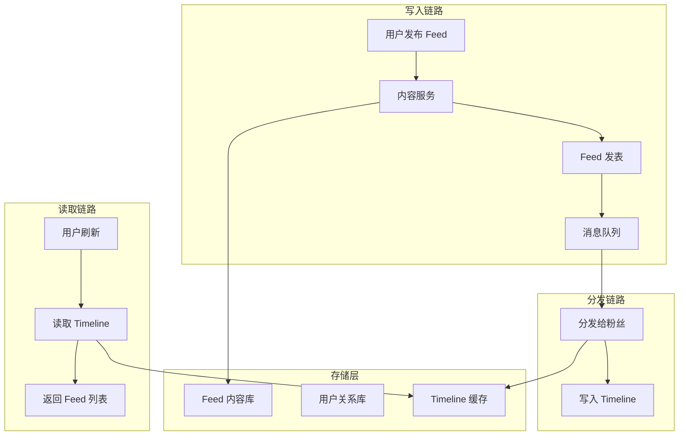
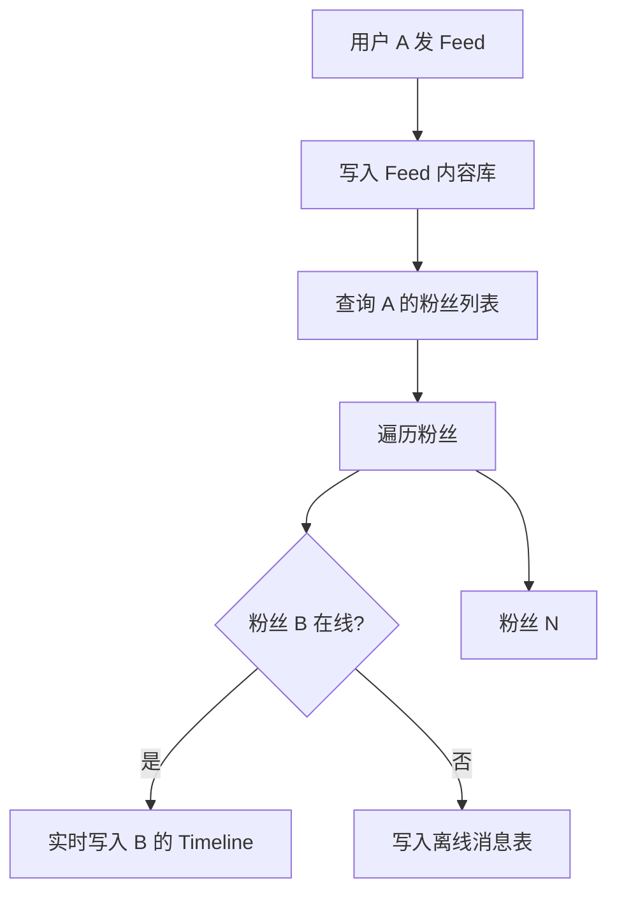
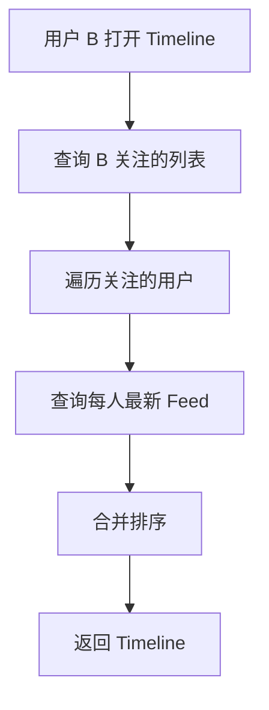
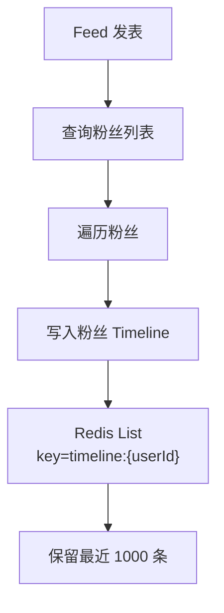
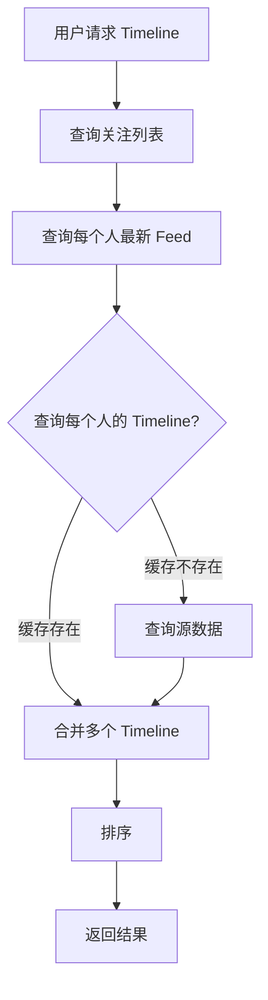
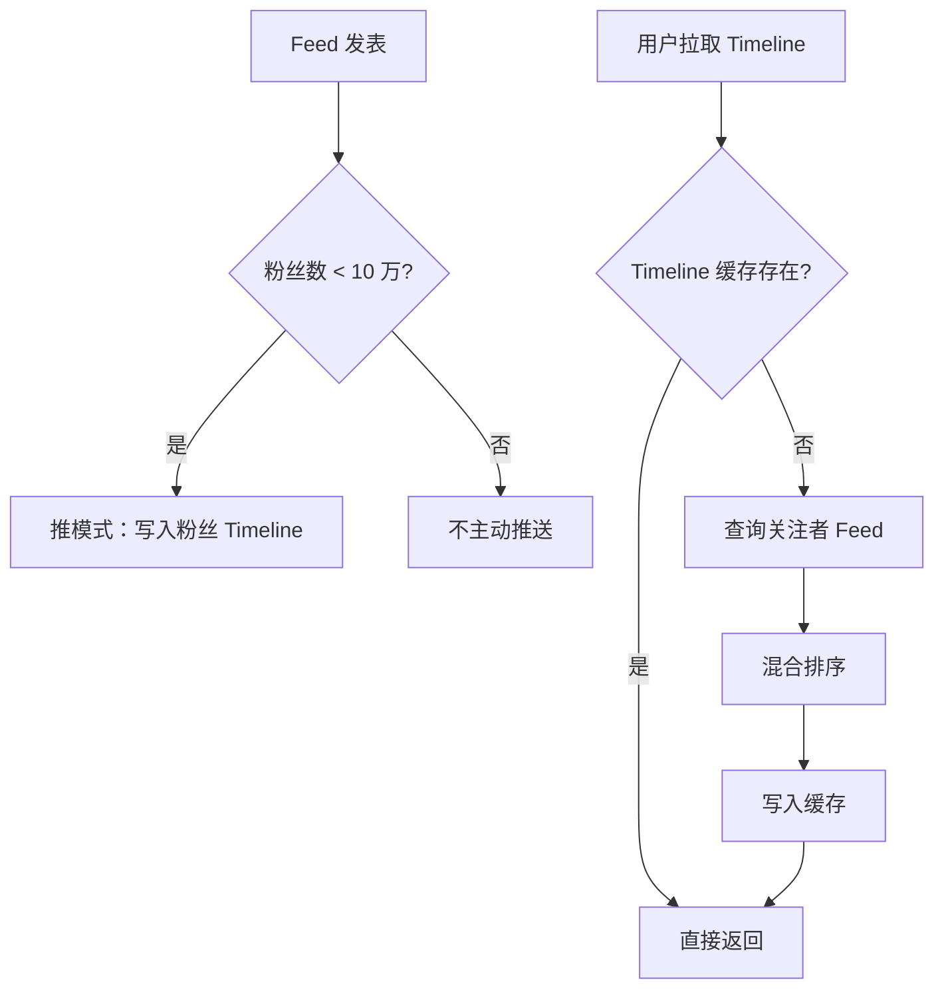
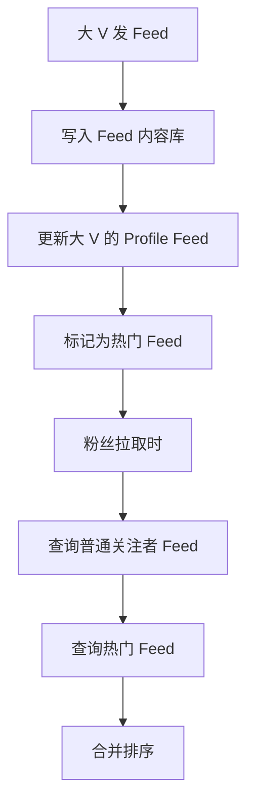

# Feed 流系统设计

**目标级别**：P6/P7

---

面试官问：「设计一个微博/朋友圈这样的 Feed 流系统」——这道题考察的是你对数据分发、内容存储、缓存架构的综合能力。

Feed 流系统的特点是「写少读多」，用户量大、日均内容多。面试官不会只问「怎么显示 feed」，而是会追问「怎么实现 Timeline」「怎么优化 Feed 拉取性能」「推拉模式怎么选」等深层问题。

## 面试题速览

| 题号 | 问题 | 频率 | 难度 |
| --- | --- | --- | --- |
| 01 | Feed 流的核心架构是什么？ | 🔴 高频 | P5 |
| 02 | 什么是推模式和拉模式？ | 🔴 高频 | P6 |
| 03 | 如何实现 Timeline？ | 🔴 高频 | P6 |
| 04 | Feed 拉取怎么优化性能？ | 🟡 中频 | P6 |
| 05 | 如何处理热点数据？ | 🟡 中频 | P6 |

## 一、需求澄清

### Feed 流类型

| 类型 | 特征 | 典型产品 |
| --- | --- | --- |
| **Timeline** | 关注的人的内容，按时间排序 | 微博（关注页） |
| **Ranked Feed** | 关注的人的内容，按算法排序 | 微博（推荐页）、抖音 |
| **Profile Feed** | 单个用��的所有内容 | 朋友圈 |
| **List Feed** | 关注列表的聚合内容 | 微博（话题页） |

### 关键约束

| 问题 | 为什么重要 | 候选选项 |
| --- | --- | --- |
| **日活多少？** | 决定存储和缓存规模 | 1000 万 vs 1 亿 |
| **Feed 源多大？** | 决定拉取复杂度 | 100 人 vs 1000 人 |
| **内容类型？** | 影响存储设计 | 文本 / 图片 / 视频 |
| **延迟要求？** | 影响推送策略 | `<` 1s / `<` 10s |

### 数据量估算

假设：日活 1 亿用户，平均每人关注 200 人，平均每人每天发 1 条 Feed。

| 指标 | 估算 | 说明 |
| --- | --- | --- |
| 日发 Feed 量 | 1亿 × 1 | 1 亿条 |
| 存储量 | 1亿 × 365 × 100B | 3.65 TB/年 |
| 单用户 Timeline 大小 | 200 人 × 1000 条 | 20 万条 |
| 拉取复杂度 | 200 人 × 平均 100 条 | 2 万条 |

## 二、核心架构设计

### 整体架构



### 组件职责

| 组件 | 职责 | 技术选型 |
| --- | --- | --- |
| **内容服务** | 内容发布、存储、审核 | MySQL + OSS |
| **关系服务** | 关注取关、关系存储 | MySQL + Redis |
| **Timeline 服务** | Timeline 生成、缓存 | Redis Cluster |
| **分发服务** | Feed 推送给粉丝 | Kafka + 消费者 |
| **排序服务** | Ranked Feed 排序 | Elasticsearch |

## 三、推模式 vs 拉模式

### 两种模式对比

| 维度 | 推模式（Push） | 拉模式（Pull） |
| --- | --- | --- |
| **Timeline 生成时机** | 写时推送 | 读时拉取 |
| **读取性能** | 快（直接返回） | 慢（需聚合计算） |
| **写入性能** | 慢（N 个粉丝写 N 次） | 快（只写一次） |
| **存储成本** | 高（多份副本） | 低（一份源数据） |
| **Feed 延迟** | 低 | 高 |
| **大 V 问题** | 困难（粉丝多） | 容易（可缓存） |
| **适用场景** | 小 V、用户少 | 大 V、粉丝多 |

### 推模式实现



**优点**：读取快，用户体验好
**缺点**：写入慢、大 V 难处理、存储成本高

### 拉模式实现



**优点**：写入快、存储成本低、大 V 友好
**缺点**：读取慢、延迟高、计算成本高

### ⚠️ 常见陷阱

**陷阱一：推模式忽略大 V**

> 面试官：「微博大 V 发一条微博，要给所有粉丝发吗？」
>
> 错误回答：「对，所有粉丝都要收到」
>
> 正确回答：不能简单推。假设大 V 有 1000 万粉丝，一条 Feed 要写 1000 万次。需要混合方案：在线粉丝推，离线粉丝用拉；或者用分层分发，先推给小 V 再由小 V 扩散。

**陷阱二：拉模式不做缓存**

> 面试官：「拉模式每次都要重新拉取吗？」
>
> 错误回答：「对，每次都要计算」
>
> 正确回答：不是。需要做 Timeline 缓存，用刷新时间戳标记，用户拉取时只拉取增量。也可以缓存热门 Feed，避免每次都查询所有关注。

## 四、Timeline 实现方案

### 方案一：写扩散（推模式）



**数据结构**：

```bash
# 每个用户的 Timeline 是一个 Redis List
LPUSH timeline:user_001 "feed_123" "feed_122" "feed_121" ...
LTRIM timeline:user_001 0 999  # 只保留 1000 条
```

**适用场景**：小 V（粉丝 `<` 1 万）、互动性要求高

### 方案二：读扩散（拉模式）



**适用场景**：大 V（粉丝 `>` 10 万）、内容更新频率高

### 方案三：混合模式（推荐）



**策略**：
- 小 V 发 Feed → 写扩散，实时推送给粉丝
- 大 V 发 Feed → 不主动推送，粉丝拉取时再聚合
- Timeline 缓存 → 增量拉取，避免全量计算

## 五、内容表设计

```sql
CREATE TABLE feed (
    id BIGINT PRIMARY KEY AUTO_INCREMENT,
    feed_id VARCHAR(64) NOT NULL UNIQUE COMMENT 'Feed ID',
    user_id BIGINT NOT NULL COMMENT '发布者 ID',
    content TEXT COMMENT '内容',
    media_urls JSON COMMENT '媒体地址列表',
    like_count INT DEFAULT 0 COMMENT '点赞数',
    comment_count INT DEFAULT 0 COMMENT '评论数',
    created_at DATETIME DEFAULT CURRENT_TIMESTAMP,
    INDEX idx_user_time (user_id, created_at DESC),
    INDEX idx_created_at (created_at DESC)
) ENGINE=InnoDB;

CREATE TABLE user_follow (
    id BIGINT PRIMARY KEY AUTO_INCREMENT,
    user_id BIGINT NOT NULL COMMENT '用户 ID',
    follow_id BIGINT NOT NULL COMMENT '关注者 ID',
    created_at DATETIME,
    UNIQUE KEY uk_follow (user_id, follow_id),
    INDEX idx_follow_id (follow_id)
) ENGINE=InnoDB;
```

## 六、Feed 拉取优化

### 问题分析

拉取 Timeline 的性能瓶颈：

| 步骤 | 问题 | 原因 |
| --- | --- | --- |
| 查询关注列表 | N 次 DB 查询 | 全量拉取 |
| 查询每个用户的 Feed | M × N 次 DB 查询 | 每个关注者查一次 |
| 合并排序 | 计算量大 | 归并排序复杂度高 |

### 优化方案

**方案一：Timeline 预计算**

用户发 Feed 时，预先写入其粉丝的 Timeline 缓存。

```java
public class TimelineService {
    
    public void publishFeed(Long userId, Feed feed) {
        // 1. 写入 Feed 内容
        feedDAO.insert(feed);
        
        // 2. 查询粉丝列表（分页）
        List<Long> fans = followDAO.selectFans(userId, 0, 10000);
        
        // 3. 写入每个粉丝的 Timeline
        for (Long fanId : fans) {
            String key = "timeline:" + fanId;
            redisTemplate.opsForList().lpush(key, feed.getFeedId());
            redisTemplate.opsForList().ltrim(key, 0, 999);
        }
    }
}
```

**方案二：热门内容缓存**

热门 Feed 单独缓存，避免重复计算。

```java
public class TimelineService {
    
    public List<Feed> getTimeline(Long userId, int offset, int limit) {
        // 1. 获取用户 Timeline（Redis List）
        List<String> feedIds = redisTemplate.opsForList()
            .range("timeline:" + userId, offset, offset + limit - 1);
        
        if (feedIds.isEmpty()) {
            // 2. 空则回源拉取
            feedIds = pullFromSource(userId);
        }
        
        // 3. 批量获取 Feed 内容
        return feedService.getFeedsByIds(feedIds);
    }
}
```

**方案三：增量拉取**

用户拉取 Timeline 时，只拉取上次拉取之后的增量。

```bash
# 记录上次拉取时间戳
GET timeline:last_pull:user_001
# 返回: 1704897600000

# 拉取增量
SELECT * FROM feed 
WHERE user_id IN (SELECT follow_id FROM user_follow WHERE user_id = 1001)
AND created_at > 1704897600000
ORDER BY created_at DESC
LIMIT 20
```

### ⚠️ 面试官挖坑点

**陷阱：Timeline 无限增长**

> 面试官：「如果用户关注了 1000 个人，每人每天发 10 条，Timeline 会无限增长吗？」
>
> 错误回答：「不会，可以定期清理」
>
> 正确回答：会。所以要限制 Timeline 长度，比如只保留最近 1000 条。用 LTRIM 或定期任务清理超出部分。对于超过 1 年的不活跃用户，可以不推送新 Feed，下次拉取时再计算。

## 七、大 V 问题处理

### 问题分析

大 V 用户发一条 Feed，如果推给所有粉丝：

| 大 V 粉丝数 | 写入次数 | 耗时（10ms/次） |
| --- | --- | --- |
| 1 万 | 1 万次 | 100 秒 |
| 100 万 | 100 万次 | 2.7 小时 |
| 1000 万 | 1000 万次 | 27 小时 |

### 解决方案：分层分发



| 分层 | 策略 | 说明 |
| --- | --- | --- |
| **在线粉丝** | 推模式 | 实时推送，保证体验 |
| **离线粉丝** | 拉模式 | 拉取时聚合，延迟推送 |
| **热门 Feed** | 缓存 | 大 V 的 Feed 进热门缓存 |

## 八、��试高频追问

### 第一层：推拉模式对比

> **问题**：推模式和拉模式各有什么优缺点？
>
> **参考答案**：
> 推模式是写时推送，读快但写慢，适合小 V；拉模式是读时拉取，写快但读慢，适合大 V。推模式的存储成本高，每条 Feed 存 N 份；拉模式的计算成本高，每次读取都要聚合。生产环境推荐混合模式：小 V 推，大 V 拉。

### 第二层：Timeline 实现

> **问题**：怎么实现一个 Timeline？
>
> **参考答案**：
> 用 Redis List 存储每个用户的 Timeline。发 Feed 时，用 LPUSH 写入粉丝的 Timeline，用 LTRIM 限制长度。用户查看 Timeline 时，用 LRANGE 分页获取 Feed ID，再批量获取 Feed 内容。关键是控制 Timeline 长度，避免无限增长。

### 第三层：大 V 处理

> **问题**：如果大 V 发 Feed，要给 1000 万粉丝推送吗？
>
> **参考答案**：
> 不能直接推，那样写入耗时太长。解决方案是分层分发：小 V 推，大 V 拉；在线粉丝推，离线粉丝拉取时计算；或者使用 CDN/消息队列异步分发。大 V 的 Feed 进入热门缓存，粉丝拉取时直接查询。

## 九、综合对比

| 维度 | 推模式 | 拉模式 | 混合模式 |
| --- | --- | --- | --- |
| **读取性能** | 优 | 差 | 中 |
| **写入性能** | 差 | 优 | 中 |
| **存储成本** | 高 | 低 | 中 |
| **大 V 友好** | 否 | 是 | 是 |
| **小 V 友好** | 是 | 否 | 是 |
| **实现复杂度** | 中 | 中 | 高 |
| **适用场景** | 朋友圈 | 微博推荐 | 微博关注 |

---

> 💡 **面试官视角**：Feed 流系统考察的是你对「数据分发」和「读写优化」的理解。推拉模式的选择是核心，要能说出各自的 trade-off 以及混合方案的设计思路。
