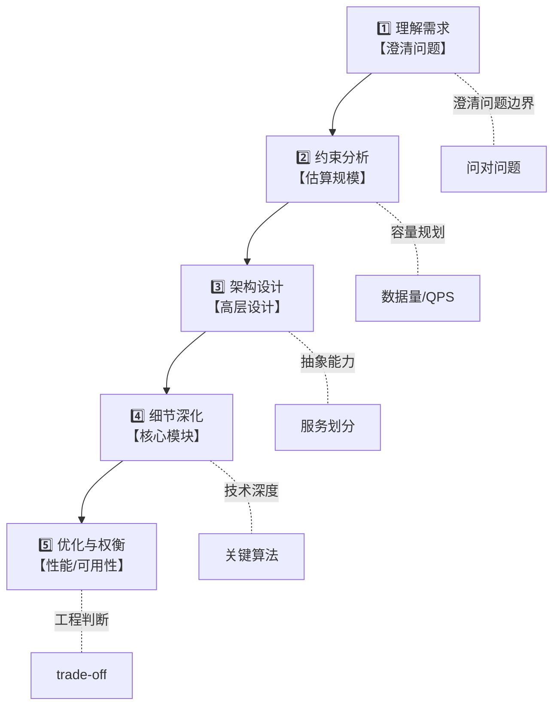
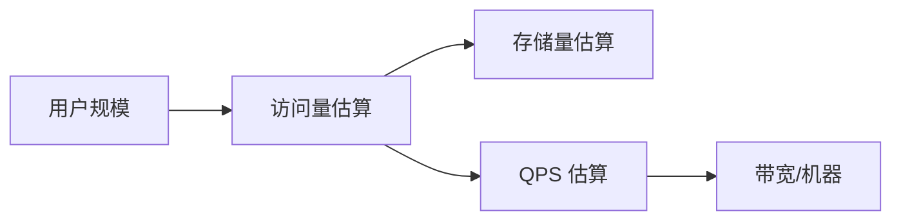
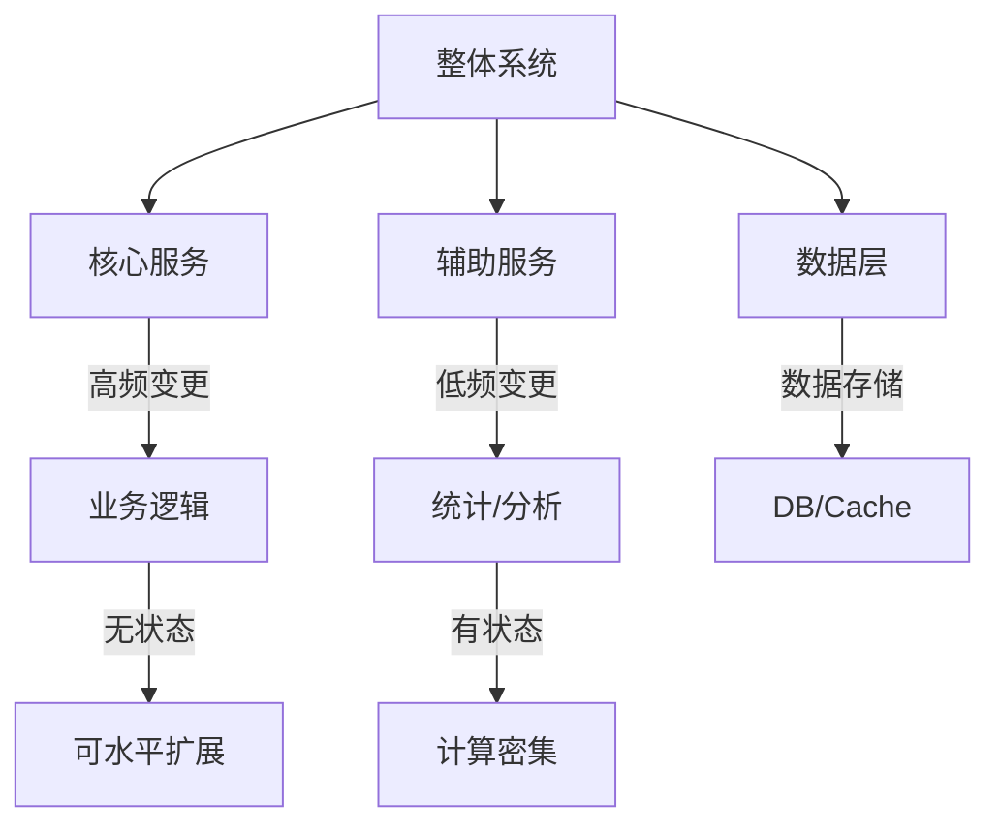
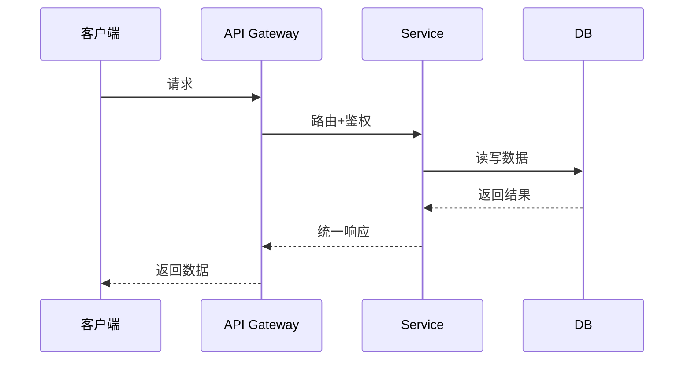
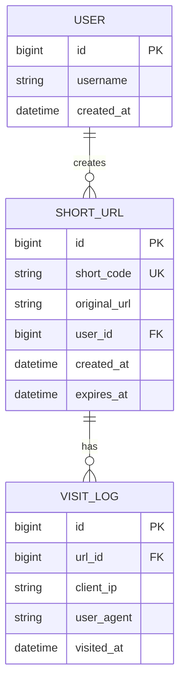
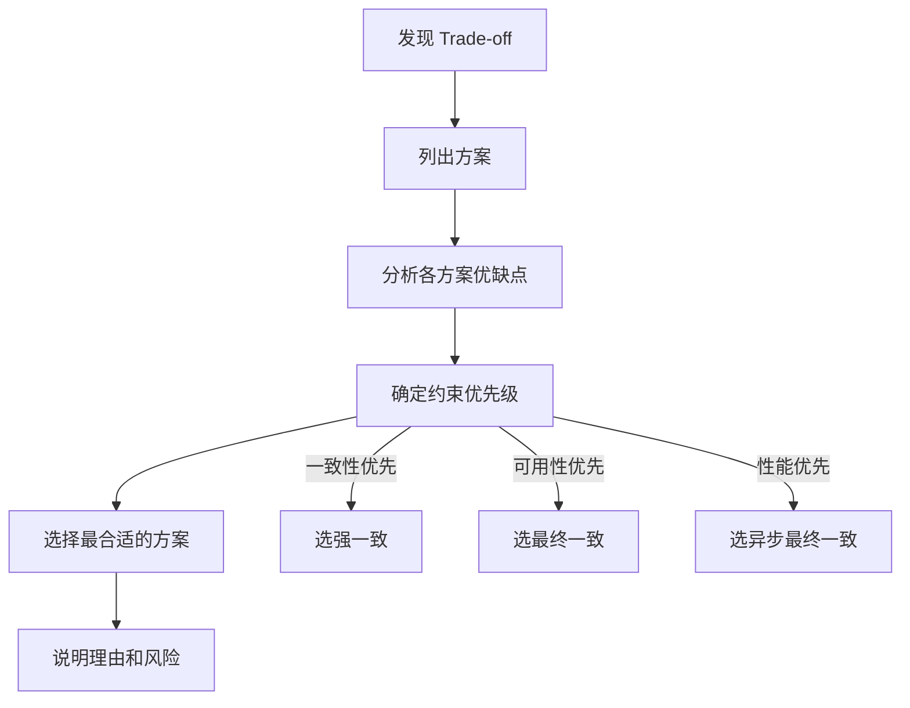

# 系统设计面试框架

**目标级别**：P6/P7

---

「请设计一个短链系统」——听到这句话，你会怎么开始？

很多候选人上来就开始画架构图、讲技术选型，结果讲到一半发现自己漏掉了关键需求，或者和面试官的预期完全不在一个频道上。系统设计面试的第一步不是「怎么设计」，而是「理解问题」。

## 面试流程概览

系统设计面试通常分为以下五个环节，每个环节都有面试官想要考察的能力点：



## 第一步：理解需求

### 必须澄清的 5 个问题

面试官给的需求往往是模糊的，你需要主动追问来明确边界：

| 问题 | 为什么重要 | 示例 |
| --- | --- | --- |
| 系统规模多大？ | 决定技术选型和架构复杂度 | 日活 100 万 vs 日活 1 亿 |
| 功能范围是什么？ | 避免做多了也避免做少了 | 只做生成还是也要做跳转分析？ |
| 性能指标是什么？ | 决定优化方向 | P99 延迟 `<` 100ms 还是 `<` 1s？ |
| 可用性要求多高？ | 决定容错设计 | 99.9% 还是 99.99%？ |
| 有什么约束条件？ | 省钱/用现有组件/快速上线 | 必须用 MySQL？ |

### 需求分类框架

拿到需求后，先判断它属于哪类系统：

| 类型 | 特征 | 代表题目 | 设计重点 |
| --- | --- | --- | --- |
| **存储型** | 数据量大、读多写少 | 短链系统、Feed 流 | 存储成本、查询效率 |
| **计算型** | 计算密集、实时性高 | 排行榜、推荐系统 | 计算效率、缓存策略 |
| **交互型** | 实时性要求高 | IM 系统、直播弹幕 | 长连接、消息分发 |
| **事务型** | 一致性要求高 | 支付系统、秒杀系统 | 分布式事务、数据一致性 |

### ⚠️ 常见陷阱

**陷阱一：不问规模就动手**

> 候选人：「短链系统用 MySQL 存储，Redis 做缓存...」
> 面试官：「日活 1 亿，每天生成 10 亿条短链」
> 候选人：「......」

不问规模的后果：选型可能完全错误，白做了大量无用功。

**陷阱二：功能范围不清晰**

> 候选人画了一个完美的短链系统，包括访问统计、权限管理、过期机制...
> 面试官：「我只需要最基础的跳转功能」
> 候选人内心 OS：白画了

一定要在开始前和面试官确认功能边界。

## 第二步：约束分析

### 容量估算方法

系统设计面试必须做容量估算，这是展现工程判断力的重要环节。

**核心公式**：



**估算的基本步骤**：

1. **估算日活跃用户（DAU）**：假设日活占总用户的 10%-20%
2. **估算日请求量**：DAU × 平均每人每天请求次数
3. **估算峰值 QPS**：日均 QPS × 峰值系数（通常 3-10 倍）
4. **估算存储量**：每天新增数据 × 保留天数

### 估算示例：短链系统

假设需求：日活 1000 万用户，平均每人每天生成 5 条短链、访问 20 次

| 指标 | 估算公式 | 结果 |
| --- | --- | --- |
| 日生成量 | 1000万 × 5 | 5000 万条 |
| 日访问量 | 1000万 × 20 | 20 亿次 |
| 峰值 QPS | 20亿 ÷ 86400 × 5 | ~12 万 QPS |
| 单条存储 | 50 字节 | 2.5 GB/天 |
| 一年存储 | 2.5 GB × 365 | ~900 GB |

### 机器数量估算

根据估算的 QPS 来计算需要多少台机器：

| 组件 | 单机能力 | 估算所需 | 备注 |
| --- | --- | --- | --- |
| Web 服务器 | 1000-2000 QPS | 12万 ÷ 1500 `=` 80 台 | 需要负载均衡 |
| Redis 缓存 | 10-20 万 QPS | 1-2 台 | 主从保证可用性 |
| MySQL | 3000-5000 QPS | 读 24 台，写 16 台 | 需要分库分表 |

### ⚠️ 常见陷阱

**陷阱三：估算过于精确**

面试官问：「你觉得需要多少台服务器？」

错误回答：「根据我的计算，需要 142.7 台服务器，四舍五入取 143 台。」

正确回答：「按单台 1500 QPS 估算，大概需要 80 台 Web 服务器，再预留 50% 的冗余。」

面试官要的是量级感觉，不需要精确到个位数。

**陷阱四：忘记考虑峰值**

> 候选人：「日均 QPS 10 万，用 20 台机器就够了」
> 面试官：「峰值是日均的 5 倍呢？」
> 候选人：「......」

一定要考虑峰值，留足余量。

## 第三步：架构设计

### 服务拆分原则

根据功能边界和变更频率进行服务拆分：



**拆分原则**：

| 原则 | 说明 | 示例 |
| --- | --- | --- |
| 高频 vs 低频 | 访问量差异大的功能拆开 | 秒杀商品页 vs 普通商品页 |
| 读 vs 写 | 读写比例不同的拆开 | 评论列表 vs 提交评论 |
| 核心 vs 非核心 | 核心链路独立部署 | 支付链路 vs 消息通知 |
| 变更频率 | 变更原因不同的拆开 | 用户服务 vs 订单服务 |

### API 设计

系统设计中的 API 设计往往被忽视，但它能体现你的抽象能力：



**API 设计要点**：

- 使用 RESTful 风格，保持一致性
- 考虑分页、过滤、排序等通用能力
- 设计好错误码和错误信息
- 考虑接口版本管理

## 第四步：细节深化

### 核心模块设计

针对每个核心模块，需要深入设计：

| 模块 | 需要回答的问题 |
| --- | --- |
| **存储设计** | 表结构、索引、分库分表策略 |
| **缓存设计** | 缓存结构、过期策略、更新策略 |
| **一致性** | 如何保证数据一致性？分布式事务还是最终一致？ |
| **可用性** | 某台机器挂了怎么办？服务如何降级？ |
| **扩展性** | 数据量增长 10 倍怎么办？ |

### 数据模型设计



## 第五步：优化与权衡

### 性能优化方向

| 优化维度 | 常用手段 |
| --- | --- |
| **延迟** | 缓存、异步、预计算、CDN |
| **吞吐** | 水平扩展、读写分离、分库分表 |
| **可用性** | 冗余部署、自动 failover、降级熔断 |
| **一致性** | 分布式事务、消息队列、补偿机制 |

### 权衡决策框架

遇到 trade-off 时，用这个框架做决策：



**权衡示例**：

| 场景 | 方案 A | 方案 B | 选择依据 |
| --- | --- | --- | --- |
| 缓存一致 | Cache Aside | Write Through | 写多还是读多？ |
| 库存扣减 | 下单预占 | 支付减库存 | 超卖容忍度？ |
| 消息投递 | at-least-once | at-most-once | 业务能接受重复吗？ |

## 面试话术模板

### 开场话术

```
「好的，我想先确认一下需求：
1. 系统的规模大概是多大？日活用户量级是多少？
2. 核心功能有哪些？有没有哪些是可以砍掉的？
3. 性能指标是什么？延迟要求大概在什么水平？
4. 可用性要求？有没有 SLO 要求？」
```

### 估算话术

```
「根据需求来估算一下规模：
假设日活 1000 万用户，按峰值 QPS 是日均的 5 倍来算，
日均是 10 万 QPS，峰值大概是 50 万 QPS。
按单台机器 2000 QPS 估算，需要 25 台 Web 服务器。
考虑到缓存命中率 80%，实际数据库 QPS 大概是 10 万...」
```

### 权衡话术

```
「这里有两个方案：
方案 A 是一致性优先，代价是延迟增加 20ms；
方案 B 是可用性优先，代价是可能出现短暂数据不一致。
结合业务场景，我认为方案 B 更合适，因为...
不过方案 B 也有风险，如果...可以通过...来缓解。」
```

## 面试评分标准

| 维度 | P5 表现 | P6 表现 | P7 表现 |
| --- | --- | --- | --- |
| 需求理解 | 能回答基本问题 | 能主动追问关键点 | 能识别隐含约束 |
| 容量估算 | 能做简单估算 | 估算全面且合理 | 估算精准且有依据 |
| 架构设计 | 能画出基本架构 | 能合理拆分服务 | 能设计高可用架构 |
| 技术选型 | 能选择合适组件 | 能说出 trade-off | 能结合场景优化 |
| 权衡决策 | 能说出优缺点 | 能做合理决策 | 能处理复杂场景 |
| 沟通表达 | 能讲清楚方案 | 能引导讨论方向 | 能应对追问扩展 |

## 常见错误总结

| 错误 | 后果 | 改进方法 |
| --- | --- | --- |
| 不问需求就开始设计 | 方向可能完全错误 | 养成先问需求的习惯 |
| 容量估算跳过 | 选型可能不合理 | 每天练习 3 道估算题 |
| 只讲优点不讲缺点 | 显得思考不全面 | 每个方案都说 trade-off |
| 卡在一个点上 | 时间不够讲完 | 设置时间节点 |
| 不接受面试官建议 | 显得固执 | 保持开放心态 |

---

> 💡 **面试官视角**：系统设计面试不是考试，而是协作讨论。面试官期待的是你在不确定中做假设、在权衡中做决策的能力。不要追求完美方案，要追求「思考过程」和「工程判断力」。
