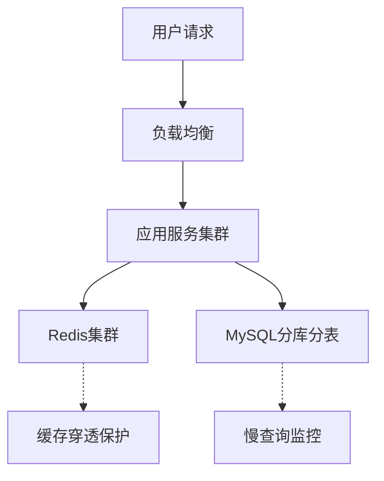

# 系统设计面试框架

候选人大刘坐在字节跳动的面试间，面前的白板上空空如也。面试官说："设计一个微博的Feed流系统，给你有10分钟时间。"

大刘深吸一口气，开始画架构图。5分钟后，他的图上画满了各种箭头和方框，但他越说越乱，最后面试官打断他："你的设计方案解决了什么问题？你有没有考虑过数据规模？"

大刘哑口无言。

这场面试的失败，不是因为大刘不懂技术，而是他不懂**系统设计面试的节奏**。

【架构权衡】

系统设计面试不是让你当场画出一个完美的架构图，而是考察你面对复杂问题时的问题分析能力、方案权衡思维和工程落地意识。知道怎么组织这场对话，比知道多少技术细节更重要。

## 一、需求澄清 🔴

90%的候选人死在第一步——没有澄清需求就开始画图。

### 1.1 为什么要澄清需求

面试官出一道系统设计题，通常只有一两句话。比如"设计一个短链系统"。这句话背后藏着无数隐含条件：
- 日活多少？
- 短链支持多久的有效期？
- 需要支持自定义短链吗？
- 读多还是写多？
- 需要支持统计分析吗？

你不说清楚，面试官就默认你假设了一个错误的范围。

### 1.2 澄清清单

面试的前2分钟，你应该主动抛出以下问题：

**功能边界**：
- 核心功能是什么？最小可用版本需要支持哪些特性？
- 用户是谁？C端用户还是B端商家？
- 需要支持哪些操作？CRUD还是以读为主？

**数据规模**：
- 日活/月活是多少？（直接影响架构选型）
- 日均请求量是多少？（QPS，决定了容量规划）
- 数据量有多大？（影响存储选型）
- 增长预期是多少？（影响扩展性设计）

**性能指标**：
- 延迟要求是多少？（P50/P99）
- 可用性要求是多少？（4个9还是5个9）
- 一致性要求是什么？（强一致还是最终一致）

### 1.3 错误示范

> 面试官：设计一个秒杀系统。
>
> 候选人：好的，我先用Redis做缓存，RabbitMQ做消息队列，MySQL做持久化...
>
> 面试官打断：你知道双十一零点秒杀活动有多少人同时参与吗？
>
> 候选人：...呃，很多？

**问题诊断**：没有澄清QPS规模就开始选型，这是典型的"拿着锤子找钉子"。秒杀100人参与和100万人参与，架构方案天差地别。

### 1.4 标准姿势

> 面试官：设计一个秒杀系统。
>
> 候选人：我先确认一下几个关键指标——
>
> 1. 并发规模是多少？是小活动几千QPS，还是双十一级别百万QPS？
> 2. 库存有限吗？超卖容忍度是多少？
> 3. 需要支持前端展示吗？还是纯下单链路？
> 4. 一致性要求多高？允许短暂超卖吗？
>
> 面试官：按双十一级别设计，允许极少量超卖。
>
> 候选人：明白，那我按百万QPS设计，重点解决热点库存和流量削峰问题。

【面试官心理】

面试官出一道题，他其实有一个默认的考察框架。你问的问题暴露了你的思维层次——问"日活多少"的人知道架构要看数据量级，问"一致性要求"的人知道不同场景有不同权衡，问"最小可用版本"的人有产品意识。这些问题本身就是在加分。

## 二、方案设计 🔴

### 2.1 从简单方案开始

拿到需求后，**不要一上来就搞分布式微服务**。

先把最简单的方案说出来，然后分析瓶颈，再逐步演进。这是你展示思维方式的过程。

**第一版：最简单机方案**

假设数据量不大，单机MySQL + Redis缓存能搞定。
- 描述清楚数据模型
- 描述清楚核心接口和流程
- 估算一下单机容量

**第二版：识别瓶颈**

> "单机方案在QPS超过1000时会出现瓶颈，因为MySQL单表写入上限大约是2000 QPS..."

瓶颈可能来自：
- 数据库连接数上限
- 单机CPU/内存限制
- 网络带宽
- 磁盘IO

**第三版：水平扩展方案**

针对每个瓶颈，给出水平扩展思路。
- 数据库：从单机到主从复制，到分库分表
- 缓存：从单机到集群
- 应用：从单机到无状态服务集群

### 2.2 画图的技巧

架构图不是越复杂越好。好的架构图应该：
- **自顶向下**：先画用户入口，再画服务层，最后画数据层
- **关键路径突出**：核心链路用粗线，辅助链路用虚线
- **标注数据流向**：让面试官一眼看懂请求从哪来到哪去



### 2.3 关键决策要讲Why

每一层技术选型，你都要能说出**为什么选它**和**为什么不选其他方案**。

| 层级 | 常见选项 | 选型依据 |
| --- | --- | --- |
| 负载均衡 | Nginx / LVS / 云SLB | 性能 vs 功能 vs 运维成本 |
| 网关层 | Kong / Spring Cloud Gateway / 自研 | QPS需求 / 功能需求 / 定制化程度 |
| 缓存层 | Redis / Memcached | 数据结构 / 持久化需求 / 团队熟悉度 |
| 消息队列 | Kafka / RocketMQ / RabbitMQ | 吞吐量 / 延迟 / 消息可靠性 |
| 数据库 | MySQL / PostgreSQL / MongoDB | 数据结构 / 一致性需求 / 团队熟悉度 |

:::tip 💡

面试官最想听到的不是你选了什么，而是你为什么这么选。能说出"我选A而不是B，因为..."的候选人，至少是P6以上水平。

:::

### 2.4 常见翻车点

**翻车点1：只讲技术不讲业务**
> 候选人：我用Redis做缓存，MySQL做存储，Kafka做消息队列...
>
> 面试官：你的数据模型是什么？用户请求进来怎么流转？

**翻车点2：过度设计**
> 候选人：我设计了一个六层架构，包括API网关、服务网格、配置中心、链路追踪...
>
> 面试官：这个系统日活多少？
>
> 候选人：大概1万。
>
> 面试官：...

**翻车点3：不考虑运维成本**
> 候选人：每个微服务独立部署，用不同的编程语言...
>
> 面试官：那你的团队有多少人？
>
> 候选人：5个。
>
> 面试官：...

【架构权衡】

架构复杂度要和业务规模匹配。小公司用微服务是自找麻烦，大公司用单体是自寻死路。面试时展示这种"规模意识"，比展示你会多少框架更有价值。

## 三、深入优化 🟡

### 3.1 面试官的追问方向

当你完成了基础方案，面试官通常会从以下几个方向追问：

**性能方向**：
- 你的系统能支撑多少QPS？怎么算出来的？
- 延迟P99是多少？怎么优化？
- 有没有热点问题？怎么处理？

**可用性方向**：
- 如果Redis挂了怎么办？
- 数据库主从切换时服务会受影响吗？
- 怎么做到99.99%的可用性？

**一致性方向**：
- 缓存和数据库怎么保持一致？
- 分布式事务怎么解决？
- 消息丢了怎么办？

**扩展性方向**：
- 如果数据量增长100倍怎么办？
- 怎么做到不停机扩容？

### 3.2 应对追问的策略

**策略1：承认局限，给出Plan B**

不要死扛一个方案，学会给自己留退路。
> "这个方案在正常情况下没问题，但如果Redis挂了，我设计了降级策略：直接查数据库，同时发出告警..."

**策略2：用数据说话**

每个结论都要有数据支撑。
> "MySQL单表超过2000万条记录后性能会明显下降，所以我按日活1000万设计了分表策略..."

**策略3：展示生产经验**

面试官特别在意你有没有踩过坑。
> "之前我们生产环境就遇到过热点key问题，当时用本地缓存 + Redis二级缓存解决了..."

:::warning ⚠️

面试官追问时，最怕的不是你答不上来，而是你答不上来还硬扛。如果你真的不知道，就说"这个我没实际遇到过，但我分析可能是..."——诚实的态度比强撑更讨喜。

:::

### 3.3 高频追问：如何量化性能

面试官经常会问"你怎么证明你的方案能支撑这个规模"，你需要展示容量估算能力。

**基本公式**：

```
所需机器数 = 预估QPS / 单机QPS × 冗余系数
```

**单机QPS参考**：
- MySQL单表读：3000-5000 QPS
- MySQL单表写：1000-2000 QPS
- Redis单机：10-15万 QPS
- 普通HTTP服务：3000-5000 QPS

**示例**：
> "假设日活1000万，峰值QPS是日均的5倍也就是5000，系统打算用Redis缓存热点数据（命中率80%），回源QPS约1000，单机MySQL能支撑2000 QPS，所以数据库层用一主两从就够了。"

【面试官心理】

追问环节是拉开差距的关键。能回答基础问题的候选人占80%，能在追问中展示量化思维和生产经验的占40%，能面对压力保持冷静、条理清晰的只有20%。这个环节答得好不好，直接决定你能不能拿到offer。

## 四、总结收尾 🟢

### 4.1 你应该总结什么

面试的最后2分钟，是展示你全局视野的机会。

**技术总结**：
- 快速回顾你的方案核心要点
- 点出系统的关键瓶颈和解决思路

**权衡反思**：
- 这个方案有哪些取舍？
- 如果需求变化，哪里最容易扩展？

**运维视角**：
- 上线后需要监控哪些指标？
- 出了故障怎么排查？

### 4.2 万能收尾句式

> "整体来看，这个系统最核心的设计点是【1-2个核心决策】，主要挑战在于【1-2个难点】，如果让我在上线后继续优化，我最想改进的是【1个点】。"

示例：
> "整体来看，这个秒杀系统最核心的设计点是基于Redis的库存预扣减和请求分段限流，主要挑战在于热点商品的库存并发控制，如果让我继续优化，我最想改进的是加入实时库存大屏，让运营人员能看到秒杀进度。"

### 4.3 避免的两个极端

**极端1：说完方案就结束**
> 候选人：以上就是我的设计方案。
>
> 面试官：好的。（内心：这人没有总结能力）

**极端2：总结时又提出新方案**
> 候选人：另外我觉得还可以加入XX功能，用YY技术实现...
>
> 面试官：等等，你刚才的方案还没定论呢，先把核心问题解决。

【面试官心理】

最后2分钟，面试官在观察你有没有"收尾"意识。优秀的候选人能把10分钟的对话收在一个漂亮的结论上，不优秀的候选人要么戛然而止让面试官尴尬，要么越说越多收不住。收尾能力反映的是一个人的表达能力——你能把一个复杂问题讲清楚，面试官才相信你能把复杂系统讲清楚。

## 五、四大题型解题套路 🟡

### 5.1 存储型题目

典型题目：短链系统、Feed流系统、评论系统

**核心套路**：数据模型设计 -> 读写比例分析 -> 存储选型 -> 索引设计 -> 扩展方案

```
解题路径：
1. 确定核心数据是什么
2. 分析读写比例和查询模式
3. 选择合适的存储引擎
4. 设计索引支持高效查询
5. 考虑分库分表策略
```

### 5.2 计算型题目

典型题目：附近的人、排行榜、搜索建议

**核心套路**：计算模型 -> 算法选型 -> 精度 vs 性能权衡 -> 缓存优化

```
解题路径：
1. 确定计算的核心公式
2. 选择合适的算法（如Geohash、跳表）
3. 分析精度和性能的取舍
4. 设计缓存层减少重复计算
```

### 5.3 流控型题目

典型题目：秒杀系统、限流系统、消息队列

**核心套路**：流量特征分析 -> 削峰策略 -> 资源隔离 -> 最终一致性

```
解题路径：
1. 分析流量特征（突发程度、持续时间）
2. 设计削峰策略（队列、缓存、延迟处理）
3. 设计资源隔离防止雪崩
4. 保证最终一致性
```

### 5.4 协同型题目

典型题目：IM系统、在线文档、直播弹幕

**核心套路**：实时性要求 -> 消息可靠送达 -> 状态同步 -> 冲突处理

```
解题路径：
1. 确定实时性要求（毫秒级/秒级）
2. 设计消息可靠送达机制
3. 处理多端状态同步
4. 解决并发写入冲突
```

## 六、自检清单 🟢

面试前，用这个清单过一遍：

| 检查项 | 核心问题 |
| --- | --- |
| 需求澄清 | 问过QPS、数据规模、一致性要求了吗？ |
| 方案完整 | 画出完整的请求链路了吗？ |
| 选型有理 | 每个技术选型都说清楚Why了吗？ |
| 数据量化 | 给出了具体的容量估算数字吗？ |
| 风险意识 | 提到了可能的故障点和降级方案吗？ |
| 全局视野 | 总结时能说出1-2个核心设计点吗？ |

## 七、真实面试回放 🟡

> **面试官**：设计一个Twitter的Timeline系统。
>
> **候选人**（大张）：我先确认一下——这是指用户的首页Feed流吗？日活大概多少？用户主要看还是主要发？
>
> **面试官**：日活1亿，用户主要看，平均每人每天看20条推文。
>
> **大张**：明白。我先说最简方案：用户发推时写入自己的粉丝列表，写入量是1亿 × 关注数均值的写入。如果平均每人关注200人，那就是200亿条/天的写入。数据量太大，我需要用消息队列削峰，然后推送到粉丝的收件箱。
>
> **面试官**：推模式有什么问题？
>
> **大张**：大V用户发一条推文要推送给几千万粉丝，写入量巨大，而且很多粉丝可能是僵尸用户，根本不会看。我分析了，推模式适合"粉丝数差异不大"的场景，我们的场景有热点问题。所以我的方案是：大V用拉模式，普通用户用推模式，混合处理。
>
> **面试官**：怎么实现拉模式？
>
> **大张**：用户查看Timeline时，聚合他关注的所有人最近N条推文。问题是关注200人，N=20，要读取2000条记录，太慢了。我设计了三层缓存：Redis缓存每个用户最近100条Timeline，CDN缓存热门推文，本地LRU缓存热点大V的最近推文。
>
> **面试官**：Redis缓存怎么保证一致性？
>
> **大张**：Timeline对一致性要求不高，属于"最终一致"场景。我设计了两个机制：一是推文更新/删除时发送消息，异步更新缓存；二是Timeline设置TTL，过期后重新聚合。
>
> **面试官**：好的，你来总结一下核心设计。
>
> **大张**：核心设计是混合读写策略：大V推文拉模式 + 普通用户推模式，存储层用消息队列削峰，缓存层用Redis + CDN + 本地三级缓存，核心权衡是"写入成本 vs 读取成本"，我们选择了增加写入复杂度来换取读取的低延迟。
>
> **面试官**：不错。
>
> 【面试官手记】
>
> 大张这场面试表现出了几个关键素质：第一，需求澄清做得充分，知道问日活和读写比例；第二，能识别推拉模式的trade-off，有量化分析能力；第三，缓存设计有三层意识，不是一上来就堆Redis；第四，总结时能说出核心权衡，这是P6+的标志。整个面试10分钟，没有任何冷场，节奏把控得很好。


系统设计面试，本质上是一场"技术谈判"。你和面试官不是对立关系，而是共同在讨论一个复杂问题。掌握好节奏——澄清需求、展现思路、坦然承认局限、漂亮收尾——比背再多八股文都重要。

记住：面试官要的不是百科全书，而是一个有思考力、有权衡意识、有工程直觉的技术人。
