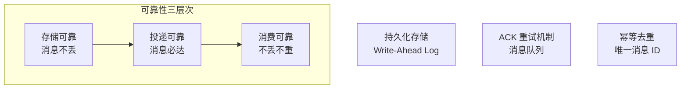
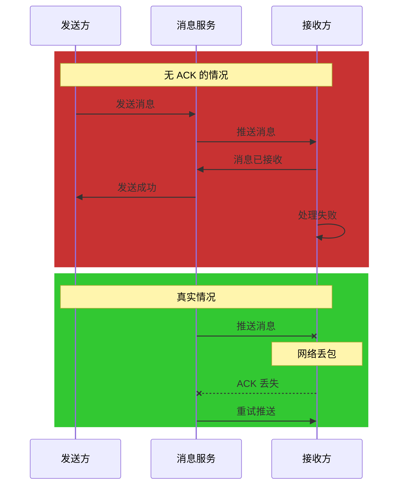
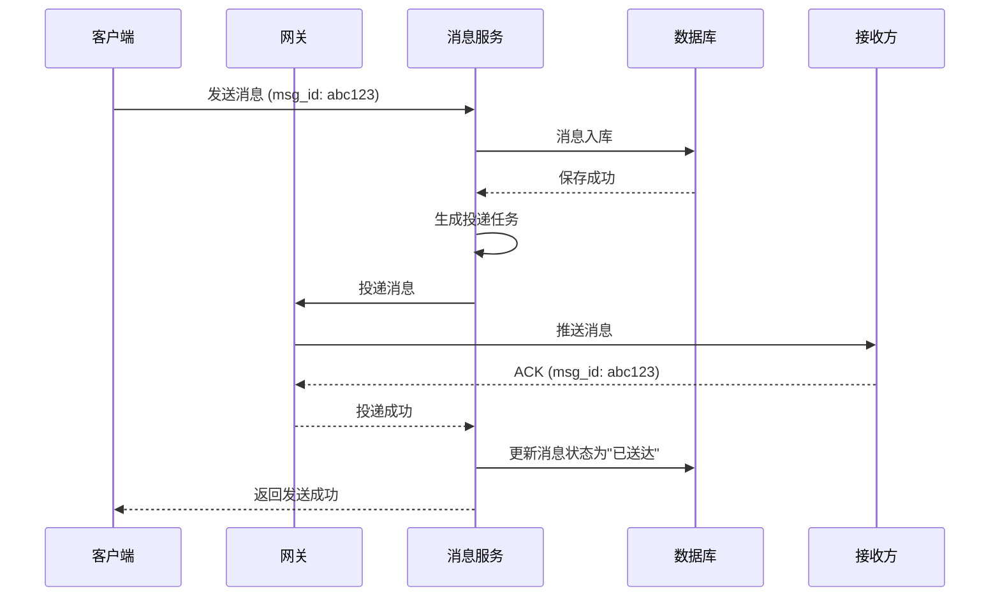
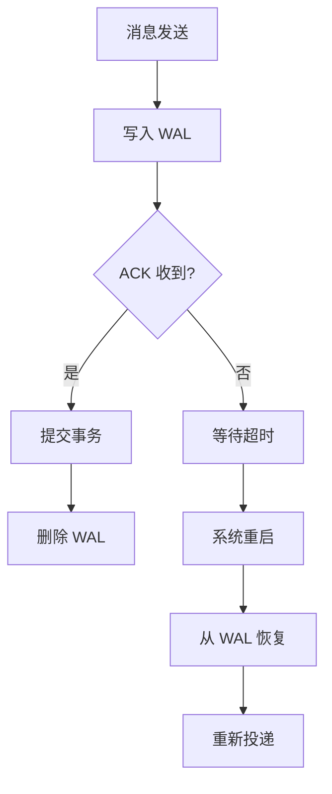
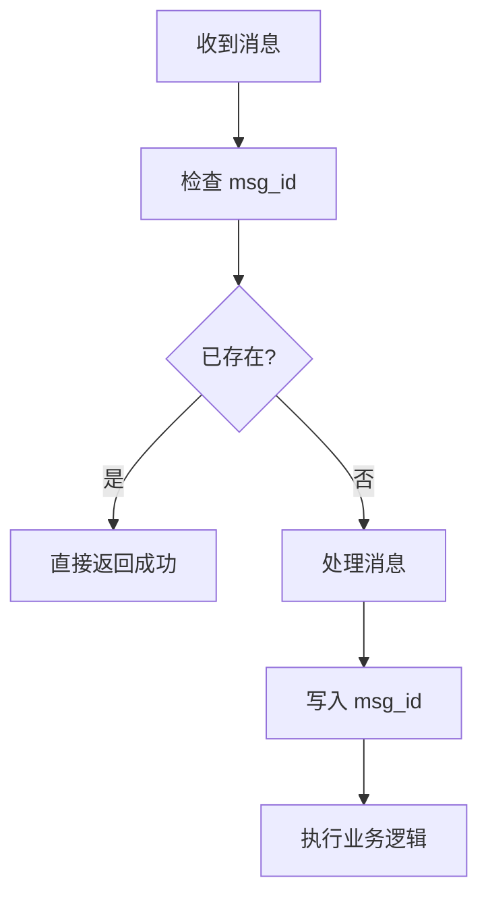
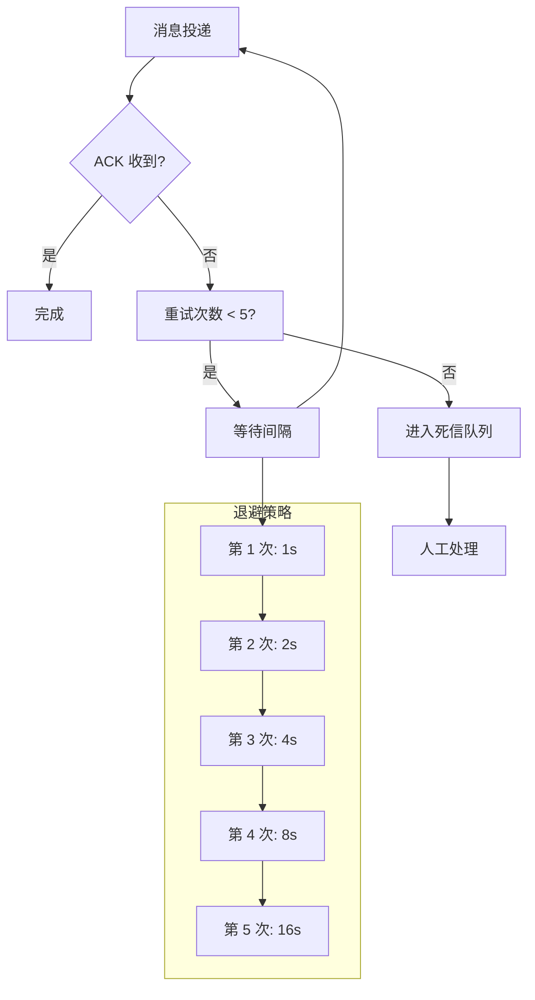
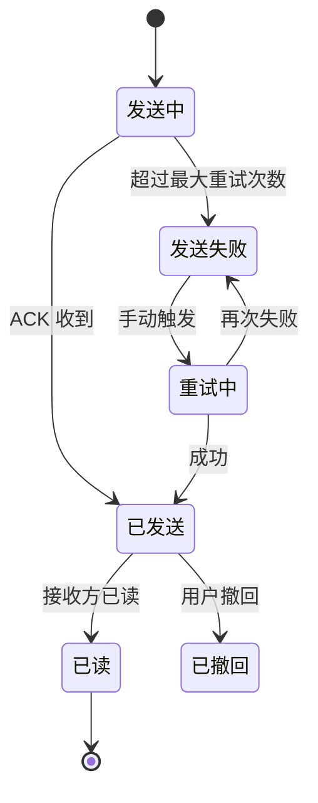
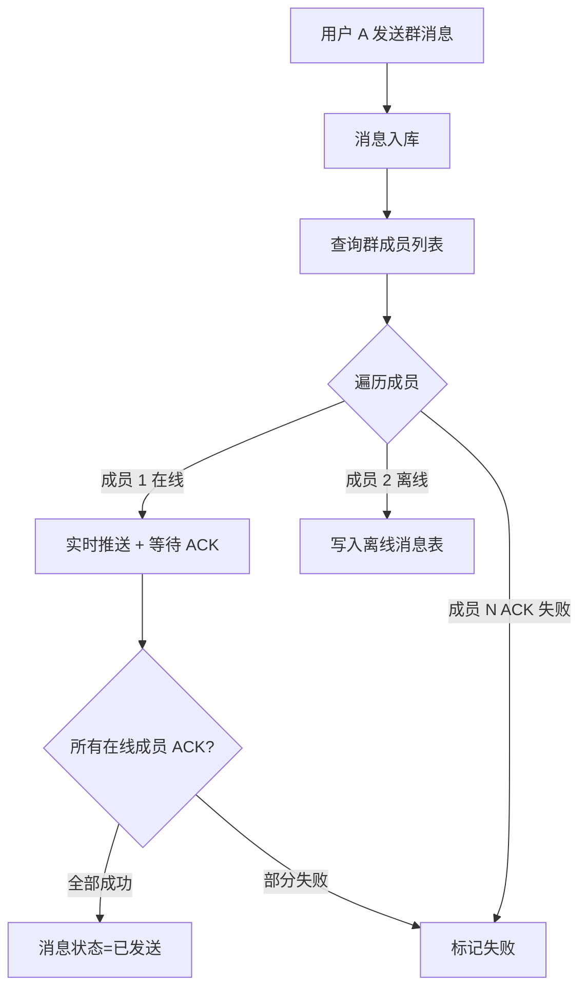
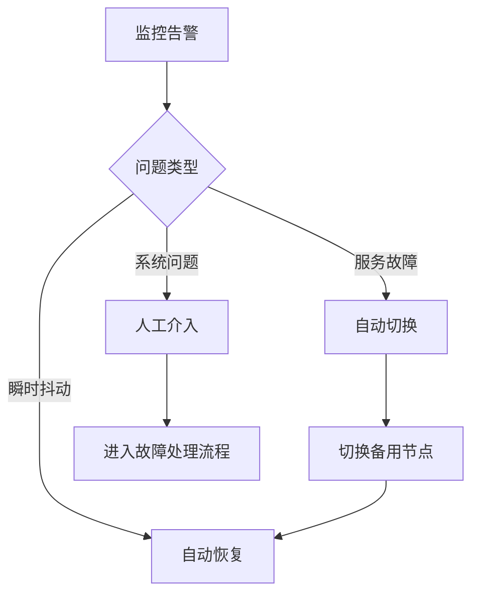

# IM 消息可靠性保证

**目标级别**：P6/P7

---

上一讲我们讲了 IM 系统的整体设计，这一讲专门聊聊**消息可靠性**——这是 IM 系统最核心也最容易出问题的部分。

面试官问：「怎么保证消息一定能送达？」——这个问题看似简单，但面试官会从消息入库、投递、ACK、超时重试、幂等去重等多个角度追问，考察你对分布式系统一致性的理解深度。

## 面试题速览

| 题号 | 问题 | 频率 | 难度 |
| --- | --- | --- | --- |
| 01 | 消息可靠性的三个层次是什么？ | 🔴 高频 | P6 |
| 02 | 消息 ACK 机制怎么设计？ | 🔴 高频 | P6 |
| 03 | 消息丢失怎么检测和恢复？ | 🟡 中频 | P6 |
| 04 | 消息重复怎么避免和处理？ | 🔴 高频 | P6 |
| 05 | 消息重试的策略怎么定？ | 🟡 中频 | P6 |

## 一、消息可靠性的三个层次

消息可靠性不是简单的「发出去就行」，而是要在多个层次上保证。



| 层次 | 保证 | 实现方式 | 失败后果 |
| --- | --- | --- | --- |
| **存储可靠** | 消息不丢失 | 持久化存储、WAL | 消息永久丢失 |
| **投递可靠** | 消息必送达 | ACK + 重试 | 消息暂时丢失 |
| **消费可靠** | 不丢不重 | 幂等去重 | 消息重复 |

## 二、消息 ACK 机制

### ACK 的必要性

没有 ACK 机制，系统无法知道消息是否送达：



### ACK 时序设计



### ACK 超时设计

| 参数 | 推荐值 | 说明 |
| --- | --- | --- |
| **ACK 超时时间** | 30 秒 | 过长影响重试及时性，过短易误判 |
| **最大重试次数** | 5 次 | 超过后标记为"投递失败" |
| **重试间隔** | 1s, 2s, 4s, 8s, 16s | 指数退避 |
| **死信队列保留时间** | 7 天 | 人工介入处理 |

### ⚠️ 常见陷阱

**陷阱一：只等链路 ACK 就认为成功**

> 候选人：「消息推送到接收方客户端就算成功了」
> 面试官：「那如果接收方客户端刚收到就崩溃了，还没处理怎么办？」
>
> 正确答案：需要区分「送达」和「已处理」。可以设计两层 ACK：推送 ACK（送达）+ 业务 ACK（处理完成）。

**陷阱二：ACK 超时直接标记失败**

> 面试官：「ACK 超时了，你怎么判断是网络丢包还是接收方真的挂了？」
>
> 正确答案：不能简单标记失败，应该继续重试。可以结合在线状态：如果接收方在线但 ACK 超时，说明网络问题；如果接收方离线，就不用重试了。

## 三、消息持久化策略

### 消息入库时机

| 方案 | 时机 | 优点 | 缺点 |
| --- | --- | --- | --- |
| **先入库再推送** | 推送前必须入库 | 保证不丢失 | 延迟略高 |
| **先推送再入库** | 推送成功后再入库 | 延迟低 | 可能丢消息 |
| **异步双写** | 推送和入库并行 | 性能高 | 实现复杂 |

**推荐方案**：先入库再推送

```java
public class MessageService {
    
    public SendResult sendMessage(Message message) {
        // 1. 生成全局唯一消息 ID
        String msgId = snowflake.nextId();
        message.setMsgId(msgId);
        
        // 2. 消息入库（必须成功）
        messageDAO.insert(message);
        
        // 3. 投递消息
        DeliveryTask task = new DeliveryTask(msgId, message.getReceiverId());
        deliveryQueue.push(task);
        
        // 4. 等待 ACK 或超时重试
        return new SendResult(msgId, SendStatus.SENDING);
    }
}
```

### Write-Ahead Log (WAL)

消息入库后、定时任务执行前，系统崩溃了怎么办？使用 WAL 保证一致性：



## 四、消息幂等去重

### 重复消息的场景

| 场景 | 原因 | 结果 |
| --- | --- | --- |
| **客户端重试** | 用户网络不好点击重发 | 同一消息发送多次 |
| **服务端重试** | ACK 超时触发重发 | 同一消息重复投递 |
| **网络抖动** | 消息丢失触发重传 | 重复消息 |
| **消息队列重试** | 消费失败重新入队 | 重复消费 |

### 幂等去重方案



**方案一：数据库唯一索引**

```sql
CREATE TABLE message_log (
    id BIGINT PRIMARY KEY,
    msg_id VARCHAR(64) NOT NULL UNIQUE,
    status TINYINT NOT NULL,
    created_at DATETIME,
    INDEX idx_created_at (created_at)
);
```

```java
public boolean processMessage(Message msg) {
    try {
        messageLogDAO.insert(msg.getMsgId(), msg.getStatus());
        // 执行业务逻辑
        return true;
    } catch (DuplicateKeyException e) {
        // msg_id 已存在，直接返回成功
        return true;
    }
}
```

**方案二：Redis 去重**

```java
public boolean processMessage(Message msg) {
    String key = "msg:processed:" + msg.getMsgId();
    
    // SET NX：不存在才设置
    Boolean result = redisTemplate.opsForValue().setIfAbsent(key, "1", 7, TimeUnit.DAYS);
    if (Boolean.FALSE.equals(result)) {
        return true; // 已处理过
    }
    
    // 业务处理
    return doProcess(msg);
}
```

### 去重窗口设计

| 窗口类型 | 适用场景 | 实现方式 |
| --- | --- | --- |
| **永久去重** | 关键消息（订单、支付） | 持久化存储，永久保留 msg_id |
| **滑动窗口** | 普通消息 | 只保留最近 N 分钟的 msg_id |
| **按业务去重** | 有时效性的消息 | 业务级别去重（如当天有效） |

```java
public class DeduplicationService {
    
    // 滑动窗口去重：保留最近 7 天
    private static final long DEDUP_WINDOW = 7 * 24 * 3600 * 1000L;
    
    public boolean isDuplicate(String msgId) {
        String key = "msg:dedup:" + msgId;
        return Boolean.TRUE.equals(redisTemplate.hasKey(key));
    }
    
    public void markProcessed(String msgId) {
        String key = "msg:dedup:" + msgId;
        redisTemplate.opsForValue().set(key, "1", DEDUP_WINDOW, TimeUnit.MILLISECONDS);
    }
}
```

## 五、消息重试策略

### 重试策略设计



| 重试次数 | 间隔时间 | 累计耗时 |
| --- | --- | --- |
| 第 1 次 | 1 秒 | 1 秒 |
| 第 2 次 | 2 秒 | 3 秒 |
| 第 3 次 | 4 秒 | 7 秒 |
| 第 4 次 | 8 秒 | 15 秒 |
| 第 5 次 | 16 秒 | 31 秒 |

### ⚠️ 面试官挖坑点

**陷阱一：重试导致消息乱序**

> 面试官：「消息 A 和 B 按顺序发送，如果 A 超时重试，但 B 已经送达，会怎样？」
>
> 错误回答：「没关系，按时间顺序展示就行」
>
> 正确回答：会乱序。解决方案：使用序列号排序；或者在重试前等待一段时间；或者使用悲观策略，只有收到前一条 ACK 才发下一条。

**陷阱二：重试风暴**

> 面试官：「如果系统重启，所有消息都超时要重试，会发生什么？」
>
> 错误回答：「按顺序重试就行」
>
> 正确回答：会产生重试风暴，瞬间流量翻 N 倍。解决方案：使用消息队列削峰；或者错峰重试；或者限流降级。

## 六、消息状态机设计

### 消息完整状态流转



### 状态存储设计

```sql
CREATE TABLE message (
    id BIGINT PRIMARY KEY,
    msg_id VARCHAR(64) NOT NULL,
    sender_id BIGINT NOT NULL,
    receiver_id BIGINT NOT NULL,
    content TEXT,
    status TINYINT NOT NULL COMMENT '0-发送中 1-已发送 2-已读 3-已撤回 4-发送失败',
    retry_count INT DEFAULT 0 COMMENT '重试次数',
    error_msg VARCHAR(500) COMMENT '错误信息',
    created_at DATETIME,
    updated_at DATETIME,
    INDEX idx_status_time (status, updated_at)
);
```

## 七、群聊消息可靠性

### 群聊的特殊性

| 问题 | 说明 | 解决方案 |
| --- | --- | --- |
| **消息量大** | N 个人需要收到 N 份消息 | 使用写扩散 / 读扩散 |
| **部分 ACK** | N 个人只有部分在线 | 区分在线和离线 ACK |
| **离线处理复杂** | N 个人的离线消息不同 | 离线消息表按用户维度存储 |

### 群聊 ACK 设计



## 八、消息可靠性监控

### 核心监控指标

| 指标 | 计算方式 | 告警阈值 |
| --- | --- | --- |
| **消息送达率** | 成功数 / 总数 | `<` 99.9% |
| **平均投递耗时** | 投递耗时求平均 | `>` 500ms |
| **重试率** | 重试数 / 总数 | `>` 5% |
| **死信队列积压** | DLQ 消息数 | `>` 1000 |
| **ACK 超时率** | 超时数 / 总数 | `>` 1% |

### 告警与恢复



## 九、面试高频追问

### 第一层：消息 ACK 机制

> **问题**：怎么保证消息一定送达？
>
> **参考答案**：
> 消息可靠性有三个层次：存储可靠（先入库再推送）、投递可靠（ACK + 重试）、消费可靠（幂等去重）。具体流程是：消息先入库，然后投递到接收方，等待 ACK。收到 ACK 更新消息状态为"已送达"；超时未收到 ACK，指数退避重试；超过最大重试次数进入死信队列。

### 第二层：消息重复问题

> **问题**：怎么避免消息重复？
>
> **参考答案**：
> 消息重复的场景包括客户端重试、服务端重试、网络抖动等。解决方案是使用消息 ID 做幂等去重。可以用数据库唯一索引或 Redis SET NX 实现。关键是设计去重窗口：关键消息永久去重，普通消息滑动窗口去重。

### 第三层：群聊消息可靠性

> **问题**：群聊消息怎么保证每个成员都收到？
>
> **参考答案**：
> 群聊消息比单聊复杂，需要遍历群成员列表。对于在线成员，实时推送并等待 ACK；对于离线成员，写入离线消息表。关键是记录每个成员的送达状态：有些成员送达成功、有些失败、有些离线。这样用户上线后能知道自己错过了哪些消息。

## 十、综合对比

| 维度 | at-most-once | at-least-once | exactly-once |
| --- | --- | --- | --- |
| **定义** | 消息最多送达一次 | 消息至少送达一次 | 消息恰好送达一次 |
| **丢失风险** | 高 | 低 | 无 |
| **重复风险** | 无 | 中 | 无 |
| **实现复杂度** | 低 | 中 | 高 |
| **适用场景** | 日志、监控 | 普通消息 | 支付、订单 |
| **IM 推荐** | ❌ | ✅ | ✅ |

---

> 💡 **面试官视角**：消息可靠性是 IM 系统的核心。面试官会追问 ACK 机制、重试策略、幂等去重、群聊 ACK 等细节。关键是理解「送达」和「已处理」的区别，以及如何在性能和一致性之间做权衡。
