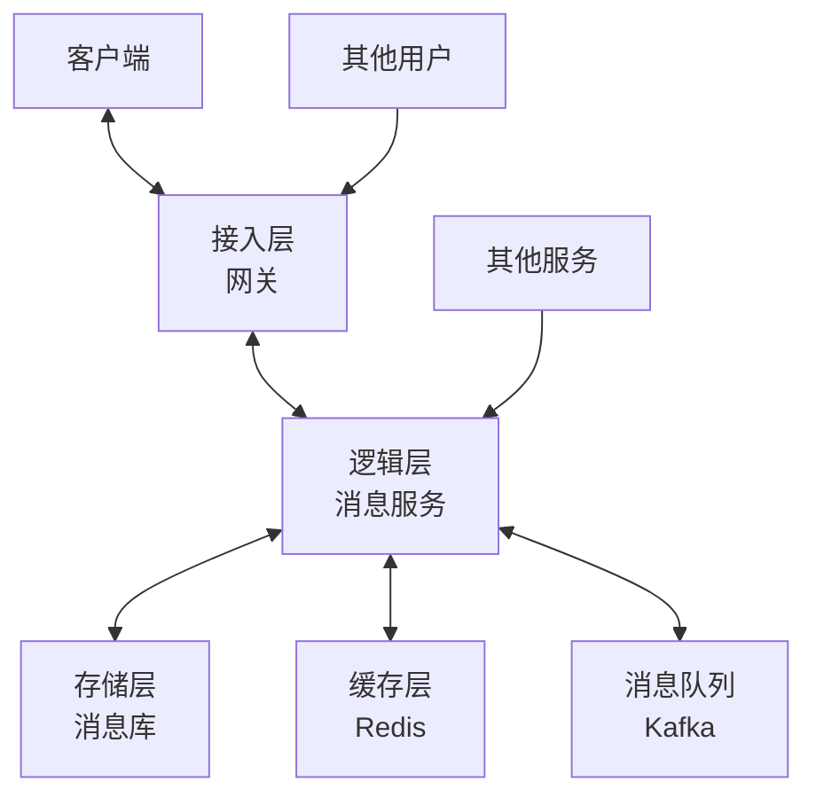
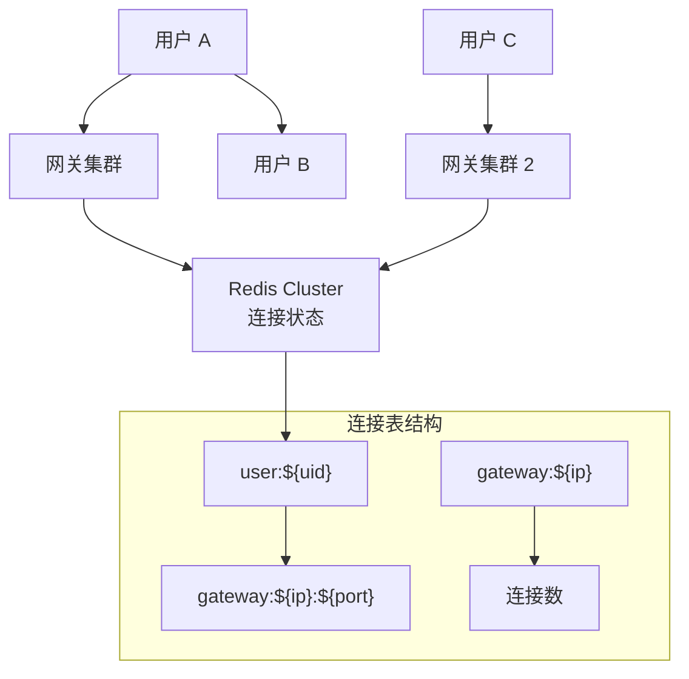
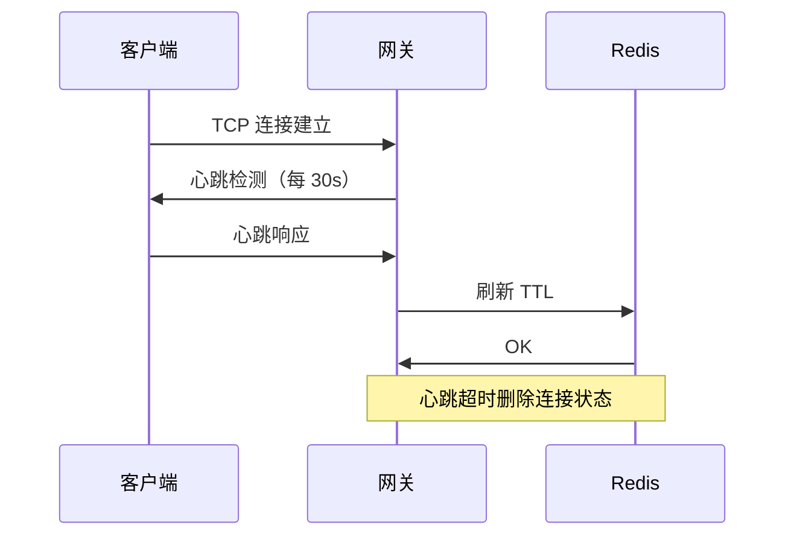
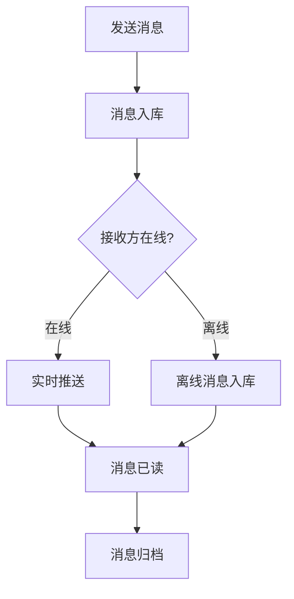
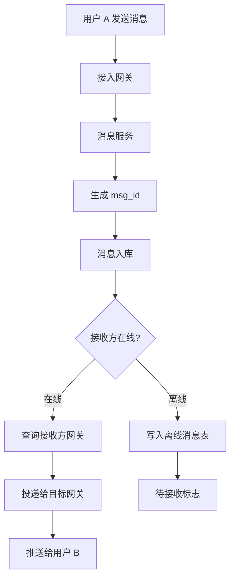
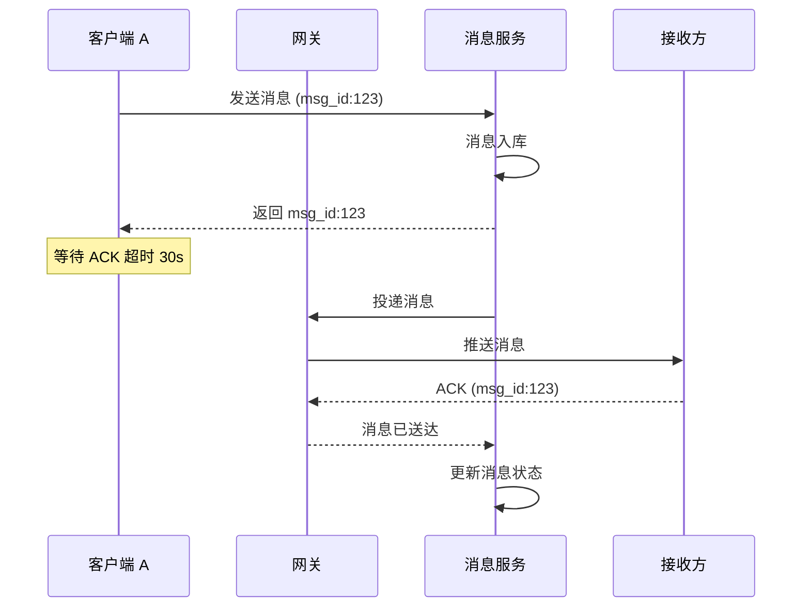
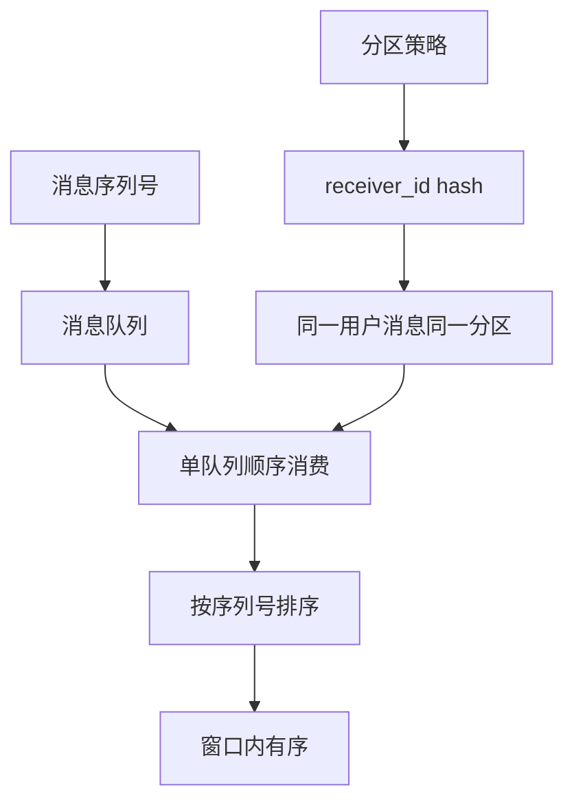
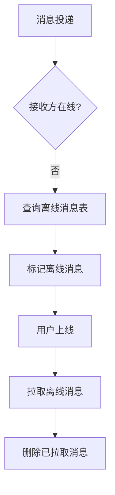
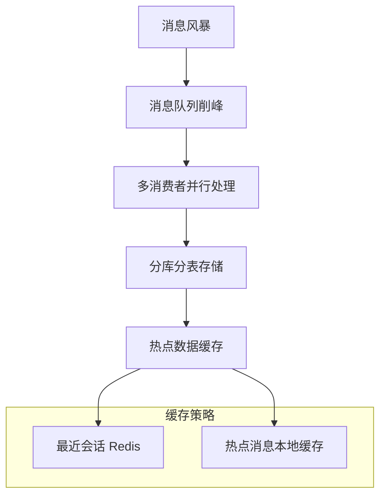

# IM 即时通讯系统设计

**目标级别**：P6/P7

---

面试官问：「设计一个微信这样的即时通讯系统」——这道题看起来简单，实际上考察的是你对长连接、消息可靠性、高并发架构的综合理解。

很多人觉得 IM 系统不就是「发消息 + 收消息」吗？但面试官追问到 WebSocket 连接管理、消息一致性保证、离线消息处理时，大多数候选人就开始卡壳了。

## 面试题速览

| 题号 | 问题 | 频率 | 难度 |
| --- | --- | --- | --- |
| 01 | IM 系统的核心架构是什么？ | 🔴 高频 | P5 |
| 02 | 怎么实现消息的可靠传递？ | 🔴 高频 | P6 |
| 03 | WebSocket 连接怎么管理？ | 🟡 中频 | P6 |
| 04 | 消息顺序怎么保证？ | 🔴 高频 | P6 |
| 05 | 离线消息怎么处理？ | 🟡 中频 | P6 |

## 一、需求澄清

IM 系统设计前，必须明确几个关键问题：

| 问题 | 为什么重要 | 候选选项 |
| --- | --- | --- |
| **单聊还是群聊？** | 群聊消息分发更复杂 | 单聊 / 群聊 / 两者都有 |
| **消息类型有哪些？** | 决定消息模型 | 文本 / 图片 / 语音 / 视频 |
| **在线状态要不要显示？** | 影响架构设计 | 显示 / 不显示 |
| **消息保留多久？** | 影响存储成本 | 临时 / 7 天 / 永久 |
| **规模多大？** | 决定连接管理策略 | 100 万 vs 1 亿在线 |

## 二、核心架构设计

### 整体架构



### 组件职责

| 组件 | 职责 | 技术选型 |
| --- | --- | --- |
| **接入层** | 连接管理、协议转换、认证鉴权 | Nginx / Netty Gateway |
| **逻辑层** | 消息处理、用户关系、群组管理 | Java / Go 微服务 |
| **存储层** | 消息持久化、用户数据 | MySQL / MongoDB |
| **缓存层** | 在线状态、会话列表、热点数据 | Redis Cluster |
| **消息队列** | 异步处理、削峰填谷 | Kafka / RabbitMQ |

## 三、连接管理

### WebSocket vs Long Polling

| 方案 | 原理 | 优点 | 缺点 | 适用场景 |
| --- | --- | --- | --- | --- |
| **WebSocket** | 双向长连接 | 实时性好、低延迟 | 实现复杂、需要保活 | 生产环境推荐 |
| **Long Polling** | 轮询等待新消息 | 实现简单 | 资源浪费、延迟高 | 简单场景 |
| **SSE** | 服务端推送 | 实现简单 | 单向、兼容性差 | 通知场景 |

**推荐方案**：WebSocket + Long Polling 降级

### 连接管理架构



### 连接状态存储

使用 Redis 存储用户连接状态：

```bash
# 用户登录时
SET user:${uid}:conn ${gateway_ip}:${port}
EXPIRE user:${uid}:conn 3600  # 心跳保活

# 查找用户在哪台网关
GET user:${uid}:conn  # 返回 gateway:192.168.1.1:8080

# 用户下线时删除
DEL user:${uid}:conn
```

### 心跳机制



| 参数 | 推荐值 | 说明 |
| --- | --- | --- |
| 心跳间隔 | 30 秒 | 过长影响检测灵敏度 |
| 心跳超时 | 60 秒 | 连续 2 次无心跳则认为离线 |
| 连接超时 | 10 秒 | TCP 连接建立超时 |

## 四、消息模型设计

### 消息生命周期



### 消息表结构

```sql
CREATE TABLE message (
    id BIGINT PRIMARY KEY AUTO_INCREMENT,
    msg_id VARCHAR(64) NOT NULL COMMENT '消息 ID雪花算法生成',
    sender_id BIGINT NOT NULL COMMENT '发送者 ID',
    receiver_id BIGINT NOT NULL COMMENT '接收者 ID（用户或群 ID）',
    msg_type TINYINT NOT NULL COMMENT '1-文本 2-图片 3-语音 4-视频',
    content TEXT COMMENT '消息内容',
    status TINYINT DEFAULT 0 COMMENT '0-发送中 1-已发送 2-已读 3-已撤回',
    created_at DATETIME DEFAULT CURRENT_TIMESTAMP,
    INDEX idx_receiver_time (receiver_id, created_at DESC),
    INDEX idx_sender_time (sender_id, created_at DESC),
    INDEX idx_msg_id (msg_id)
) ENGINE=InnoDB;
```

### 消息分发流程



## 五、消息可靠性保证

### 消息送达的三个层次

| 层次 | 保证 | 实现方式 |
| --- | --- | --- |
| **at-least-once** | 消息至少送达一次 | 重试机制 |
| **exactly-once** | 消息恰好送达一次 | 幂等 + 消息去重 |
| **有序** | 消息按发送顺序到达 | 序列号 + 窗口 |

### 消息 ACK 机制



### 消息重试机制

| 策略 | 实现 | 场景 |
| --- | --- | --- |
| **指数退避** | 重试间隔 1s, 2s, 4s, 8s... | 网络抖动 |
| **最大重试次数** | 超过 N 次标记失败 | 持久故障 |
| **死信队列** | N 次失败后进入 DLQ | 人工处理 |

### ⚠️ 面试官挖坑点

**陷阱一：消息丢失**

> 面试官：「如果消息服务崩溃了，已经投递的消息会不会丢？」
>
> 错误回答：「不会丢，因为已经推送给用户了。」
>
> 正确回答：需要分情况讨论。如果是推送给用户后还没收到 ACK，需要重试；如果已经收到 ACK 但还没更新数据库状态，需要保证消息入库和 ACK 更新的原子性。可以用消息队列的持久化 + 手动 ACK 机制。

**陷阱二：消息重复**

> 面试官：「网络不好时客户端重试，会不会产生重复消息？」
>
> 错误回答：「不会，可以限制重试次数。」
>
> 正确回答：会。使用消息 ID 做幂等去重，每次收到消息先查 msg_id 是否存在，存在则直接返回成功。

## 六、消息顺序保证

### 乱序的原因

| 原因 | 说明 | 场景 |
| --- | --- | --- |
| **网络延迟不同** | 不同消息走不同路由 | 跨机房 |
| **重试导致乱序** | 失败消息重发 | 网络抖动 |
| **多线程处理** | 并行处理消息 | 高并发 |

### 顺序保证方案



**方案一：单队列顺序消费**

所有消息按序处理，简单但性能差。适用于消息量不高的场景。

**方案二：分区 + 序列号（推荐）**

按接收者 ID 哈希分区，保证同一用户消息有序。

```java
public class MessageRouter {
    
    public int route(String receiverId) {
        int hash = receiverId.hashCode();
        return Math.abs(hash % kafkaPartitions);
    }
}
```

**方案三：本地序列号窗口**

客户端维护一个滑动窗口，本地排序后再展示。

```java
public class MessageWindow {
    private TreeMap<Long, Message> window = new TreeMap<>();
    private static final int WINDOW_SIZE = 100;
    
    public void addMessage(Message msg) {
        window.put(msg.getSeq(), msg);
        // 清理超出窗口的旧消息
        if (window.size() > WINDOW_SIZE) {
            window.remove(window.firstKey());
        }
    }
    
    public List<Message> getOrderedMessages() {
        return new ArrayList<>(window.values());
    }
}
```

## 七、离线消息处理

### 离线消息流程



### 离线消息表

```sql
CREATE TABLE offline_message (
    id BIGINT PRIMARY KEY AUTO_INCREMENT,
    receiver_id BIGINT NOT NULL COMMENT '接收者 ID',
    msg_id VARCHAR(64) NOT NULL COMMENT '消息 ID',
    msg_type TINYINT NOT NULL COMMENT '消息类型',
    content TEXT COMMENT '消息内容',
    sender_id BIGINT COMMENT '发送者 ID',
    created_at DATETIME DEFAULT CURRENT_TIMESTAMP,
    INDEX idx_receiver_unread (receiver_id, status, created_at)
) ENGINE=InnoDB;
```

### 拉取策略

| 策略 | 实现 | 优点 | 缺点 |
| --- | --- | --- | --- |
| **全量拉取** | 一次性拉取所有离线消息 | 简单 | 数据量大时慢 |
| **分页拉取** | 分页拉取离线消息 | 性能稳定 | 实现复杂 |
| **增量拉取** | 只拉取上次拉取之后的消息 | 带宽最优 | 需要记录拉取位点 |

```java
public List<Message> pullOfflineMessages(Long userId, Long lastMsgId, int limit) {
    return messageDAO.selectByReceiverAndLimit(
        userId, 
        lastMsgId, 
        limit
    );
}
```

## 八、高并发优化

### 消息量估算

假设：日活 1 亿用户，平均每人每天发送 20 条消息。

| 指标 | 估算 | 说明 |
| --- | --- | --- |
| 日消息量 | 1亿 × 20 | 200 亿条 |
| 峰值 QPS | 200亿 ÷ 86400 × 5 | ~115 万 QPS |
| 存储量 | 200亿 × 100B | 2 TB/天 |
| 一年存储 | 2TB × 365 | 730 TB |

### 优化方案



| 优化层 | 方案 | 效果 |
| --- | --- | --- |
| **接入层** | 连接复用、心跳优化 | 减少连接开销 |
| **网关层** | 无状态、水平扩展 | 支持高并发 |
| **消息队列** | 分区消费、削峰填谷 | 解耦、异步 |
| **存储层** | 分库分表、冷热分离 | 水平扩展 |

## 九、面试高频追问

### 第一层：IM 系统架构

> **问题**：IM 系统是怎么工作的？
>
> **参考答案**：
> IM 系统分为三层：接入层负责 WebSocket 连接管理；逻辑层处理消息业务逻辑；存储层持久化消息。用户发送消息时，消息先入库，然后查询接收方是否在线。如果在线，通过 Redis 找到接收方连接所在的网关，直接推送；如果离线，消息存入离线消息表，等待用户上线后拉取。

### 第二层：消息可靠性

> **问题**：怎么保证消息一定能送达？
>
> **参考答案**：
> 消息可靠性有三个层次：消息入库保证持久化；推送后等待 ACK，超时重试；接收端使用消息 ID 做幂等去重。关键点是在消息入库和推送之间不能有状态丢失，可以用消息队列的持久化 + 手动 ACK 机制。

### 第三层：消息顺序和离线

> **问题**：群聊消息怎么保证顺序？如果用户离线了怎么办？
>
> **参考答案**：
> 群聊消息按接收者 ID 哈希分区到同一队列，保证同一群的消息有序。同时每个消息携带全局递增的序列号，客户端本地排序后再展示。用户离线时，消息存入离线消息表。用户上线后，根据本地存储的最新消息 ID，查询并拉取离线消息。为了减少离线消息量，可以设置过期策略（如 7 天）。

## 十、综合对比

| 维度 | 自研 IM | 第三方 IM SDK | 开源方案 |
| --- | --- | --- | --- |
| **灵活性** | 高 | 中 | 高 |
| **开发成本** | 高（3-6 月） | 低（1 周） | 中（1-2 月） |
| **运维成本** | 高 | 低 | 中 |
| **可扩展性** | 高 | 受限 | 高 |
| **数据安全** | 自己控制 | 第三方存储 | 可私有部署 |
| **成本** | 服务器 + 人力 | 按量付费 | 服务器 + 人力 |
| **适用场景** | 核心业务 | 快速上线 | 中大型项目 |

---

> 💡 **面试官视角**：IM 系统设计的核心考察点是「实时性」和「可靠性」的平衡。面试官会追问消息 ACK、重试机制、离线消息处理等细节。关键是理解每个方案的 trade-off，而不是简单背答案。
