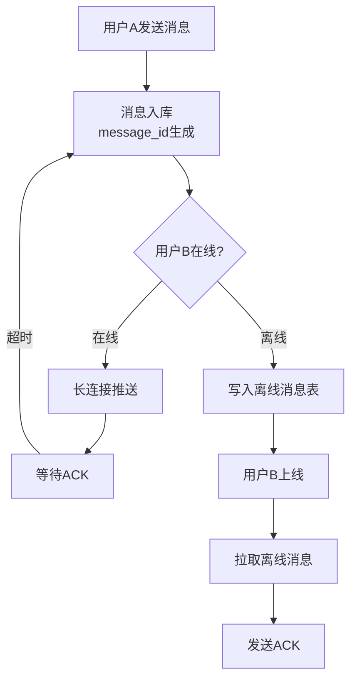

# IM 即时通讯系统设计

2020年春节除夕夜，某社交App的客服系统涌入了一波投诉："我的消息明明显示发送成功了，为什么对方没收到？"

技术团队排查后发现：春节期间用户活跃度是平时的50倍，在线连接数从500万飙升到2亿。长连接网关的单机容量被打满，消息推送出现了消息堆积和延迟。

这还不是最严重的问题。更严重的是：消息发送端显示"发送成功"，但服务端的消息队列已经积压了5分钟。用户在电梯里、地铁里、山区里，收到的消息是延迟的、残缺的、甚至丢失的。

**IM系统的核心矛盾，就在这里：用户感知到的"发送成功"和服务端真实的"消息送达"之间，有一道巨大的鸿沟。**

【架构权衡】

IM系统是分布式系统中最复杂的场景之一。它同时涉及：长连接管理、消息可靠送达、在线状态同步、海量连接下的性能挑战。很多面试者能把架构图画出来，但问到"消息丢了怎么办"就卡壳——这才是IM系统设计的核心。

## 一、IM系统核心问题 🔴

### 1.1 四大核心问题

```
IM系统的四座大山：

1. 消息可靠送达
   - 消息发送后，对方必须收到
   - 不能丢失，不能重复
   - 离线消息怎么办？

2. 在线状态管理
   - 用户上线/下线怎么感知
   - 多端登录怎么同步
   - 状态变化怎么实时推送

3. 海量长连接
   - 单机支持多少连接？
   - 连接怎么分布到多台网关？
   - 断线重连怎么处理？

4. 消息有序性
   - 消息怎么保证顺序？
   - 乱序消息怎么处理？
   - 多端同步怎么保证一致性？
```

### 1.2 量化指标

```
IM系统的关键数字：

长连接：
- 单机最大连接数：约50万（受限于文件描述符和内存）
- 单机消息吞吐量：约10万/秒
- 2亿在线用户需要：400台网关

消息延迟：
- 同城：<100ms
- 跨城：<500ms
- 跨国：<2s

消息存储：
- 单条消息大小：平均200字节
- 日均消息量：100亿条
- 存储量：100亿 × 200字节 = 200GB/天
```

### 1.3 面试核心问题

> 面试官：IM系统最核心的问题是什么？
>
> 候选人：是消息的**可靠送达**。用户A发送消息给用户B，要保证这条消息一定被用户B收到，不管用户B是在线还是离线。
>
> 面试官：那怎么实现？
>
> 候选人：三层保障：
>
> 一是**消息存储**：消息先落库（消息库），再推送（在线推送/离线拉取）
>
> 二是**确认机制**：推送后要等对方ACK，超时重试
>
> 三是**离线消息**：离线用户上线后，主动拉取未读消息
>
> 面试官：消息显示"已发送"但对方没收到，怎么排查？
>
> 候选人：这个问题要从发送链路排查：
>
> 1. 发送端是否收到服务端的ACK（没收到说明消息没到网关）
>
> 2. 网关是否成功推送到接收方（没推送说明接收方状态不对）
>
> 3. 接收方是否收到并处理（收到但没处理说明客户端bug）
>
> 需要在消息表和推送记录表里查。

【面试官心理】

IM系统的追问方向通常有三个：消息可靠性（丢了怎么办）、状态同步（在线状态怎么管理）、性能优化（海量连接怎么办）。能回答"三层保障"的候选人，说明他理解了IM的核心；能说出"ACK+重试+离线拉取"的候选人，说明他有实战经验。

## 二、消息可靠送达 🔴

### 2.1 三层消息存储



### 2.2 消息发送流程

```
Step 1: 消息入库
INSERT INTO message (msg_id, from_uid, to_uid, content, create_time, status)
VALUES (?, ?, ?, ?, ?, 'sending')

Step 2: 推送消息
- 如果用户在线：通过WebSocket推送到网关
- 网关收到后：更新消息状态为 'sent'
- 发送ACK给发送方

Step 3: 等待确认
- 接收方收到消息后：发送ACK（msg_id）给网关
- 网关收到ACK：更新消息状态为 'delivered'

Step 4: 超时重试
- ACK超时（5秒未收到）：重试推送
- 最多重试3次
- 3次后标记为 'failed'，通知发送方
```

### 2.3 消息ID设计

```java
// 消息ID = 雪花ID，保证全局唯一且递增
// 递增的好处：接收方可以判断消息顺序
long msgId = snowflake.nextId();

// 消息存储
public class Message {
    private long msgId;        // 全局唯一ID
    private long fromUid;      // 发送方
    private long toUid;       // 接收方
    private String content;    // 消息内容
    private long timestamp;    // 时间戳
    private int status;       // 状态：sending/sent/delivered/failed
}
```

### 2.4 消息确认机制

```
ACK机制设计：

接收方收到消息后，需要回复ACK：
{
    "type": "ack",
    "msg_id": 12345678,
    "timestamp": 1734067200000
}

服务端收到ACK后，更新消息状态为 'delivered'

超时重试：
- 重试间隔：1s, 2s, 4s（指数退避）
- 最大重试次数：3次
- 超过3次：标记为发送失败，通知发送方

消息去重：
- 接收方本地缓存最近1分钟的msg_id
- 如果收到重复msg_id，直接回复ACK，不重复处理
```

## 三、在线状态管理 🟡

### 3.1 状态同步架构

```
用户上线流程：
1. 客户端连接网关（WebSocket）
2. 网关将用户状态写入Redis：user:online:{uid} = {server_id, fd, timestamp}
3. 网关通过Redis Pub/Sub通知其他网关
4. 其他网关更新本地路由表

用户下线流程：
1. 客户端主动关闭连接 / 心跳超时
2. 网关删除Redis中的用户状态
3. Redis Pub/Sub通知其他网关
4. 其他网关更新路由表
```

### 3.2 Redis状态存储

```
在线状态Key设计：
user:online:{uid} → {gateway_id, fd, last_heartbeat, client_version}

TTL设置：
- 每次心跳续期TTL为60秒
- 如果TTL过期，说明用户离线
- Redis会自动清理过期key（结合主动检测）

多端登录：
- 一个uid可以有多条在线记录（user:online:{uid}:{device_id}）
- 查询时用 SCAN 或 KEYSPACE 遍历
```

### 3.3 心跳机制

```java
// 服务端心跳配置
// 客户端每30秒发送一次心跳
// 服务端60秒没收到心跳，判定为离线

// 心跳消息
{
    "type": "ping",
    "timestamp": 1734067200000
}

// 服务端响应
{
    "type": "pong",
    "server_time": 1734067200001
}
```

## 四、海量长连接处理 🟡

### 4.1 网关集群架构

```
架构设计：

客户端
  ↓
负载均衡（Nginx / LVS）
  ↓
网关集群（WebSocket）
  ↓
消息路由层（Redis Pub/Sub）
  ↓
消息服务集群
  ↓
消息存储（MySQL分库分表 + Redis）
```

### 4.2 连接路由

```
问题：用户A连接网关1，用户B连接网关2，消息怎么路由？

解决方案：Redis存储网关映射
user:gateway:{uid} → {gateway_id, fd}

消息路由流程：
1. 用户A发消息给用户B
2. 消息服务查询 Redis user:gateway:{B的uid}
3. 获取B连接的网关地址
4. 通过Redis Pub/Sub推送到对应网关
5. 网关找到B的fd，发送消息
```

### 4.3 断线重连

```
断线原因：
1. 网络不稳定（移动网络常见）
2. 切换网络（4G切WiFi）
3. 服务器维护

重连策略：
1. 指数退避：1s, 2s, 4s, 8s... 最大30s
2. 重连上限：最多重试10次
3. 重连时携带上一次的最大msg_id
4. 服务端推送这期间未收到的消息

消息同步：
- 客户端连接时带上 last_msg_id = 12345678
- 服务端查询消息表，找出 last_msg_id 之后的消息
- 批量推送给客户端
```

## 五、消息存储设计 🟡

### 5.1 分表策略

```
消息量估算：
- 日均消息量：100亿条
- 单表容量：3000万条
- 需要表数：100亿 / 3000万 ≈ 334张表

按 msg_id 取模分表：
- msg_id = 雪花ID（递增）
- 表数：256张表
- table_index = msg_id % 256

分库策略：
- 8个库，每库32张表
- db_index = table_index / 32
- table_index = table_index % 32
```

### 5.2 索引设计

```sql
-- 消息表
CREATE TABLE message (
    msg_id BIGINT PRIMARY KEY,
    from_uid BIGINT NOT NULL,
    to_uid BIGINT NOT NULL,
    content TEXT,
    create_time DATETIME,
    INDEX idx_to_uid_time (to_uid, create_time),  -- 查询某用户的离线消息
    INDEX idx_from_uid_time (from_uid, create_time)  -- 查询发送记录
) ENGINE=InnoDB;
```

### 5.3 冷热分离

```
热数据（近7天）：MySQL + Redis
- 最近7天的消息频繁被访问
- 存在MySQL做持久化
- 热点数据缓存在Redis

冷数据（7天前）：归档到HBase / ES
- 历史消息访问频率低
- 归档到成本更低的存储
- 按月分区，查询时指定时间范围
```

## 六、生产避坑 🟡

### 6.1 IM系统的五大坑

**坑1：消息重复发送**

```
问题：重试机制导致消息重复
场景：接收方收到消息后ACK丢失，服务端重试推送
影响：接收方看到两条相同的消息
解决方案：
- 接收方本地去重：维护一个最近消息ID集合
- 消息ID为64位整数，内存占用可接受（1000个ID ≈ 8KB）
```

**坑2：消息乱序**

```
问题：消息顺序和发送顺序不一致
场景：网络抖动，消息1比消息2晚到
影响：聊天界面显示顺序错乱
解决方案：
- 消息ID递增，接收方按ID排序显示
- 消息携带 sequence 序号，接收方按序号重组
- 乱序超过阈值（如10条），触发全量同步
```

**坑3：在线状态不一致**

```
问题：Redis和网关内存不一致
场景：网关内存显示用户在线，但Redis显示离线
影响：消息路由到错误的网关
解决方案：
- 定期同步：网关每30秒上报本地状态到Redis
- 消息推送时先查Redis，再查网关
- 兜底：推送失败后降级为查询Redis
```

**坑4：消息风暴**

```
问题：大群发消息导致消息风暴
场景：1000人群里有人发消息，推送给999人
影响：单条消息变成999条消息，系统压力倍增
解决方案：
- 消息聚合：只推送到在线用户，离线用户拉取
- 分批推送：避免瞬间流量过大
- 限流：单用户每秒最多推送1000条消息
```

**坑5：长连接耗尽**

```
问题：用户频繁断线重连，占用大量连接资源
场景：用户在地铁里，信号不稳定
影响：网关连接数激增，性能下降
解决方案：
- 连接限流：单IP每秒最多N个新建连接
- 心跳自适应：根据客户端网络质量调整心跳间隔
- 连接复用：支持HTTP/2 Multiplexing，一个连接承载多个会话
```

### 6.2 性能监控指标

| 指标 | 目标值 | 告警阈值 |
| --- | --- | --- |
| 消息送达率 | `>99.9%` | `<99.5%` |
| 消息延迟P99 | `<500`ms | `>2`s |
| 单机连接数 | `<40`万 | `>45`万 |
| 消息吞吐量 | `>5`万/秒 | `<2`万/秒 |
| 心跳超时率 | `<0.1%` | `>1%` |

【架构权衡】

IM系统的设计哲学是"消息不丢不重"——消息丢了用户会投诉，消息重了用户也会投诉。但"不丢不重"是有代价的：确认机制增加延迟、去重增加存储、顺序保证增加复杂度。工程上没有完美方案，关键是**明确你的业务约束**：允许多少延迟？能容忍多少重复？消息的优先级是否需要区分？

## 七、真实面试回放 🟡

> **面试官**：设计一个微信聊天系统，支持文字、图片、语音，需要注意什么？
>
> **候选人**（小王）：核心问题有三个：
>
> 第一是消息可靠送达。文字消息走TCP/WebSocket，图片语音走CDN。
>
> 第二是在线状态。用户上线时建立长连接，状态写入Redis。下线时删除状态，通过Redis Pub/Sub通知其他网关。
>
> 第三是多媒体存储。图片和语音不能存数据库，要存OSS/CDN，消息体只存URL。
>
> **面试官**：图片消息的发送流程是什么？
>
> **小王**：分三步：
>
> 第一步：客户端上传图片到OSS/CDN，获取URL
>
> 第二步：客户端发送消息，消息体包含图片URL和缩略图URL
>
> 第三步：服务端存储消息元数据（msg_id, from, to, url, create_time），推送消息给接收方
>
> 缩略图的作用是：聊天列表里显示小图，减少流量和渲染时间。
>
> **面试官**：如果图片上传到一半断网了怎么办？
>
> **小王**：两个方案：
>
> 一是断点续传：客户端本地记录已上传的分片，断网后从断点继续。
>
> 二是重头开始：简单粗暴，用户重新上传。
>
> 实际用第一个方案更好，因为图片通常几MB到几十MB，重传成本高。
>
> **面试官**：消息已读状态怎么设计？
>
> **小王**：已读状态需要一个专门的表：
>
> `read_status(user_id, msg_id, read_time)`
>
> 用户A读消息时，给用户B发一个"已读"消息，B收到后更新自己的已读状态。
>
> 需要注意的是：群聊的已读状态要复杂得多，要区分"谁读了"，而不是"读了没有"。
>
> **面试官**：群聊消息怎么推送？
>
> **小王**：群聊消息不走推模式，走拉模式：
>
> 1. 用户发群消息到群消息表
>
> 2. 在线成员拉取未读消息（带上 last_read_msg_id）
>
> 3. 离线成员上线后主动拉取
>
> 为什么不推？因为群成员可能很多（几千人），推一次变成几千次，浪费资源。
>
> 【面试官手记】
>
> 小王的回答展示了几个关键能力：
>
> 1. 图片消息的流程清晰：上传OSS → 存URL → 推送
>
> 2. 断点续传是加分点：说明考虑过实际场景
>
> 3. 已读状态的回答有陷阱：群聊的已读比单聊复杂得多，能提到群聊的特殊性说明有实战经验
>
> 4. 群聊用拉模式：这是正确的trade-off，能区分推拉模式适用场景的候选人，超过了90%
>
> 这场面试属于P6+/P7级别，亮点在于"细节"和"trade-off"。
>
> 扣分点：没有提到消息ID的单调递增对客户端排序的作用。

IM系统设计的核心是**消息可靠送达**，记住三个要点：

1. **消息存储**：先落库，再推送，离线消息等上线拉取
2. **ACK确认**：超时重试，指数退避，去重防重复
3. **状态同步**：Redis管理在线状态，Pub/Sub广播变更

当你能在面试中讲清楚"一条消息从发送到被对方看到的完整流程"，IM系统这关就算过了。
