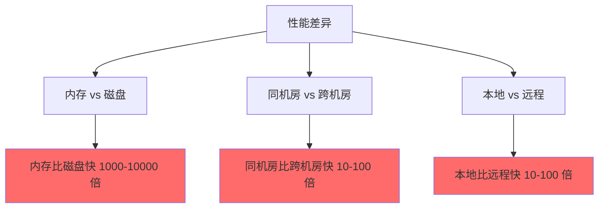
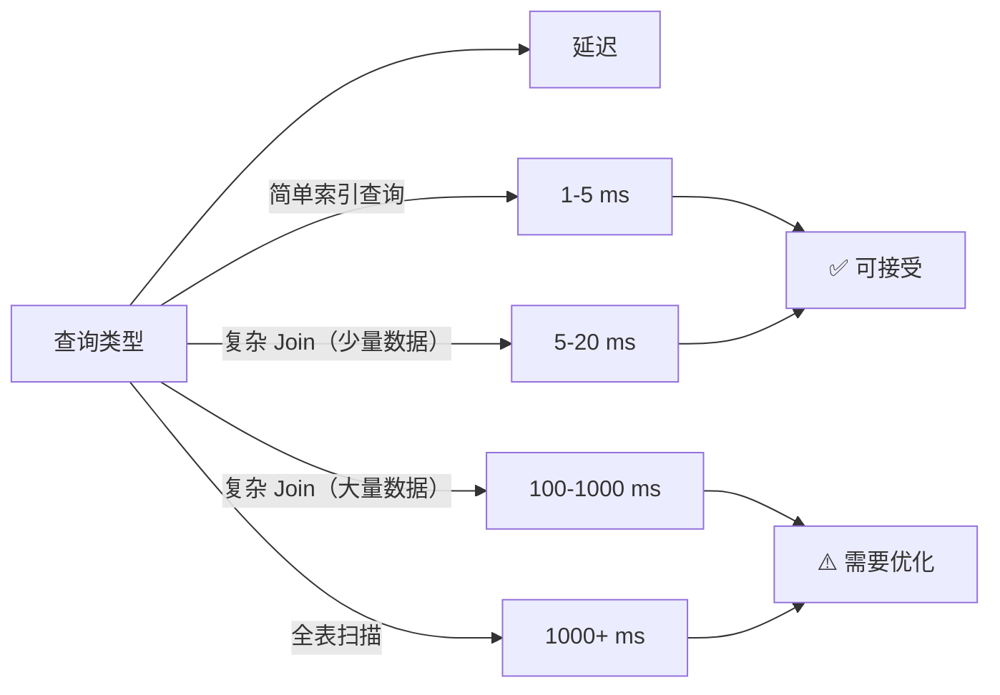
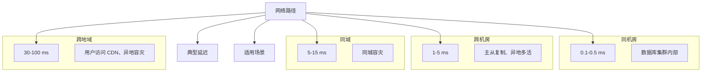
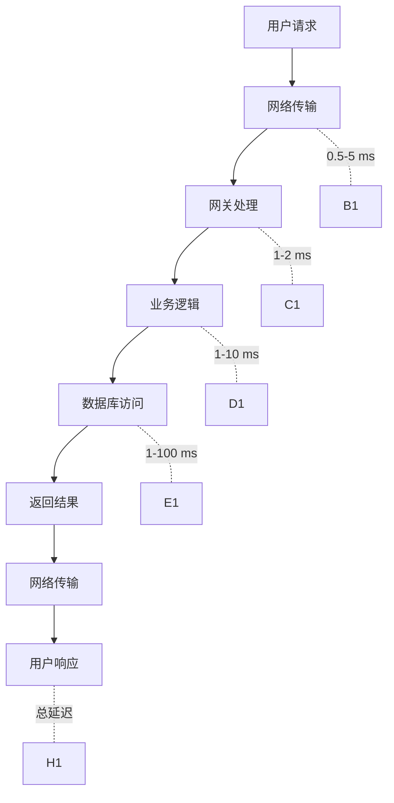
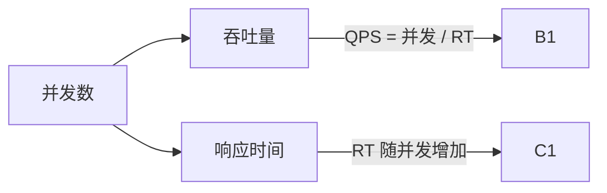
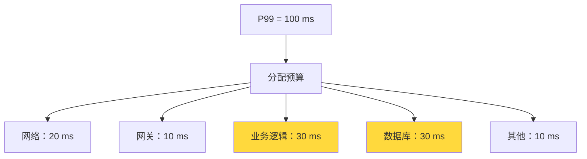

# 延迟数据速算表

**目标级别**：P6/P7

---

Jeff Dean 说过：「如果你不理解延迟，你的系统看起来会像巫术。」

每个工程师都应该记住一组关键数字，它们是系统性能分析的起点。当面试官问「这个查询需要多久」或者「瓶颈在哪里」时，你能脱口而出大概的延迟，是展现工程素养的重要方式。

## 必背延迟数字

### 计算机基础延迟（2019 年数据）

| 操作 | 延迟 | 相对速度 |
| --- | --- | --- |
| CPU 缓存 L1 命中 | 1 纳秒 | 1 秒 |
| L2 缓存命中 | 3 纳秒 | 3 秒 |
| L3 缓存命中 | 12 纳秒 | 12 秒 |
| 内存访问 | 100 纳秒 | 100 秒 |
| SSD 随机读取 | 100 微秒 | 27 小时 |
| SSD 顺序读取 1MB | 200 微秒 | 2 天 |
| 机械磁盘随机读取 | 5 毫秒 | 50 天 |
| 机械磁盘顺序读取 1MB | 20 毫秒 | 200 天 |
| **同机房网络** | **0.5 毫秒** | **5 天** |
| **跨机房网络** | **1-10 毫秒** | **10-100 天** |
| 国内跨地域网络 | 30-50 毫秒 | 300-500 天 |
| 海外跨地域网络 | 100-200 毫秒 | 1000-2000 天 |

### ⚠️ 重要结论



**记住三句话**：

1. **内存比磁盘快 1000-10000 倍**
2. **网络调用比内存访问慢 10000 倍**
3. **同机房网络比跨机房快 10-100 倍**

## 各组件延迟详解

### 数据库延迟



| 操作 | 平均延迟 | P99 延迟 | 说明 |
| --- | --- | --- | --- |
| 简单 SELECT（命中索引） | 1-5 ms | 10 ms | 最优情况 |
| 简单 UPDATE/DELETE | 2-8 ms | 15 ms | 包含磁盘写 |
| 插入（无索引） | 1-3 ms | 5 ms | 最快场景 |
| 插入（有索引） | 3-10 ms | 20 ms | 索引维护开销 |
| 分页查询（limit 100） | 5-20 ms | 50 ms | 取决于偏移量 |
| 分页查询（limit 100000） | 100-500 ms | 1000 ms | 偏移量越大越慢 |
| COUNT(*) 全表 | 100-1000 ms | 5000 ms | 必须扫全表 |
| GROUP BY 大表 | 200-2000 ms | 10000 ms | 排序开销大 |

### Redis 延迟

| 操作 | 延迟 | 说明 |
| --- | --- | --- |
| GET/SET | 0.1-0.5 ms | 内存操作，极快 |
| HSET/HGET | 0.2-0.5 ms | Hash 操作 |
| ZADD/ZRANGE | 0.5-1 ms | 有序集合 |
| LPUSH/RPOP | 0.1-0.3 ms | 列表操作 |
| 批量操作 MGET 100 个 | 1-3 ms | 减少网络开销 |
| SCAN 1000 个 key | 5-20 ms | 渐进式遍历 |
| 发布订阅 | 0.5-1 ms | 内存操作 |
| Lua 脚本 | 1-10 ms | 取决于脚本复杂度 |

### 网络延迟



| 路径 | 延迟 | 典型场景 |
| --- | --- | --- |
| 同进程（内存） | < 1 ns | 函数调用 |
| 同一台机器进程间 | 0.01-0.1 ms | Unix Socket |
| 同机房机器间 | 0.1-0.5 ms | RPC 调用 |
| 跨机房（同城） | 1-5 ms | 读写分离主从 |
| 同区域跨地域 | 20-50 ms | 国内北京→上海 |
| 跨洲际 | 100-200 ms | 国内→美国 |
| 卫星通信 | 500+ ms | 特殊场景 |

### HTTP 请求延迟

| 场景 | 延迟 | 说明 |
| --- | --- | --- |
| 同机房 HTTP 调用 | 1-5 ms | 包含网络和处理 |
| 跨机房 HTTP 调用 | 5-20 ms | 取决于距离 |
| HTTPS 握手（TLS 1.2） | 15-50 ms | 需要额外 RTT |
| HTTPS 握手（TLS 1.3） | 5-15 ms | 1-RTT 或 0-RTT |
| CDN 边缘节点 | 10-50 ms | 取决于用户位置 |

### 消息队列延迟

| 队列 | 生产延迟 | 消费延迟 | 说明 |
| --- | --- | --- | --- |
| Kafka（单分区） | 0.5-2 ms | 1-5 ms | 取决于批次大小 |
| Kafka（端到端） | 5-20 ms | 包含网络+处理 | 端到端包括生产+消费 |
| RabbitMQ | 1-5 ms | 1-5 ms | 内存+网络 |
| RocketMQ | 1-3 ms | 1-3 ms | 阿里开源 |
| Redis Stream | 0.1-0.5 ms | 0.1-0.5 ms | 最快，但功能较少 |

## 性能计算规则

### 估算系统响应时间

```
总响应时间 = CPU 处理时间 + 网络延迟 + 内存访问 + 磁盘IO
```



**示例计算**：一个典型的 HTTP 请求延迟分解

| 阶段 | 耗时 | 说明 |
| --- | --- | --- |
| DNS 解析 | 5-50 ms | 可用 DNS 缓存优化 |
| TCP 握手 | 5-15 ms | 可用连接池优化 |
| TLS 握手 | 15-50 ms | 可用 TLS 1.3 优化 |
| 发送请求 | 1-5 ms | 数据大小相关 |
| 服务器处理 | 5-50 ms | 业务逻辑 |
| 数据库查询 | 5-50 ms | 索引情况 |
| 返回响应 | 1-5 ms | 数据大小相关 |
| **总计** | **40-220 ms** | 取决于各环节 |

### 并发与响应时间关系



| 并发数 | 响应时间 | 吞吐量 | 系统状态 |
| --- | --- | --- | --- |
| 1 | 10 ms | 100 QPS | 轻松 |
| 10 | 10 ms | 1000 QPS | 正常 |
| 50 | 15 ms | 3300 QPS | 开始紧张 |
| 100 | 30 ms | 3300 QPS | 接近瓶颈 |
| 200 | 100 ms | 2000 QPS | **过载** |

## 常见场景延迟预算

### P99 延迟要求与分配



| 服务类型 | P99 预算 | 示例场景 |
| --- | --- | --- |
| 高性能要求 | 50-100 ms | 搜索、推荐 |
| 标准在线服务 | 100-300 ms | 普通 API |
| 后台任务 | 500-2000 ms | 报表生成 |
| 异步任务 | 不要求 | 消息处理 |

### 延迟优化收益表

| 优化手段 | 延迟降低 | 适用场景 | 代价 |
| --- | --- | --- | --- |
| 添加索引 | 50-90% | 查询慢 | 写入变慢 |
| Redis 缓存 | 80-95% | 热点数据 | 一致性复杂度 |
| 读写分离 | 50-70% | 读多写少 | 数据延迟 |
| 异步处理 | 70-90% | 非核心链路 | 架构复杂度 |
| 批量操作 | 50-80% | 大量小请求 | 延迟增加单个请求 |
| 连接池 | 30-50% | 频繁连接创建 | 连接管理复杂度 |

## 面试高频追问

### 追问一：为什么 Redis 比 MySQL 快这么多？

```
「Redis 是纯内存操作，延迟在 0.1-0.5 ms 级别；
MySQL 需要磁盘 IO，单次查询在 1-100 ms 级别。
差了 100-10000 倍。」
```

### 追问二：为什么跨机房延迟比同机房高这么多？

```
「跨机房需要经过交换机、路由器等网络设备，
还要考虑物理距离带来的信号传播延迟。
同机房可能在同一个机架，网络设备少，距离近。」
```

### 追问三：如何降低系统延迟？

```
「根据木桶效应，先找出瓶颈在哪里：
1. 如果是网络延迟，可以考虑就近接入、连接池
2. 如果是数据库延迟，可以加索引、加缓存、读写分离
3. 如果是业务逻辑，可以考虑异步处理、并行计算
4. 如果是 IO 阻塞，可以考虑预加载、批量操作」
```

## 快速估算工具

### 估算一次数据库查询的延迟

```
延迟 = 网络延迟（0.5ms） + 处理延迟（0.5ms） + 磁盘 IO（1-10ms）
     ≈ 2-11 ms（取决于是否命中索引）
```

### 估算一次 Redis 缓存查询的延迟

```
延迟 = 网络延迟（0.5ms） + 处理延迟（0.1ms）
     ≈ 0.6 ms
```

### 估算一次远程调用的延迟

```
延迟 = 网络往返（2 × 距离延迟） + 服务器处理 + 序列化/反序列化
     ≈ 同机房：2-5 ms
     ≈ 跨机房：10-50 ms
```

## ⚠️ 面试避坑指南

### 陷阱一：说错数量级

> 面试官问：「一次数据库查询大概多久？」
> 错误回答：「1 秒左右吧」
> 正确回答：「普通的索引查询大概 1-5 ms，如果是分页大偏移量可能 100 ms 以上」

### 陷阱二：混淆不同场景

> 面试官问：「Kafka 延迟多少？」
> 错误回答：「Kafka 很快，1 ms」
> 正确回答：「Kafka 单条消息生产延迟 0.5-2 ms，端到端延迟取决于消费者的消费速度」

### 陷阱三：忘记考虑 P99

> 面试官问：「你的系统响应时间是多少？」
> 错误回答：「10 ms 吧，挺快的」
> 正确回答：「P50 是 10 ms，但 P99 可能到 100 ms，因为有 GC 和锁竞争」

---

> 💡 **加分回答**：在面试中主动说出 P50/P90/P99 的概念，并解释为什么只说平均值不够，能展示你对性能分析的深度理解。
