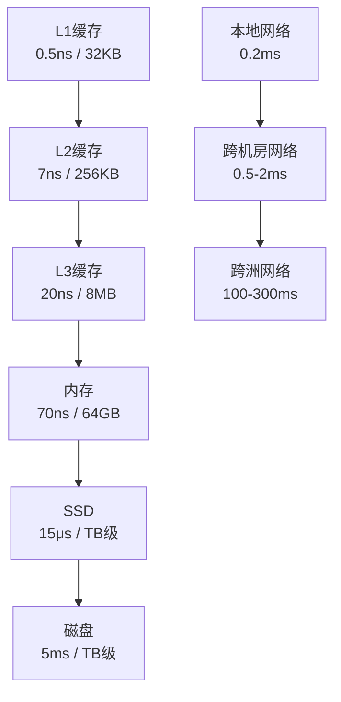

# 延迟数据速算表

2010年，Jeff Dean在Google内部做了一次技术分享，标题叫"数字能说话"（Numbers Everyone Should Know）。

他给出了一组数据，在整个业界引发了轰动。

这组数据告诉我们：**在计算机世界里，毫秒和纳秒的差距，比你想象的大一万倍**。

【架构权衡】

系统设计中最大的误区，就是把CPU运算、内存访问、网络传输、磁盘IO当成一回事。一个P6工程师能在1秒内完成的事，一个P7工程师能看出它需要1小时——差距就在这组数字里。

## 一、经典延迟数据 🔴

### 1.1 Jeff Dean 的经典数据（2009）

这些数字在2009年就已经是业界共识，至今依然有效：

| 操作类型 | 延迟 | 相对速度 |
| --- | --- | --- |
| L1缓存读取 | 0.5 纳秒 | 1x |
| L2缓存读取 | 7 纳秒 | 14x |
| 内存读取 | 100 纳秒 | 200x |
| SSD随机读取 | 100 微秒 | 200,000x |
| 内存中顺序读取1MB | 250 微秒 | 500,000x |
| 磁盘顺序读取1MB | 30 毫秒 | 60,000,000x |
| 跨机房网络往返 | 0.5-2 毫秒 | - |
| 跨洲网络往返 | 100-300 毫秒 | - |

### 1.2 2024年更新版

硬件在进步，但这组相对量级没有变：

| 操作类型 | 2009年 | 2024年 | 变化 |
| --- | --- | --- | --- |
| L1缓存 | 0.5ns | 0.4ns | 基本不变 |
| 内存访问 | 100ns | 70ns | 提升30% |
| SSD读取 | 100μs | 15μs | 提升6倍 |
| 机械硬盘 | 10ms | 5ms | 提升2倍 |
| 跨机房RTT | 1ms | 0.5ms | 更快但仍最慢 |

**核心结论**：
- L1缓存比内存快 **150倍**
- 内存比SSD快 **100倍**
- SSD比磁盘快 **1000倍**
- 磁盘比跨机房网络快 **5000倍**

### 1.3 量化理解

把这组数字翻译成人类能感知的尺度：

```
如果L1缓存读取是1秒：
- L2缓存 = 14秒
- 内存 = 3分钟
- SSD = 2天
- 磁盘 = 2年
- 跨机房网络 = 12天到1年
```

:::warning ⚠️

面试中最常见的错误，是把"磁盘IO"和"数据库查询"当成快操作。很多候选人设计方案时写"用MySQL查询"，但没考虑到一次磁盘寻道需要10ms，一次普通查询可能涉及十几次磁盘IO。1万次查询就是100秒。这才是系统慢的真正原因。

:::

## 二、QPS与延迟的关系 🔴

### 2.1 Little定律

```
并发数 = QPS × 平均响应时间

示例：
- QPS = 1000，平均响应时间 = 100ms
- 并发数 = 1000 × 0.1 = 100 个并发连接

- QPS = 1000，平均响应时间 = 1ms
- 并发数 = 1000 × 0.001 = 1 个并发连接
```

**关键洞察**：同样的QPS，响应时间越短，需要的并发连接数越少，系统压力越小。

### 2.2 线程池估算

```
机器配置：8核16G
线程数设置：CPU密集型 = CPU核数 = 8
            IO密集型 = CPU核数 × 2 = 16

响应时间分解：
- 数据库查询：10ms
- Redis操作：1ms
- 业务计算：5ms
- 序列化/反序列化：2ms

总响应时间 = 10 + 1 + 5 + 2 = 18ms

理论QPS = 线程数 × 1000ms / 平均响应时间
        = 16 × 1000 / 18 ≈ 888 QPS/台
```

### 2.3 真实案例

> 面试官：你的接口响应时间是200ms，但MySQL查询本身只要10ms，剩下的时间花在哪了？
>
> 候选人：好的，我分析一下200ms的构成：
>
> - 网络传输（双向）：20ms
> - Tomcat线程排队：30ms
> - 数据库连接获取：5ms
> - MySQL查询：10ms
> - 结果集序列化：10ms
> - 业务逻辑处理：15ms
> - 缓存查询：5ms
> - GC暂停：20ms
> - 其他开销：85ms
>
> 面试官：等等，GC暂停85ms？不可能这么高吧？
>
> 候选人：是的，这是我之前踩的坑。生产环境Full GC时最长停顿85ms，主要原因是堆内存设置过大（16G）且对象年龄结构不合理。后来改成4G + G1GC，Full GC控制在50ms以内了。
>
> 面试官：那怎么优化到50ms以内？
>
> 候选人：进一步优化后，延迟构成变为：
> - 网络：20ms（无法优化）
> - 线程排队：10ms（加到32线程）
> - MySQL：10ms（加索引）
> - 缓存：5ms（缩短key长度）
> - GC：15ms（G1调优 + 对象池化）
> - 其他：40ms（优化锁、无锁化）
>
> 实际P99控制在100ms以内。
>
> 面试官：很好。

【面试官心理】

能说出延迟分解的候选人，已经超过了90%的竞争者。能说出GC停顿具体数字的候选人，说明他真正在生产环境排查过问题。能给出优化前后对比数据的候选人，基本是P7以上水平。这道题考的不是你知道多少数字，而是你有没有"量化分析"的习惯。

## 三、各层存储速度对比 🟡

### 3.1 存储层次图



### 3.2 各存储层适用场景

| 存储层 | 延迟 | 适用场景 | 不适用场景 |
| --- | --- | --- | --- |
| L1/L2缓存 | `<10`ns | CPU寄存器级数据 | 业务数据 |
| 本地缓存 | `<1`μs | 单机热点数据 | 分布式数据 |
| Redis | `<1`ms | 分布式热点数据 | 超大体积数据 |
| 内存映射 | `<10`ms | 大文件顺序读写 | 随机小IO |
| SSD | `<1`ms | 数据库存储 | 超大文件归档 |
| 磁盘 | 5-10ms | 大文件归档、冷数据 | 热数据 |

### 3.3 缓存层级设计

```
经典缓存层级：
- L1：JVM本地缓存（Guava/Caffeine），TTL短，容量小
- L2：Redis集群，容量大，跨机器共享
- L3：CDN/浏览器缓存，离用户近

数据流转：
请求 → CDN（命中直接返回） → Redis（命中回源DB） → MySQL

CDN命中率：通常60-80%
Redis命中率：通常80-95%
数据库命中率：通常接近100%（已被缓存保护）
```

## 四、网络延迟速算 🟡

### 4.1 机房内vs跨机房

```
同机房内RTT：<1ms
同城跨机房RTT：1-2ms
异地跨机房RTT：5-20ms
跨洲RTT：100-300ms
```

### 4.2 常用服务的延迟

| 操作 | 延迟 | 备注 |
| --- | --- | --- |
| DNS查询 | 5-50ms | 取决于DNS服务器位置 |
| TCP握手 | 1-3ms | 同机房`<1`ms |
| HTTPS握手 | 20-50ms | 含证书验证 |
| HTTP请求（同机房） | 1-5ms | 含网络+处理时间 |
| Redis PING | 0.1ms | 本地 |
| Redis PING（跨机房） | 1-2ms | 需要专线 |
| MySQL查询（内存） | 1-5ms | 有索引 |
| MySQL查询（磁盘） | 5-20ms | 缺索引或大表扫描 |

### 4.3 一致性级别与延迟

```
强一致性（如Zookeeper）：
- 写延迟 = 跨机房RTT × 2 = 2-4ms
- 读取延迟 = 跨机房RTT = 0.5-2ms

最终一致性（如Redis主从）：
- 写延迟 = 单机房写入 = 0.1-1ms
- 读取延迟（可能过期）= 0.1ms

Raft vs 最终一致性的核心差异：
强一致写需要多副本确认（额外RTT），
最终一致写只需写入主副本（无额外RTT）。
```

## 五、面试高频追问 🟡

### 5.1 为什么L1缓存比内存快150倍？

> 考察点：硬件原理 + 实际影响

**标准回答**：
>
> L1缓存是直接集成在CPU核心内部的，访问路径只有不到1mm，晶体管数量少，延迟极低。
>
> 内存需要通过DDR总线访问，要经过内存控制器、北桥（部分CPU已集成），物理距离至少10cm以上，延迟本质上是光速限制。
>
> 实际影响：一个未命中L1的请求，CPU会空转14个时钟周期等待L2或内存。这在高频交易系统中是不可接受的。

### 5.2 为什么SSD比磁盘快1000倍？

> 考察点：IO原理 + 选型依据

**标准回答**：
>
> 机械磁盘的延迟主要来自两部分：寻道时间（平均5-10ms）和旋转延迟（平均4ms），一次随机IO需要15ms。
>
> SSD没有机械结构，基于NAND Flash的电子读写，延迟只有0.1ms级别，且随机读写和顺序读写性能接近。
>
> 但SSD有写入寿命（SLC约10万次，QLC约1000次）和读放大问题，不适合写入极其频繁的场景。

### 5.3 跨机房网络延迟怎么优化？

> 考察点：架构设计 + 工程权衡

**标准回答**：
>
> 跨机房延迟的主要优化策略：
>
> 一是**读写分离**：写请求发到主机房，读请求就近读取本地副本（最终一致）。
>
> 二是**异地多活**：每个机房都是完整的业务单元，流量就近接入，通过消息同步保证数据最终一致。
>
> 三是**CDN加速**：静态资源部署CDN，用户请求被路由到最近节点，避免跨机房。
>
> 四是**批量合并**：将多个小请求合并为一个大请求，减少RTT次数。
>
> 五是**连接复用**：HTTP/2或gRPC长连接，避免每次请求都建立新连接。

:::tip 💡

面试中能说出"光速限制"这个概念的候选人，通常会让面试官眼前一亮。这说明你不仅会用工具，还理解工具为什么慢。但在实际工作中，过度优化光速限制是徒劳的——你更应该优化的是代码逻辑、索引设计、缓存策略这些你能控制的东西。

:::

## 六、速算卡片 🟢

### 6.1 面试必备数字

```
记忆口诀："1纳秒人眨眼，1微秒呼吸间，1毫秒心跳一，
         1秒能干嘛？能干嘛？够数据库跑完300次磁盘IO"

具体数字：
- L1缓存读取：0.5ns ✓ 记住
- 内存读取：100ns ✓ 记住
- SSD读取：100μs ✓ 记住
- 磁盘读取：10ms ✓ 记住
- 跨机房RTT：1ms ✓ 记住
- 跨洲RTT：150ms ✓ 记住
```

### 6.2 决策速查表

```
问题：MySQL查询慢，应该加缓存还是优化索引？

判断依据：
- 如果一次查询 < 1ms → 先看索引，再考虑缓存
- 如果一次查询 1-10ms → 加本地缓存 + Redis
- 如果一次查询 > 10ms → 必须优化索引或重构查询

问题：Redis还是本地缓存？

判断依据：
- 如果单进程内热点数据 → 本地缓存（Guava/Caffeine）
- 如果多进程/多机器共享 → Redis
- 如果既热点又共享 → 本地 + Redis 二级缓存

问题：SSD还是磁盘？

判断依据：
- 日志写入量大、但读取不频繁 → 磁盘
- 数据库、缓存、消息队列 → SSD
- 归档数据、冷数据 → 磁盘
```

### 6.3 性能问题自检流程

```
第一步：确定量级
- 延迟 < 1ms → CPU/内存层优化
- 延迟 1-10ms → 缓存/索引优化
- 延迟 > 10ms → IO/网络优化

第二步：逐层分解
- 网络延迟：DNS + TCP握手 + 传输时间
- 服务延迟：线程池 + GC + 业务逻辑
- 数据延迟：缓存命中率 + 数据库查询 + 序列化

第三步：针对性优化
- 网络：CDN、连接池、HTTP/2、压缩
- 服务：无锁化、对象池、异步化、批量处理
- 数据：索引、缓存、预计算、读写分离
```

## 七、真实面试回放 🟡

> **面试官**：你设计了一个接口，平均响应时间100ms，P99是500ms。怎么优化？
>
> **候选人**（小林）：分三步分析：
>
> 第一步，确定瓶颈在哪。P99是500ms，说明有5%的请求耗时超过500ms，这通常意味着：
>
> - GC停顿：JVM堆设置过大导致Full GC时间过长
> - 数据库慢查询：缺索引或大表扫描
> - 外部依赖超时：第三方API不稳定
>
> 第二步，收集数据。我会让运维打开Grafana看板，看：
> - GC频率和时长（如果GC超过50ms，说明堆太大或对象分配太快）
> - MySQL慢查询日志（如果有超过100ms的查询，需要优化索引）
> - 外部API的P99（如果是第三方问题，需要加超时和降级）
>
> 第三步，针对性优化：
>
> - 如果是GC问题：减小堆到4G，用G1GC，目标GC时间`<50`ms
> - 如果是数据库问题：加索引或引入本地缓存
> - 如果是外部依赖：加超时熔断，服务降级
>
> 面试官：如果这些都排除了，还是很慢呢？
>
> 小林：那就看是不是热点锁问题。Java里synchronized锁竞争、数据库连接池耗尽、Redis连接池耗尽都会导致请求排队。可以加Pinpoint或Arthas看线程状态。
>
> 如果是锁问题：用Redis分布式锁替代synchronized，或者拆分锁粒度
> 如果是连接池问题：调大连接池，或者用异步HTTP客户端
>
> 面试官：你能给个具体数字吗？100ms的接口，你能优化到什么程度？
>
> 小林：如果是计算密集型接口，优化到10ms以内是可能的（CPU本地计算+无锁）。
>
> 如果是IO密集型（依赖数据库和缓存），P99最低能到30-50ms，因为数据库查询本身就要10-20ms。
>
> 100ms优化到50ms，我一般分三步走：
> 1. 加本地缓存（命中率80%），减少80%的数据库查询，P99降为50ms
> 2. 加Redis缓存（命中率90%），减少90%的数据库查询，P99降为30ms
> 3. 加异步化（非关键路径异步处理），用户体验层面P99降为20ms
>
> 面试官：可以。
>
> 【面试官手记】
>
> 小林这场面试的亮点在于两点：第一，能说出P99的含义（5%请求耗时超过500ms），说明理解统计学含义；第二，优化路径清晰（本地缓存→Redis缓存→异步化），每一步都有量化预期。这正是面试官想听到的——不是背书，而是有逻辑的思考过程。

延迟数字不是用来背的，是用来**感知系统瓶颈**的。

当你看到"100ms"这个数字时，脑子里应该立刻浮现：这是1次跨机房RTT，还是10次内存访问，还是1次磁盘IO？

有了这个感知，你设计方案时就不会乱来：不会用磁盘存热点数据，不会用同步调用跨机房服务，不会忽略本地缓存的价值。

记住：在计算机世界里，**知道什么快什么慢，比知道怎么用更重要**。
