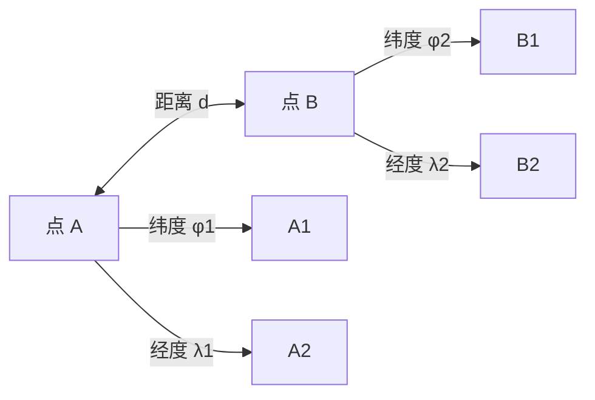
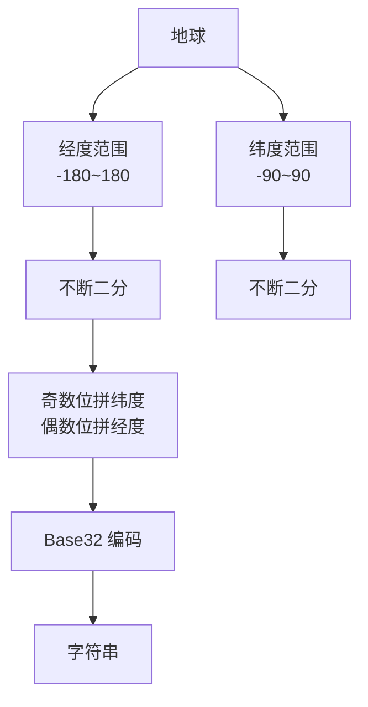
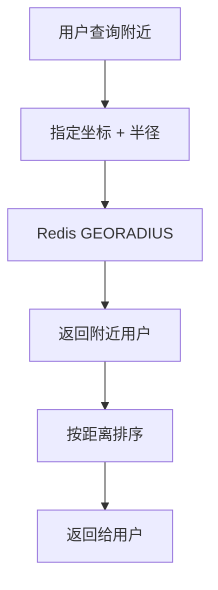
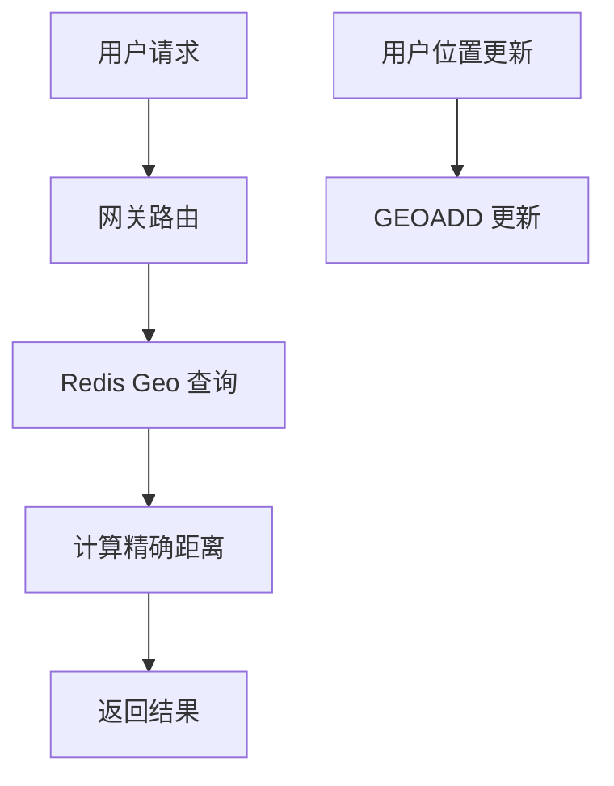
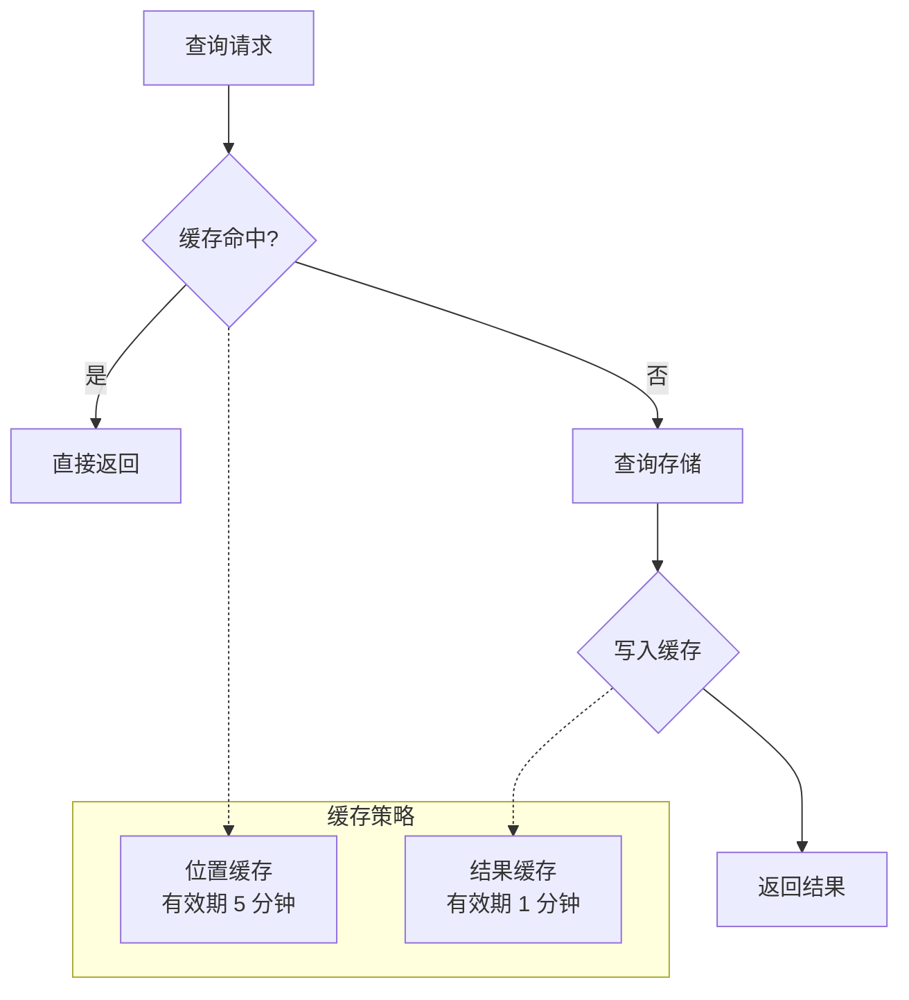

# 附近的人（LBS）系统

**目标级别**：P6/P7

---

面试官问：「设计一个附近的人功能」——这道题考察的是你对地理位置计算、空间索引、高并发查询的理解。

很多人觉得「附近的人」不就是查询「距离 `<` 5km 的用户」吗？但面试官会追问到 GeoHash、空间索引、性能优化等深层问题，让你当场露馅。

## 面试题速览

| 题号 | 问题 | 频率 | 难度 |
| --- | --- | --- | --- |
| 01 | 附近的人的核心问题是什么？ | 🔴 高频 | P5 |
| 02 | 如何计算两个坐标的距离？ | 🔴 高频 | P6 |
| 03 | GeoHash 算法是怎么工作的？ | 🔴 高频 | P6 |
| 04 | Redis 的 Geo 命令怎么用？ | 🟡 中频 | P6 |
| 05 | 如何应对高并发查询？ | 🟡 中频 | P6 |

## 一、需求澄清

### 功能场景

| 场景 | 特征 | 典型产品 |
| --- | --- | --- |
| **附近的人** | 查询附近 N 个用户 | 微信、陌陌 |
| **附近的车** | 查询附近可用车辆 | 滴滴、美团打车 |
| **附近的商家** | 查询附近商家列表 | 美团、大众点评 |
| **配送范围** | 查询是否在配送范围内 | 外卖平台 |

### 关键约束

| 问题 | 为什么重要 | 候选选项 |
| --- | --- | --- |
| **范围多大？** | 决定索引策略 | 1km / 5km / 10km |
| **返回数量？** | 影响排序和分页 | 20 / 50 / 100 |
| **实时性要求？** | 影响更新策略 | 实时 / 准实时 |
| **精度要求？** | 影响存储和算法 | 100m / 500m / 1km |

## 二、地理位置基础

### 坐标系统

地球坐标使用经纬度表示：

| 维度 | 范围 | 说明 |
| --- | --- | --- |
| **纬度** | -90° ~ +90° | 北纬为正，南纬为负 |
| **经度** | -180° ~ +180° | 东经为正，西经为负 |

**常见坐标系统**：

| 系统 | 说明 | 中国偏移 |
| --- | --- | --- |
| **WGS84** | GPS 标准坐标 | 标准 |
| **GCJ-02** | 国测局坐标（火星坐标） | 有偏移 |
| **BD-09** | 百度坐标 | 在 GCJ-02 基础上再偏移 |

⚠️ **面试官挖坑点**：在中国做 LBS，必须处理坐标偏移。WGS84 直接定位会偏移 300-500 米。

### 距离计算

**球面距离公式（Harvesine）**：



```java
public class GeoUtils {
    
    private static final double EARTH_RADIUS = 6371.0; // 地球半径 km
    
    /**
     * 计算两点之间的距离（单位：米）
     */
    public static double distance(double lat1, double lon1, double lat2, double lon2) {
        double dLat = Math.toRadians(lat2 - lat1);
        double dLon = Math.toRadians(lon2 - lon1);
        
        double a = Math.sin(dLat / 2) * Math.sin(dLat / 2) 
                 + Math.cos(Math.toRadians(lat1)) * Math.cos(Math.toRadians(lat2)) 
                 * Math.sin(dLon / 2) * Math.sin(dLon / 2);
        
        double c = 2 * Math.atan2(Math.sqrt(a), Math.sqrt(1 - a));
        
        return EARTH_RADIUS * c * 1000; // 转为米
    }
}
```

**⚠️ 常见陷阱**：用平面距离公式算经纬度！经纬度不是平面坐标系，直接用勾股定理误差极大。

## 三、GeoHash 算法

### 核心思想

GeoHash 将二维的经纬度编码成一维的字符串，相似前缀的坐标在空间上也相近。



### GeoHash 编码示例

以「故宫」为例（约 39.916°N, 116.397°E）：

| 步骤 | 范围 | 位 | 值 |
| --- | --- | --- | --- |
| 1 | 纬度 0-90 | 1 | 1 |
| 2 | 经度 0-180 | 1 | 1 |
| 3 | 纬度 45-90 | 0 | 10 |
| 4 | 经度 90-180 | 0 | 100 |
| ... | ... | ... | ... |
| 结果 | 12 位二进制 | 0010 0110 1101 | `wx4g0e` |

### 不同精度

| GeoHash 长度 | 格子大小 | 适用场景 |
| --- | --- | --- |
| 1 位 | `~5000km` | 大洲级别 |
| 3 位 | `~625km` | 国家级别 |
| 5 位 | `~5km` | 城市级别 |
| 6 位 | `~1.2km` | 城区级别 |
| 8 位 | `~153m` | 附近的人 |

### Java 实现

```java
public class GeoHash {
    
    private static final String BASE32 = "0123456789bcdefghjkmnpqrstuvwxyz";
    
    public static String encode(double lat, double lon, int precision) {
        double[] latRange = {-90.0, 90.0};
        double[] lonRange = {-180.0, 180.0};
        
        StringBuilder geohash = new StringBuilder();
        boolean isEven = true;
        int bit = 0;
        int ch = 0;
        
        while (geohash.length() < precision) {
            double mid;
            if (isEven) {
                mid = (lonRange[0] + lonRange[1]) / 2;
                if (lon >= mid) {
                    ch |= (1 << (4 - bit));
                    lonRange[0] = mid;
                } else {
                    lonRange[1] = mid;
                }
            } else {
                mid = (latRange[0] + latRange[1]) / 2;
                if (lat >= mid) {
                    ch |= (1 << (4 - bit));
                    latRange[0] = mid;
                } else {
                    latRange[1] = mid;
                }
            }
            
            isEven = !isEven;
            bit++;
            
            if (bit == 5) {
                geohash.append(BASE32.charAt(ch));
                bit = 0;
                ch = 0;
            }
        }
        
        return geohash.toString();
    }
}
```

## 四、Redis Geo 命令

Redis 5.0+ 内置了 Geo 功能，支持存储和查询地理位置。

### 基本命令

```bash
# 添加用户位置
GEOADD user:location 116.397 39.916 "user_001"   # 用户 001，故宫附近
GEOADD user:location 116.398 39.915 "user_002"   # 用户 002，故宫附近

# 查询附近的人（附近 1km 的用户）
GEORADIUS user:location 116.397 39.916 1 km WITHDIST WITHCOORD ASC COUNT 20

# 查询两个用户之间的距离
GEODIST user:location user_001 user_002 km

# 获取用户坐标
GEOPOS user:location user_001
```

### 查询流程



### ⚠️ 常见陷阱

**陷阱一：边界附近的用户可能被漏掉**

> 面试官：「用户在格子边缘，附近的人能查到吗？」
>
> 错误回答：「能查到，GeoHash 很准」
>
> 正确回答：不一定。GeoHash 有边界效应，格子边缘的用户可能属于相邻格子。解决方案：查询时扩大一圈格子（8 个邻居），再做过滤。

**陷阱二：GeoHash 不能做精确距离排序**

> 面试官：「GeoHash 返回的结果是按距离排序的吗？」
>
> 错误回答：「是的，按 GeoHash 前缀排序」
>
> 正确回答：GeoHash 只保证前缀相同的位置相近，不能按精确距离排序。需要在返回结果后再用球面距离公式计算距离并排序。

## 五、查询优化

### 方案一：Redis Geo（推荐）

适合数据量 `>` 1 亿、查询 QPS `>` 10 万。



**优点**：性能高、支持距离排序、内置 Geo 命令
**缺点**：数据量受限于 Redis 内存

### 方案二：MySQL + 空间索引

适合数据量 `<` 1 亿、数据需要持久化的场景。

```sql
-- MySQL 空间索引
CREATE TABLE user_location (
    id BIGINT PRIMARY KEY,
    user_id BIGINT NOT NULL,
    location POINT NOT NULL SRID 4326,
    geohash VARCHAR(12),
    updated_at DATETIME,
    SPATIAL INDEX idx_location (location)
);

-- 查询附近的人（使用空间索引）
SELECT 
    user_id,
    ST_Distance(location, ST_GeomFromText('POINT(116.397 39.916)', 4326)) as distance
FROM user_location
WHERE ST_Contains(
    ST_Buffer(ST_GeomFromText('POINT(116.397 39.916)', 4326), 0.01),
    location
)
ORDER BY distance
LIMIT 20;
```

### 方案三：MongoDB

适合文档型数据、需要存储用户画像的场景。

```javascript
// MongoDB 2dsphere 索引
db.users.createIndex({ "location": "2dsphere" })

// 查询附近的人
db.users.find({
    location: {
        $nearSphere: {
            $geometry: {
                type: "Point",
                coordinates: [116.397, 39.916]
            },
            $maxDistance: 1000  // 1000 米
        }
    }
}).limit(20)
```

## 六、性能优化

### 缓存策略



### 热点用户处理

| 场景 | 方案 | 说明 |
| --- | --- | --- |
| **明星账号** | 专属缓存 | 热点用户位置单独缓存 |
| **批量查询** | Pipeline | 批量查询减少网络开销 |
| **用户黑名单** | 过滤掉 | 不返回被拉黑的用户 |

### 异步更新

```java
public class LocationService {
    
    // 异步更新，避免阻塞主流程
    @Async
    public void updateLocationAsync(Long userId, double lat, double lon) {
        // 更新 Redis
        redisTemplate.opsForGeo().add("user:location", 
            new Point(lon, lat), "user_" + userId);
        
        // 异步写入数据库
        locationDAO.update(userId, lat, lon, new Date());
    }
}
```

## 七、数据模型

### 用户位置表

```sql
CREATE TABLE user_location (
    id BIGINT PRIMARY KEY AUTO_INCREMENT,
    user_id BIGINT NOT NULL UNIQUE,
    latitude DECIMAL(10, 6) NOT NULL COMMENT '纬度',
    longitude DECIMAL(10, 6) NOT NULL COMMENT '经度',
    geohash_prefix VARCHAR(8) COMMENT 'GeoHash 前缀',
    updated_at DATETIME DEFAULT CURRENT_TIMESTAMP ON UPDATE CURRENT_TIMESTAMP,
    INDEX idx_geohash (geohash_prefix),
    INDEX idx_updated_at (updated_at)
) ENGINE=InnoDB;
```

## 八、面试高频追问

### 第一层：GeoHash 原理

> **问题**：GeoHash 是怎么把经纬度变成字符串的？
>
> **参考答案**：
> GeoHash 用递归二分法将经纬度范围不断对半分，每次取其中一半。奇数位放经度，偶数位放纬度，凑够 5 位转成一个 Base32 字符。这样生成的字符串，前缀相同的点距离更近。比如「wx4g0e」和「wx4g0f」在空间上很接近，但前 4 位「wx4g」相同的两个点可能在 10km 范围内。

### 第二层：边界效应

> **问题**：GeoHash 有什么缺陷？怎么解决？
>
> **参考答案**：
> 最大的问题是边界效应。假设查询范围是 1km，但用户所在格子大小可能是 1.2km，格子边缘的用户可能漏掉。解决方案是：查询时不仅查目标格子，还要查周围 8 个邻居格子，然后过滤掉超出范围的。这会增加一些计算量，但能保证不漏。

### 第三层：Redis Geo vs MySQL

> **问题**：附近的人功能，用 Redis 好还是 MySQL 好？
>
> **参考答案**：
> 看规模。如果 QPS `>` 10 万、数据量 `>` 1 亿，用 Redis Geo 性能更好。如果数据量不大、查询复杂度高、需要关联其他字段，MySQL 空间索引更灵活。也可以两者结合：Redis 做实时查询，MySQL 做持久化和复杂分析。

## 九、综合对比

| 维度 | Redis Geo | MySQL 空间索引 | MongoDB |
| --- | --- | --- | --- |
| **QPS** | `>` 10 万 | `<` 1 万 | 1-5 万 |
| **数据量** | 受内存限制 | TB 级 | TB 级 |
| **距离排序** | 原生支持 | 支持但慢 | 支持 |
| **开发成本** | 低 | 中 | 低 |
| **数据持久化** | RDB/AOF | 支持 | 支持 |
| **适用规模** | 大规模实时查询 | 中规模 | 中大规模 |

## 十、扩展思考

### 问题一：用户位置隐私

> 用户位置是敏感信息，怎么保护？
>
> **解决方案**：
> - 精度模糊化：只保留 3 位 GeoHash（约 5km 精度）
> - 频率限制：限制同区域查询次数
> - 可见性设置：用户可设置谁能查看位置
> - 数据加密：位置数据加密存储

### 问题二：实时性 vs 性能

> 频繁更新位置导致性能下降。
>
> **解决方案**：
> - 批量更新：攒够 N 条再更新
> - 异步队列：更新请求入队，异步处理
> - 空间换时间：预计算热点区域的索引

---

> 💡 **面试官视角**：LBS 系统考察的是你对空间索引和距离计算的理解。GeoHash 是核心知识点，要能说出编码原理、边界效应、解决方案。还要理解为什么不能用平面距离公式计算经纬度。
