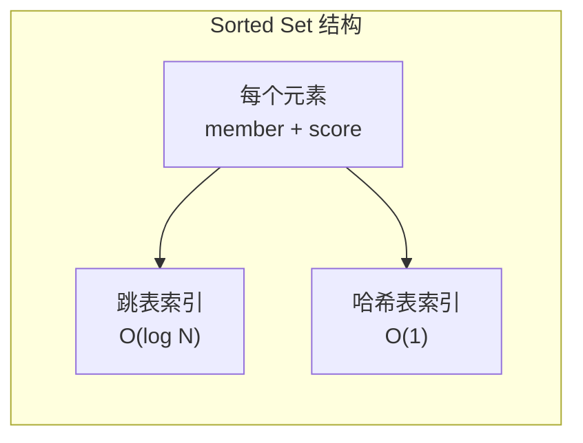
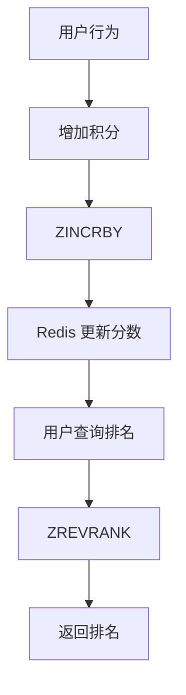
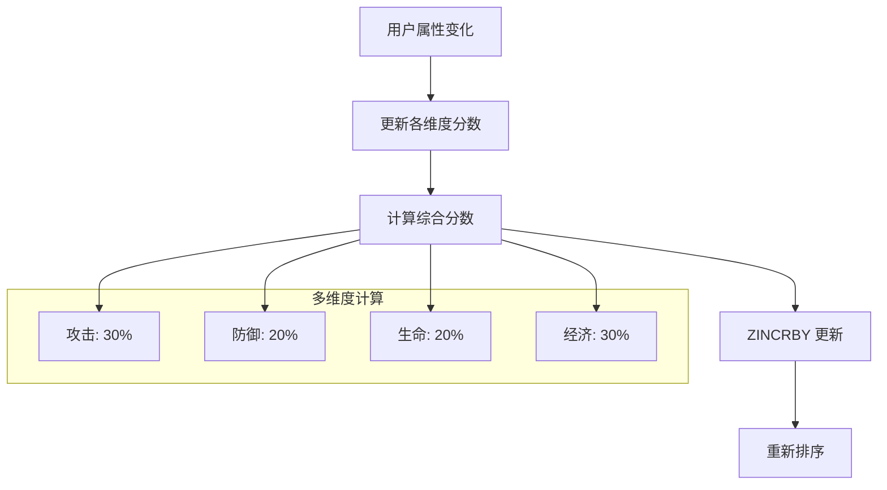
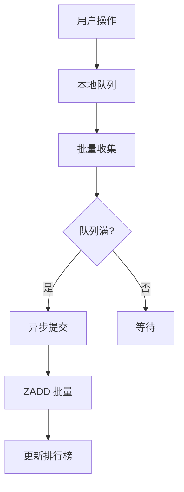
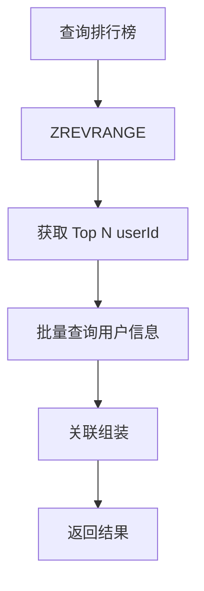

# 排行榜系统设计

**目标级别**：P6/P7

---

面试官问：「设计一个游戏/主播/商品排行榜」——这道题考察的是你对有序集合、实时排名、写入性能的理解。

很多人觉得排行榜不就是「排序 + 显示」吗？但面试官会追问到 Redis Sorted Set、实时更新、分页查询等深层问题。

## 面试题速览

| 题号 | 问题 | 频率 | 难度 |
| --- | --- | --- | --- |
| 01 | 排行榜的核心数据结构是什么？ | 🔴 高频 | P5 |
| 02 | Redis Sorted Set 怎么实现排名？ | 🔴 高频 | P6 |
| 03 | 如何处理高并发写入？ | 🟡 中频 | P6 |
| 04 | 如何优化分页查询？ | 🟡 中频 | P6 |
| 05 | 排行榜有哪些业务场景？ | 🟡 中频 | P6 |

## 一、需求澄清

### 排行榜类型

| 类型 | 特征 | 典型场景 |
| --- | --- | --- |
| **积分榜** | 单维度分数排序 | 游戏积分榜 |
| **战力榜** | 多维度数据综合 | 游戏战力榜 |
| **热度榜** | 实时变化，需去重 | 微博热搜 |
| **销售榜** | 需要定时汇总 | 商品销量榜 |
| **粉丝榜** | 单调递增，偶尔清零 | 主播粉丝榜 |

### 关键约束

| 问题 | 为什么重要 | 候选选项 |
| --- | --- | --- |
| **排名维度** | 决定数据模型 | 单维度 / 多维度 |
| **实时性** | 影响更新策略 | 实时 / 准实时 / 定时 |
| **历史排名** | 影响存储设计 | 需要 / 不需要 |
| **榜单数量** | 影响资源消耗 | 1 个 / N 个 |

## 二、核心数据结构

### Redis Sorted Set

Sorted Set 是 Redis 专门为排行榜设计的数据结构。



| 操作 | 时间复杂度 | 说明 |
| --- | --- | --- |
| ZADD | O(log N) | 添加/更新分数 |
| ZINCRBY | O(log N) | 增量更新 |
| ZRANK | O(log N) | 获取排名 |
| ZREVRANK | O(log N) | 获取倒序排名 |
| ZRANGE | O(log N + M) | 获取指定范围 |
| ZSCORE | O(1) | 获取分数 |

### 基本操作

```bash
# 添加/更新用户分数
ZADD leaderboard:game 1000 "user_001"
ZADD leaderboard:game 2000 "user_002"
ZADD leaderboard:game 1500 "user_003"

# 获取用户排名（0 为第一）
ZRANK leaderboard:game "user_001"  # 返回 1

# 获取用户倒序排名（1 为第一）
ZREVRANK leaderboard:game "user_001"  # 返回 0

# 获取 Top N
ZREVRANGE leaderboard:game 0 9 WITHSCORES

# 获取用户分数
ZSCORE leaderboard:game "user_001"  # 返回 "1000"

# 获取指定排名范围的用户
ZRANGE leaderboard:game 10 19 WITHSCORES
```

### ⚠️ 常见陷阱

**陷阱一：分数相同时排名怎么排？**

> 面试官：「两个用户分数相同，排名怎么算？」
>
> 错误回答：「排名一样」
>
> 正确回答：Redis 的 ZRANK 会根据 member 的字典序作为第二排序键。分数相同时，字典序小的排名靠前。如果要强制相同分数按其他规则排序，需要在分数上做手脚，比如 `实际分数 * 1000000 + 时间戳`。

**陷阱二：排名和分数的精度问题**

> 面试官：「用户分数是 99.99，高还是 99.991 高？」
>
> 错误回答：「99.991 高」
>
> 正确回答：在 Redis 中，99.991 确实比 99.99 高。但如果精度要求高，应该把所有分数乘以 1000 或 10000 转成整数，避免浮点数比较问题。

## 三、排行榜实现方案

### 方案一：单维度排行榜（推荐）

最简单直接的场景，按单一维度排序。



```java
public class LeaderboardService {
    
    private static final String KEY_PREFIX = "leaderboard:";
    
    public void addScore(String boardName, Long userId, double score) {
        String key = KEY_PREFIX + boardName;
        redisTemplate.opsForZSet().incrementScore(key, userId.toString(), score);
    }
    
    public Long getRank(String boardName, Long userId) {
        String key = KEY_PREFIX + boardName;
        Long rank = redisTemplate.opsForZSet().reverseRank(key, userId.toString());
        return rank == null ? null : rank + 1; // 转为 1-indexed
    }
    
    public List<UserScore> getTopN(String boardName, int n) {
        String key = KEY_PREFIX + boardName;
        Set<ZSetOperations.TypedTuple<String>> tuples = 
            redisTemplate.opsForZSet().reverseRangeWithScores(key, 0, n - 1);
        
        return tuples.stream()
            .map(t -> new UserScore(
                Long.parseLong(t.getValue()),
                t.getScore()
            ))
            .collect(Collectors.toList());
    }
}
```

### 方案二：多维度排行榜

需要综合多个维度计算排名，如游戏中的战力 = 攻击 + 防御 + 生命。



```java
public class MultiDimensionLeaderboard {
    
    public double calculateScore(User user) {
        double attackScore = user.getAttack() * 0.3;
        double defenseScore = user.getDefense() * 0.2;
        double hpScore = user.getHp() * 0.2;
        double economyScore = user.getEconomy() * 0.3;
        
        return attackScore + defenseScore + hpScore + economyScore;
    }
    
    public void updateScore(Long userId, UserUpdate update) {
        // 更新原始属性
        userDAO.update(userId, update);
        
        // 重新计算综合分数并更新排行榜
        User user = userDAO.selectById(userId);
        double score = calculateScore(user);
        
        String key = "leaderboard:power";
        redisTemplate.opsForZSet().add(key, userId.toString(), score);
    }
}
```

## 四、高并发写入优化

### 问题分析

排行榜的写入 QPS 可能很高，如游戏战斗中每击杀一个怪都要更新积分。

| 场景 | 写入 QPS | 说明 |
| --- | --- | --- |
| 游戏战斗 | 1 万 | 每次击杀 |
| 直播打赏 | 1000 | 每次打赏 |
| 商品秒杀 | 10 万 | 瞬时峰值 |

### 优化方案：批量 + 异步



```java
public class LeaderboardWriteService {
    
    private BlockingQueue<ScoreUpdate> queue = new LinkedBlockingQueue<>(10000);
    
    public void addScore(Long userId, double score) {
        queue.offer(new ScoreUpdate(userId, score));
    }
    
    @Async
    public void batchFlush(String boardName) {
        List<ScoreUpdate> batch = new ArrayList<>();
        queue.drainTo(batch, 1000);
        
        if (batch.isEmpty()) return;
        
        // 按 userId 聚合
        Map<Long, Double> aggregated = batch.stream()
            .collect(Collectors.groupingBy(
                ScoreUpdate::getUserId,
                Collectors.summingDouble(ScoreUpdate::getScore)
            ));
        
        // 批量更新
        String key = "leaderboard:" + boardName;
        aggregated.forEach((userId, score) -> 
            redisTemplate.opsForZSet().incrementScore(key, userId.toString(), score)
        );
    }
}
```

### ⚠️ 面试官挖坑点

**陷阱：实时性和一致性的平衡**

> 面试官：「排行榜需要实时吗？还是可以延迟？」
>
> 错误回答：「必须实时」
>
> 正确回答：看业务场景。游戏战力榜可以延迟 1-2 秒，用户感受不到差别，但能大幅降低写入压力。热搜榜需要秒级更新。但实时性要求越低，越容易优化。

## 五、分页查询优化

### 普通分页

```bash
# 获取第 11-20 名（第二页）
ZREVRANGE leaderboard:game 10 19 WITHSCORES
```

### 带用户信息的分页

普通分页只能返回 userId 和分数，需要查询用户信息。



```java
public List<UserRankInfo> getTopNWithInfo(String boardName, int n) {
    String key = "leaderboard:" + boardName;
    Set<ZSetOperations.TypedTuple<String>> tuples = 
        redisTemplate.opsForZSet().reverseRangeWithScores(key, 0, n - 1);
    
    // 获取 userId 列表
    List<Long> userIds = tuples.stream()
        .map(t -> Long.parseLong(t.getValue()))
        .collect(Collectors.toList());
    
    // 批量查询用户信息
    List<User> users = userDAO.selectByIds(userIds);
    Map<Long, User> userMap = users.stream()
        .collect(Collectors.toMap(User::getId, u -> u));
    
    // 组装结果
    AtomicInteger rank = new AtomicInteger(1);
    return tuples.stream()
        .map(t -> {
            Long userId = Long.parseLong(t.getValue());
            return new UserRankInfo(
                rank.getAndIncrement(),
                userId,
                userMap.get(userId).getName(),
                t.getScore()
            );
        })
        .collect(Collectors.toList());
}
```

### 游标分页

对于超大数据量，使用游标避免性能问题。

```bash
# 第一页
ZREVRANGE leaderboard:game 0 99 WITHSCORES
# 返回: cursor = "100", nextCursor = "0" 表示结束

# 第二页（使用游标）
ZREVRANGEBYSCORE leaderboard:game 900 +inf LIMIT 0 100
# 返回 901-1000 分的用户
```

## 六、业务场景设计

### 游戏积分榜

| 需求 | 方案 |
| --- | --- |
| 实时更新 | ZINCRBY 增量更新 |
| 每日重置 | 定时任务清理 + 重新初始化 |
| 历史排名 | 按月归档到 MySQL |
| 跨服排名 | Redis Cluster 分片 |

### 热搜榜

| 需求 | 方案 |
| --- | --- |
| 实时热度 | ZINCRBY 增量，热度衰减 |
| 去重 | ZREM 已下榜条目 |
| 时效性 | 定时清理 + 按时间窗口查询 |

```java
public class HotSearchService {
    
    // 添加热度
    public void addHeat(String keyword) {
        String key = "hotsearch:live";
        redisTemplate.opsForZSet().incrementScore(key, keyword, 1);
    }
    
    // 热度衰减（每小时执行）
    public void decayHeat() {
        String key = "hotsearch:live";
        Set<ZSetOperations.TypedTuple<String>> tuples = 
            redisTemplate.opsForZSet().reverseRangeWithScores(key, 0, -1);
        
        for (ZSetOperations.TypedTuple<String> t : tuples) {
            double newScore = t.getScore() * 0.9; // 衰减 10%
            if (newScore < 10) {
                redisTemplate.opsForZSet().remove(key, t.getValue());
            } else {
                redisTemplate.opsForZSet().add(key, t.getValue(), newScore);
            }
        }
    }
    
    // 获取当前热搜
    public List<String> getHotSearch(int n) {
        String key = "hotsearch:live";
        Set<String> keywords = redisTemplate.opsForZSet().reverseRange(key, 0, n - 1);
        return new ArrayList<>(keywords);
    }
}
```

### 销售榜

| 需求 | 方案 |
| --- | --- |
| 定时汇总 | 定时任务计算 |
| 实时展示 | 当天累计 + 定时快照 |
| 跨店铺排名 | 按维度分片 |

## 七、数据持久化

### 定时持久化

```bash
# 每小时将排行榜写入 MySQL
0 * * * * /usr/local/bin/backup_leaderboard.sh
```

```sql
-- 排行榜快照表
CREATE TABLE leaderboard_snapshot (
    id BIGINT PRIMARY KEY AUTO_INCREMENT,
    board_name VARCHAR(64) NOT NULL COMMENT '榜单名称',
    snapshot_time DATETIME NOT NULL COMMENT '快照时间',
    user_id BIGINT NOT NULL COMMENT '用户ID',
    score DECIMAL(15,2) NOT NULL COMMENT '分数',
    `rank` INT NOT NULL COMMENT '排名',
    UNIQUE KEY uk_board_time_rank (board_name, snapshot_time, user_id),
    INDEX idx_board_time (board_name, snapshot_time)
);
```

## 八、面试高频追问

### 第一层：Sorted Set 原理

> **问题**：Redis 的 Sorted Set 是怎么实现的？
>
> **参考答案**：
> Sorted Set 底层是跳表 + ��希表的组合。跳表用于按分数排序，支持 O(log N) 的 ZADD、ZRANK 操作；哈希表用于 member 到 score 的映射，支持 O(1) 的 ZSCORE 操作。这种设计让读写操作都很高效。跳表是有序链表，层级越高数据越稀疏，查询时会从高层开始快速定位。

### 第二层：高并发写入优化

> **问题**：排行榜的写入 QPS 很高，怎么优化？
>
> **参考答案**：
> 主要优化方向：1）本地队列缓冲，批量提交到 Redis，减少网络开销；2）按 userId 分片，多个 Redis 实例分散写入压力；3）异步更新，不阻塞主流程；4）降低实时性要求，用定���任务汇总替代实时更新。

### 第三层：多维度排名

> **问题**：如果排名要综合多个维度，怎么处理？
>
> **参考答案**：
> 每个维度单独存储一个 Sorted Set，查询时做交集。或者计算一个综合分数，用 ZADD 更新。综合分数的计算要注意权重和精度，可以用整数避免浮点数问题。如果维度经常变化，用 Lua 脚本保证原子性。

## 九、综合对比

| 维度 | Redis Sorted Set | MySQL | Elasticsearch |
| --- | --- | --- | --- |
| **写入性能** | O(log N) | O(log N) | O(log N) |
| **查询性能** | O(log N) | O(N) | O(log N) |
| **数据量** | 受内存限制 | TB 级 | TB 级 |
| **实时排名** | 支持 | 支持 | 支持 |
| **模糊查询** | 不支持 | 支持 | 支持 |
| **适用场景** | 实时榜单 | 历史榜单 | 复杂榜单 |

## 十、扩展思考

### 问题一：如何防止刷榜？

> 攻击者用脚本批量刷积分。
>
> **解决方案**：
> - 限流：同一用户每秒更新次数限制
> - 验证码：超过阈值需要验证
> - 人工审核：榜单前列人工复核

### 问题二：如何实现跨服排行榜？

> 游戏有多个服务器，每个服有独立排行榜。
>
> **解决方案**：
> - 数据汇总：每个服定时上报到中央服
> - 统一排名：中央服合并计算
> - 延迟容忍：接受一定延迟

---

> 💡 **面试官视角**：排行榜考察的是你对有序集合和实时系统的理解。Sorted Set 是核心知识点，要能说出原理和常见问题（如分数相同时的排序）。还要理解实时性和性能的权衡。
