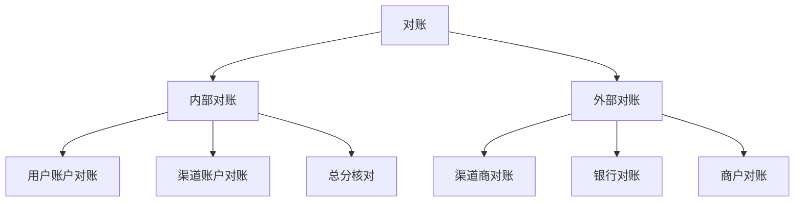
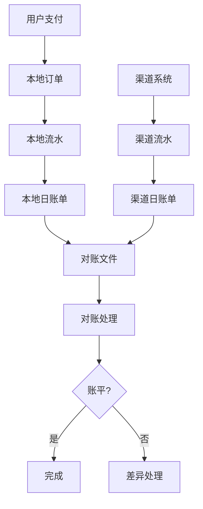
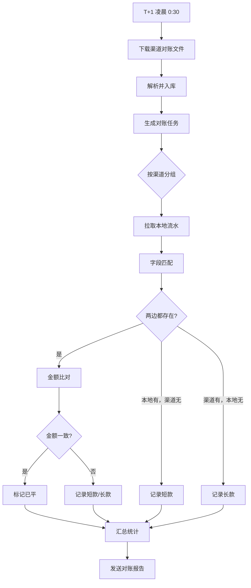
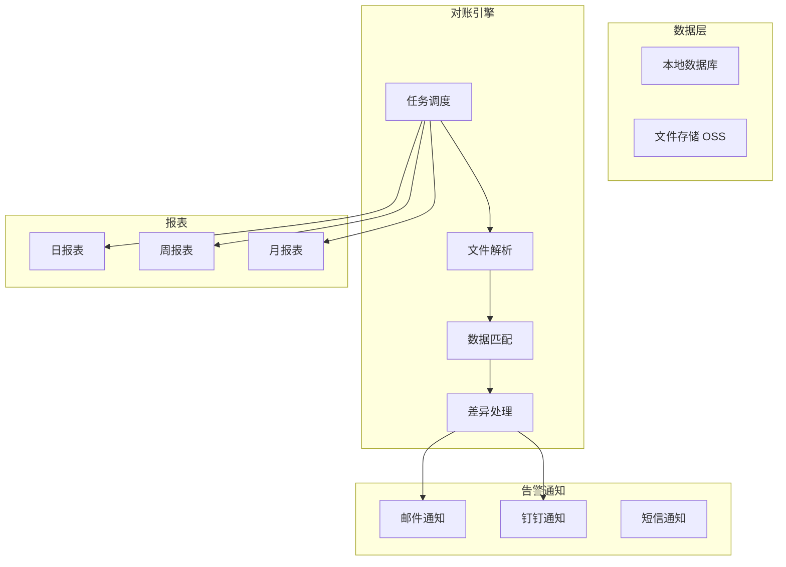

# 支付系统对账设计

**目标级别**：P6/P7

---

上一讲我们讲了支付系统的设计，这一讲专门聊聊**对账**——这是支付系统最后一道安全防线。

面试官问：「怎么保证你和渠道方的账是平的？」——这道题考察的是你对数据一致性、资金安全的理解，以及排查问题的系统性思维。

## 面试题速览

| 题号 | 问题 | 频率 | 难度 |
| --- | --- | --- | --- |
| 01 | 对账的核心目标是什么？ | 🔴 高频 | P5 |
| 02 | 对账的数据来源有哪些？ | 🔴 高频 | P6 |
| 03 | 对账流程怎么设计？ | 🟡 中频 | P6 |
| 04 | 账不平怎么排查和处理？ | 🔴 高频 | P6 |
| 05 | 如何实现自动化对账？ | 🟡 中频 | P6 |

## 一、对账的核心目标

### 为什么需要对账

支付系统的每一笔交易都涉及真金白银，账不平意味着钱对不上：

| 类型 | 说明 | 后果 |
| --- | --- | --- |
| **短款** | 我们记录少了 | 少收钱，损失收入 |
| **长款** | 我们记录多了 | 多付钱，损失本金 |
| **账不平** | 两边不一致 | 原因不明，风险最大 |

### 对账的类型



| 类型 | 对照双方 | 频率 | 说明 |
| --- | --- | --- | --- |
| **交易对账** | 本地订单 vs 渠道流水 | T+1 | 核心，必须做 |
| **退款对账** | 本地退款 vs 渠道退款 | T+1 | 与交易对账同时 |
| **账户对账** | 流水 vs 余额 | 每日 | 确保余额正确 |
| **轧账** | 收 vs 支 | 每日 | 日终检查收支平衡 |

## 二、对账数据来源

### 数据链路



### 数据表设计

```sql
-- 1. 本地支付流水
CREATE TABLE payment_flow (
    id BIGINT PRIMARY KEY AUTO_INCREMENT,
    order_id VARCHAR(64) NOT NULL COMMENT '订单号',
    channel_order_no VARCHAR(64) COMMENT '渠道订单号',
    user_id BIGINT NOT NULL,
    amount DECIMAL(15,2) NOT NULL COMMENT '支付金额',
    channel_fee DECIMAL(15,2) DEFAULT 0 COMMENT '渠道手续费',
    status TINYINT NOT NULL COMMENT '状态',
    channel_code VARCHAR(32) COMMENT '渠道编码',
    created_at DATETIME,
    INDEX idx_channel_order (channel_order_no),
    INDEX idx_created_at (created_at)
) ENGINE=InnoDB;

-- 2. 渠道流水（对账文件导入）
CREATE TABLE channel_flow (
    id BIGINT PRIMARY KEY AUTO_INCREMENT,
    channel_order_no VARCHAR(64) NOT NULL COMMENT '渠道订单号',
    out_trade_no VARCHAR(64) COMMENT '商户订单号',
    amount DECIMAL(15,2) NOT NULL COMMENT '交易金额',
    channel_fee DECIMAL(15,2) DEFAULT 0 COMMENT '渠道手续费',
    trade_type VARCHAR(32) COMMENT '交易类型',
    trade_status VARCHAR(32) COMMENT '交易状态',
    channel_code VARCHAR(32) COMMENT '渠道编码',
    trade_time DATETIME COMMENT '交易时间',
    created_at DATETIME,
    UNIQUE KEY uk_channel_order (channel_order_no, channel_code),
    INDEX idx_trade_time (trade_time)
) ENGINE=InnoDB;

-- 3. 对账差异记录
CREATE TABLE reconciliation_diff (
    id BIGINT PRIMARY KEY AUTO_INCREMENT,
    check_date DATE NOT NULL COMMENT '对账日期',
    diff_type VARCHAR(32) NOT NULL COMMENT '差异类型',
    local_order_no VARCHAR(64) COMMENT '本地订单号',
    channel_order_no VARCHAR(64) COMMENT '渠道订单号',
    local_amount DECIMAL(15,2) COMMENT '本地金额',
    channel_amount DECIMAL(15,2) COMMENT '渠道金额',
    diff_amount DECIMAL(15,2) COMMENT '差异金额',
    status VARCHAR(32) DEFAULT 'PENDING' COMMENT '处理状态',
    remark TEXT COMMENT '备注',
    created_at DATETIME,
    INDEX idx_date_status (check_date, status)
) ENGINE=InnoDB;
```

## 三、对账流程设计

### 标准 T+1 对账流程



### 对账任务调度

```bash
# 定时任务配置（每天凌晨执行）
0 1 * * * /usr/local/bin/reconciliation.sh

# 对账脚本伪代码
#!/bin/bash
DATE=$(date -d "yesterday" +%Y%m%d)
echo "开始对账: $DATE"

# 1. 下载渠道文件
python download_channel_file.py --date $DATE

# 2. 导入渠道流水
python import_channel_flow.py --date $DATE

# 3. 执行对账
python reconciliation.py --date $DATE

# 4. 发送报告
python send_report.py --date $DATE
```

### 对账匹配规则

| 字段 | 匹配规则 | 说明 |
| --- | --- | --- |
| **订单号** | 精确匹配 | 核心匹配字段 |
| **金额** | 精确匹配 | 金额必须完全一致 |
| **时间** | 容差 24h | 考虑时区差异 |
| **状态** | 需双方都是成功 | 只有成功才算平 |

```java
public class ReconciliationService {
    
    public void reconcile(String date, String channelCode) {
        // 1. 查询本地成功流水
        List<PaymentFlow> localFlows = paymentFlowDAO.selectSuccessByDate(date, channelCode);
        
        // 2. 查询渠道成功流水
        List<ChannelFlow> channelFlows = channelFlowDAO.selectSuccessByDate(date, channelCode);
        
        // 3. 构造成对账记录
        Map<String, PaymentFlow> localMap = localFlows.stream()
            .collect(Collectors.toMap(PaymentFlow::getOrderId, f -> f));
        Map<String, ChannelFlow> channelMap = channelFlows.stream()
            .collect(Collectors.toMap(ChannelFlow::getChannelOrderNo, f -> f));
        
        // 4. 遍历比对
        for (PaymentFlow local : localFlows) {
            ChannelFlow channel = channelMap.get(local.getOrderId());
            
            if (channel == null) {
                // 本地有，渠道无 → 短款
                recordDiff(DiffType.SHORT, local);
            } else if (!local.getAmount().equals(channel.getAmount())) {
                // 金额不一致 → 长款/短款
                recordDiff(DiffType.AMOUNT_MISMATCH, local, channel);
            } else {
                // 完全匹配 → 标记已平
                markAsReconciled(local);
            }
        }
        
        // 5. 处理渠道有多、本地没有的情况
        for (ChannelFlow channel : channelFlows) {
            if (!localMap.containsKey(channel.getChannelOrderNo())) {
                recordDiff(DiffType.LONG, channel);
            }
        }
    }
}
```

## 四、差异处理

### 差异类型

| 类型 | 说明 | 可能原因 | 处理方式 |
| --- | --- | --- | --- |
| **短款** | 本地有，渠道无 | 丢消息、延迟回调 | 补录渠道流水 |
| **长款** | 渠道有，本地无 | 本地丢单、延迟入库 | 排查本地订单 |
| **金额差** | 金额不一致 | 手续费计算差异 | 核实并调整 |

### ⚠️ 常见陷阱

**陷阱一：对账差异不处理**

> 面试官：「对账发现 100 元差异，你觉得怎么处理？」
>
> 错误回答：「记下来就好了，下次再对」
>
> 正确回答：必须 100% 处理。对账的核心就是发现问题，差异不处理对账就失去意义。100 元差异要追查到根因：如果是系统 bug 导致，要修复 bug；如果是人工操作失误，要追责；如果是恶意行为，要报案。

**陷阱二：只对账不平的记录**

> 面试官：「你只处理对不平的流水，平的就不管了？」
>
> 错误回答：「平的没问题，不用管」
>
> 正确回答：平的也要检查。如果对账两边都漏了同一笔流水，对账发现不了。所以还要做「笔数核对」：本地笔数 = 渠道笔数，保证没有两边同时漏掉的情况。

## 五、轧账设计

### 轧账公式

```
渠道应收 = 交易笔数 × 平均金额 - 渠道手续费
本地实收 = 本地交易金额总和
差异 = 渠道应收 - 本地实收
```

### 轧账表示例

```sql
-- 日轧账汇总表
CREATE TABLE daily_reconciliation (
    id BIGINT PRIMARY KEY AUTO_INCREMENT,
    check_date DATE NOT NULL COMMENT '对账日期',
    channel_code VARCHAR(32) NOT NULL COMMENT '渠道编码',
    total_count INT NOT NULL COMMENT '总笔数',
    local_amount DECIMAL(15,2) NOT NULL COMMENT '本地金额',
    local_fee DECIMAL(15,2) DEFAULT 0 COMMENT '本地手续费',
    channel_amount DECIMAL(15,2) COMMENT '渠道金额',
    channel_fee DECIMAL(15,2) COMMENT '渠道手续费',
    diff_count INT DEFAULT 0 COMMENT '差异笔数',
    diff_amount DECIMAL(15,2) DEFAULT 0 COMMENT '差异金额',
    status VARCHAR(32) DEFAULT 'PENDING' COMMENT 'PENDING/RECONCILED/EXCEPTION',
    created_at DATETIME,
    updated_at DATETIME,
    UNIQUE KEY uk_date_channel (check_date, channel_code)
);
```

### 轧账报表

| 渠道 | 日期 | 本地笔数 | 本地金额 | 渠道笔数 | 渠道金额 | 差异笔数 | 差异金额 | 状态 |
| --- | --- | --- | --- | --- | --- | --- | --- | --- |
| 微信支付 | 2024-01-15 | 100,000 | 500,000 | 99,998 | 499,990 | 2 | 10 | 待处理 |
| 支付宝 | 2024-01-15 | 80,000 | 400,000 | 80,000 | 400,000 | 0 | 0 | 已平 |

## 六、自动化对账

### 对账系统架构



### 对账监控指标

| 指标 | 计算方式 | 告警阈值 |
| --- | --- | --- |
| **对账完成率** | 已对账渠道数 / 应对账渠道数 | `<` 100% |
| **差异率** | 差异笔数 / 总笔数 | `>` 0.01% |
| **对账耗时** | 对账任务开始到结束 | `>` 30 分钟 |
| **文件获取成功率** | 成功获取文件数 / 请求数 | `<` 99% |

```java
public class ReconciliationMonitor {
    
    // 对账完成回调
    public void onReconciliationComplete(ReconciliationResult result) {
        // 发送钉钉告警
        if (result.getDiffCount() > 0) {
            String message = String.format(
                "【对账告警】日期: %s, 渠道: %s, 差异笔数: %d, 差异金额: %.2f",
                result.getDate(),
                result.getChannelCode(),
                result.getDiffCount(),
                result.getDiffAmount()
            );
            dingTalkService.sendAlert(message);
        }
        
        // 记录监控指标
        monitorService.record("reconciliation.diff.rate", 
            result.getDiffCount() * 1.0 / result.getTotalCount());
    }
}
```

## 七、面试高频追问

### 第一层：对账基本流程

> **问题**：对账是怎么做的？
>
> **参考答案**：
> 对账是 T+1 进行的，流程是：凌晨下载渠道对账文件 → 解析入库 → 按订单号匹配本地流水 → 比对金额和状态 → 记录差异。差异分为三种：本地有渠道无（短款）、本地无渠道有（长款）、金额不一致。平的流水标记已平，差异流水进入差异处理流程。

### 第二层：差异怎么处理

> **问题**：发现短款怎么办？
>
> **参考答案**：
> 短款说明本地记录了但渠道没有，可能是丢消息或回调延迟。处理流程：先查渠道后台确认这笔交易是否成功；如果成功，补录渠道流水；如果失败，查日志排查丢单原因。关键是差异必须 100% 处理，不能放着不管。

### 第三层：如何保证对账准确性

> **问题**：怎么保证对账本身是准确的？
>
> **参考答案**：
> 对账本身也要有校验机制：数据入库前要验签，防止文件被篡改；对账完成后要做笔数核对，确保没有两边同时漏掉的情况；差异处理要有记录和审批，不能随意调整；定期做对账系统的功能测试，模拟各种异常场景。

## 八、综合对比

| 维度 | 手动对账 | 半自动对账 | 全自动对账 |
| --- | --- | --- | --- |
| **人力成本** | 高 | 中 | 低 |
| **及时性** | 差 | 中 | 好 |
| **准确性** | 人为失误 | 人为失误 | 高 |
| **扩展性** | 差 | 中 | 好 |
| **适用规模** | `<` 1000 笔/天 | 1000-10 万笔/天 | `>` 10 万笔/天 |

## 九、扩展思考

### 问题一：实时对账

> T+1 对账有 1 天延迟，出问题要第二天才能发现。
>
> **解决方案**：
> 对于核心业务，可以做实时对账或准实时对账（T+0）。原理是：支付成功后立即向渠道方查询状态，与本地状态比对。但 T+0 成本高，只适合高风险交易。

### 问题二：对账文件丢失

> 渠道方文件没生成或下载失败，导致无法对账。
>
> **解决方案**：
> - 多渠道获取：支持 API 和文件两种方式
> - 文件校验：检查文件完整性（行数校验和、金额汇总）
> - 异常告警：文件获取失败立即告警
> - 补下载：支持补跑历史对账

---

> 💡 **面试官视角**：对账考察的是你对「数据一致性」和「风险控制」的理解。面试官会追问差异处理、轧账公式、自动化对账等细节。关键是理解对账是支付系统最后一道防线，必须 100% 准确。
