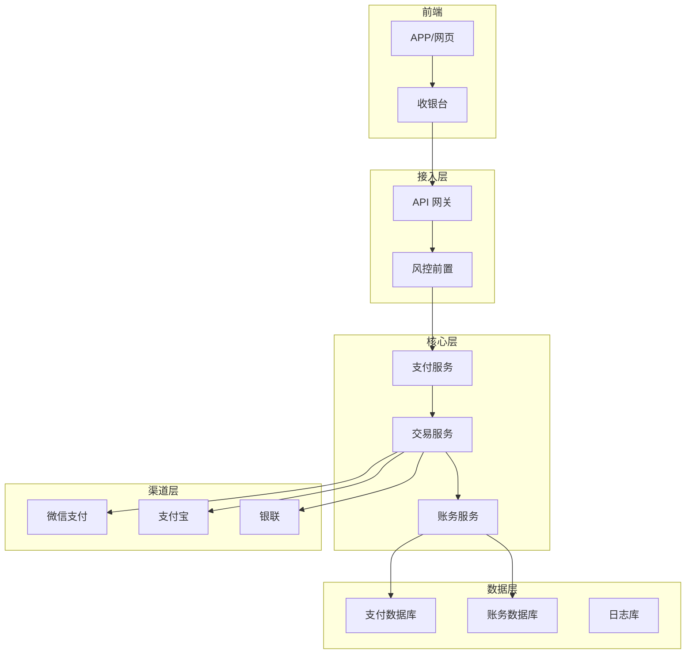
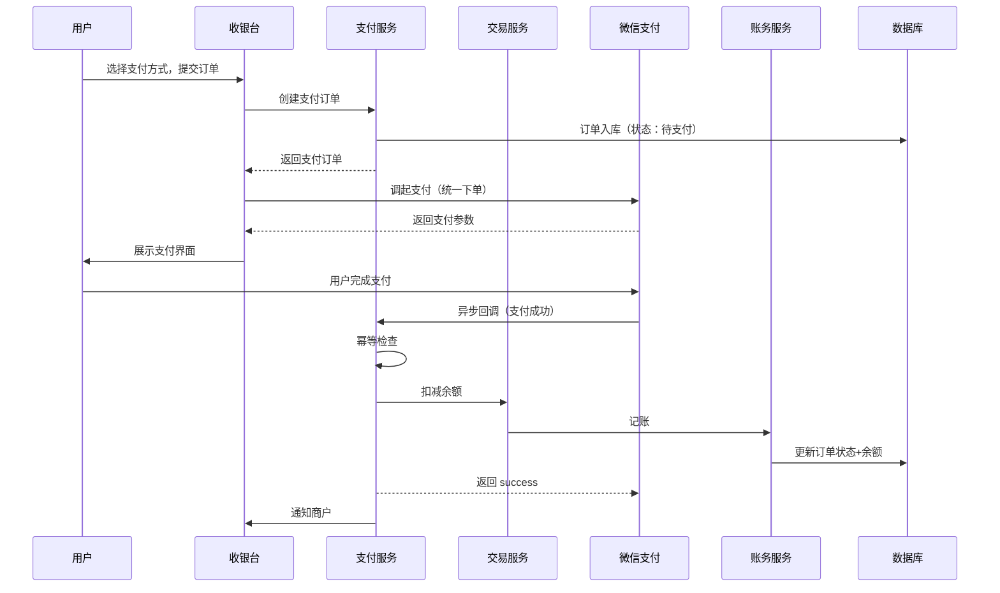
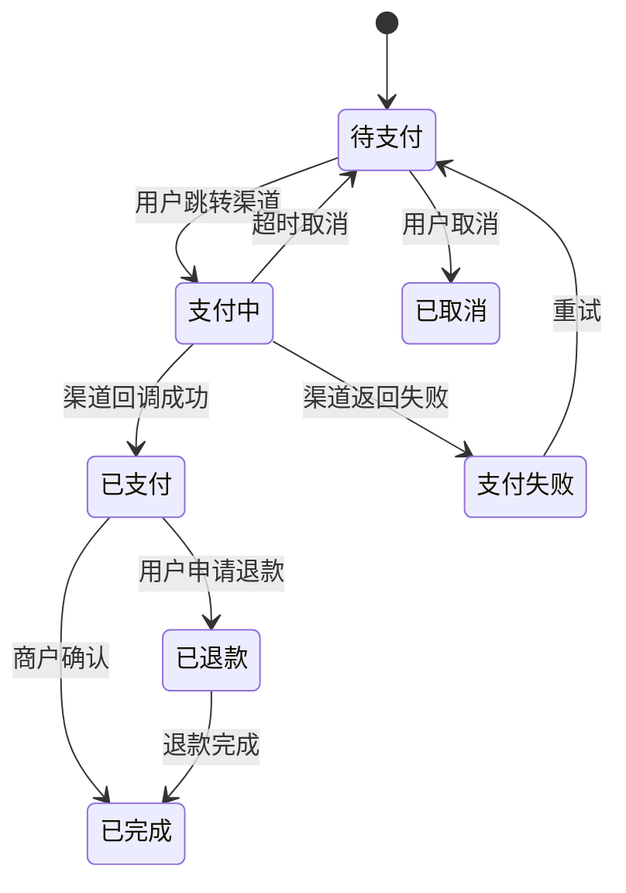
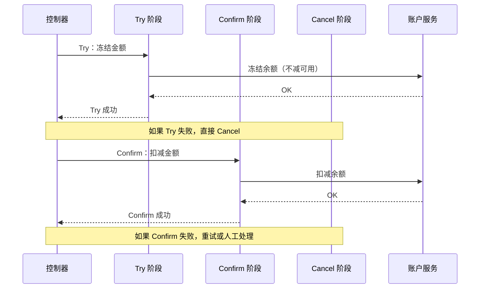
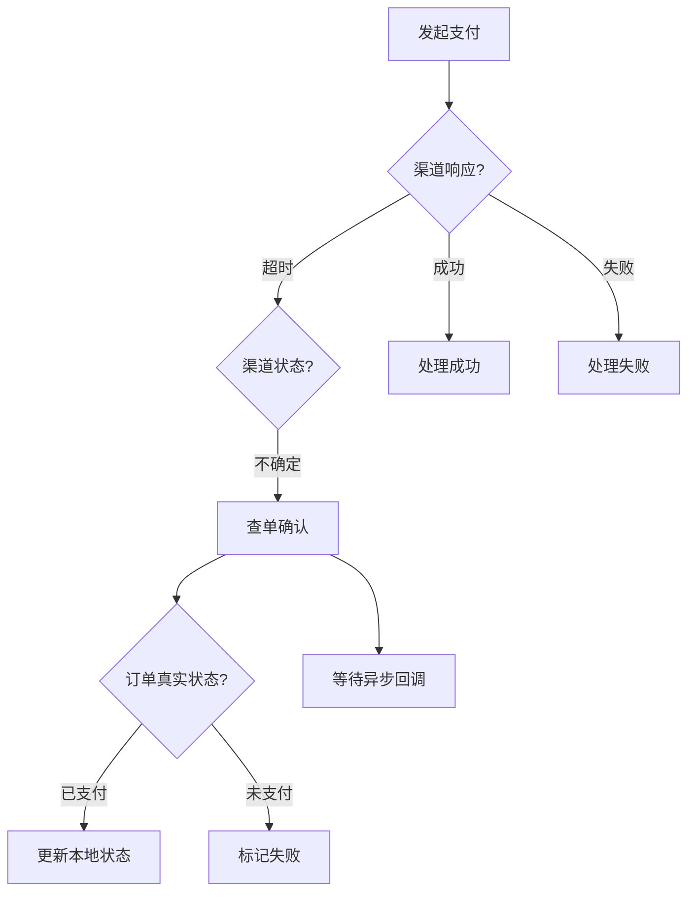
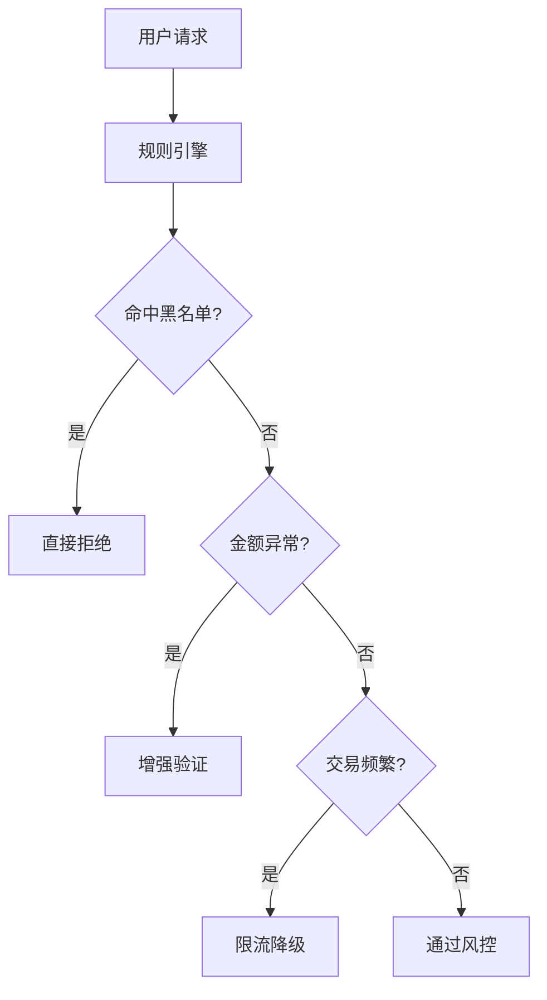

# 支付系统设计

**目标级别**：P6/P7

---

面试官问：「设计一个支付系统」——这道题考察的是你对分布式事务、资金安全、高可用设计的综合能力。

支付系统是公司最核心的系统之一，对一致性要求极高。面试官不会只问「怎么收款」，而是会追问「怎么保证不重复扣款」「怎么对账」「怎么应对渠道方故障」等深层问题。

## 面试题速览

| 题号 | 问题 | 频率 | 难度 |
| --- | --- | --- | --- |
| 01 | 支付系统的核心架构是什么？ | 🔴 高频 | P5 |
| 02 | 怎么保证不重复扣款？ | 🔴 高频 | P6 |
| 03 | 分布式事务怎么实现？ | 🔴 高频 | P6 |
| 04 | 渠道方超时怎么处理？ | 🟡 中频 | P6 |
| 05 | 怎么设计幂等接口？ | 🔴 高频 | P6 |

## 一、需求澄清

支付系统设计前，必须明确几个关键问题：

| 问题 | 为什么重要 | 候选选项 |
| --- | --- | --- |
| **支付场景有哪些？** | 决定接入哪些渠道 | 扫码、APP、网页、H5 |
| **交易量多大？** | 决定架构复杂度 | 1000 vs 10 万 QPS |
| **资金一致性要求多高？** | 决定事务方案 | 强一致 / 最终一致 |
| **对账频率是什么？** | 决定对账设计 | T+1 / 实时 |
| **需要支持退款吗？** | 影响交易模型 | 支持 / 不支持 |

### 支付系统类型

| 类型 | 特征 | 示例 |
| --- | --- | --- |
| **聚合支付** | 整合多个支付渠道 | 微信、支付宝、银联 |
| **自建支付** | 自己搭建支付通道 | 电商平台钱包 |
| **跨境支付** | 多币种、汇率换算 | PayPal、WorldFirst |
| **代付系统** | 企业向用户付款 | 佣金发放、退款 |

## 二、核心架构设计

### 整体架构



### 组件职责

| 组件 | 职责 | 设计要点 |
| --- | --- | --- |
| **API 网关** | 统一入口、鉴权、限流 | 防攻击、安全防护 |
| **风控前置** | 交易风控、欺诈检测 | 规则引擎、模型 |
| **支付服务** | 订单管理、状态流转 | 幂等、事务 |
| **交易服务** | 路由、渠道对接 | 渠道适配器模式 |
| **账务服务** | 记账、分账、核销 | 复式记账、一致性 |

## 三、支付流程设计

### 标准支付流程



### 支付状态机



## 四、幂等设计

支付系统的幂等是生命线，一次扣款不能执行两次。

### 幂等 key 设计

| 幂等维度 | key 格式 | 有效期 |
| --- | --- | --- |
| **创建订单** | `{userId}:{orderId}` | 永久 |
| **发起支付** | `{orderId}:{channelId}` | 永久 |
| **渠道回调** | `{channelId}:{outTradeNo}` | 永久 |
| **退款申请** | `{orderId}:{refundId}` | 永久 |

### 幂等实现方案

**方案一：数据库唯一索引**

```sql
CREATE TABLE payment_order (
    id BIGINT PRIMARY KEY AUTO_INCREMENT,
    order_id VARCHAR(64) NOT NULL UNIQUE COMMENT '订单号',
    user_id BIGINT NOT NULL,
    amount DECIMAL(15,2) NOT NULL,
    status TINYINT NOT NULL,
    created_at DATETIME,
    INDEX idx_user_status (user_id, status)
) ENGINE=InnoDB;
```

```java
public class PaymentService {
    
    @Transactional
    public PaymentResult createOrder(OrderRequest request) {
        try {
            // 幂等插入，如果订单号已存在则抛异常
            orderDAO.insert(request.getOrderId(), request.getAmount());
            return doCreateOrder(request);
        } catch (DuplicateKeyException e) {
            // 订单已存在，查询并返回
            return orderDAO.selectByOrderId(request.getOrderId());
        }
    }
}
```

**方案二：Redis SET NX**

```java
public PaymentResult initiatePayment(String orderId, String channelId) {
    String key = "payment:idempotent:" + orderId + ":" + channelId;
    
    // SET NX：不存在才设置
    Boolean success = redisTemplate.opsForValue()
        .setIfAbsent(key, "processing", 30, TimeUnit.MINUTES);
    
    if (Boolean.FALSE.equals(success)) {
        // 已存在，可能正在处理或已完成
        return paymentDAO.selectByOrderId(orderId);
    }
    
    try {
        return doInitiatePayment(orderId, channelId);
    } catch (Exception e) {
        // 失败时删除 key，允许重试
        redisTemplate.delete(key);
        throw e;
    }
}
```

### ⚠️ 常见陷阱

**陷阱一：先查后写**

> 面试官：「你用 `SELECT` 判断订单是否存在，再 `INSERT`，会有什么并发问题？」
>
> 错误回答：「不会有并发问题，查完再写」
>
> 正确回答：先查后写在并发时会导致重复创建。正确做法是用唯一索引或 `INSERT ... ON DUPLICATE KEY` 语法，让数据库保证唯一性。

**陷阱二：只防前端重试，不防后端重试**

> 面试官：「前端按钮防重复点击就够了吗？」
>
> 错误回答：「够了，用户不点两次就不会重复扣款」
>
> 正确回答：不够。后端还要防：网络超时导致客户端重试、渠道方回调重试、系统恢复后任务重跑。必须用幂等 key 做完整防护。

## 五、分布式事务

### 支付系统的分布式事务场景

| 场景 | 涉及系统 | 一致性要求 |
| --- | --- | --- |
| **扣款 + 记账** | 支付服务 + 账务服务 | 强一致 |
| **下单 + 库存** | 订单服务 + 库存服务 | 最终一致 |
| **支付 + 分账** | 支付服务 + 分账服务 | 最终一致 |
| **退款 + 还原** | 退款服务 + 账务服务 | 强一致 |

### 分布式事务方案对比

| 方案 | 原理 | 优点 | 缺点 | 适用场景 |
| --- | --- | --- | --- | --- |
| **2PC** | 两阶段提交 | 强一致 | 阻塞、单点 | 不推荐 |
| **TCC** | Try-Confirm-Cancel | 强一致、性能好 | 实现复杂 | 高并发支付 |
| **本地消息表** | 消息队列 + 本地表 | 实现简单 | 延迟、一致性弱 | 中等一致性 |
| **Saga** | 编排式补偿 | 高性能 | 长事务复杂 | 长流程 |
| **最大努力通知** | 重试 + 确认 | 简单 | 不保证 | 回调场景 |

### TCC 模式实现



```java
public class PaymentTCCService {
    
    // Try：冻结金额
    @Try
    public void freeze(AccountDTO account) {
        accountDAO.freeze(account.getUserId(), account.getAmount());
    }
    
    // Confirm：确认扣款
    @Confirm
    public void confirm(AccountDTO account) {
        accountDAO.confirmFreeze(account.getUserId(), account.getAmount());
    }
    
    // Cancel：释放冻结
    @Cancel
    public void cancel(AccountDTO account) {
        accountDAO.unfreeze(account.getUserId(), account.getAmount());
    }
}
```

## 六、渠道方交互

### 渠道方超时处理



### 查单策略

| 场景 | 策略 | 超时时间 |
| --- | --- | --- |
| **同步返回成功** | 直接确认 | 0 |
| **同步返回失败** | 直接失败 | 0 |
| **同步返回超时** | 立即查单 1 次 | +5s |
| **超时无响应** | 每 30s 查单，最多次 | +120s |
| **多次查单无果** | 人工介入 | +24h |

```java
public class ChannelQueryService {
    
    public PaymentStatus queryPayment(String orderId) {
        // 1. 查询本地数据库状态
        PaymentOrder order = orderDAO.selectByOrderId(orderId);
        if (order.getStatus() == PaymentStatus.PAID) {
            return PaymentStatus.PAID;
        }
        
        // 2. 调用渠道方查单
        ChannelResponse response = channel.query(orderId);
        
        // 3. 根据渠道返回更新本地状态
        if (response.isSuccess()) {
            updateOrderStatus(orderId, PaymentStatus.PAID);
            return PaymentStatus.PAID;
        } else {
            return PaymentStatus.UNPAID;
        }
    }
}
```

### ⚠️ 面试官挖坑点

**陷阱一：渠道返回「系统繁忙」就认为失败**

> 面试官：「渠道返回『系统繁忙』，你怎么处理？」
>
> 错误回答：「标记失败，让用户重试」
>
> 正确回答：「系统繁忙」是未知状态，可能是成功也可能是失败。必须查单确认，不能直接标记失败。直接标记失败会导致用户扣钱了但订单显示失败。

**陷阱二：渠道回调直接更新状态**

> 面试官：「收到渠道回调后，你直接更新订单状态吗？」
>
> 错误回答：「对，更新成功后返回 success」
>
> 正确回答：不是。正确流程是：验签 → 幂等检查 → 落库 → 异步通知商户 → 返回 success。如果验签失败、已处理过、落库失败，都不能返回 success。

## 七、风控设计

### 风控拦截点



### 核心风控规则

| 规则类型 | 规则示例 | 处理方式 |
| --- | --- | --- |
| **黑名单** | 命中黑名单用户 | 直接拒绝 |
| **金额阈值** | 单笔 `>` 5 万 | 增强验证 |
| **频率限制** | 1 分钟 `>` 10 笔 | 限流 |
| **设备指纹** | 同一设备多账号 | 人脸验证 |
| **异地登录** | 非常用地址支付 | 短信验证 |

## 八、面试高频追问

### 第一层：支付流程和幂等

> **问题**：支付系统怎么保证不重复扣款？
>
> **参考答案**：
> 支付系统的幂等是生命线。从三个层次保证：前端防重复点击（按钮置灰）；后端用幂等 key（订单号 + 渠道号）防止重复请求；渠道回调用 `outTradeNo` 幂等处理。关键是用唯一索引或 `SET NX` 让数据库/Redis 保证唯一性，而不是先查后写。

### 第二层：分布式事务

> **问题**：支付成功但记账失败了怎么办？
>
> **参考答案**：
> 用 TCC 模式处理。Try 阶段冻结金额，Confirm 阶段确认扣款，Cancel 阶段释放冻结。如果 Confirm 失败，重试直到成功或人工介入。如果 Try 成功后系统崩溃，恢复后可以检测到未完成的交易，继续处理。关键是账务服务和支付服务要在一个事务域内。

### 第三层：渠道方异常处理

> **问题**：渠道方超时，你怎么确定支付成功还是失败？
>
> **参考答案**：
> 渠道方超时有三种可能：成功但响应丢失、失败、真的超时。处理策略是：先用幂等 key 判断是否处理过；如果没处理过，调用渠道��查单接口确认状态；根据查询结果更新本地状态。绝对不能直接标记失败，否则会导致用户扣钱了但订单失败。

## 九、综合对比

| 维度 | 聚合支付 | 自建支付 | 代付系统 |
| --- | --- | --- | --- |
| **接入成本** | 低 | 高 | 高 |
| **合规成本** | 低 | 高 | 高 |
| **资金安全** | 渠道方保障 | 自己负责 | 自己负责 |
| **灵活性** | 受限 | 高 | 高 |
| **交易费率** | 有通道费 | 可谈 | 可谈 |
| **适用场景** | 中小企业 | 大型平台 | 企业发款 |

## 十、扩展思考

### 问题一：如何防止羊毛党

> 攻击者用大量账号刷优惠、刷红包。
>
> **应对方案**：
> - 设备指纹识别：同一设备关联多账号标记风险
> - 行为分析：正常用户行为 vs 机器行为
> - 验证码：异常操作触发人机验证
> - 实时风控：异常流量实时拦截

### 问题二：如何保证资金安全

> 核心原则：资金不丢不错。
>
> **应对方案**：
> - 操作日志全链路追踪
> - 大额操作多级审批
> - 资金变动必须复核
> - 每日对账，发现差异告警

---

> 💡 **面试官视角**：支付系统考察的是你对「资金安全」和「一致性」的理解。面试官会追问幂等、分布式事务、渠道异常处理等细节。关键是理解为什么支付系统需要这么复杂的设计，而不是背答案。
