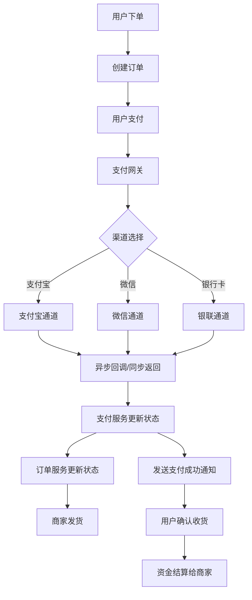

# 支付系统设计

2021年"双十一"，某电商平台的支付系统在0点14分发生了一次严重故障：5000个用户反映账户被重复扣款，最多的一个用户被扣了12次。

事后复盘，原因简单到可笑：支付网关在处理超时重试时，没有正确校验订单状态，导致同一个订单被提交了多次到银行通道。

这不是技术难题，这是**幂等性设计**的基本功没做好。

后果是：平台垫付了50万元赔款，客服团队连续加班一周处理投诉，品牌信誉损失不可估量。

【架构权衡】

支付系统是分布式系统中最考验"正确性"的场景。它不像IM系统那样追求高并发，不像秒杀系统那样追求削峰，它追求的是**每一分钱都要对得上**。任何一致性上的疏漏，都会变成真金白银的损失。支付系统的设计哲学是：正确性 > 性能 > 功能。

## 一、支付系统核心问题 🔴

### 1.1 四大核心问题

```
支付系统的四座大山：

1. 资金一致性
   - 不能多扣、不能少扣
   - 用户账户、银行账户、平台账户要同时更新
   - 任何一步失败都要回滚

2. 幂等性设计
   - 同一笔订单不能重复扣款
   - 网络超时时要能安全重试
   - 幂等是支付系统的生命线

3. 渠道统一接入
   - 支付宝/微信/银联各有接口
   - 统一封装，屏蔽差异
   - 异常处理要统一

4. 对账清算
   - 平台账和银行账要能对上
   - 日终对账，发现差异及时处理
   - 差错处理要有人工介入
```

### 1.2 量化指标

```
支付系统的关键数字：

交易规模：
- 日均交易量：1000万笔
- 日均交易额：10亿元
- 峰值QPS：约5000笔/秒

可靠性要求：
- 支付成功率：>99.5%
- 系统可用性：99.99%
- 资金差错率：<0.001%

延迟要求：
- 支付接口响应时间：P99 < 3秒
- 异步回调处理：<10秒
- 对账文件生成：<5分钟
```

### 1.3 面试核心问题

> 面试官：支付系统最核心的问题是什么？
>
> 候选人：是**资金一致性**。支付本质上是资金转移：从用户账户到商家账户，平台在其中扮演中介。如果扣款成功但订单失败，或者扣款两次，就会造成资金损失。
>
> 面试官：那怎么保证一致性？
>
> 候选人：核心是**事务+幂等+补偿**：
>
> 1. 事务：扣款和创建支付流水在同一事务里
>
> 2. 幂等：用订单号作为唯一键，重复请求返回原结果
>
> 3. 补偿：最终一致性，通过对账发现和修复不一致

【面试官心理】

支付系统的追问方向通常围绕"一致性"展开。能说出"事务+幂等+补偿"的候选人，说明理解了分布式一致性的基本思路；能详细解释幂等实现的候选人，说明有实战经验；能提到"对账"和"差错处理"的候选人，说明有全局视野。

## 二、支付链路设计 🔴

### 2.1 完整支付流程



### 2.2 支付状态机

```
支付状态流转：

[创建] → [待支付] → [支付中] → [已支付]
   ↓          ↓          ↓
[取消]    [超时取消]  [支付失败]
   ↓
[退款中] → [已退款]

详细说明：
- 创建：生成支付订单，状态为"待支付"
- 待支付：用户选择支付方式，等待用户操作
- 支付中：用户已完成操作，等待渠道回调
- 已支付：收到渠道成功回调，资金已扣除
- 取消/超时：用户主动取消或超时未支付
- 退款：用户申请退款或系统自动退款
```

### 2.3 幂等设计

```java
// 支付幂等实现：基于订单号的唯一约束

public class PaymentService {

    @Transactional
    public PaymentResult pay(String orderId, String channel, BigDecimal amount) {
        // Step 1: 查询支付流水
        PaymentDO existing = paymentDAO.selectByOrderId(orderId);
        if (existing != null) {
            // 已存在支付流水，直接返回
            return PaymentResult.from(existing);
        }

        // Step 2: 创建支付流水（订单号唯一索引，重复插入报错）
        PaymentDO payment = new PaymentDO();
        payment.setOrderId(orderId);
        payment.setChannel(channel);
        payment.setAmount(amount);
        payment.setStatus(PaymentStatus.PENDING);
        payment.setCreateTime(new Date());
        paymentDAO.insert(payment);

        // Step 3: 调用支付渠道
        ChannelResponse response = channelService.pay(payment);
        if (response.isSuccess()) {
            payment.setStatus(PaymentStatus.SUCCESS);
            payment.setChannelTradeNo(response.getTradeNo());
        } else {
            payment.setStatus(PaymentStatus.FAILED);
            payment.setErrorCode(response.getErrorCode());
        }
        paymentDAO.update(payment);

        return PaymentResult.from(payment);
    }
}
```

### 2.4 幂等的边界情况

```
幂等设计的关键点：

1. 数据库唯一索引：order_id 唯一约束，重复插入报错
2. 状态检查：即使插入成功，也要检查当前状态
3. 更新条件：UPDATE 时带 WHERE status = '待支付'
4. 乐观锁：version 字段防止并发更新

防止重复扣款的完整检查：
- 订单维度：order_id 唯一键
- 支付渠道维度：同一订单+同一渠道+同一金额
- 用户维度：用户账户余额检查（防止余额不足但被扣款）
```

## 三、资金流一致性 🟡

### 3.1 三户模型

```
支付系统的三户模型：

1. 用户账户：存储用户预充值资金
2. 平台账户：存储平台自有资金（佣金、保证金）
3. 商户账户：存储商户应收资金

资金流转：
用户支付100元 → 用户账户-100 → 平台账户+98 → 商户账户+98
                                     → 佣金账户+2

账户更新必须同时成功或同时失败：
- 用分布式事务（如Seata TCC/Saga）
- 或用消息队列 + 本地消息表
```

### 3.2 账户表设计

```sql
-- 账户表
CREATE TABLE account (
    id BIGINT PRIMARY KEY,
    account_type TINYINT NOT NULL,  -- 1=用户, 2=商户, 3=平台
    owner_id BIGINT NOT NULL,        -- user_id 或 merchant_id
    balance DECIMAL(15,2) NOT NULL DEFAULT 0,  -- 可用余额
    frozen_amount DECIMAL(15,2) NOT NULL DEFAULT 0,  -- 冻结金额
    version INT NOT NULL DEFAULT 0,  -- 乐观锁版本号
    create_time DATETIME,
    update_time DATETIME,
    UNIQUE KEY uk_owner_type (owner_id, account_type)
) ENGINE=InnoDB;

-- 账户变动流水表
CREATE TABLE account_transaction (
    id BIGINT PRIMARY KEY,
    account_id BIGINT NOT NULL,
    transaction_type TINYINT NOT NULL,  -- 1=收入, 2=支出, 3=冻结, 4=解冻
    amount DECIMAL(15,2) NOT NULL,
    balance_before DECIMAL(15,2) NOT NULL,
    balance_after DECIMAL(15,2) NOT NULL,
    order_id VARCHAR(64),                 -- 关联订单号
    remark VARCHAR(256),
    create_time DATETIME,
    INDEX idx_order_id (order_id),
    INDEX idx_account_time (account_id, create_time)
) ENGINE=InnoDB;
```

### 3.3 分布式事务方案

```
方案1：Seata AT模式（两阶段提交）
- 自动补偿，性能好
- 适用于短事务（<1秒）
- 缺点：锁粒度大，高并发时有性能问题

方案2：TCC模式（Try-Confirm-Cancel）
- Try：预留资源（冻结金额）
- Confirm：确认扣款（冻结→实际支出）
- Cancel：释放资源（冻结→解冻）
- 适用于长事务

方案3：Saga模式（最终一致）
- 每个子事务有正向和补偿操作
- 失败时逆序执行补偿
- 适用于跨系统长事务
```

## 四、渠道统一接入 🟡

### 4.1 渠道适配器模式

```java
// 统一支付接口
public interface PaymentChannel {
    /**
     * 统一下单
     */
    ChannelPayResponse pay(PayRequest request);

    /**
     * 异步回调处理
     */
    ChannelCallbackResult callback(CallbackRequest request);

    /**
     * 退款
     */
    ChannelRefundResponse refund(RefundRequest request);

    /**
     * 查账
     */
    ChannelQueryResponse query(OrderQueryRequest request);
}

// 支付宝通道实现
@Service
public class AlipayChannel implements PaymentChannel {
    @Override
    public ChannelPayResponse pay(PayRequest request) {
        // 调用支付宝统一下单接口
        AlipayTradePayRequest alipayRequest = new AlipayTradePayRequest();
        alipayRequest.setOutTradeNo(request.getOrderId());
        alipayRequest.setTotalAmount(request.getAmount().toString());
        alipayRequest.setSubject(request.getSubject());
        // ... 设置其他参数
        AlipayTradePayResponse response = alipayClient.execute(alipayRequest);
        return ChannelPayResponse.from(response);
    }
}

// 微信支付通道实现
@Service
public class WechatPayChannel implements PaymentChannel {
    @Override
    public ChannelPayResponse pay(PayRequest request) {
        // 调用微信统一下单接口
        WxPayUnifiedOrderRequest wxRequest = new WxPayUnifiedOrderRequest();
        wxRequest.setOutTradeNo(request.getOrderId());
        wxRequest.setTotalFee(request.getAmount().multiply(new BigDecimal(100)).intValue());
        // ... 设置其他参数
        WxPayUnifiedOrderResponse response = wxPayService.unifiedOrder(wxRequest);
        return ChannelPayResponse.from(response);
    }
}
```

### 4.2 渠道异常处理

```
渠道返回码处理：

1. 明确成功：返回码=SUCCESS
   → 更新本地订单为"支付成功"
   → 通知下游系统

2. 明确失败：返回码=FAIL 或错误码为已知失败码
   → 更新本地订单为"支付失败"
   → 释放库存等资源

3. 不确定（网络超时）：返回码为空或解析失败
   → 先查渠道确认订单状态
   → 查账后确认

4. 重复回调：同一订单号的多次成功回调
   → 幂等处理，返回成功但不重复处理
```

## 五、退款流程 🟡

### 5.1 退款状态机

```
退款状态流转：

[申请退款] → [审核中] → [退款中] → [已退款]
    ↓              ↓
[拒绝退款]    [退款失败] → [重试]

退款类型：
- 全额退款：退还全部支付金额
- 部分退款：退还部分金额（需计算佣金退还）
- 原路退回：退到原支付渠道
- 退到余额：退到平台账户余额
```

### 5.2 退款幂等

```java
public class RefundService {

    @Transactional
    public RefundResult refund(String orderId, BigDecimal refundAmount, String reason) {
        // Step 1: 检查原支付是否成功
        PaymentDO payment = paymentDAO.selectByOrderId(orderId);
        if (payment == null || payment.getStatus() != PaymentStatus.SUCCESS) {
            throw new BusinessException("原支付未成功，无法退款");
        }

        // Step 2: 检查退款金额
        BigDecimal refundedAmount = refundDAO.sumRefundedAmount(orderId);
        BigDecimal canRefundAmount = payment.getAmount().subtract(refundedAmount);
        if (refundAmount.compareTo(canRefundAmount) > 0) {
            throw new BusinessException("退款金额超出可退金额");
        }

        // Step 3: 创建退款记录（退款单号唯一）
        RefundDO refund = new RefundDO();
        refund.setRefundId(genRefundId());
        refund.setOrderId(orderId);
        refund.setAmount(refundAmount);
        refund.setStatus(RefundStatus.PENDING);
        refundDAO.insert(refund);

        // Step 4: 调用渠道退款
        try {
            ChannelRefundResponse response = channelService.refund(refund);
            if (response.isSuccess()) {
                refund.setStatus(RefundStatus.SUCCESS);
                refund.setChannelRefundNo(response.getRefundNo());
                // 更新账户余额
                accountService.unfreezeAndRefund(payment.getUserId(), refundAmount);
            } else {
                refund.setStatus(RefundStatus.FAILED);
                refund.setErrorMsg(response.getErrorMsg());
            }
        } catch (Exception e) {
            refund.setStatus(RefundStatus.FAILED);
            refund.setErrorMsg(e.getMessage());
        }
        refundDAO.update(refund);

        return RefundResult.from(refund);
    }
}
```

## 六、生产避坑 🟡

### 6.1 支付系统的五大坑

**坑1：重复扣款**

```
问题：网络超时导致重试，同一订单被扣多次
场景：用户点击支付，1秒后没响应，又点了一次
影响：用户被扣多次，客诉爆发
解决方案：
- 支付订单号(order_id)唯一约束
- 支付前先查询是否已有成功记录
- 渠道调用用幂等键（如order_id），渠道侧防重
```

**坑2：状态不一致**

```
问题：渠道回调失败，本地状态已更新
场景：本地更新状态为"支付成功"，发MQ通知下游时MQ挂了
影响：订单状态是"已支付"，但下游系统不知道
解决方案：
- 发MQ用事务消息：本地事务和MQ发送在同一事务
- 或者：本地消息表 + 定时任务轮询补偿
```

**坑3：余额并发扣减**

```
问题：同一用户同时发起两笔支付，余额被超扣
场景：用户余额100元，两笔订单都是80元，并发扣减
影响：余额变成-60元
解决方案：
- UPDATE时检查余额：UPDATE account SET balance = balance - ? WHERE id = ? AND balance >= ?
- 用乐观锁：version字段，更新时version+1
```

**坑4：渠道回调伪造**

```
问题：黑客伪造支付成功回调
场景：抓包分析回调格式，伪造成功回调
影响：免费获得商品
解决方案：
- 回调参数加签：验签通过才处理
- 回调IP地址白名单：只接受渠道方IP的回调
- 回调后再查账：收到回调后再查一次渠道确认
```

**坑5：日终对账差异**

```
问题：平台账和银行账对不上
场景：平台显示用户A支付100元，银行显示支付99元（手续费差异）
影响：无法结算，财务头疼
解决方案：
- 对账文件下载后自动比对
- 差异记录标记，人工介入处理
- 建立差错处理流程
```

### 6.2 监控指标

| 指标 | 目标值 | 告警阈值 |
| --- | --- | --- |
| 支付成功率 | >99.5% | <99% |
| 重复扣款率 | 0 | >0.001% |
| 对账差异率 | 0 | >0.01% |
| 支付延迟P99 | <3s | >5s |
| 回调处理延迟 | <10s | >30s |

【架构权衡】

支付系统的设计有一个核心原则：**资金不能丢，丢了就要找回来**。任何设计都要以资金安全为前提，宁可牺牲性能，也要保证一致性。幂等是生命线，对账是兜底保障，事务是最后防线。三者缺一不可。

## 七、真实面试回放 🟡

> **面试官**：设计一个支付系统，怎么防止用户重复支付？
>
> **候选人**（老王）：核心是四道防线：
>
> 第一道：前端防重复点击。按钮点击后置灰，2秒内不能重复点击。但这只是安慰性设计，可以被绕过。
>
> 第二道：后端幂等。用order_id作为唯一键，同一order_id的支付请求，要么返回已有结果，要么报错。
>
> 第三道：渠道幂等。调用支付宝/微信时，out_trade_no（就是order_id）传给渠道，渠道自己也会防重。
>
> 第四道：对账兜底。日终对账时，如果发现同一order_id有多笔支付，触发告警，人工处理。
>
> **面试官**：如果后端更新了订单状态，但MQ通知下游时失败了怎么办？
>
> **老王**：这个问题本质是本地事务和下游通知的一致性。
>
> 方案一：事务消息。RocketMQ支持事务消息，本地事务和MQ发送在同一事务里，MQ会回调确认是否成功，不成功就重试。
>
> 方案二：本地消息表。创建一张本地消息表，和订单更新在同一个事务里。定时任务轮询消息表，发送失败就重试。
>
> 我们用方案一，RocketMQ事务消息比较成熟。
>
> **面试官**：退款时，怎么保证原路退回？
>
> **老王**：退款分两种：
>
> 一是原路退回：用户用支付宝付的，退款也退回支付宝。需要记录支付时的渠道交易号（支付宝交易号），退款时带上。
>
> 二是退到余额：退到平台账户余额。这种不需要原渠道支持，但用户不一定有平台账户。
>
> 大多数场景用原路退回，因为用户心理上期望"钱从哪来到哪去"。
>
> 【面试官手记】
>
> 老王这场面试的亮点：
>
> 1. 四道防线：前端、后端、渠道、对账，层层设防
>
> 2. 事务消息回答到位：知道RocketMQ事务消息的回调确认机制
>
> 3. 原路退回的回答体现了产品思维：不是技术决定业务，而是业务决定技术
>
> 这场面试属于P7级别，支付系统的设计在P7面试中出现频率很高，因为支付系统涉及资金安全，需要候选人有足够的工程意识。
>
> 继续追问方向：会问"余额并发扣减怎么解决"和"渠道回调验签怎么设计"，这两个问题考验候选人对并发安全和安全设计的理解。

支付系统设计的核心是**资金一致性**，记住三个要点：

1. **幂等是生命线**：订单号唯一约束 + 渠道幂等键
2. **事务保证一致性**：本地事务 + 消息队列事务
3. **对账是兜底保障**：日终对账 + 差错处理

当你能在面试中讲清楚"怎么防止重复扣款"，支付系统这关就算过了。
