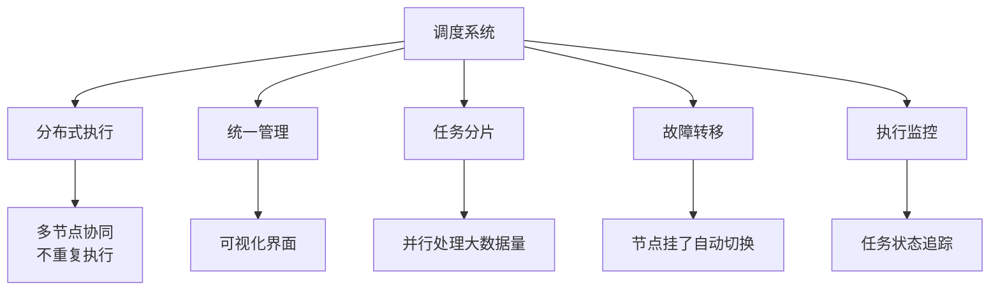
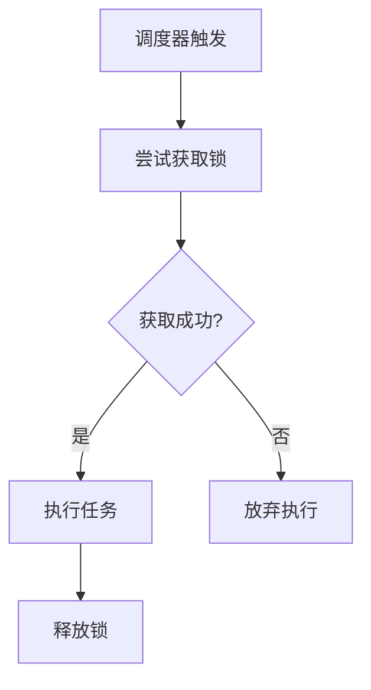
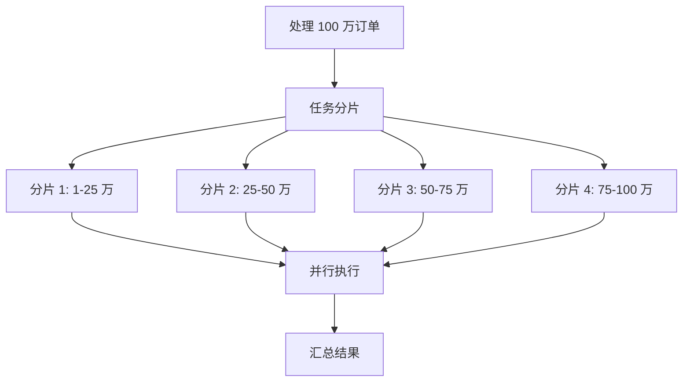
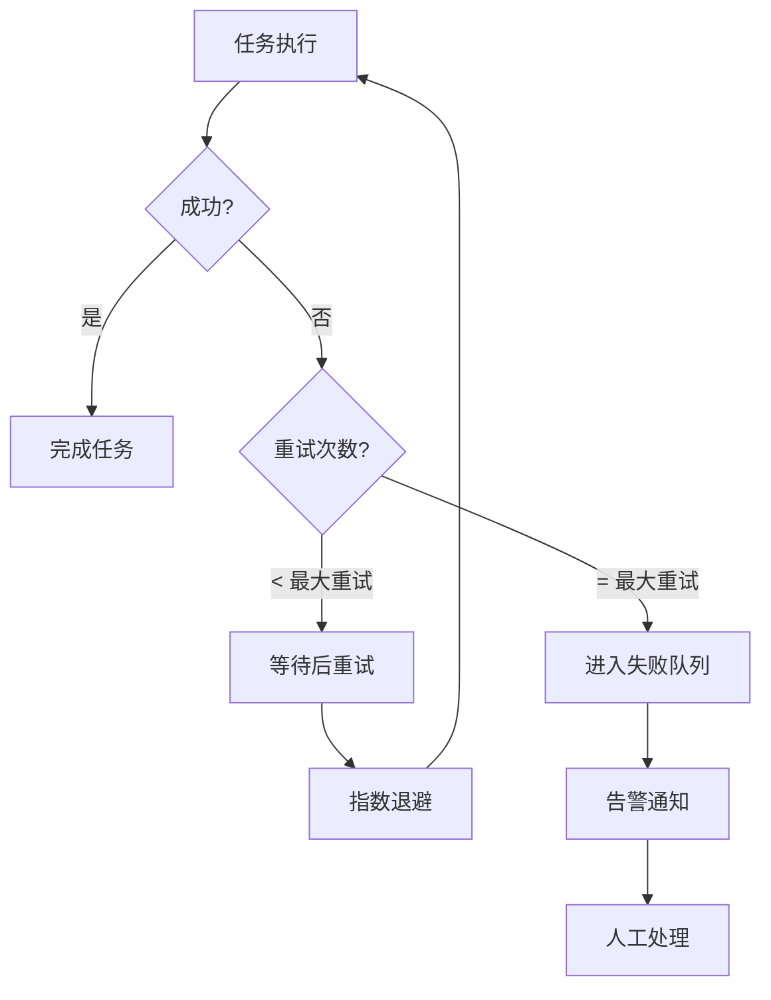
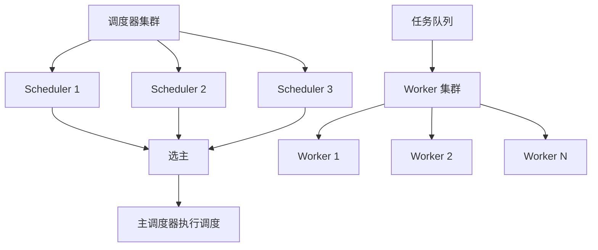

# 定时任务调度系统

**目标级别**：P6/P7

---

面试官问：「如果让你设计一个定时任务调度系统，怎么做？」——这道题考察的是你对任务调度、分布式一致性、高可用的理解。

定时任务看似简单，但生产环境的调度系统要处理分布式执行、任务分片、故障转移等问题。面试官会追问到任务幂等、分片策略、调度精度等深层问题。

## 面试题速览

| 题号 | 问题 | 频率 | 难度 |
| --- | --- | --- | --- |
| 01 | 定时任务调度的核心问题是什么？ | 🔴 高频 | P5 |
| 02 | 分布式环境下怎么避免任务重复执行？ | 🔴 高频 | P6 |
| 03 | 任务分片怎么实现？ | 🟡 中频 | P6 |
| 04 | 任务失败怎么处理？ | 🟡 中频 | P6 |
| 05 | 常见调度框架有哪些？ | 🟡 中频 | P6 |

## 一、为什么需要任务调度系统

### 简单定时任务的局限性

| 问题 | 说明 | 后果 |
| --- | --- | --- |
| **单机执行** | 应用重启后任务丢失 | 任务漏执行 |
| **无法集群** | 多实例重复执行 | 数据重复处理 |
| **无法管理** | 任务状态不可见 | 问���难以排查 |
| **无法分片** | 任务无法并行 | 执行效率低 |

### 调度系统价值



## 二、核心问题：如何避免重复执行

### 问题场景

假设「每日统计」任务部署在 3 台机器上，凌晨 0 点触发：

- 机器 1 执行一次
- 机器 2 执行一次
- 机器 3 执行一次

结果：统计数据 3 份，数据错乱。

### 解决方案

| 方案 | 原理 | 优点 | 缺点 |
| --- | --- | --- | --- |
| **抢锁** | 抢到锁才执行 | 实现简单 | 抢锁开销大 |
| **抢任务** | 抢到任务才执行 | 负载均衡 | 实现复杂 |
| **选主** | 只让主节点执行 | 简单 | 主节点压力大 |
| **时间轮** | 精确到毫秒 | 高精度 | 实现复杂 |

### 分布式锁实现



```java
public class DistributedTaskExecutor {
    
    private RedissonClient redisson;
    
    public void execute(Task task) {
        String lockKey = "task:lock:" + task.getTaskId();
        RLock lock = redisson.getLock(lockKey);
        
        try {
            // 尝试获取锁，等待 0 秒，锁自动释放时间 1 分钟
            boolean acquired = lock.tryLock(0, 60, TimeUnit.SECONDS);
            
            if (acquired) {
                try {
                    // 执行业务逻辑
                    doExecute(task);
                } finally {
                    lock.unlock();
                }
            }
            // 未获取到锁，放弃本次执行
        } catch (InterruptedException e) {
            Thread.currentThread().interrupt();
        }
    }
}
```

### ⚠️ 面试官挖坑点

**陷阱一：锁自动释放时间设置不合理**

> 面试官：「锁的自动释放时间设为 1 分钟，但任务执行需要 2 分钟，怎么办？」
>
> 错误回答：「那就设为 2 分钟」
>
> 正确回答：不能简单设为执行时间。万一任务执���卡住，锁自动释放后其他节点会抢到锁，导致任务重复执行。应该用「看门狗」机制：任务执行过程中不断续期锁，任务完成才释放。

**陷阱二：不处理锁获取失败**

> 面试官：「抢锁失败后，这个任务就这样算了？」
>
> 错误回答：「对，不执行了就」
>
> 正确回答：不是。应该记录本次触发，标记为「抢锁失败未执行」，下次调度周期再执行。或者重试几次后告警。

## 三、任务分片策略

### 什么是任务分片

任务分片是将一个大任务拆分成多个小任务，并行执行。



### 分片实现

```java
public class ShardingTaskExecutor {
    
    public void executeShardingTask(Task task, int totalShards, int shardIndex) {
        // 1. 查询需要处理的数据范围
        long startId = shardIndex * (1000000L / totalShards);
        long endId = (shardIndex + 1) * (1000000L / totalShards);
        
        // 2. 分页处理
        int pageSize = 1000;
        long currentId = startId;
        
        while (currentId < endId) {
            List<Order> orders = orderDAO.selectByIdRange(currentId, endId, pageSize);
            if (orders.isEmpty()) {
                break;
            }
            
            processOrders(orders);
            currentId = orders.get(orders.size() - 1).getId();
        }
    }
}
```

### 分片策略对比

| 策略 | 说明 | 优点 | 缺点 |
| --- | --- | --- | --- |
| **ID 取模** | `id % shardCount` | 均匀 | 扩容困难 |
| **范围划分** | 按 ID 范围分片 | 简单 | 可能不均匀 |
| **一致性哈希** | 用哈希环分配 | 扩容友好 | 实现复杂 |
| **动态分片** | 根据负载动态分配 | 负载均衡 | 实现复杂 |

## 四、任务执行模式

### 调度方式对比

| 模式 | 说明 | 适用场景 | 示例 |
| --- | --- | --- | --- |
| **固定周期** | 按固定周期重复执行 | 周期性任务 | 每分钟同步数据 |
| **Cron 表达式** | 用 Cron 表达式定义 | 复杂调度 | 每天 9 点执行 |
| **一次性** | 只执行一次 | 临时任务 | 定时发邮件 |
| **延迟执行** | 延迟一段时间执行 | 异步处理 | 30 分钟后检查 |

### Cron 表达式解析

| 字段 | 允许值 | 特殊字符 |
| --- | --- | --- |
| 秒 | 0-59 | , - * / |
| 分 | 0-59 | , - * / |
| 时 | 0-23 | , - * / |
| 日 | 1-31 | , - * / ? L W |
| 月 | 1-12 | , - * / |
| 周 | 0-6 或 SUN-SAT | , - * / ? L # |

```bash
# 示例
0 0 9 * * ?          # 每天 9 点执行
0 0/30 * * * ?        # 每 30 分钟执行
0 0 9 ? * MON-FRI      # 工作日 9 点执行
0 0 10,14,16 * * ?    # 每天 10 点、14 点、16 点执行
```

## 五、任务失败处理

### 失败策略



| 策略 | 说明 | 适用场景 |
| --- | --- | --- |
| **立即重试** | 失败后立即重试一次 | 网络瞬时抖动 |
| **指数退避** | 重试间隔递增 | 临时故障 |
| **最大重试** | 超过次数后放弃 | 确定性问题 |
| **死信队列** | 进入失败队列 | 需要人工处理 |

```java
public class TaskExecutor {
    
    private static final int MAX_RETRY = 3;
    
    public void execute(Task task) {
        int retryCount = 0;
        
        while (retryCount <= MAX_RETRY) {
            try {
                doExecute(task);
                return; // 成功退出
            } catch (Exception e) {
                retryCount++;
                if (retryCount > MAX_RETRY) {
                    // 进入死信队列
                    moveToDeadLetterQueue(task, e);
                    return;
                }
                
                // 指数退避等待
                long waitTime = (long) Math.pow(2, retryCount) * 1000;
                Thread.sleep(waitTime);
            }
        }
    }
}
```

### 任务状态管理

```sql
-- 任务执行记录表
CREATE TABLE task_execution (
    id BIGINT PRIMARY KEY AUTO_INCREMENT,
    task_id VARCHAR(64) NOT NULL COMMENT '任务 ID',
    task_name VARCHAR(128) COMMENT '任务名称',
    status TINYINT NOT NULL COMMENT '0-待执行 1-执行中 2-成功 3-失败 4-超时',
    start_time DATETIME COMMENT '开始时间',
    end_time DATETIME COMMENT '结束时间',
    error_msg TEXT COMMENT '错误信息',
    retry_count INT DEFAULT 0 COMMENT '重试次数',
    shard_index INT COMMENT '分片序号',
    created_at DATETIME,
    INDEX idx_task_status (task_id, status),
    INDEX idx_start_time (start_time)
);
```

## 六、高可用设计

### 调度器高可用



### 选主策略

| 策略 | 实现 | 优点 | 缺点 |
| --- | --- | --- | --- |
| **ZooKeeper** | 临时有序节点 | 可靠 | 引入 ZK |
| **数据库** | 主键唯一约束抢主 | 简单 | 性能差 |
| **Redis** | SET NX 抢主 | 性能好 | 需要 Redis |
| **Raft** | 一致性协议 | 自包含 | 实现复杂 |

## 七、常见调度框架对比

| 框架 | 开发语言 | 特点 | 适用场景 |
| --- | --- | --- | --- |
| **Quartz** | Java | 功能完整，稳定 | 中小企业 |
| **Elastic Job** | Java | 分布式，任务分片 | 分布式任务 |
| **XXL-Job** | Java | 调度中心，运维友好 | 运维友好 |
| **PowerJob** | Java | 任务编排，调度+执行 | 复杂任务 |
| **Airflow** | Python | DAG 编排，Python 生态 | 数据 pipeline |
| **DolphinScheduler** | Java | 可视化，K8s 集成 | 大数据平台 |

## 八、面试高频追问

### 第一层：分布式执行

> **��题**：多台机器部署定时任务，怎么避免重复执行？
>
> **参考答案**：
> 用分布式锁抢执行权。任务触发时，先尝试获取锁，获取成功才执行，执行完释放锁。如果获取锁失败，说明其他节点在执行，本节点放弃。可以配合「任务抢接」模式，节点抢到哪个分片就执行哪个分片，实现负载均衡。

### 第二层：任务分片

> **问题**：100 万条数据需要处理，怎么分片？
>
> **参考答案**：
> 按 ID 范围分片。假设 4 个节点，分片 1 处理 1-25 万，分片 2 处理 25-50 万，分片 3 处理 50-75 万，分片 4 处理 75-100 万。每个节点独立查询、独立处理，互不干扰。也可以按时间分片，比如按天分区处理。

### 第三层：任务失败

> **问题**：任务执行失败了怎么处理？
>
> **参考答案**：
> 三层处理：1）重试机制，失败后指数退避重试，最多重试 3 次；2）死信队列，超过重试次数后进入失败队列，保留执行记录；3）告警通知，发钉钉/邮件告警，人工介入处理。关键是要有任务状态追踪和执行日志。

## 九、综合对比

| 维度 | 单机定时器 | Quartz | XXL-Job |
| --- | --- | --- | --- |
| **分布式支持** | ❌ | ❌ | ✅ |
| **任务分片** | ��� | ❌ | ✅ |
| **故障转移** | ❌ | ❌ | ✅ |
| **运维界面** | ❌ | ❌ | ✅ |
| **Cron 表达式** | ✅ | ✅ | ✅ |
| **任务重试** | ❌ | 简单 | 完善 |
| **执行日志** | ❌ | 简单 | 完善 |

---

> 💡 **面试官视角**：任务调度系统考察的是你对「分布式协调」和「任务管理」的理解。关键是理解为什么需要调度系统，以及如何避免重复执行、处理失败、保证高可用。
