# 秒杀系统热点处理

**目标级别**：P6/P7

---

「100 万人同时抢购 1000 台 iPhone——这些流量有什么共同点？」

他们都在访问同一个商品 ID。这就是**热点数据**。热点数据会让单点变成性能瓶颈，让本该分散的压力集中在一个地方爆发。

## 什么是热点数据

### 热点的分类

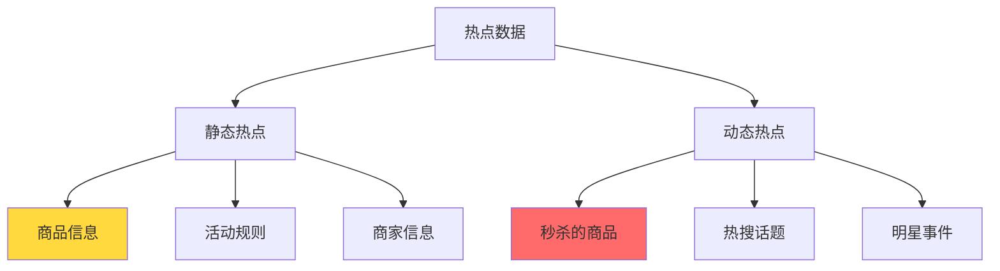

| 类型 | 特征 | 示例 | 处理方式 |
| --- | --- | --- | --- |
| **静态热点** | 可提前预知 | 爆款商品 | 预加载到缓存/CDN |
| **动态热点** | 实时生成 | 突发热搜 | 实时识别+快速缓存 |

### 热点的分级

```
热点程度 = 访问频率 × 并发用户数

| 级别 | 热点程度 | 处理策略 |
| --- | --- | --- |
| 极热 | Top 10 商品 | 必须独立处理 |
| 热门 | Top 100 商品 | 缓存优先 |
| 温热 | Top 1000 商品 | 读写分离 |
| 普通 | 其他商品 | 常规处理 |
```

## 热点识别的挑战

### 实时热点的识别

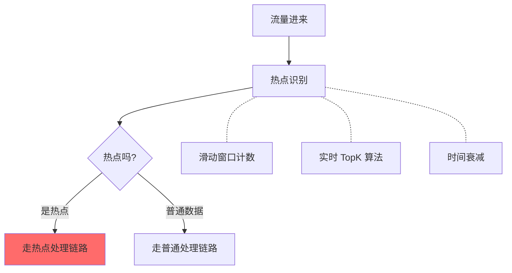

**难点一：识别延迟**

```
问题：等识别出热点时，流量高峰可能已经过去了

解决方案：
1. 热点规则提前配置（已知活动）
2. 热点识别前置（在 NGINX 层）
3. 热点识别与处理并行
```

**难点二：识别精度**

```
问题：识别太宽泛会浪费资源，识别太精准会漏掉热点

解决方案：
1. 分级处理：极热/热门/温热
2. 渐进处理：先粗筛再精筛
3. 兜底策略：识别不出来时用通用方案
```

## 热点数据处理方案

### 一、CDN 缓存静态热点

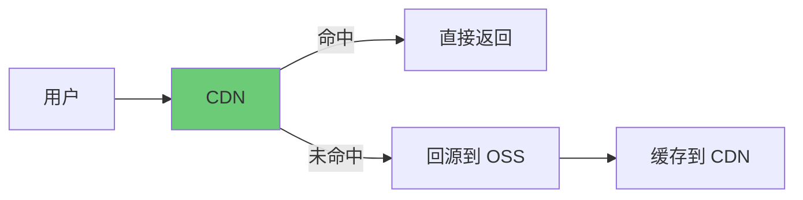

**适用场景**：商品详情页、活动规则页

**配置策略**：

| 内容 | 缓存时间 | 更新方式 |
| --- | --- | --- |
| 商品详情 | 30 秒-1 分钟 | 主动推送 |
| 活动规则 | 5 分钟 | 活动开始前推送 |
| 商家信息 | 10 分钟 | 主动推送 |

### 二、多级缓存消除热点

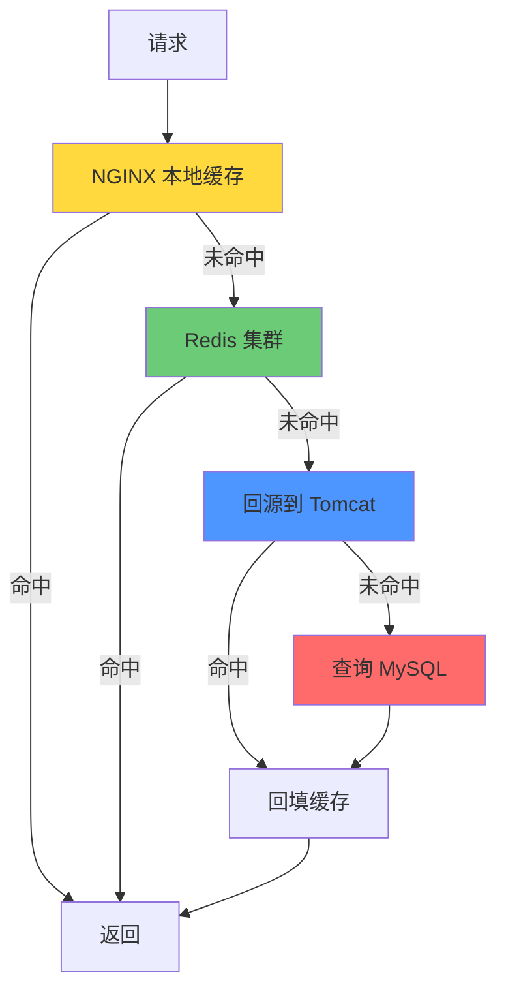

**缓存结构设计**：

```java
// 热点数据 key 设计
// 商品详情: goods:detail:`{商品ID}`
// 秒杀状态: seckill:status:`{商品ID}`
// 库存数量: seckill:stock:`{商品ID}`  // 不缓存，用原子操作
```

### 三、热点数据独立集群

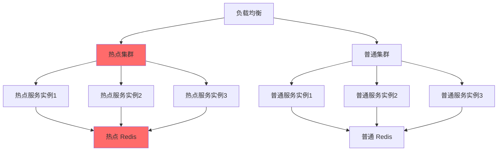

**优势**：

| 优势 | 说明 |
| --- | --- |
| 隔离资源 | 热点不会影响普通请求 |
| 独立扩容 | 热点集群可以配置更高规格 |
| 独立优化 | 可以针对热点做特殊优化 |

### 四、数据分片分散热点

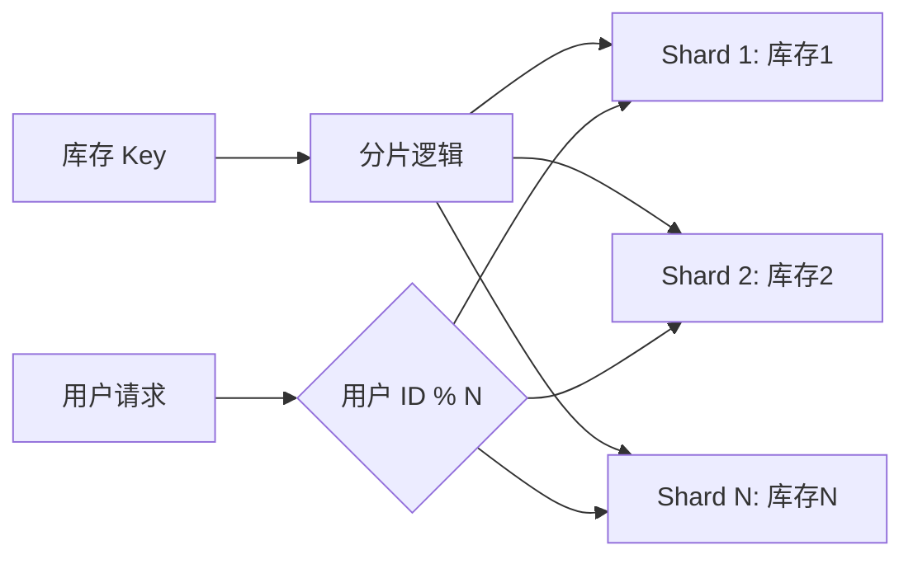

**实现示例**：

```java
// 库存分片：把单点库存分散到多个 Key
int shardCount = 10;
int shardId = userId % shardCount;
String stockKey = "seckill:" + goodsId + ":stock:" + shardId;

// 用户只能访问自己所属分片
// 最终库存 = sum(所有分片库存)
```

### 五、热点数据预热

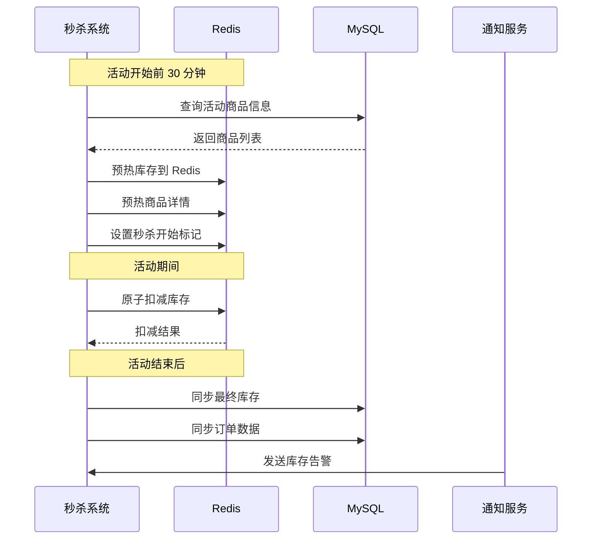

**预热内容**：

| 数据 | 预热时机 | 更新频率 |
| --- | --- | --- |
| 库存数据 | 活动前 30 分钟 | 按需更新 |
| 商品详情 | 活动前 1 小时 | 按需更新 |
| 秒杀资格 | 活动前 10 分钟 | 按需更新 |

## 秒杀热点处理详解

### 库存热点：单 Key 瓶颈

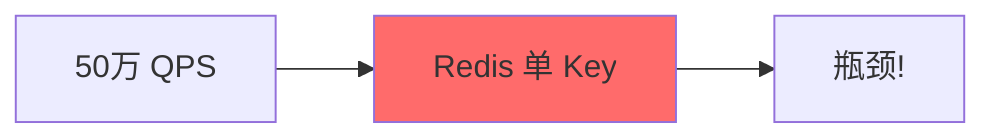

**问题**：所有请求都打同一个 Key，Redis 单线程成为瓶颈

**解决方案一：分片**

```
把单个库存 Key 拆成 N 个 Key，每个 Key 存储 1/N 的库存
用户根据某种规则（如 userId）路由到不同的分片

示例：1000 库存，分成 10 个 Key，每个 Key 100 库存
```

**解决方案二：分段**

```
把库存按时间段分段：库存_1、库存_2、库存_3
用户根据请求时间路由到不同时间段
```

### 热点商品详情页

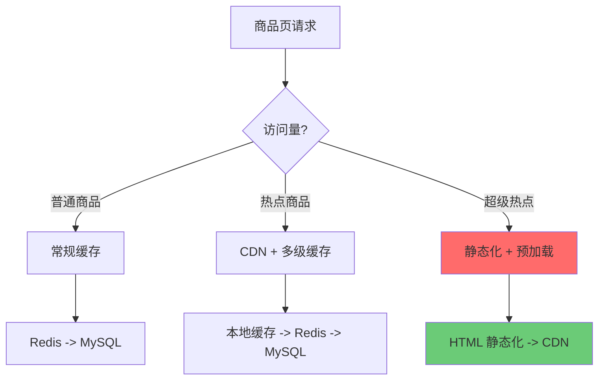

### 防热点数据击穿

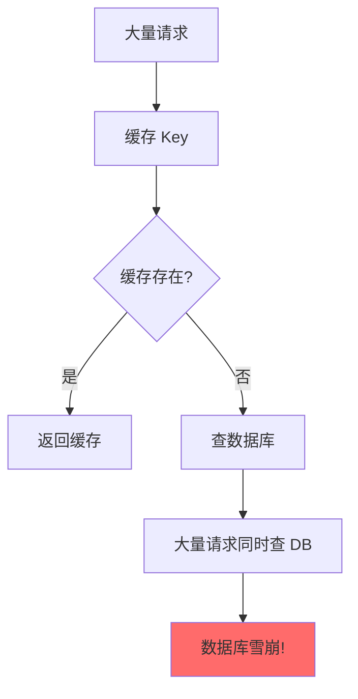

**问题**：缓存过期瞬间，大量请求同时穿透到数据库

**解决方案：热点数据永不过期 + 异步更新**

```java
// 热点数据设置为永不过期
// 后台定时任务异步更新缓存
// 用户请求时，如果发现缓存正在更新，等待一下再查

if (cache.isRefreshing()) {
    // 等待缓存更新完成
    Thread.sleep(100);
    return cache.get();
}
```

## 热点限流

### 多维度限流

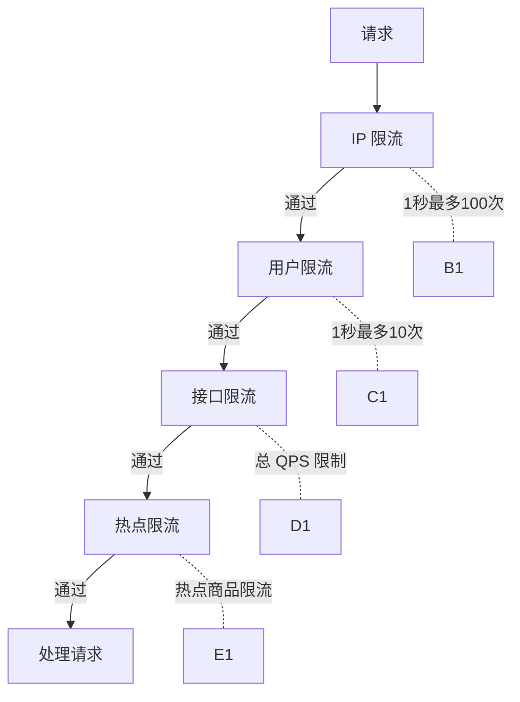

| 维度 | 限流规则 | 说明 |
| --- | --- | --- |
| IP 维度 | 100 次/秒/IP | 防止单 IP 刷接口 |
| 用户维度 | 10 次/秒/用户 | 防止单用户刷接口 |
| 接口维度 | 50 万 QPS | 保护系统总容量 |
| 热点维度 | 1000 次/秒/商品 | 保护热点数据 |

### 热点限流算法

```java
// 滑动窗口限流（热点商品）
public class HotspotRateLimiter {
    
    // 使用 Redis Sorted Set 实现滑动窗口
    public boolean isAllowed(String goodsId, String userId, int limit) {
        String key = "rate:hotspot:" + goodsId;
        long now = System.currentTimeMillis();
        long windowStart = now - 1000; // 1秒窗口
        
        // 移除窗口外的记录
        redis.zremrangeByScore(key, 0, windowStart);
        
        // 统计窗口内请求数
        long count = redis.zcard(key);
        
        if (count < limit) {
            // 添加请求记录
            redis.zadd(key, now, userId + ":" + now);
            redis.expire(key, 2); // 2秒过期
            return true;
        }
        return false;
    }
}
```

## 热点数据降级

### 多级降级策略

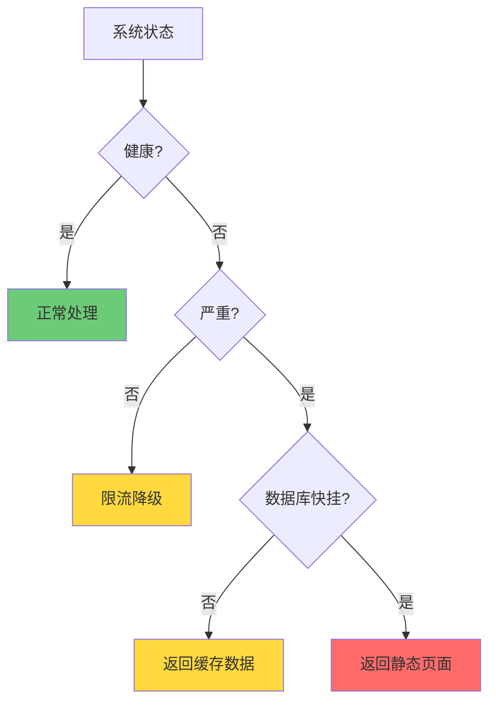

| 降级级别 | 触发条件 | 处理方式 | 影响 |
| --- | --- | --- | --- |
| L0 正常 | 系统正常 | 全功能 | 无 |
| L1 限流 | CPU > 80% | 热点限流 | 部分用户请求被拒 |
| L2 降级 | 响应时间 > 500ms | 返回缓存数据 | 数据可能不是最新 |
| L3 熔断 | 错误率 > 10% | 返回静态页 | 功能不可用 |

### 降级开关设计

```java
// 降级开关配置
public class DegradeConfig {
    
    // 商品详情降级
    public static final DegradeRule DETAIL_RULE = DegradeRule.builder()
        .enable(true)
        .fallback(() -> getStaticDetail())
        .triggerCondition(() -> redisQPS > 50万)
        .build();
    
    // 库存查询降级
    public static final DegradeRule STOCK_RULE = DegradeRule.builder()
        .enable(true)
        .fallback(() -> "有货")
        .triggerCondition(() -> dbQPS > 5000)
        .build();
}
```

## 热点数据监控

### 监控指标

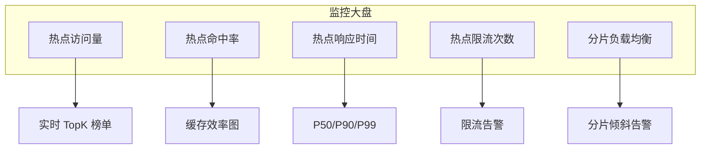

| 指标 | 正常值 | 告警阈值 | 处理 |
| --- | --- | --- | --- |
| 热点命中率 | `>` 95% | `<` 90% | 检查缓存 |
| 热点响应时间 P99 | `<` 50ms | `>` 100ms | 扩容或降级 |
| 热点限流次数 | `<` 1% | `>` 5% | 分析流量来源 |
| 分片倾斜度 | `<` 20% | `>` 50% | 检查路由逻辑 |

## 常见错误分析

### ⚠️ 错误一：热点数据没有预热

> 候选人：「我把商品信息缓存到 Redis 了」
> 面试官：「活动一开始，所有请求同时打过来，Redis 从数据库加载来得及吗？」

**问题**：冷启动时缓存为空，所有请求穿透到数据库。

**正确做法**：提前预热热点数据到缓存。

### ⚠️ 错误二：所有商品用同一个缓存 Key

> 候选人：「我把所有商品详情都缓存了，用 Key = goods:detail」
> 面试官：「那怎么区分不同商品？」

**问题**：没有按商品 ID 区分缓存。

**正确做法**：Key = goods:detail:`{商品ID}`，按商品维度缓存。

### ⚠️ 错误三：缓存失效策略不当

> 候选人：「商品详情缓存 5 分钟，过期就失效」
> 面试官：「如果秒杀进行到一半缓存失效了怎么办？」

**问题**：热点数据频繁失效，导致缓存击穿。

**正确做法**：热点数据永不过期 + 异步更新。

## 面试回答模板

```
「热点数据的处理核心是：识别热点、隔离热点、消减热点。

识别热点：
- 静态热点提前配置（已知活动）
- 动态热点实时统计（滑动窗口 TopK）

隔离热点：
- CDN 缓存静态内容
- 多级缓存（本地+Redis+数据库）
- 热点数据独立集群

消减热点：
- 分片：把单 Key 库存分到多个 Key
- 限流：多维度限流（IP/用户/接口/热点）
- 降级：多级降级策略保护系统

以秒杀库存为例，我把 1000 件库存分到 10 个 Key，
用户根据 userId % 10 路由到不同分片，
这样 Redis 单机瓶颈就变成了 10 倍吞吐。」
```

---

> 💡 **加分回答**：在面试中提到「热点数据监控」和「自动扩容」的联动机制，展示你对生产环境运维的理解。
