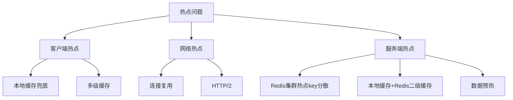

# 秒杀系统热点处理

2018年618，某电商平台发生了一次诡异的故障：系统所有指标都正常——CPU 40%，内存60%，网络带宽30%——但接口响应时间从50ms飙升到8秒。

排查了整整2个小时，最后发现：一个大V发了条微博，推荐了某款秒杀商品。那款商品的访问量在10分钟内从1万QPS涨到了50万QPS。

**50万QPS，全部打在同一个Redis key上。**

Redis单节点被打成了单向通过的瓶颈。不是CPU打满，不是内存耗尽，而是单线程的Redis在处理同一个key的并发请求时，出现了锁竞争。

这就是秒杀系统中最经典的热点问题。

【架构权衡】

热点问题的本质是**资源分布不均**。大多数请求集中在少数数据上，导致这些数据成为系统瓶颈。解决热点问题，不是让数据变"冷"，而是让数据变"散"——把一个热点的压力，分散到多个节点上。

## 一、什么是热点问题 🔴

### 1.1 热key、热value、热商品

```
热key：一个key的访问量远超其他key
示例：seckill:product:10001（某爆款商品库存）
影响：所有请求打到同一个Redis节点

热value：一个value中的某个子集被高频访问
示例：商品详情页的库存数字
影响：缓存命中率极高，但更新时大量请求同时穿透

热商品：某个商品的数据量远超其他商品
示例：大V直播间推荐的商品
影响：所有相关缓存都围绕这个商品，读写比例严重失衡
```

### 1.2 热点问题的三个层级



### 1.3 量化热点阈值

```
热点判断标准：
- 单key访问量 > 总访问量的10% → 热key
- 单商品库存更新频率 > 1000次/秒 → 热value
- 单商品页面PV > 100万/分钟 → 热商品

Redis单节点处理能力：
- GET请求：10-15万/秒
- 复杂Lua脚本：5-8万/秒
- 单key并发锁：>1万/秒时出现明显延迟
```

### 1.4 面试核心问题

> 面试官：热key问题的本质是什么？
>
> 候选人：本质是**请求分布不均**。Redis单线程处理，所有请求排队。如果50万QPS打到同一个key上，Redis处理不过来，请求就会堆积。
>
> 面试官：那怎么处理？
>
> 候选人：三个思路：
>
> 一是**分散**：把一个热key变成多个key，比如按哈希分散到N个key
>
> 二是**本地缓存**：热数据在每个服务器本地缓存一份，减少Redis压力
>
> 三是**提前预热**：秒杀开始前，把热数据加载到本地缓存

【面试官心理】

热点问题是秒杀系统的进阶考点。能回答"Redis单线程是瓶颈"说明你知道原理；能说出"hash分散"和"本地缓存"说明你知道方案；能提到"预热"说明你有实战经验。这个话题通常在P6/P7面试中出现，追问方向通常是"怎么实现"和"有什么副作用"。

## 二、热key识别 🔴

### 2.1 识别方法

```
方法1：客户端埋点
- 在SDK层统计key的访问频率
- 超过阈值时上报到热点检测服务
- 优点：准确，缺点：侵入业务代码

方法2：RedisMONITOR
- 定期执行MONITOR命令采样
- 统计采样窗口内的key频率
- 优点：非侵入，缺点：MONITOR影响性能

方法3：代理层统计
- 在Proxy层（Codis/Redis Cluster Proxy）统计
- 优点：集中统计，不影响Redis
- 缺点：需要部署代理层

方法4：Redis 4.0+ CLIENT LIST
- 定期执行CLIENT LIST查看连接信息
- 分析命令来源和执行的命令
- 优点：轻量，缺点：信息有限
```

### 2.2 生产实践

```
热点检测配置：
- 检测窗口：1秒
- 上报阈值：单key > 1000次/秒
- 检测到热点后：300ms内完成缓存预加载

热点数据特征：
- 更新频率：库存类 > 1000次/秒，价格类 > 100次/秒
- 访问频率：详情页 > 10万次/秒，评论 > 1万次/秒
- 时效性：库存类要求强一致，详情类允许秒级延迟
```

## 三、热key处理方案 🔴

### 3.1 方案一：热点key分散

```
核心思想：一个热key变成N个key

实现：给key加后缀哈希
原key：seckill:stock:10001
分散后：
- seckill:stock:10001:0（桶0）
- seckill:stock:10001:1（桶1）
- ...
- seckill:stock:10001:15（桶15）

访问时：
hash = crc32(uid) % 16
key = "seckill:stock:10001:" + hash

扣减时：遍历所有桶，有一个桶成功即成功
查询时：聚合所有桶的结果
```

:::warning ⚠️

热点分散的问题是：查询和扣减的复杂度增加。扣减时需要遍历所有桶，查询时需要聚合所有桶。对于库存扣减这种操作，可以通过增加复杂度来换QPS；但对于数据量大的场景（比如商品详情），不适用。

:::

### 3.2 方案二：本地缓存

```
核心思想：减少Redis访问，本地缓存热点数据

架构：
客户端 → 本地缓存 → Redis

实现：Guava Cache / Caffeine
- 容量：100MB（根据机器内存调整）
- TTL：热数据1秒，冷数据60秒
- 更新：写入时双写，读取时LRU

效果：
- 命中率80%：Redis QPS从50万降到10万
- 命中率95%：Redis QPS从50万降到2.5万
```

### 3.3 方案三：读写分离 + 热点池

```
核心思想：用更多Redis节点分担热点压力

Redis Cluster + 热点池：
- 普通key：按哈希槽分布到16个节点
- 热点key：复制到所有16个节点
- 读取：本地路由到最近的节点
- 写入：只写主节点

数据同步：热点key写入时，通过Pub/Sub广播到所有节点

效果：
- 原来50万QPS打1个节点
- 现在50万QPS分散到16个节点，每节点3万QPS
```

### 3.4 方案四：热点探测 + 自动迁移

```
核心流程：
1. 热点检测服务实时监控Redis MONITOR
2. 发现热key（>5000次/秒）
3. 将热key复制到多个节点（Redis主从复制）
4. 客户端路由层感知热key分布，轮询访问各节点
5. 热点消失后，自动撤销复制

实现难点：
- 热点检测有延迟（至少1秒）
- 热点可能在检测到之前就消失了
- 复制本身也消耗资源
```

## 四、热value处理 🟡

### 4.1 热value场景

```
典型场景：商品详情页中的库存数字

问题：
- 库存数字每秒更新1000次
- 50万用户每秒读取同一个value
- Redis可以扛住读，但写锁会导致读延迟

解决方案：读写分离
- 写操作：直接写Redis主节点
- 读操作：读Redis从节点（可能有1-5ms延迟）
- 库存一致性：允许5ms以内的延迟
```

### 4.2 库存扣减的热点处理

```
场景：秒杀库存扣减

错误做法：
GET stock
IF stock > 0 THEN SET stock stock-1

正确做法：
WATCH stock
stock = GET stock
IF stock > 0 THEN
  MULTI
  SET stock stock-1
  EXEC
ELSE
  UNWATCH

最佳做法（Redis原生）：
DECR stock
IF result >= 0 THEN 成功
ELSE INCR stock; 失败
```

### 4.3 库存更新的热value优化

```
优化前：每次扣减都写Redis
stock = redis.decr("seckill:stock:10001")

优化后：本地聚合 + 批量写
1. 本地AtomicInteger计数
2. 每100ms批量扣减一次Redis
3. 批量扣减命令：Lua脚本

效果：
- Redis写入次数从50万次/秒降到1万次/秒
- 代价：库存有100ms的不精确窗口
```

:::tip 💡

热value处理的核心矛盾是**一致性和性能的权衡**。库存扣减必须强一致，但可以牺牲一点实时性（100ms延迟）；商品详情可以接受最终一致，但需要保证读取性能。理解这个矛盾，才能选择正确的方案。

:::

## 五、热商品处理 🟡

### 5.1 热商品的识别

```
识别维度：
1. 访问量：PV > 100万/分钟
2. 下单量：订单 > 1万/分钟
3. 搜索量：搜索关键词 > 10万次/分钟

识别时机：
- 秒杀前：根据预约数据预判
- 秒杀中：实时监控+告警
- 秒杀后：数据分析+下一轮预案

识别后动作：
1. 热点标记：给该商品打上"hot"标签
2. 资源隔离：分配独立缓存池
3. 降级预案：如果扛不住，自动降级为"排队购买"
```

### 5.2 热商品的数据预热

```
预热时机：秒杀开始前10分钟

预热内容：
1. 商品基本信息：写入Redis集群所有节点
2. 库存扣减额度：按地域分配，避免跨机房延迟
3. 风控白名单：高频用户提前加入风控池

预热验证：
- 预热后验证所有节点的库存一致性
- 模拟100QPS压测，检查是否出现热点
- 预热失败时告警，不允许秒杀开始
```

### 5.3 热商品的服务隔离

```
物理隔离：给热商品分配独立服务集群
- 独立域名：hotticket.example.com
- 独立服务器：16核128G高配机器
- 独立Redis集群：不受其他商品影响

逻辑隔离：在同一集群内部做资源隔离
- 独立线程池：热点商品走专用线程池
- 独立缓存分区：热点数据走独立Redis分区
- 独立限流阈值：热点商品限流阈值更高
```

## 六、生产避坑 🟡

### 6.1 热点处理的五大坑

**坑1：本地缓存一致性问题**

```
问题：本地缓存更新后，Redis也更新了，但其他服务器的本地缓存还是旧值
场景：用户下单成功，库存扣减了，但其他用户看到还是旧库存
影响：误导用户以为还有库存

解决方案：
- 库存类数据：不用本地缓存，只用Redis
- 详情类数据：本地缓存TTL极短（500ms）
- 或者：写入时同时失效所有本地缓存（Pub/Sub广播）
```

**坑2：热点分散后查询变慢**

```
问题：库存从1个key变成16个key，查询库存要聚合16个结果
场景：用户查看商品详情时，需要显示总库存
影响：接口延迟增加

解决方案：
- 库存查询：本地缓存聚合结果，只在变化时更新
- 详情展示：只显示"有货"/"无货"，不显示具体数字
- 或者：用pipeline一次获取16个key
```

**坑3：热点key预热失败**

```
问题：秒杀开始前5分钟，预热脚本执行失败
场景：Redis重启后，热key没有及时加载
影响：秒杀开始瞬间，所有请求打到数据库

解决方案：
- 预热脚本必须有验证环节：预热后读一次验证
- 预热脚本失败：自动重试3次，失败则告警
- 兜底方案：本地缓存兜底，撑过预热失败的窗口期
```

**坑4：热点key的雪崩效应**

```
问题：热key过期时，瞬间大量请求穿透到数据库
场景：Redis重启或key过期，50万QPS全部打到DB
影响：数据库被打挂

解决方案：
- 热key不过期：设置TTL为-1（永不过期）
- 更新时不过期：删除后立即写入新值
- 主动续期：异步任务定期刷新热key的TTL
```

**坑5：热点key的集中失效**

```
问题：大量热key在同一时刻过期
场景：预热时设置了相同的TTL，过期时全部失效
影响：热点变冷，瞬间全部打到数据库

解决方案：
- TTL随机化：在固定TTL基础上加随机偏移（如+0~60秒）
- 过期前续期：异步任务在key过期前自动刷新
- 永不失效：对极端热key设置永不过期
```

### 6.2 监控指标

| 指标 | 正常值 | 告警阈值 | 处理方式 |
| --- | --- | --- | --- |
| 单key QPS | `<5`万 | `>10`万 | 触发热点分散 |
| Redis CPU | `<70%` | `>85%` | 扩容或分散 |
| 本地缓存命中率 | `>80%` | `<60%` | 检查TTL配置 |
| 热点key数量 | `<100` | `>500` | 检查是否有异常流量 |

【架构权衡】

热点处理没有银弹。每种方案都有trade-off：本地缓存牺牲一致性换来性能；热点分散增加复杂度；读写分离增加运维成本。关键是根据你的业务场景选择合适的方案——如果库存必须强一致，就不能用本地缓存；如果一致性可以妥协，就不要死扛Redis单点。

## 七、工程选型 🟢

| 方案 | 适用场景 | 优点 | 缺点 |
| --- | --- | --- | --- |
| 热点分散 | 库存扣减类热key | 彻底解决热点 | 实现复杂，查询变慢 |
| 本地缓存 | 读多写少类数据 | 性能提升10倍 | 一致性风险 |
| 读写分离 | 读多写少类数据 | 读写解耦 | 数据有延迟 |
| 服务隔离 | 超级爆款 | 物理隔离最可靠 | 成本高 |
| 自动探测 | 不确定热点的场景 | 自动适应 | 有探测延迟 |

## 八、真实面试回放 🟡

> **面试官**：你的秒杀系统，库存扣减用的是Redis，Redis挂了怎么办？
>
> **候选人**（老李）：Redis挂了分两种情况：
>
> 一是Redis主节点挂了，从节点自动切换。这个我们用哨兵模式，切换时间约30秒。这30秒内，库存扣减会失败，用户看到"系统繁忙"。
>
> 二是Redis集群彻底挂了，所有节点都不可用。这个我们有三级降级：
>
> 第一级：本地缓存兜底。每个JVM实例预装了100份库存，用AtomicInteger原子扣减，撑60秒。
>
> 第二级：降级为数据库直接扣减。关闭缓存，直接操作MySQL，加上分布式锁，控制并发。
>
> 第三级：熔断。如果MySQL QPS超过1万，直接返回"已售罄"，不再接受新请求。
>
> **面试官**：本地缓存兜底，库存怎么预装？
>
> **老李**：有两个策略：
>
> 第一个是静态预装。秒杀开始前10分钟，把Redis里的库存数据全部加载到每个JVM的ConcurrentHashMap里。好处是启动时就准备好了，坏处是如果秒杀取消，数据不一致。
>
> 第二个是动态兜底。当Redis QPS超过阈值（比如8万）时，动态把热点key加载到本地缓存。这需要热点探测服务配合。
>
> 我们用的是静态预装，因为秒杀商品的库存是提前知道的。
>
> **面试官**：本地缓存和Redis怎么保持一致？
>
> **老李**：库存类数据，我们**不允许**本地缓存。只用Redis。
>
> 本地缓存只用于商品详情、评价列表这类允许秒级不一致的数据。
>
> 具体做法是：更新Redis后，发布一条失效消息（Redis Pub/Sub），所有JVM收到后删除本地缓存。
>
> 这个方案的延迟是P99 < 100ms，在可接受范围内。
>
> **面试官**：可以。
>
> 【面试官手记】
>
> 老李的回答展示了三个层次：
>
> 1. 知道Redis有主从切换机制（Sentinel）
> 2. 知道主从切换有30秒窗口，所以设计了本地缓存兜底
> 3. 知道本地缓存不能用于库存（强一致性数据），只能用于详情类数据
>
> 第三个层次是关键。很多候选人设计了本地缓存，但没区分"可以容忍不一致"和"必须强一致"的数据，结果上线后出现超卖问题。能区分这个边界的，至少是P7级别的候选人。

热点处理是秒杀系统中最考验工程功力的环节。记住三个核心原则：

1. **分散优于集中**：把一个热key变成多个，是解决热key的根本
2. **本地缓存看场景**：读多写少用，写多读少别用
3. **降级是最后的防线**：再好的方案也要有Plan B兜底

当你能把热点问题讲清楚，秒杀系统的核心问题就都解决了。
