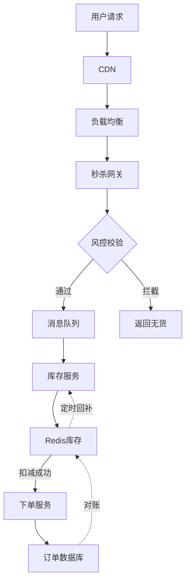

# 秒杀系统设计

2019年双十一零点14分，某电商平台的订单系统风控报警突然响起——库存扣减QPS冲到28万，数据库连接池瞬间耗尽，服务开始雪崩。

事后复盘，原因简单到可笑：一个爆款商品（iPhone 11 Pro 256G，限量500台）的秒杀活动，因为没有做库存预热，导致大量请求直接穿透到数据库。

500台iPhone，引来了50万人同时抢购。

28万QPS的库存扣减请求，把MySQL打成了筛子。

这是所有秒杀系统设计的反面教材。

【架构权衡】

秒杀系统的本质是**用可控的代价满足有限的资源**。不是让你扛住100万人同时抢500台iPhone——那是物理上不可能的事。而是让这100万人在"感觉公平"的前提下，有序地参与抢购，最终只有500人得手。

## 一、秒杀系统的本质 🔴

### 1.1 三个核心问题

秒杀系统要解决三个核心问题：

**1. 流量控制**：如何让50万QPS的请求有序通过，而不是一股脑冲垮系统？

**2. 库存扣减**：如何在高并发下正确扣减有限库存，不超卖、不少卖？

**3. 订单核对**：如何保证最终一致性，不丢单、不多单？

这三个问题的难度依次递增。一个"能用"的秒杀系统能解决第一个问题；一个"好用"的秒杀系统能解决前两个；一个"工业级"的秒杀系统必须同时解决三个。

### 1.2 典型架构演进



**架构分层**：
- 第一层：CDN + 负载均衡（扛住入口流量）
- 第二层：秒杀网关 + 风控（拦住非法流量）
- 第三层：消息队列（削峰填谷）
- 第四层：库存服务 + Redis（原子扣减）
- 第五层：下单服务 + 数据库（持久化订单）

### 1.3 面试核心指标

> 面试官：秒杀系统的核心指标是什么？
>
> 候选人：三个：
>
> 一是**系统可用性**：秒杀期间服务不能挂，要保证99.99%的可用性。
>
> 二是**库存准确性**：不能超卖（卖出501台），也不能少卖太多（只卖出450台）。
>
> 三是**用户体验**：抢到的用户在3秒内收到反馈，没抢到的用户要在10秒内收到反馈。
>
> 面试官：超卖和少卖，哪个更严重？
>
> 候选人：超卖更严重。少卖只是商业损失，超卖会引发客诉、赔偿、平台信任危机。所以我们宁可少卖，不能超卖。

【面试官心理】

秒杀系统是面试中的高频考点，也是最能展示工程思维的题型。面试官问这道题，通常不是想听你背架构图，而是想看你能不能把"高并发"、"数据一致性"、"系统可用性"这三个分布式系统的经典矛盾串起来讲清楚。能说出"宁可少卖不超卖"的候选人，说明他真正思考过业务约束。

## 二、流量削峰 🔴

### 2.1 为什么需要削峰

```
不做削峰：
用户发起请求 → 直接打到DB → 数据库连接耗尽 → 服务雪崩 → 全挂

做削峰：
用户发起请求 → 消息队列 → 异步处理 → 数据库 → 服务存活 → 正常下单
```

核心思想：**用"时间换空间"**——把100万人在1秒内的请求，分散到1000人在1000秒内处理。

### 2.2 削峰四件套

**1. 验证码/问答**

```
原理：在秒杀入口增加一道人机识别
- 秒杀前5分钟放出验证码
- 答题正确才能参与秒杀
- 机器人和真人混在一起，挡住80%机器流量

优点：实现简单，对正常用户干扰小
缺点：用户体验略有下降，不能完全挡住脚本

实际效果：挡住 70-90% 的机器刷单
```

**2. 秒杀令牌**

```
原理：只有持有有效令牌的请求才能进入秒杀链路
- 秒杀开始前，用户需要先获取令牌
- 令牌有有效期（60秒）和数量限制（与库存1:1）
- 获取令牌时做简单风控（同一用户限速）

优点：精确控制进入秒杀链路的人数
缺点：增加一次接口调用

实际效果：削峰比例 1:100（100万请求缩到1万）
```

**3. 消息队列**

```
原理：将同步扣减改为异步处理
- 用户下单请求进入MQ
- 后台消费者异步处理库存扣减
- 用户端轮询或推送获取结果

优点：彻底隔离前端流量和后端处理能力
缺点：用户等待时间长，需要轮询或WebSocket

削峰能力：100万请求/秒 → 1万处理/秒
```

**4. 预约+分层**

```
原理：提前预约，分时段参与
- 秒杀前1天开始预约，收集用户意向
- 根据预约数据，提前分配服务器资源
- 分时段放行，控制同时在线人数

优点：资源准备充分，峰值可预测
缺点：用户需要提前预约，流程变长

实际效果：将峰值QPS平滑到平均值的1.5倍
```

### 2.3 削峰策略对比

| 策略 | 削峰比例 | 实现成本 | 用户体验影响 | 适用场景 |
| --- | --- | --- | --- | --- |
| 验证码 | 70-90% | 低 | 轻微 | 所有秒杀 |
| 令牌 | 99% | 中 | 无 | 限量严格场景 |
| 消息队列 | 任意比例 | 高 | 需等待 | 库存充足场景 |
| 分时段预约 | 平滑 | 高 | 需预约 | 超级爆款 |

:::tip 💡

生产环境中，通常组合使用多种削峰策略：验证码挡住机器 → 令牌控制并发 → 消息队列平滑处理。这三层削峰下来，100万QPS能降到1万QPS，数据库完全扛得住。

:::

## 三、库存扣减 🔴

### 3.1 为什么不能用数据库直接扣减

```
直接扣减SQL：
UPDATE inventory SET stock = stock - 1 WHERE product_id = ? AND stock > 0

问题分析：
- 50万人同时执行这条SQL
- MySQL单表写入上限约2000 QPS
- 剩余49000 QPS会排队等待
- 排队超时 → 连接耗尽 → 服务雪崩
```

### 3.2 Redis原子扣减方案

```
核心思想：把库存扣减操作从数据库迁移到Redis

Step 1: 库存预热
- 秒杀开始前，将商品库存写入Redis
- SET seckill:stock:{product_id} 500

Step 2: Lua脚本原子扣减
EVAL "
  local stock = redis.call('GET', KEYS[1])
  if tonumber(stock) <= 0 then
    return -1
  end
  return redis.call('DECR', KEYS[1])
" 1 seckill:stock:{product_id}

Step 3: 异步落库
- Redis扣减成功后，发送消息到MQ
- 消费者异步创建订单、更新数据库库存
```

### 3.3 超卖问题的根因

```
为什么会超卖？

场景还原：
1. 线程A读取库存=1
2. 线程B读取库存=1
3. 线程A扣减成功，库存=0
4. 线程B扣减成功，库存=-1  ← 超卖了！

本质：读-改-写不是原子操作

解决方案：Redis单线程 + Lua原子脚本

Lua脚本等价于：
if (redis.call('GET', key) > 0) {
  return redis.call('DECR', key);
}
return -1;
```

### 3.4 库存扣减的三个坑

**坑1：Redis挂了**

> 问题：Redis宕机，所有扣减操作失败
>
> 解决方案：
> - Redis集群部署（主从 + 哨兵）
> - 写成功后立即异步落库
> - 库存扣减成功后，给用户一个"预下单成功"
> - 如果MQ消费失败，通过对账补单

**坑2：Redis和数据库不一致**

> 问题：Redis扣减成功，但MQ消息丢失，导致少卖
>
> 解决方案：
> - 订单创建时校验Redis库存（乐观锁）
> - 每5分钟对账一次：Redis库存 + 已下单未支付数 = 总库存
> - 发现差异时，触发补库存流程

**坑3：库存回滚**

> 问题：用户下单后15分钟未支付，库存要回滚
>
> 解决方案：
> - 下单时冻结库存（stock - 1 → frozen_stock + 1）
> - 支付成功：frozen_stock → 已售
> - 超时未支付：frozen_stock → stock
> - 或者：支付成功才扣减库存，下单只做预占

【架构权衡】

库存扣减的核心矛盾是"性能 vs 一致性"。直接用数据库扣减，一致性最好（事务保证），但性能最差；用Redis扣减，性能最好，但需要额外的补偿机制保证一致性。工程上没有银弹，关键是**明确你的业务约束**：超卖容忍度是多少？少卖容忍度是多少？能接受多长的不一致窗口？

## 四、订单核对 🟡

### 4.1 三种订单状态

```
订单状态机：

[创建] → [已支付] → [已完成]
   ↓         ↓
[取消]    [已退款]

关键点：
- 创建订单后有15分钟支付窗口
- 超时未支付 → 自动取消 → 库存回滚
- 支付成功才算真正成交
```

### 4.2 对账机制

```
对账目的：发现Redis和数据库不一致

对账公式：
Redis剩余库存 + 冻结库存 + 已下单未支付 = 总库存
Redis剩余库存 + 已售 = 总库存

触发条件：
- 每5分钟定时对账
- 秒杀结束后对账
- 库存低于阈值时对账

不一致处理：
- Redis多：可能是MQ消息重复消费，降级处理
- Redis少：可能是MQ消息丢失，补发消息
```

### 4.3 幂等性保证

```
为什么需要幂等？
- MQ消息可能重复投递
- 用户可能重复点击
- 网络超时后重试

幂等方案：
- 数据库：订单号唯一索引，重复插入报错
- Redis：下单时写入幂等标记 SETNX order:idempotency:{order_id} 1
- 业务：订单状态机只能正向流转，已支付不能重复扣库存
```

## 五、生产避坑 🟡

### 5.1 五大翻车现场

**翻车1：库存预热失败**

```
现象：秒杀开始瞬间，系统雪崩
根因：Redis库存预热脚本执行失败，但没人发现
教训：
- 秒杀前2小时自动预热，并验证预热结果
- 预热脚本写入监控告警，失败即通知
```

**翻车2：热点用户刷单**

```
现象：同一用户抢了多个订单
根因：没有做用户维度的限流
教训：
- 每个用户每种商品限购1件（Redis SETNX user:product:{uid}:{pid}）
- 风控系统实时监控同一用户的下单频率
```

**翻车3：超卖**

```
现象：卖出数量 > 库存数量
根因：Lua脚本逻辑有bug，或者Redis主从切换时数据丢失
教训：
- Lua脚本上线前必须做压力测试
- Redis用集群模式，不用主从模式
- 下单前再次校验Redis库存
```

**翻车4：库存回滚不及时**

```
现象：用户下单后不付款，库存一直冻结
根因：超时取消任务挂了，或者执行时间太长
教训：
- 定时任务用分布式调度（如XXL-Job），多机执行
- 取消操作要幂等，允许重复执行
- 库存冻结时间要合理（15分钟够用）
```

**翻车5：CDN缓存过期**

```
现象：秒杀开始前，用户访问的还是"即将开始"页面
根因：CDN缓存TTL设置过长
教训：
- 秒杀相关页面TTL设置为0或极短
- 秒杀开始前用CDN刷新接口，主动失效缓存
```

### 5.2 监控指标清单

| 指标 | 阈值 | 处理方式 |
| --- | --- | --- |
| 秒杀网关QPS | `>50`万 | 限流 |
| Redis库存 | `<100` | 提前预判断货 |
| MQ积压 | `>10`万 | 加消费者 |
| 下单成功率 | `<95%` | 降级非核心链路 |
| P99延迟 | `>500`ms | 扩容 |

:::warning ⚠️

秒杀系统最怕的不是慢，而是"不可预测"。平时正常，突然某一秒全挂——这种黑天鹅事件往往是因为忽略了某些边界条件。秒杀前一定要做全链路压测，把所有依赖项（Redis、MySQL、MQ、第三方支付）都纳入压测范围。

:::

## 六、工程代价评估 🟢

| 维度 | 评估 |
| --- | --- |
| 开发成本 | 高（需要改动多个系统：网关、库存、订单、对账） |
| 运维成本 | 高（需要实时监控库存、队列积压、订单状态） |
| 排障复杂度 | 中（库存不一致时需要快速对账） |
| 扩展性 | 好（削峰和扣减组件可复用） |
| 回滚风险 | 低（库存未受影响时可以快速回滚） |

## 七、面试应答模板 🟢

### 7.1 万能应答结构

```
第一部分：明确约束
"秒杀系统的核心约束是：不能超卖、不能少卖太多、用户体验要好"

第二部分：架构分层
"我设计三层架构：
1. 入口层：CDN + 验证码 + 令牌，控制进入人数
2. 扣减层：Redis + Lua脚本，保证原子扣减
3. 下单层：MQ + 数据库，保证最终一致性"

第三部分：关键设计
"核心是Redis原子扣减 + 异步下单。
Redis扣减成功后发MQ，消费者异步创建订单。
每5分钟对账，发现不一致时补偿"

第四部分：容灾降级
"如果Redis挂了，启用本地缓存 + 降级策略；
如果MQ积压，限流 + 扩容消费者；
如果超卖，触发熔断，返回用户'系统繁忙'"
```

### 7.2 高频追问应答

**Q：如何保证不超卖？**

> 用Redis + Lua脚本原子扣减，扣减成功后才发MQ，MQ消费失败时补偿。
>
> 关键点：Lua脚本里要有 `if (stock <= 0) return -1` 的判断。

**Q：如何处理少卖？**

> 少卖的原因是用户下单后不付款，超时取消后库存回滚。
>
> 我们用定时任务扫描超时订单，每5分钟执行一次。
>
> 另外，秒杀结束后会对账，发现Redis和DB不一致时补发消息。

**Q：Redis挂了怎么办？**

> 方案一：本地缓存兜底。库存预热到每个服务器的JVM内存，用AtomicInteger保证线程安全。适合小库存场景。
>
> 方案二：降级为直接查数据库。如果Redis全挂，切换到数据库直接扣减（需要数据库能扛住）。
>
> 方案三：熔断。当Redis错误率超过10%，自动熔断，降级到排队购买。

【面试官心理】

秒杀系统的追问，通常会围绕"一致性"和"容灾"展开。面试官想看的不是你背了哪些方案，而是你有没有"兜底意识"——当核心组件挂了，你的系统还能不能降级运行。能说出"本地缓存兜底"或"熔断降级"的候选人，说明他有生产环境的实战经验，不是纸上谈兵。

## 八、真实面试回放 🟡

> **面试官**：设计一个12306火车票秒杀系统，10万张票，1000万人抢购。
>
> **候选人**（小张）：我先确认几个约束：
>
> - 这10万张票是同一个车次同一时间，还是多个车次？
> - 用户一次可以买几张？
> - 超卖容忍度是多少？
>
> **面试官**：多车次多日期，用户一次最多买5张，允许极少量超卖（票到人不到）。
>
> **小张**：明白。按1000万QPS设计，核心问题有三个：风控拦截、库存扣减、订单创建。
>
> 架构上分四层：
>
> 第一层：CDN + 验证码，挡住70%流量
>
> 第二层：秒杀网关 + 令牌桶，精确控制并发。令牌数量=库存×110%，多出10%是给取消订单回滚预留的。
>
> 第三层：Redis库存扣减 + 本地缓存兜底
>
> 第四层：MQ + 订单服务
>
> **面试官**：为什么需要本地缓存兜底？
>
> **小张**：Redis虽然很快，但机器挂了或者网络抖动时，请求会直接打到数据库。本地缓存是最后一道防线，每个JVM实例缓存100张票，原子扣减，撑30秒足够运维切换Redis主从了。
>
> **面试官**：火车票有个特殊性是选座，怎么处理并发选座？
>
> **小张**：好问题。选座需要座位级别的一致性。方案是：
>
> - 每个座位单独一个Redis key：`seat:{train_id}:{carriage}:{row}:{col}`
> - 用户选座时，原子检查+锁定该座位
> - Lua脚本：GET + 判断 + SETNX
> - 如果座位被锁定，返回"已被选择"
>
> **面试官**：如果用户选了5个座位，第6个座位没抢到怎么办？
>
> **小张**：两种方案：
>
> - 方案一：分布式事务。用户先选5个座位，第六个座位失败时，回滚前5个。但分布式事务性能差。
>
> - 方案二（推荐）：分段锁。座位按车厢分组，每个车厢有自己的锁。用户先选座，提交订单时如果某个座位失败，整个订单失败，用户重新选择。这样可以用乐观锁，不需要分布式事务。
>
> **面试官**：可以。你来总结一下核心设计。
>
> **小张**：核心设计三点：
>
> 1. 多层削峰：CDN + 验证码 + 令牌 + MQ，逐层过滤
> 2. 原子扣减：Redis Lua脚本 + 本地缓存兜底
> 3. 最终一致：MQ异步下单 + 定时对账 + 补偿机制
>
> 最大挑战是选座的并发控制，我选择分段锁方案，牺牲部分灵活性换一致性。
>
> **面试官**：很好。
>
> 【面试官手记】
>
> 小张这场面试表现出色的地方：
>
> 1. 确认约束时才问"多车次"和"超卖容忍度"——说明他知道不同场景方案不同
> 2. 令牌数量 = 库存 × 110% —— 说明他考虑到库存回滚
> 3. 本地缓存兜底 —— 说明他考虑到Redis容灾
> 4. 选座问题回答得好：分段锁方案是工程中的常见选择，比分布式事务轻量得多
>
> 这场面试属于P7级别的系统设计，小张的回答超出了"秒杀系统"的范畴，进入到"复杂一致性场景"的深度讨论。加分。

秒杀系统是系统设计中的"老网红"，但真正能在面试中把每个环节讲清楚的候选人不到20%。

记住三个核心：
1. **削峰**：把100万QPS变成1万QPS，用令牌、队列、验证码
2. **扣减**：Redis + Lua原子操作，保证不超卖
3. **一致性**：MQ + 对账 + 补偿，保证最终一致

当你能在白板上把这三件事讲清楚，秒杀系统这关就算过了。
