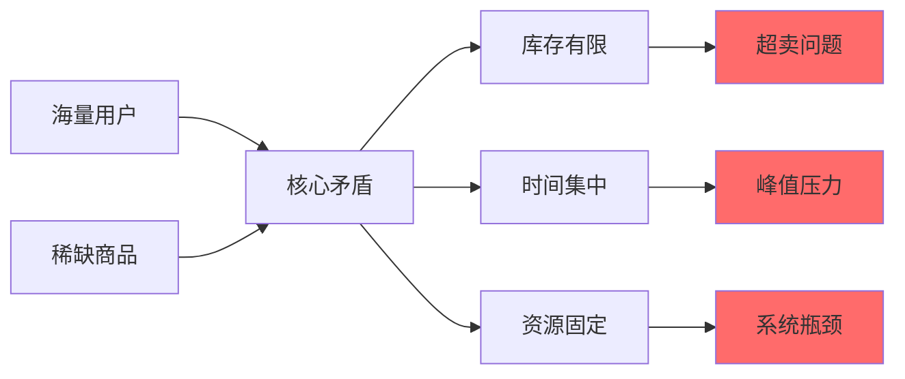
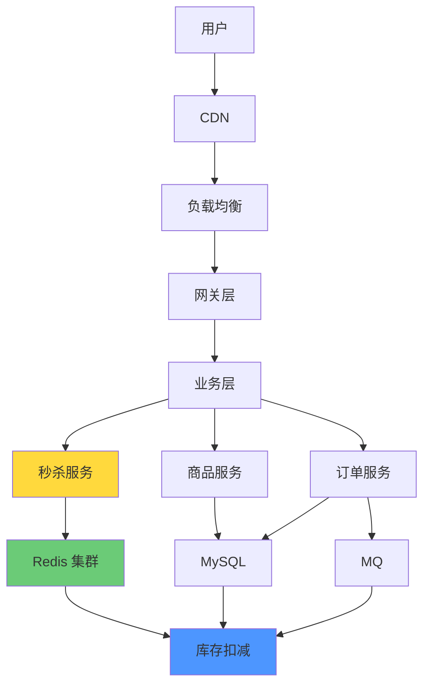
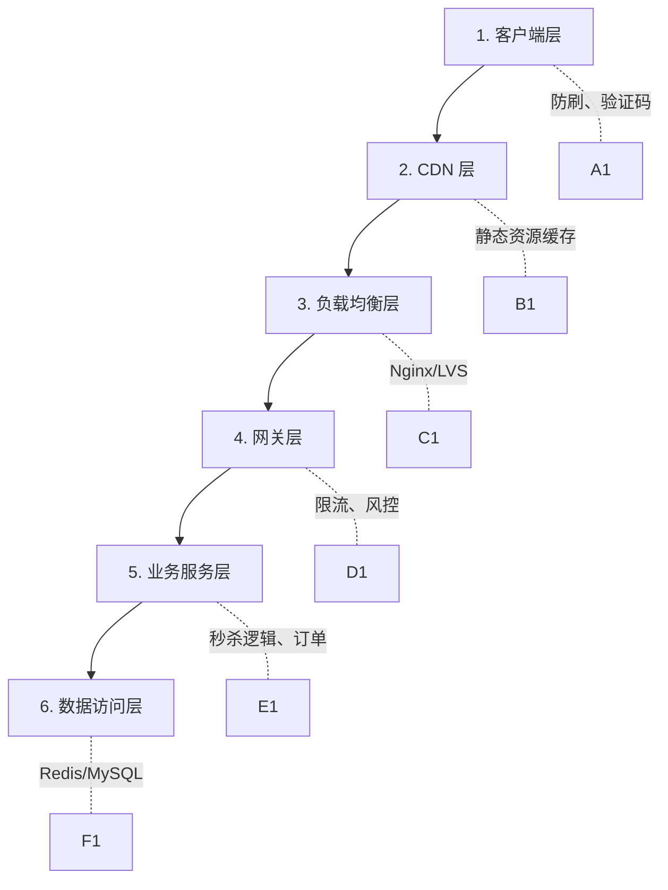
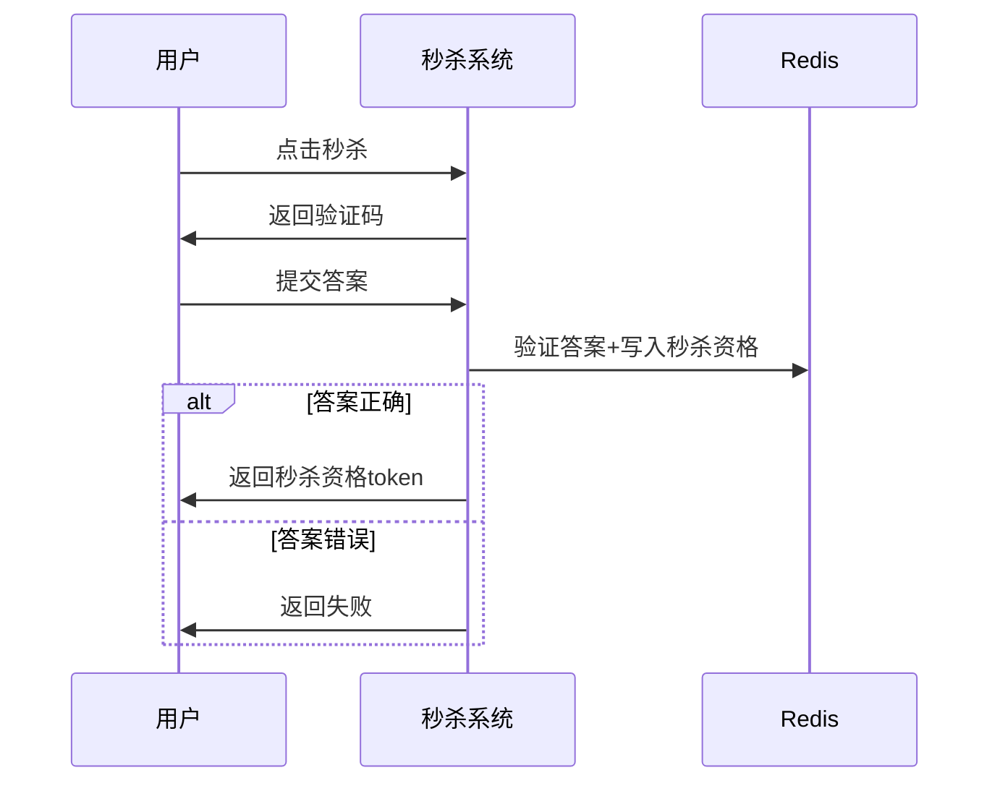
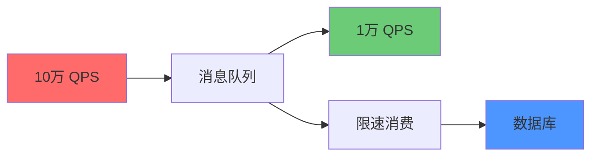
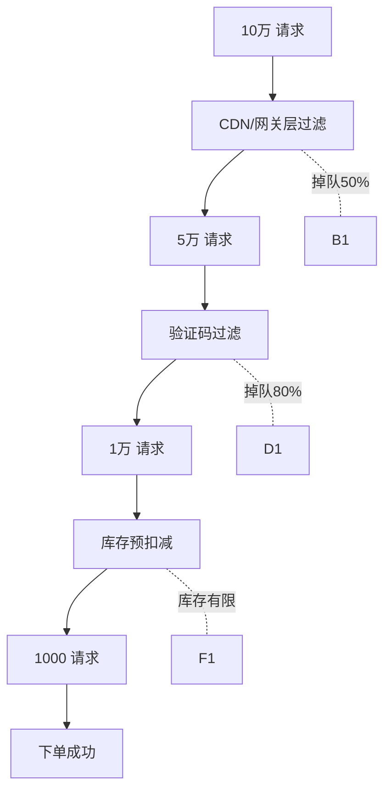
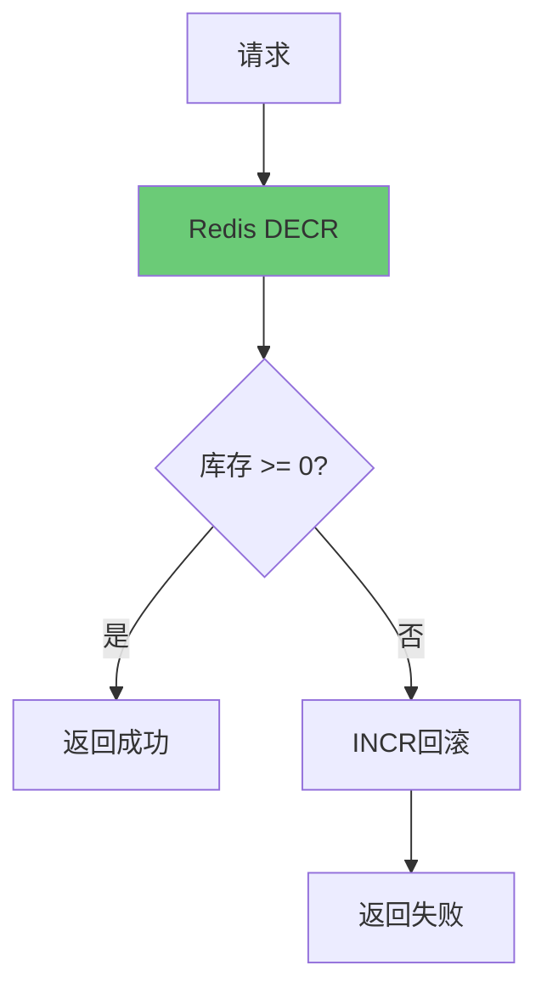
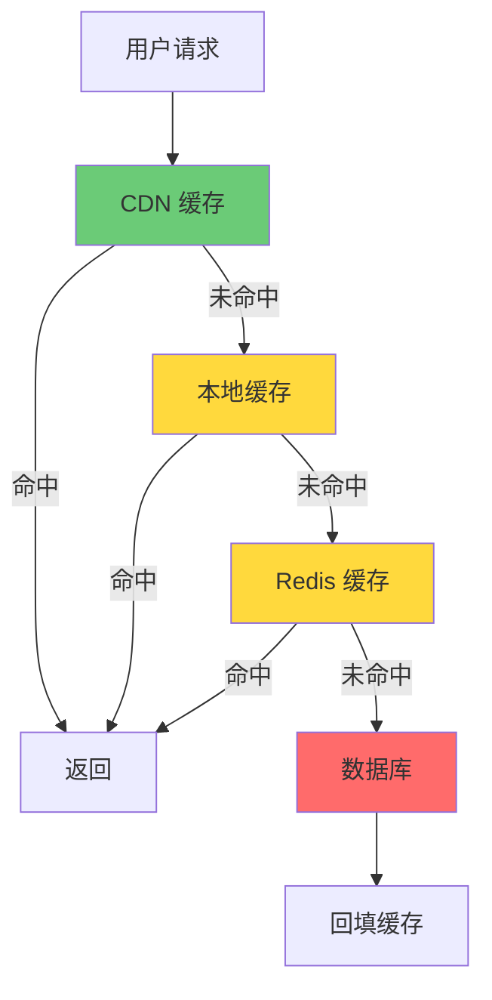

# 秒杀系统设计

**目标级别**：P6/P7

---

「双十一零点，1000 万人同时抢购 iPhone 15，库存只有 100 台——你怎么设计这个系统？」

这是面试中最经典的高并发场景题。但面试官真正想问的不是你知道多少高并发技术，而是你面对「资源极度有限、流量极度爆发」这个核心矛盾时，如何做出正确的技术取舍。

## 核心问题分析

### 秒杀系统的本质

秒杀系统的本质是：**用有限的资源服务无限的流量**。



### 三大核心挑战

| 挑战 | 说明 | 解决思路 |
| --- | --- | --- |
| **高并发** | 瞬时流量是平时的 100-1000 倍 | 削峰、限流、分流 |
| **超卖问题** | 库存卖成负数 | 原子操作、乐观锁 |
| **资源浪费** | 大量请求打到数据库 | 缓存、异步、排队 |

## 架构设计

### 整体架构图



### 分层设计



## 关键技术方案

### 一、流量削峰

#### 1. 验证码/答题

```
「在秒杀开始前加入一道计算题，
不仅能挡住一半的机器流量，
还能把峰值请求分散到 10 秒内」
```

**实现原理**：



**适用场景**：防止黄牛、削峰 30-50%

#### 2. 消息队列削峰

```
「把瞬时高并发写入变成平滑的队列消费，
数据库只需要按照自己的节奏处理」
```



#### 3. 分层过滤

```
「把 99% 的无效流量在最外层就过滤掉，
只让 1% 的有效请求进入核心系统」
```



### 二、库存扣减方案

#### ⚠️ 超卖问题的本质

超卖不是因为并发高，而是因为**读和写不是原子的**：

```mermaid
flowchart sequence
    A["请求1: SELECT库存"] --> B["库存=10"]
    C["请求2: SELECT库存"] --> D["库存=10"]
    E["请求1: UPDATE库存=库存-1"] --> F["库存=9"]
    G["请求2: UPDATE库存=库存-1"] --> H["库存=8"]
    
    Note over A,H: 正常情况：库存从10减到8，卖了2件
```

```mermaid
flowchart sequence
    A["请求1: SELECT库存"] --> B["库存=10"]
    C["请求2: SELECT库存"] --> D["库存=10"]
    E["请求1: UPDATE库存=库存-1"] --> F["库存=9"]
    G["请求2: UPDATE库存=库存-1"] --> H["库存=8"]
    
    Note over A,H: 问题：如果只有1件库存，两个请求都读到10，都扣减，都成功
```

#### 方案一：Redis 原子扣减



**实现代码逻辑**：

```java
// Lua 脚本保证原子性
String luaScript = 
    "local stock = redis.call('GET', KEYS[1]) " +
    "if tonumber(stock) <= 0 then return 0 end " +
    "redis.call('DECR', KEYS[1]) " +
    "return 1";
    
redis.eval(luaScript, 1, "seckill:stock:123");
```

**优缺点**：

| 维度 | 说明 |
| --- | --- |
| ✅ 优点 | 性能极高，QPS 可达 10 万+ |
| ✅ 优点 | 原子操作，不会超卖 |
| ❌ 缺点 | Redis 挂了怎么办？ |
| ⚠️ 注意 | 需要定期同步库存到数据库 |

#### 方案二：数据库乐观锁

```java
// 使用版本号或条件更新
UPDATE seckill_goods 
SET stock = stock - 1 
WHERE goods_id = ? AND stock > 0;
```

**优缺点**：

| 维度 | 说明 |
| --- | --- |
| ✅ 优点 | 强一致，不依赖外部组件 |
| ✅ 优点 | 实现简单，不超卖 |
| ❌ 缺点 | 并发高时大量请求失败 |
| ❌ 缺点 | 数据库压力仍然较大 |

#### 方案三：数据库悲观锁

```java
// 使用 FOR UPDATE 悲观锁
SELECT stock FROM seckill_goods WHERE id = ? FOR UPDATE;
// 业务逻辑判断
UPDATE seckill_goods SET stock = stock - 1 WHERE id = ?;
```

**⚠️ 缺点**：并发高时会产生大量锁等待，不推荐用于秒杀场景。

#### 方案对比

| 方案 | QPS 能力 | 一致性 | 复杂度 | 推荐场景 |
| --- | --- | --- | --- | --- |
| Redis 原子扣减 | 10 万+ | 最终一致 | 中 | **首选方案** |
| 乐观锁 | 3000-5000 | 强一致 | 低 | 小规模秒杀 |
| 悲观锁 | 1000 以下 | 强一致 | 中 | 不推荐 |

### 三、多级缓存策略



**缓存数据**：

| 数据 | 缓存位置 | 过期时间 | 说明 |
| --- | --- | --- | --- |
| 商品详情 | CDN + 本地 | 1 分钟 | 变化少 |
| 秒杀开始标志 | Redis | 30 秒 | 高频读取 |
| 库存余量 | Redis | 0 | 不缓存 |
| 秒杀资格 | Redis | 5 分钟 | 用户维度 |

### 四、MQ 异步下单

```mermaid
flowchart sequence
    participant U as 用户
    participant A as API
    participant R as Redis
    participant M as MQ
    participant O as 订单服务
    
    U->>A: 秒杀请求
    A->>R: 扣减库存
    alt 库存充足
        A->>M: 发送下单消息
        A->>U: 返回排队中
        M->>O: 投递消息
        O->>O: 创建订单
        O->>U: 通知结果
    else 库存不足
        A->>U: 返回售罄
    end
```

**消息可靠性保证**：

1. **发送端确认**：消息成功投递到 MQ 才扣减库存
2. **消费端确认**：订单创建成功才 ACK
3. **定时补偿**：定期检查超时未完成的订单

## 容量估算

### 秒杀系统规模假设

| 参数 | 假设值 | 说明 |
| --- | --- | --- |
| 参与用户 | 100 万 | 活动预热 |
| 峰值 QPS | 50 万 | 点击瞬间 |
| 商品数量 | 1000 件 | 稀缺商品 |
| 持续时间 | 1 小时 | 活动窗口 |

### 资源估算

| 组件 | 估算方法 | 数量 | 备注 |
| --- | --- | --- | --- |
| API 服务器 | 50万 ÷ 2000 | 250 台 | 峰值预留 |
| Redis 集群 | 10万 QPS | 4 台 | 主从+哨兵 |
| MySQL | 1万 TPS | 8 台 | 分库分表 |
| MQ | 10万 QPS | 6 台 | 3主3从 |

## 常见错误分析

### ⚠️ 错误一：在数据库层面做库存扣减

> 候选人：「用 UPDATE stock = stock - 1 WHERE id = ? AND stock > 0」
> 面试官：「100 万 QPS 打进来，你的数据库能扛住吗？」

**问题**：数据库单机只有 3000-5000 QPS，100 万 QPS 会直接被打挂。

**正确做法**：在 Redis 层做库存扣减，异步落库。

### ⚠️ 错误二：先扣库存再发消息

> 候选人：「先扣库存，扣成功就发 MQ」
> 面试官：「如果 MQ 挂了，库存已经扣了怎么办？」

**问题**：库存扣减和消息发送不是原子操作，可能出现数据不一致。

**正确做法**：先发 MQ，MQ 确认后再扣库存，或者使用 TCC 事务。

### ⚠️ 错误三：忘记限流

> 候选人：「把系统设计得很完美...」
> 面试官：「如果有人用脚本刷你怎么办？」

**问题**：没有防刷措施，系统可能被恶意流量打垮。

**正确做法**：加入验证码、IP 限流、接口限流。

## 面试回答模板

### 简洁版（1 分钟）

```
「秒杀系统的核心矛盾是：海量请求 vs 有限库存。

我的设计分为三层：
1. 流量层：CDN + 负载均衡 + 验证码，挡住 90% 的无效流量
2. 缓存层：Redis 做库存扣减，单机可达 10 万 QPS
3. 异步层：MQ 削峰，订单服务异步处理

关键点是用 Redis 做库存扣减保证原子性，用 MQ 异步下单保证系统稳定性。」
```

### 详细版（3-5 分钟）

```
「秒杀系统有三个核心挑战：高并发、超卖、资源浪费。

第一，流量削峰。
我在入口加入验证码，把峰值请求分散到 10 秒内。
同时使用分层过滤：CDN 层过滤 50%，验证码层过滤 80%，只有 1% 的请求能进入核心系统。

第二，库存扣减。
我采用 Redis + MQ 的方案：
用户请求先到 Redis，用 Lua 脚本做原子扣减。
扣减成功后才发 MQ 消息，订单服务消费消息创建订单。
这样做的好处是 Redis 单机可达 10 万 QPS，完全扛得住峰值压力。

第三，一致性保证。
Redis 库存是热点数据，丢失不可接受。
所以 Redis 和 MySQL 需要定期同步：
每秒从 MySQL 同步一次库存到 Redis，
每分钟对账一次，发现差异及时告警。

整体架构是：
用户 -> CDN -> Nginx -> Gateway -> 秒杀服务 -> Redis/MQ -> 订单服务 -> MySQL」

（面试官追问时再深入讲解具体细节）
```

## 高频追问

### 追问一：Redis 挂了怎么办？

```
「Redis 挂了有三种处理方案：
1. 限流降级：直接返回"系统繁忙"，保护数据库
2. 回到数据库：使用数据库乐观锁做兜底，但 QPS 会大幅下降
3. 本地标记：每个服务节点记录本地库存，达到阈值后拒绝请求

实际生产中，建议用方案1作为兜底，同时对 Redis 做高可用部署（主从+哨兵）。」
```

### 追问二：如何防止超卖？

```
「超卖的本质是"检查库存"和"扣减库存"不是原子操作。

解决方案：
1. Redis Lua 脚本：在 Redis 层面原子执行检查+扣减
2. 数据库乐观锁：UPDATE SET stock = stock - 1 WHERE id = ? AND stock > 0
3. 分布式锁：抢锁后检查+扣减，但性能较差

Redis Lua 是最优方案，既保证原子性，又保证高性能。」
```

### 追问三：MQ 消息丢失怎么办？

```
「MQ 消息丢失有三种场景，对应三种解决方案：

1. 生产者丢失：开启 Confirm 模式，消息持久化，收到 Broker 确认才扣库存
2. Broker 丢失：主从同步，等待从节点也写入才 ACK
3. 消费者丢失：手动 ACK，订单创建成功才发送 ACK

实际用 RocketMQ 或 Kafka，配置好参数基本能保证 at-least-once 语义。」
```

---

> 💡 **加分回答**：在面试中提到「Redis 库存和 MySQL 库存的同步机制」以及「异常情况下的补偿策略」，能展示你对分布式系统一致性的深度理解。
