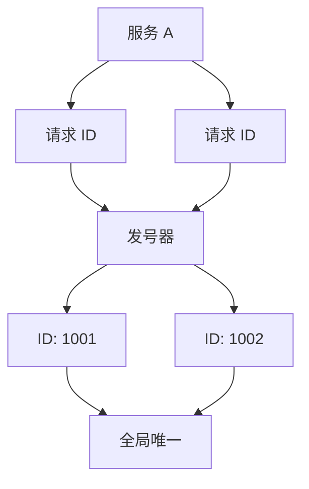
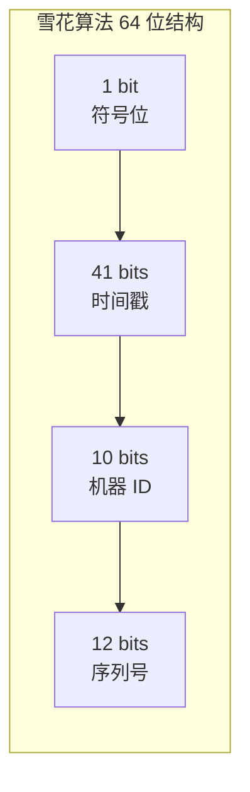
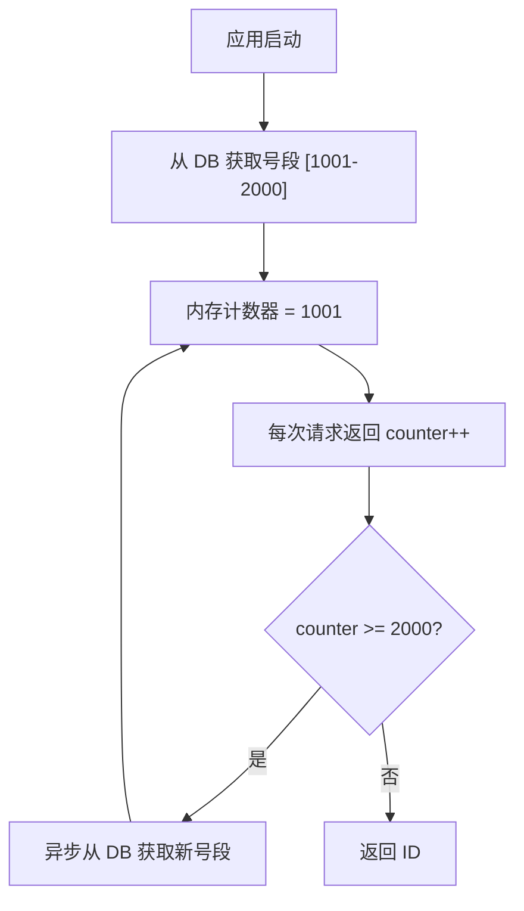
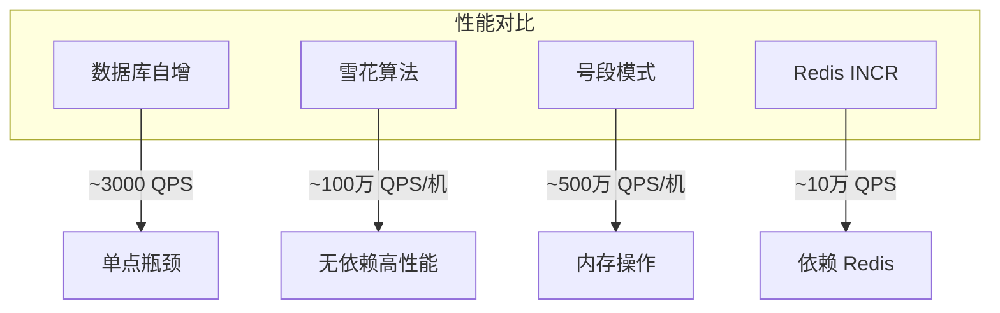
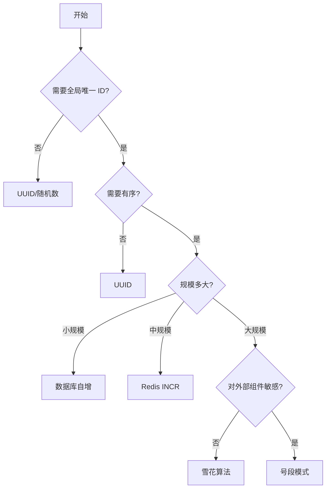

# 短链系统发号器设计

**目标级别**：P6/P7

---

上一讲我们讲了短链系统的整体设计，短码生成是核心问题。这一讲专门聊聊**发号器**——怎么生成不重复、有序、可预测的短码。

面试官问：「如果让你设计一个分布式发号器，怎么做？」——这道题考察的是你对分布式系统一致性和高性能的理解深度。

## 面试题速览

| 题号 | 问题 | 频率 | 难度 |
| --- | --- | --- | --- |
| 01 | 发号器要解决什么问题？ | 🔴 高频 | P5 |
| 02 | 有序 ID 有什么好处？ | 🔴 高频 | P6 |
| 03 | 雪花算法的结构是什么？ | 🔴 高频 | P6 |
| 04 | 雪花算法有什么问题？ | 🟡 中频 | P6 |
| 05 | 还有哪些分布式 ID 方案？ | 🟡 中频 | P6 |

## 一、发号器要解决什么问题

发号器的本质是：**在分布式环境下，生成全局唯一的、有序的 ID**。



### 为什么需要有序 ID

| 场景 | 有序 ID 的价值 | 无序 ID 的问题 |
| --- | --- | --- |
| **数据库写入** | B+Tree 分裂少，索引效率高 | 随机写入，索引维护成本高 |
| **范围查询** | 按 ID 范围查询高效 | 需要全表扫描 |
| **分页展示** | 支持高效分页（offset） | 只能靠 limit，性能差 |
| **数据归档** | 按 ID 范围归档简单 | 需要扫描全表 |
| **调试排查** | ID 大小反映时间顺序 | 无法判断生成先后 |

### ⚠️ 常见陷阱

**陷阱一：只用 UUID**

> 候选人：「我用 UUID 生成唯一 ID，简单又方便」
> 面试官：「UUID 是有序的吗？存储空间多大？对索引有什么影响？」

UUID 的问题：
- 无序：写入 InnoDB 时造成页分裂
- 存储大：36 个字符，索引效率低
- 可读性差：无法从 ID 推断时间

## 二、发号器设计方案

### 方案对比

| 方案 | 原理 | 唯一性 | 有序性 | 性能 | 依赖 | 适用场景 |
| --- | --- | --- | --- | --- | --- | --- |
| **数据库自增** | Auto Increment | ✅ | ✅ | 中 | MySQL | 单机、小规模 |
| **雪花算法** | 时间戳 + 机器 ID + 序列号 | ✅ | ✅ | 高 | 无 | 生产环境推荐 |
| **号段模式** | 批量从数据库获取 ID 段 | ✅ | ✅ | 高 | DB/Redis | 分库分表场景 |
| **Redis INCR** | 原子递增 | ✅ | ✅ | 高 | Redis | 有 Redis 基础 |
| **ZooKeeper** | 顺序节点 | ✅ | ✅ | 低 | ZK | 强依赖 ZK |

### 方案一：数据库自增主键

最简单的方式，MySQL 的 AUTO_INCREMENT 保证唯一和有序。

```sql
CREATE TABLE id_generator (
    id BIGINT PRIMARY KEY AUTO_INCREMENT,
    biz_tag VARCHAR(32) NOT NULL COMMENT '业务标识',
    max_id BIGINT NOT NULL COMMENT '当前最大ID',
    step INT NOT NULL COMMENT '步长',
    VERSION INT NOT NULL DEFAULT 0 COMMENT '版本号',
    UNIQUE KEY uk_biz_tag (biz_tag)
);

-- 每次获取 ID
UPDATE id_generator SET max_id = max_id + step WHERE biz_tag = 'short_url';
SELECT LAST_INSERT_ID();
```

**优点**：简单、可靠
**缺点**：单点、性能差、高并发时成为瓶颈

### 方案二：雪花算法（推荐）

Twitter 开源的雪花算法，64 位整型，趋势递增，不依赖外部组件。



**结构详解**：

| 字段 | 位数 | 说明 | 取值范围 |
| --- | --- | --- | --- |
| 符号位 | 1 | 固定为 0 | 0 |
| 时间戳 | 41 | 毫秒级时间戳 | 可用 69 年 |
| 机器 ID | 10 | 数据中心 + 机器编号 | 0-1023 |
| 序列号 | 12 | 每毫秒内的序列 | 0-4095 |

```java
public class SnowflakeIdGenerator {
    
    private final long twepoch = 1609459200000L; // 2021-01-01 00:00:00
    private final long workerIdBits = 10L;
    private final long sequenceBits = 12L;
    
    private final long maxWorkerId = ~(-1L << workerIdBits);
    private final long sequenceMask = ~(-1L << sequenceBits);
    
    private final long workerId;
    private long sequence = 0L;
    private long lastTimestamp = -1L;
    
    public SnowflakeIdGenerator(long workerId) {
        if (workerId < 0 || workerId > maxWorkerId) {
            throw new IllegalArgumentException("workerId 超出范围");
        }
        this.workerId = workerId;
    }
    
    public synchronized long nextId() {
        long timestamp = timeGen();
        
        if (timestamp < lastTimestamp) {
            throw new RuntimeException("时钟回拨");
        }
        
        if (timestamp == lastTimestamp) {
            sequence = (sequence + 1) & sequenceMask;
            if (sequence == 0) {
                timestamp = tilNextMillis();
            }
        } else {
            sequence = 0L;
        }
        
        lastTimestamp = timestamp;
        
        return ((timestamp - twepoch) << 22) 
             | (workerId << 12) 
             | sequence;
    }
    
    protected long tilNextMillis() {
        long timestamp = timeGen();
        while (timestamp <= lastTimestamp) {
            timestamp = timeGen();
        }
        return timestamp;
    }
    
    protected long timeGen() {
        return System.currentTimeMillis();
    }
}
```

### 方案三：号段模式

批量从数据库获取 ID 段，减少数据库压力，提高性能。



```java
public class SegmentIdGenerator {
    
    private static final long STEP = 1000;
    private AtomicLong current = new AtomicLong(0);
    private AtomicLong max = new AtomicLong(0);
    
    public long getId() {
        if (current.get() >= max.get()) {
            refresh();
        }
        return current.getAndIncrement();
    }
    
    private void refresh() {
        // 从数据库批量获取 ID 段
        long newMax = dbService.getNextSegment("short_url", STEP);
        current.set(current.get() + 1);
        max.set(newMax);
    }
}
```

## 三、雪花算法的挑战与应对

### 时钟回拨

服务器时钟回拨会导致生成重复 ID。

**💡 解决方案**：

| 方案 | 原理 | 优点 | 缺点 |
| --- | --- | --- | --- |
| **拒绝时钟回拨** | 检测到回拨直接抛异常 | 简单 | 可能影响服务 |
| **等待追赶** | 等待时钟追上再生成 | 不丢 ID | 有延迟 |
| **历史序列号** | 记录上一次序列号，回拨后从中断处继续 | 连续 | 实现复杂 |
| **双 Buffer** | 维护两个号段，回拨时切换 | 高可用 | 内存占用 |

```java
// 方案：使用 Sequence 扩展位存储更多信息
public class SnowflakeWithRecovery {
    
    private final long timestampOffset = 22;
    private final long workerIdOffset = 12;
    
    // 允许回拨的毫秒数
    private final long maxTimeBackoff = 10L;
    private long lastTimestamp = -1L;
    private long sequence = 0L;
    
    public synchronized long nextId() {
        long timestamp = System.currentTimeMillis();
        
        // 时钟回拨
        if (timestamp < lastTimestamp) {
            long offset = lastTimestamp - timestamp;
            if (offset <= maxTimeBackback) {
                // 等待追上
                timestamp = lastTimestamp;
            } else {
                // 抛出异常或切换备用方案
                throw new RuntimeException("时钟回拨过大");
            }
        }
        
        // ... 生成逻辑
        return generateId(timestamp);
    }
}
```

### 机器 ID 分配

雪花算法需要为每台机器分配唯一的机器 ID。

| 方案 | 实现 | 优点 | 缺点 |
| --- | --- | --- | --- |
| **配置文件** | 启动时读取配置 | 简单 | 运维成本高、易出错 |
| **ZooKeeper** | 启动时向 ZK 注册获取 | 自动分配 | 引入 ZK 依赖 |
| **Etcd/Consul** | 服务发现框架 | 自动分配 | 引入新组件 |
| **IP + 进程号** | 根据 IP 和进程号计算 | 无外部依赖 | 可能冲突 |
| **Snowflake-proxy** | 独立发号器服务 | 高可用 | 增加架构复杂度 |

### ⚠️ 面试官挖坑点

**陷阱一：雪花算法 ID 会超出 Long 范围**

> 面试官：「64 位 Long 的最大值是多少？雪花算法生成的 ID 会溢出吗？」
>
> 正确答案：Long.MAX_VALUE 是 2^63-1 `=` 9223372036854775807。雪花算法结构是 1+41+10+12，理论上最大值为 2^41-1 `≈` 69 年内的毫秒数乘以 2^12，无法超过 Long 范围。

**陷阱二：机器 ID 冲突**

> 面试官：「两台机器配置了相同的机器 ID，会发生什么？」
>
> 正确答案：在同一毫秒内，相同序列号会导致 ID 碰撞。需要确保机器 ID 全局唯一。

## 四、性能对比



| 方案 | 单机 QPS | 数据中心 QPS | 延迟 |
| --- | --- | --- | --- |
| 数据库自增 | 3,000 | 3,000 | 1-5ms |
| 雪花算法 | 100 万 | 1000 万 | `<` 1μs |
| 号段模式 | 500 万 | 5000 万 | `<` 1μs |
| Redis INCR | 10 万 | 100 万 | 0.1-0.5ms |

## 五、方案选型决策树



## 六、面试高频追问

### 第一层：雪花算法的结构

> **问题**：雪花算法是怎么生成 ID 的？
>
> **参考答案**：
> 雪花算法使用 64 位 long 类型：第一位是符号位固定为 0，中间 41 位是时间戳（毫秒级），后面 10 位是机器 ID（包括 5 位数据中心 ID 和 5 位机器 ID），最后 12 位是序列号。每台机器有唯一的机器 ID，每毫秒内序列号从 0 递增，最大 4096 个。

### 第二层：时钟回拨问题

> **问题**：如果服务器时钟回拨了，会发生什么？怎么处理？
>
> **参考答案**：
> 时钟回拨会导致生成重复 ID。常见处理方案：一是检测到回拨时抛异常或等待时钟追上；二是使用历史序列号，回拨后从中断处继续；三是在序列号上扩展位，复用不同时间段的序列；四是使用双 Buffer 机制，备用号段切换。生产环境推荐第一种，兜底方案是记录异常并告警，人工干预。

### 第三层：机器 ID 怎么分配

> **问题**：雪花算法的机器 ID 是怎么保证唯一的？
>
> **参考答案**：
> 机器 ID 分配有几种方式：配置文件手动指定（简单但运维成本高）、ZooKeeper/Etcd 注册获取（自动但引入依赖）、根据 IP+进程号计算（无外部依赖但可能冲突）。Twitter 原生方案用 ZooKeeper，生产环境可以选 Zookeeper 或配置中心。也可以搭建独立的 Snowflake-proxy 服务，所有机器通过 RPC 获取 ID。

## 七、综合对比

| 维度 | 数据库自增 | 雪花算法 | 号段模式 | Redis INCR |
| --- | --- | --- | --- | --- |
| **唯一性** | ✅ | ✅ | ✅ | ✅ |
| **有序性** | ✅ | ✅ | ✅ | ✅ |
| **性能** | 低 | 高 | 很高 | 中 |
| **依赖** | MySQL | 无 | DB/Redis | Redis |
| **扩展性** | 差 | 好 | 好 | 中 |
| **实现复杂度** | 低 | 中 | 中 | 低 |
| **适用规模** | `<` 1 万 QPS | `>` 1 万 QPS | `>` 10 万 QPS | `>` 5 万 QPS |

---

> 💡 **面试官视角**：发号器这道题考察的是你对「分布式唯一性」和「性能」的理解。雪花算法是标准答案，但要能说出时钟回拨、机器 ID 分配等延伸问题，才能体现深度。记住：不只是背答案，要说清楚 trade-off。
