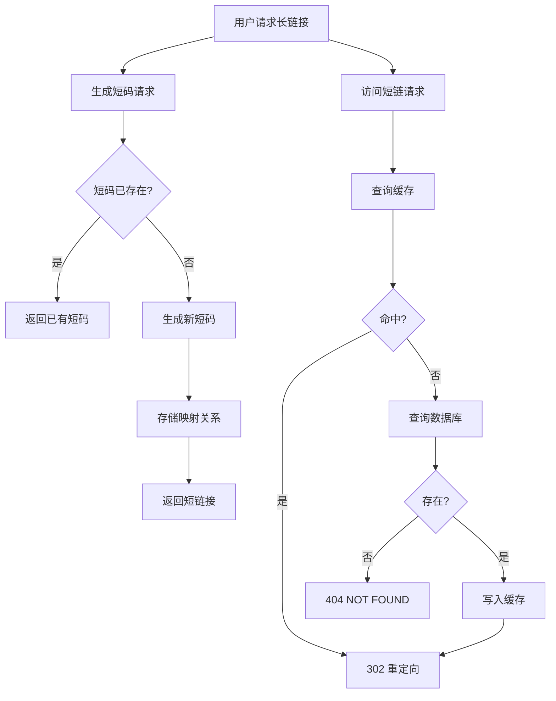
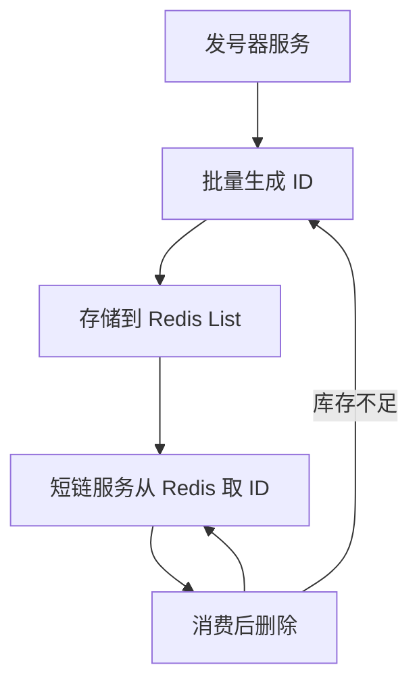
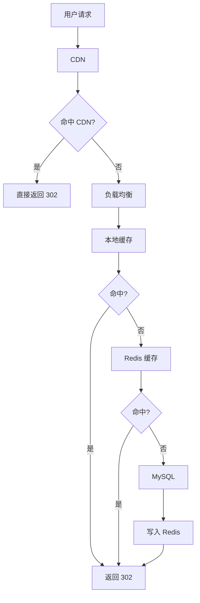

# 短链系统设计

**目标级别**：P6/P7

---

面试官问：「设计一个短链系统」——你以为这是道送分题，结果面试官追问到第三层就卡住了。

很多人觉得短链系统不就是「生成短码 + 存储 + 跳转」吗？但面试官想考的是：短码怎么生成？冲突怎么办？如何应对高并发访问？存储选型怎么定？这些问题答不好，P6 就悬了。

## 面试题速览

| 题号 | 问题 | 频率 | 难度 |
| --- | --- | --- | --- |
| 01 | 短链系统核心流程是什么？ | 🔴 高频 | P5 |
| 02 | 短码如何生成？有哪些方案？ | 🔴 高频 | P6 |
| 03 | 如何保证短码的唯一性？ | 🟡 中频 | P6 |
| 04 | 短链系统的高并发怎么应对？ | 🔴 高频 | P6 |
| 05 | 存储选型怎么定？MySQL 还是 Redis？ | 🟡 中频 | P6 |

## 一、核心需求澄清

面试官说「设计短链系统」，先别急着画架构图，先问清楚这几点：

| 问题 | 为什么重要 | 候选追问 |
| --- | --- | --- |
| 日活多少？ | 决定 QPS 和存储规模 | 100 万 vs 1 亿选型完全不同 |
| 生成量多大？ | 决定发号器设计 | 每人每天 5 条还是 50 条？ |
| 访问量多大？ | 决定缓存策略 | 读多写少还是读写都多？ |
| 需要统计吗？ | 影响数据模型 | 要不要记录访问日志？ |
| 有过期需求吗？ | 影响淘汰策略 | 永久还是有过期时间？ |

## 二、容量估算

先估算规模，再做技术选型。假设：日活 1000 万用户，平均每人每天生成 5 条短链、访问 20 次。

| 指标 | 估算公式 | 结果 |
| --- | --- | --- |
| 日生成量 | 1000万 × 5 | 5000 万条 |
| 日访问量 | 1000万 × 20 | 20 亿次 |
| 峰值 QPS | 20亿 ÷ 86400 × 峰值系数 | ~12 万 QPS |
| 单条存储 | short_code(8B) + original_url(200B) + 元数据(50B) | ~258 字节 |
| 一年存储 | 5000万 × 365 × 258B | ~4.7 TB |

**⚠️ 常见陷阱**：不问规模就选型。日活 1000 万的系统，和日活 100 万的系统，技术选型差异巨大。

## 三、核心流程



### 生成短链流程

1. 客户端提交长链接 `https://example.com/very/long/url/path`
2. 服务端生成本地唯一 ID
3. 对 ID 进行 Base62 编码，生成 6 位短码
4. 存储 `短码 → 长链接` 映射关系
5. 返回短链接 `https://short.url/abc123`

### 访问短链流程

1. 用户访问 `https://short.url/abc123`
2. 从缓存查询长链接
3. 命中则 302 重定向到长链接
4. 未命中则查数据库，查到后写入缓存再重定向
5. 未查到则返回 404

## 四、短码生成方案

这是短链系统最核心的问题，也是面试官追问最多的地方。

### 方案对比

| 方案 | 原理 | 优点 | 缺点 | 适用场景 |
| --- | --- | --- | --- | --- |
| **自增 ID + Base62** | 数据库自增 ID 转 Base62 | 简单、不重复 | ID 连续、可预测 | 小规模、内部使用 |
| **哈希算法** | MD5/SHA 哈希后取 Base62 | 不需要存储 | 可能碰撞、长度不可控 | 一次性分享链接 |
| **预生成 ID** | 分布式发号器批量生成 | 高性能、可分布式 | 依赖外部组件 | 大规模、高并发 |
| **Snowflake 改造** | 雪花算法生成唯一 ID | 有序、不重复 | 依赖机器 ID | 跨服务生成 |

### 方案一：自增 ID + Base62

数据库自增 ID 转为 62 进制（0-9、a-z、A-Z），6 位可表示 `62^6` `=` 568 亿个 ID。

```java
public class Base62Util {
    private static final String CHARSET = "0123456789abcdefghijklmnopqrstuvwxyzABCDEFGHIJKLMNOPQRSTUVWXYZ";
    
    public static String encode(long id) {
        StringBuilder sb = new StringBuilder();
        while (id > 0) {
            sb.append(CHARSET.charAt((int) (id % 62)));
            id /= 62;
        }
        return sb.reverse().toString();
    }
    
    public static void main(String[] args) {
        System.out.println(encode(999999999999L)); // 输出类似 "g5zh0p1"
    }
}
```

**⚠️ 面试官挖坑点**：

- 追问：「自增 ID 连续有什么问题？」→ 竞争对手可以通过遍历短码访问所有链接
- 追问：「6 位不够用怎么办？」→ 可以用 7 位或 8 位，或者加盐打乱

### 方案二：哈希算法

对长链接做 MD5/SHA 哈希，取前 8 位转 Base62。问题是可能碰撞，需要查库确认。

```java
public class HashBasedShortener {
    public String generate(String longUrl) {
        try {
            MessageDigest md = MessageDigest.getInstance("MD5");
            byte[] digest = md.digest(longUrl.getBytes());
            // 取前 8 字节，转 Base62
            long id = bytesToLong(digest, 8);
            return Base62Util.encode(id);
        } catch (NoSuchAlgorithmException e) {
            throw new RuntimeException(e);
        }
    }
    
    private long bytesToLong(byte[] bytes, int length) {
        long result = 0;
        for (int i = 0; i < length; i++) {
            result = (result << 8) | (bytes[i] & 0xff);
        }
        return result;
    }
}
```

**💡 加分回答**：可以用**布隆过滤器**提前判断是否存在，减少数据库查询。

### 方案三：预生成 ID（推荐）

使用分布式发号器（如雪花算法）批量生成 ID，存储在 Redis 或本地文件中，取完再申请下一批。



**💡 扩展回答**：发号器可以按时间分段生成 ID，比如「2024年」使用 1-10 亿段，「2025年」使用 11-20 亿段，便于按年份做数据归档。

## 五、存储设计

### 表结构设计

```sql
CREATE TABLE short_url (
    id BIGINT PRIMARY KEY AUTO_INCREMENT,
    short_code VARCHAR(16) NOT NULL UNIQUE COMMENT '短码',
    original_url VARCHAR(2048) NOT NULL COMMENT '原始链接',
    user_id BIGINT COMMENT '用户ID',
    expired_at DATETIME COMMENT '过期时间',
    created_at DATETIME DEFAULT CURRENT_TIMESTAMP,
    status TINYINT DEFAULT 1 COMMENT '1-正常 0-禁用',
    INDEX idx_short_code (short_code),
    INDEX idx_created_at (created_at)
) ENGINE=InnoDB DEFAULT CHARSET=utf8mb4;
```

### 存储选型对比

| 维度 | MySQL | Redis | MongoDB |
| --- | --- | --- | --- |
| 容量 | TB 级没问题 | 受内存限制 | TB 级 |
| 查询性能 | 10 万 QPS | 100 万 QPS | 50 万 QPS |
| 复杂查询 | 支持 | 不支持 | 支持 |
| 成本 | 低 | 高 | 中 |
| 适用场景 | 持久化存储 | 热数据缓存 | 日志存储 |

**推荐方案**：Redis 做缓存（热数据）+ MySQL 持久化。

### 缓存设计

| 问题 | 策略 | 说明 |
| --- | --- | --- |
| 缓存结构 | `Hash` | key=`short_code`，value=`original_url` |
| 过期策略 | LRU + TTL | 访问频率高的保留，7 天无访问淘汰 |
| 更新策略 | Cache Aside | 读命中、读未命中查库写入 |

```java
public String getLongUrl(String shortCode) {
    // 1. 查缓存
    String longUrl = redisTemplate.opsForHash().get("short_url", shortCode);
    if (longUrl != null) {
        return longUrl;
    }
    
    // 2. 查数据库
    ShortUrlDO url = shortUrlDAO.selectByShortCode(shortCode);
    if (url == null) {
        return null;
    }
    
    // 3. 写入缓存
    redisTemplate.opsForHash().put("short_url", shortCode, url.getOriginalUrl());
    return url.getOriginalUrl();
}
```

## 六、高并发优化

### 问题分析

访问短链的 QPS 可能高达 12 万，单机 Redis 能扛 10-20 万 QPS，理论上 1-2 台就够了。但问题是**热点数据**和**毛刺**。

### 优化方案



| 优化层 | 方案 | 效果 |
| --- | --- | --- |
| **CDN** | 热门短链推送到 CDN | 减少源站压力 |
| **本地缓存** | Guava Cache / Caffeine | 热点数据本地命中 |
| **Redis 缓存** | Hash 结构存储映射 | 跨机器共享热点 |
| **多级缓存** | 本地 + Redis 二级缓存 | 命中率 `>` 99% |

### ⚠️ 面试官挖坑点

- 追问：「本地缓存和 Redis 缓存数据不一致怎么办？」→ 短链修改是低频操作，可以用消息广播或版本号解决
- 追问：「Redis 挂了怎么办？」→ 主从 + 本地缓存降级，查不到时查 MySQL

## 七、常见面试追问

### 第一层：短链系统的核心流程

> **问题**：短链系统是怎么工作的？
>
> **参考答案**：
> 短链系统有两个核心流程：**生成**和**访问**。
>
> 生成流程：客户端提交长链接 → 服务端生成本地唯一 ID → Base62 编码成短码 → 存储映射关系 → 返回短链接。
>
> 访问流程：用户访问短链 → 查缓存获取长链接 → 302 重定向到目标页面。

### 第二层：短码怎么保证唯一

> **问题**：如果两个人同时生成短链，怎么保证不重复？
>
> **参考答案**：
> 有几种方案。一是数据库自增 ID，不会重复但连续；二是雪花算法生成唯一 ID，有时间戳和机器 ID；三是预生成 ID 批量取号。生产环境推荐雪花算法或预生成方案，性能好且不重复。

### 第三层：存储选型和数据量

> **问题**：日均 5000 万条短链，存储怎么设计？
>
> **参考答案**：
> MySQL 存储全量数据作为持久化层，Redis 缓存热数据。按 6 个月保留期算，需要存储 5000万 × 180 × 258B `=` 2.3 TB，需要分库分表或冷热分离。热点数据（最近 7 天）放 Redis，冷数据可以归档到对象存储。

## 八、对比总结

| 维度 | 方案 A（哈希） | 方案 B（自增 ID） | 方案 C（雪花） |
| --- | --- | --- | --- |
| 唯一性 | 需要查库确认 | 自带唯一 | 保证唯一 |
| 可预测性 | 不可预测 | ID 连续 | 近似有序 |
| 性能 | 高 | 中 | 高 |
| 存储依赖 | 无 | MySQL | 无 |
| 适用场景 | 一次性分享 | 小规模 | 大规模生产 |

## 九、扩展思考

### 问题一：短链被恶意刷

> 攻击者短时间内生成大量短链，消耗存储和计算资源。
>
> **应对方案**：
> - 接口限流：同一 IP/UserId 每分钟生成次数限制
> - 验证码：生成量超过阈值时需要图形验证码
> - 收费：对生成短链的服务收费（企业版）

### 问题二：长链接内容违规

> 用户生成包含恶意内容的短链，访问时可能触发安全扫描。
>
> **应对方案**：
> - 访问时对目标页面做安全扫描
> - 违规则跳转到安全提示页
> - 定期扫描已生成的短链，对违规内容做封禁

### 问题三：短链的生命周期管理

> 短链生成后永久存在，还是有过期时间？
>
> **应对方案**：
> - 设计 `expired_at` 字段，允许设置过期时间
> - 定期清理过期数据（定时任务或 TTL）
> - 用户可以申请续期或删除

---

> 💡 **面试官视角**：短链系统看似简单，但面试官会从「短码生成 → 存储选型 → 高并发优化 → 数据生命周期」这条线追问，考察你对系统设计的整体把控能力。关键是说出每个选择的 trade-off，而不是背答案。
