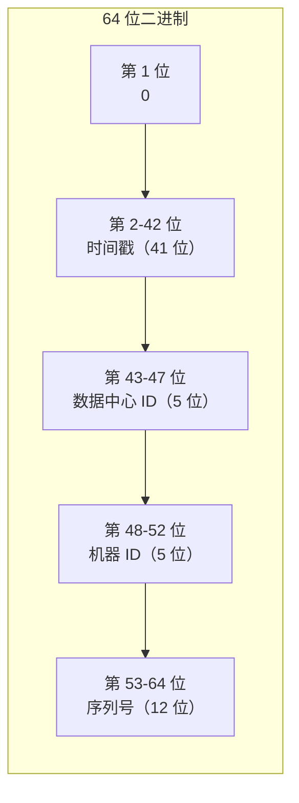
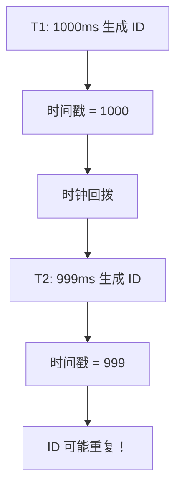
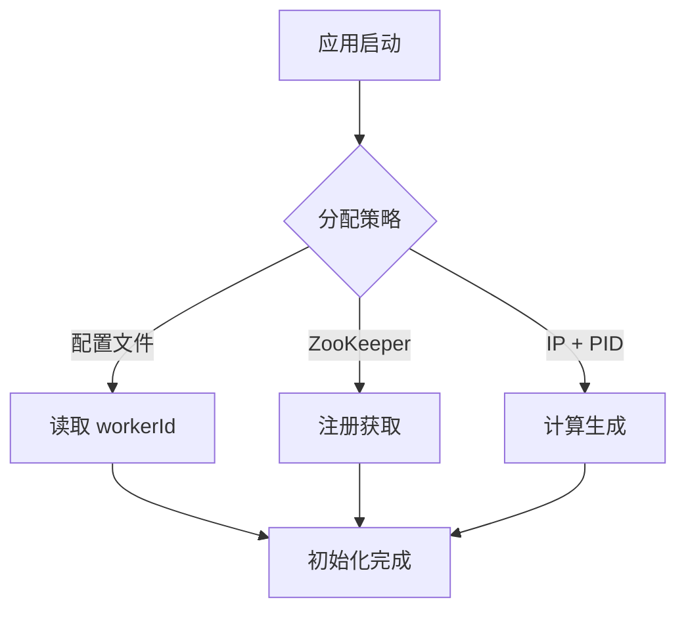

# 雪花算法原理

**目标级别**：P6/P7

---

上一讲我们讲了分布式 ID 生成器的整体设计，这一讲专门聊聊**雪花算法**——这是生产环境最常用的分布式 ID 生成方案。

面试官问：「雪花算法的时钟回拨怎么处理？」——这道题考察的是你对雪花算法细节的理解深度。只会背结构不够，还要能说出时钟回拨、机器 ID 分配、序列号溢出等问题的解决方案。

## 面试题速览

| 题号 | 问题 | 频率 | 难度 |
| --- | --- | --- | --- |
| 01 | 雪花算法的结构是什么？ | 🔴 高频 | P5 |
| 02 | 时间戳溢出怎么办？ | 🟡 中频 | P6 |
| 03 | 时钟回拨怎么处理？ | 🔴 高频 | P6 |
| 04 | 序列号溢出怎么处理？ | 🟡 中频 | P6 |
| 05 | 机器 ID 怎么分配？ | 🔴 高频 | P6 |

## 一、雪花算法详解

### 完整结构



### 各字段计算

| 字段 | 位数 | 范围 | 说明 |
| --- | --- | --- | --- |
| **符号位** | 1 | 0 | 固定为 0，保证正数 |
| **时间戳** | 41 | 0 ~ 2^41-1 | 毫秒数，从 epoch 算起 |
| **数据中心 ID** | 5 | 0 ~ 31 | 可定义 32 个数据中心 |
| **机器 ID** | 5 | 0 ~ 31 | 每数据中心 32 台机器 |
| **序列号** | 12 | 0 ~ 4095 | 每毫秒最多 4096 个 ID |

### 计算公式

```
ID = (时间戳 - epoch) << 22 | 数据中心 ID << 17 | 机器 ID << 12 | 序列号
```

**移位位数计算**：
- 时间戳需要左移 22 位（机器 ID 10 位 + 序列号 12 位）
- 数据中心 ID 需要左移 17 位（机器 ID 10 位 + 序列号 12 位）
- 机器 ID 需要左移 12 位（序列号 12 位）

## 二、时间戳设计

### Epoch 选择

| Epoch | 优点 | 缺点 |
| --- | --- | --- |
| **0（1970-01-01）** | 通用标准 | 可用时间短，只剩 29 年 |
| **2010-01-01** | 可用时间长 | 浪费位数 |
| **2021-01-01** | 可用时间长，且足够新 | 需要自定义 |

```java
public class SnowflakeIdGenerator {
    
    // 2021-01-01 00:00:00（北京时间）
    private static final long EPOCH = 1609459200000L;
    
    // 41 位时间戳可以使用约 69 年
    // 最大时间戳 = EPOCH + (2^41 - 1) 毫秒 ≈ 2090-01-01
}
```

### ⚠️ 时间戳溢出问题

> 面试官：「41 位时间戳什么时候会溢出？」
>
> 答案：从 epoch 算起，69 年后会溢出。需要在溢出前规划迁移方案，如更换 epoch 或升级位数。

### 时间戳比较

```java
// 判断时间戳是否有效
if (timestamp < lastTimestamp) {
    // 时钟回拨
} else if (timestamp == lastTimestamp) {
    // 同一毫秒
} else {
    // 新毫秒
}
```

## 三、序列号设计

### 序列号溢出

每毫秒序列号只能生成 4096 个 ID，如果超过这个数量怎么办？

```java
public synchronized long nextId() {
    long timestamp = System.currentTimeMillis();
    
    if (timestamp == lastTimestamp) {
        sequence = (sequence + 1) & sequenceMask;
        if (sequence == 0) {
            // 序列号用完，等待下一毫秒
            timestamp = tilNextMillis(lastTimestamp);
        }
    } else {
        sequence = 0L;
    }
    
    lastTimestamp = timestamp;
    return generateId(timestamp);
}
```

**核心逻辑**：
- 如果在同一毫秒内，序列号递增，到达 4095 后 & sequenceMask 会变回 0
- 序列号变回 0 时，等待到下一毫秒

### ⚠️ 面试官挖坑点

**陷阱一：序列号用完不等待**

> 面试官：「如果当前毫秒的序列号已经到 4095 了，下一个请求会怎样？」
>
> 错误回答：「生成失败的 ID」
>
> 正确回答：会等待到下一毫秒。用 `tilNextMillis()` 循环等待，直到时间戳前进到下一毫秒。这是阻塞式的，高并发时可能导致延迟增加。

**陷阱二：不处理时间回拨**

> 面试官：「如果时钟回拨到上一毫秒，会生成重复 ID 吗？」
>
> 错误回答：「不会」
>
> 正确回答：会。因为序列号是从 0 开始的，时钟回拨后可能生成之前已经用过的序列号。

## 四、时钟回拨处理

### 时钟回拨场景



### 解决方案对比

| 方案 | 原理 | 优点 | 缺点 |
| --- | --- | --- | --- |
| **拒绝生成** | 检测到回拨抛异常 | 简单 | 影响可用性 |
| **等待追赶** | 等待时钟追上 | 不丢 ID | 有延迟 |
| **备用时间戳** | 使用 lastTimestamp + 1 | 兼容性高 | 可能碰撞 |
| **历史序列号** | 记录上次序列号 | 连续 | 实现复杂 |

### 完整实现

```java
public class SnowflakeIdGenerator {
    
    private static final long EPOCH = 1609459200000L;
    private static final long WORKER_ID_BITS = 5L;
    private static final long SEQUENCE_BITS = 12L;
    
    private static final long MAX_WORKER_ID = ~(-1L << WORKER_ID_BITS);
    private static final long SEQUENCE_MASK = ~(-1L << SEQUENCE_BITS);
    
    private static final long WORKER_ID_SHIFT = SEQUENCE_BITS;
    private static final long TIMESTAMP_LEFT_SHIFT = SEQUENCE_BITS + WORKER_ID_BITS;
    
    private final long workerId;
    private volatile long sequence = 0L;
    private volatile long lastTimestamp = -1L;
    
    // 允许的最大回拨时间（毫秒）
    private static final long MAX_BACKWARD_MS = 10L;
    
    public SnowflakeIdGenerator(long workerId) {
        if (workerId < 0 || workerId > MAX_WORKER_ID) {
            throw new IllegalArgumentException("workerId 超出范围");
        }
        this.workerId = workerId;
    }
    
    public synchronized long nextId() {
        long timestamp = System.currentTimeMillis();
        
        // 时钟回拨处理
        if (timestamp < lastTimestamp) {
            long offset = lastTimestamp - timestamp;
            if (offset <= MAX_BACKWARD_MS) {
                // 小幅回拨：等待追上
                timestamp = lastTimestamp;
            } else {
                // 大幅回拨：使用备用方案
                timestamp = lastTimestamp + 1;
                // 告警通知
            }
        }
        
        // 同一毫秒内
        if (timestamp == lastTimestamp) {
            sequence = (sequence + 1) & SEQUENCE_MASK;
            if (sequence == 0) {
                // 序列号用完，等待下一毫秒
                timestamp = tilNextMillis();
            }
        } else {
            // 新毫秒，序列号重置
            sequence = 0L;
        }
        
        lastTimestamp = timestamp;
        
        return ((timestamp - EPOCH) << TIMESTAMP_LEFT_SHIFT)
             | (workerId << WORKER_ID_SHIFT)
             | sequence;
    }
    
    private long tilNextMillis() {
        long timestamp = System.currentTimeMillis();
        while (timestamp <= lastTimestamp) {
            timestamp = System.currentTimeMillis();
        }
        return timestamp;
    }
}
```

## 五、机器 ID 分配

### 分配策略



### 无中心分配实现

```java
public class WorkerIdAssigner {
    
    /**
     * 根据机器 IP 和进程 ID 生成 workerId
     * 优点：无需外部组件
     * 缺点：重启后可能变化（但 ID 本身是唯一的）
     */
    public static long assign() throws Exception {
        // 获取本机 IP
        InetAddress ip = InetAddress.getLocalHost();
        byte[] ipBytes = ip.getAddress();
        
        // 使用 IP 的后两个字节（支持 65536 个不同 IP）
        long ipValue = (ipBytes[2] & 0xFF) << 8 | (ipBytes[3] & 0xFF);
        
        // 使用进程 ID
        long pid = ProcessHandle.current().pid();
        
        // 组合计算
        long workerId = (ipValue << 8) | (pid & 0xFF);
        
        // 限制在 0-1023（10 位范围）
        return workerId % 1024;
    }
}
```

### 雪花算法变体

| 变体 | 调整 | 适用场景 |
| --- | --- | --- |
| **百度 UID** | 保留 5 位时间戳位 | 每天重置一次 |
| **美团 Leaf** | 双 Buffer + 百家号 | 高并发优化 |
| **腾讯 SEQ** | 细粒度分配 | 跨 IDC 场景 |

## 六、ID 解析

### 解析雪花 ID

```java
public class SnowflakeIdParser {
    
    private static final long EPOCH = 1609459200000L;
    private static final long WORKER_ID_BITS = 10L;
    private static final long SEQUENCE_BITS = 12L;
    
    private static final long SEQUENCE_MASK = ~(-1L << SEQUENCE_BITS);
    private static final long WORKER_ID_SHIFT = SEQUENCE_BITS;
    private static final long TIMESTAMP_SHIFT = SEQUENCE_BITS + WORKER_ID_BITS;
    
    public static SnowflakeInfo parse(long id) {
        long timestamp = (id >> TIMESTAMP_SHIFT) + EPOCH;
        long workerId = (id >> WORKER_ID_SHIFT) & ((1L << WORKER_ID_BITS) - 1);
        long sequence = id & SEQUENCE_MASK;
        
        return new SnowflakeInfo(timestamp, workerId, sequence);
    }
    
    public static void main(String[] args) {
        long id = 407503083790372864L;
        SnowflakeInfo info = parse(id);
        System.out.println("时间戳: " + info.getTimestamp());
        System.out.println("机器 ID: " + info.getWorkerId());
        System.out.println("序列号: " + info.getSequence());
        System.out.println("生成时间: " + new Date(info.getTimestamp()));
    }
}
```

## 七、性能分析

### 性能测试

```bash
# 测试结果示例
生成了 10000000 个 ID
耗时: 1234 ms
QPS: 8100000
平均延迟: 0.12 us
```

### 性能瓶颈

| 瓶颈 | 影响 | 优化方案 |
| --- | --- | --- |
| **synchronized** | 并发时排队 | 用 CAS 无锁实现 |
| **System.currentTimeMillis()** | 调用开销大 | 用 `System.nanoTime()` 或缓存时间戳 |
| **JVM GC** | Stop The World | 减少对象创建 |

### 无锁实现

```java
public class LockFreeSnowflakeIdGenerator {
    
    private static final AtomicLongHolder lastTimestamp = new AtomicLongHolder(-1);
    private final long workerId;
    
    public long nextId() {
        while (true) {
            long now = System.currentTimeMillis();
            long oldTimestamp = lastTimestamp.get();
            
            if (now < oldTimestamp) {
                // 时钟回拨
                throw new RuntimeException("时钟回拨");
            }
            
            if (now == oldTimestamp) {
                // 同一毫秒
                long oldSequence = sequence.get();
                long newSequence = (oldSequence + 1) & SEQUENCE_MASK;
                if (newSequence == 0) {
                    // 序列号用完，等待
                    continue;
                }
                if (sequence.compareAndSet(oldSequence, newSequence)) {
                    return makeId(now, newSequence);
                }
            } else {
                // 新毫秒
                sequence.set(0);
                if (lastTimestamp.compareAndSet(oldTimestamp, now)) {
                    return makeId(now, 0);
                }
            }
        }
    }
    
    private long makeId(long timestamp, long seq) {
        return ((timestamp - EPOCH) << TIMESTAMP_LEFT_SHIFT)
             | (workerId << WORKER_ID_SHIFT)
             | seq;
    }
}
```

## 八、面试高频追问

### 第一层：算法结构

> **问题**：雪花算法是怎么生成 ID 的？
>
> **参考答案**：
> 雪花算法生成 64 位长整型。第一位是符号位固定为 0，保证 ID 是正数。中间 41 位是时间戳（毫秒级），从自定义 epoch 算起，可以支持 69 年。然后 10 位是机器 ID（包括 5 位数据中心 ID 和 5 位机器 ID，最多 1024 台机器）。最后 12 位是序列号，每毫秒从 0 递增，最大 4096。

### 第二层：时钟回拨

> **问题**：时钟回拨怎么处理？
>
> **参考答案**：
> 时钟回拨会导致 ID 重复或变小。处理方案：检测到回拨时，判断回拨幅度。小幅回拨（10ms 以内）可以等待时钟追上；大幅回拨需要使用备用时间戳（lastTimestamp + 1）并告警。生产环境要有监控告警，发现时钟回拨及时处理。

### 第三层：机器 ID 分配

> **问题**：机器 ID 是怎么保证唯一的？
>
> **参考答案**：
> 机器 ID 分配有几种方式：配置文件手动指定、ZooKeeper 注册获取、IP + 进程号计算。推荐用配置中心统一管理，保证全局唯一。雪花算法的 10 位机器 ID 支持 1024 个节点，足够大多数场景使用。

## 九、综合对比

| 维度 | 雪花算法 | UUID | 数据库自增 |
| --- | --- | --- | --- |
| **格式** | 64 位整数 | 36 字符字符串 | 64 位整数 |
| **长度** | 19 位 | 36 位 | 19 位 |
| **有序性** | 时间有序 | 无序 | 连续有序 |
| **可读性** | 可解析出时间 | 不可读 | 可直接使用 |
| **性能** | 极快（内存） | 快 | 慢（数据库） |
| **依赖** | 无 | 无 | MySQL |

---

> 💡 **面试官视角**：雪花算法是生产环境最常用的 ID 生成方案。面试官会追问时钟回拨、序列号溢出、机器 ID 分配等细节。关键是理解每个问题的解决方案，而不是只背代码。
