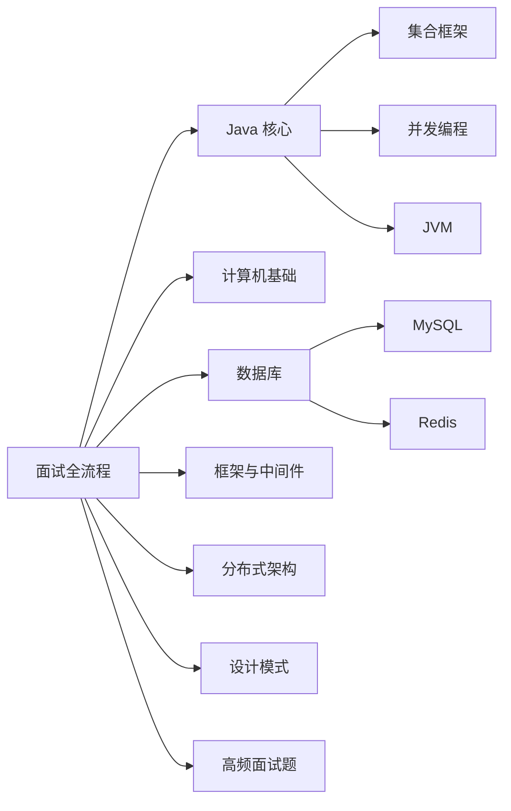

# 一份面向 Java 工程师的系统性知识图谱

2019年，我在美团带一个新人团队，面试了一批校招生。有个候选人让我印象很深——985硕士、论文发了不少、项目经历也漂亮。技术面基础问题答得中规中矩，但当我追问一句"JDK8 的 HashMap 为什么要引入红黑树？链表阈值为什么是 8 不是 16？"，他愣了整整十秒，然后开始背书。

那十秒的沉默，比任何简历都更能说明问题。

**这不是他一个人的问题。** 太多工程师花大量时间刷"LeetCode 热题 100"和"消息队列面试题大全"，却忽略了那些真正决定 P5/P6/P7 差距的核心知识点——集合源码、JVM 底层、并发编程、数据库索引。面试官问的不是你知道多少，而是你理解多深。

这个项目，就是我十几年面试官经验的一个总结。它不是网上资料的搬运，而是从真实的面试场景出发，告诉你哪些知识点真正重要、面试官真正会追问什么、以及为什么有些答案看似正确却拿不到高分。

## 一、知识图谱全景

本项目覆盖 Java 后端工程师面试的七大核心领域，每个领域都对应真实面试中的高频考点：

| 模块 | 定位 | 面试权重 |
| --- | --- | --- |
| [面试全流程](/interview-prep/) | 简历、行为面、谈薪、复盘 | 🔴 贯穿全程 |
| [Java 核心](/java/) | 集合/并发/JVM/新特性 | 🔴 半壁江山 |
| [计算机基础](/cs/) | OS/计网/数据结构/算法 | 🟡 字节/腾讯必考 |
| [数据库](/database/) | MySQL/Redis 原理与实战 | 🔴 高频核心 |
| [框架与中间件](/framework/) | Spring/MyBatis/RPC/MQ | 🟡 中频重灾区 |
| [分布式架构](/distributed/) | 分布式事务/锁/CAP | 🔴 P6+ 分水岭 |
| [设计模式](/design/) | 模式/架构/系统设计 | 🟡 加分项 |
| [高频面试题](/questions/) | 按模块归纳全部高频题 | 🔴 冲刺必备 |

:::tip 💡
面试不是考试，是对话。面试官不是在考你记忆力，而是在验证你的理解深度。能用自己的话把原理讲清楚，还能在源码里找到对应行——这才是 P6+ 的标准。
:::

## 二、面试全流程：从简历到 Offer

很多人以为面试的战场只在技术面，实际上从简历关开始，战斗就已经打响了。

### 2.1 简历关：6-8 秒的生死线

HR 平均每份简历只看 6-8 秒。在这一瞬间，你的简历必须包含足够的关键词才能通过 ATS（简历筛选系统）。

**简历三个核心问题**：

- **怎么写**：STAR 法则描述项目，用情境-任务-行动-结果结构，避免空洞的"负责...优化"
- **怎么过机筛**：识别 JD 中的高频词，精准嵌入简历，比如 JD 写"有高并发经验"，你的简历里就得出现"高并发"、"QPS"、"线程池"这些词
- **职级差异**：P5 突出基础扎实，P6 突出独立负责，P7 突出架构设计和技术影响力

:::warning ⚠️
简历最大的坑是"堆砌技术名词"和"缺少数据支撑"。与其写"负责系统优化"，不如写"通过缓存重构使接口响应时间从 200ms 降至 50ms"。数字比形容词有说服力一万倍。
:::

**核心文章**：

- [STAR 法则写简历](/interview-prep/resume/star) —— 简历描述的万能公式
- [简历关键词匹配](/interview-prep/resume/keywords) —— 如何让简历通过 ATS

### 2.2 各厂经验：知己知彼

每个大厂的面试风格和考察侧重点差异巨大：

| 厂商 | 面试风格 | 考察重点 | 常见翻车点 |
| --- | --- | --- | --- |
| 阿里 | 项目深挖、架构权衡 | 为什么这么设计、有没有替代方案 | 只会用不会设计 |
| 字节 | 算法优先、高并发场景 | 快速给思路、代码实现 | 算法不熟练、心态崩 |
| 腾讯 | 基础扎实度、工程态度 | 网络/操作系统/数据库基础 | 基础不牢、浮于表面 |
| 美团 | 解决问题能力 | 怎么排查故障、怎么优化性能 | 没有生产经验 |

### 2.3 行为面试：被忽视的翻车重灾区

行为面试（Behavioral Interview）看似随意，实际上是 P6+ 面试的重要环节。面试官通过 STAR 追问来验证你的经历是否真实、动机是否匹配、性格是否适合团队。

**最常见的问题类型**：

- "讲一个你解决过的最难的技术问题" → 聚焦问题解决的完整闭环
- "和同事意见不一致怎么处理" → 展现沟通能力和大局观
- "讲一个你搞砸过的项目" → 承认失败 + 分析根因 + 总结教训
- "有没有主动推动过什么技术改进" → 从被动执行到主动发起的转变

:::warning ⚠️
行为面试最大的坑是说假话。面试官追问 STAR 细节时，任何编造的经历都会在第二轮追问中崩溃。宁可讲一个真实的失败案例，也不要编一个完美的成功故事。
:::

**核心文章**：

- [行为面试高频题库](/interview-prep/behavioral/questions) —— 20+ 常见问题拆解

### 2.4 谈薪：技术 P7 结果谈成 P6 的 Offer

技术面试通过了，HR 谈薪才是真正见真章的时候。

**谈薪的核心原则**：永远让对方先出价。你先亮底牌，就失去了谈判的主动权。如果必须先说，就给一个你期望的上限，而不是你能接受的底线。

**核心文章**：

- [谈薪策略](/interview-prep/hr/negotiation) —— 用数据说话，不说"可以商量"
- [Offer 选择](/interview-prep/hr/offer-evaluation) —— 综合考量：薪资 + 成长 + 团队 + 业务

## 三、Java 核心：半壁江山

Java 核心是面试的重头戏。我平均每场技术面都会问 HashMap，因为它足够简单到每个人都能说两句，又足够复杂到能追问到源码细节。

### 3.1 知识全景

| 模块 | 内容定位 | 面试权重 |
| --- | --- | --- |
| **Java 基础** | `String`/`equals`/`hashCode`/值传递/异常 | P5 门槛 |
| **集合框架** | HashMap 家族、List/Set/Queue 家族 | 🔴 高频重灾区 |
| **并发编程** | synchronized/CAS/JMM/AQS/线程池 | 🔴 P6+ 必考 |
| **IO/NIO** | 五大 IO 模型、Netty Reactor | 🟡 字节加分项 |
| **JVM** | GC 算法、类加载、OOM 排查 | 🔴 高频经典 |
| **Java 新特性** | Lambda/Stream/JDK17 新特性 | 🟡 基本要求 |

### 3.2 HashMap：最好的筛选器

HashMap 是 Java 面试最好的筛选器——能背出来的人占 80%，能答出树化阈值的占 30%，能说清楚为什么选择 8 而不是 16 的只有 5%。

**HashMap 追问链（能答到第四层的都是 P6+）**：

1. put 流程是什么？
2. JDK8 为什么引入红黑树？链表阈值是多少？
3. 什么时候树化？什么时候退链表？为什么退链表阈值是 6 不是 8？
4. 你在项目里用过什么替代方案？什么场景下 HashMap 不是最优解？

**核心文章**：

- [HashMap 源码深度解析](/java/collection/hashmap) —— put/get/扩容/树化，全流程逐行解读
- [ConcurrentHashMap](/java/collection/concurrent-hashmap) —— JDK7 分段锁 vs JDK8 CAS + synchronized

### 3.3 并发编程：P5 和 P6 的分水岭

能说清楚线程安全问题的候选人占 40%，能说清楚 JMM 和 happens-before 的占 20%，能写好一个线程池并且说出核心参数的占 10%。

**并发编程三座大山**：

1. **线程安全**：synchronized/CAS/volatile 的底层实现
2. **JMM**：happens-before 规则、内存屏障、指令重排
3. **并发工具**：AQS/ReentrantLock/ThreadLocal/线程池

**核心文章**：

- [synchronized 原理](/java/concurrent/synchronized) —— 锁升级、Mark Word、偏向锁/轻量级锁/重量级锁
- [AQS 核心原理](/java/concurrent/aqs) —— 队列同步器的设计哲学

### 3.4 JVM：最后一关

GC 算法、类加载、运行时数据区、OOM 排查——每一条都能追问到生产级别。

**JVM 经典追问链**：

1. 对象的创建过程？（内存分配 + 字节码执行）
2. 对象的内存布局？（对象头 + 实例数据 + 对齐填充）
3. GC roots 有哪些？
4. 常见的垃圾回收算法？
5. G1 和 ZGC 的区别？分代收集和分区收集的本质差异？
6. 线上 OOM 怎么排查？用什么工具？

**核心文章**：

- [JVM 运行时数据区](/java/jvm/runtime-data-area) —— 堆/栈/方法区/本地方法栈完整解析
- [G1 垃圾收集器](/java/jvm/g1) —— 分区收集、并发标记、RSet 记忆集
- [OOM 排查](/java/jvm/oom) —— Heap/Stack/Metaspace/-direct-buffer-memory 的排查方法

## 四、计算机基础：打牢地基

操作系统、计网协议、数据结构与算法——这些基础决定了你在面试中能走多远。字节跳动和腾讯的面试尤其注重基础功底。

### 4.1 操作系统

**核心知识点**：

- 进程与线程的区别（上下文切换成本）
- 内存管理（分页/分段/虚拟内存）
- IO 模型（阻塞/非阻塞/异步，select/epoll/poll）
- 锁的实现（自旋锁/互斥锁/乐观锁）

**核心文章**：

- [IO 模型对比](/cs/os/io-models) —— Linux 五种 IO 模型全解析
- [Epoll 原理](/cs/os/epoll) —— 高性能网络框架的底层支撑

### 4.2 计算机网络

**核心知识点**：

- TCP 三次握手/四次挥手（为什么是三次/四次）
- TCP 可靠传输原理（滑动窗口/拥塞控制）
- HTTP/HTTPS（SSL 握手、TLS 1.2 vs 1.3）
- DNS 解析过程

**核心文章**：

- [HTTPS 原理](/cs/network/https) —— TLS 握手、数字证书、HSTS
- [TCP 与 UDP 对比](/cs/network/tcp-vs-udp) —— 适用场景与选型

### 4.3 数据结构与算法

**核心知识点**：

- 数组/链表/栈/队列/哈希表（复杂度分析）
- 二叉树/红黑树/B+ 树（数据库索引结构）
- 排序算法（快排/归并/堆排的适用场景）
- 图算法（DFS/BFS/最短路径）

**核心文章**：

- [合并排序](/cs/algorithm/merge-sort) —— 分治思想与稳定性分析
- [树的三种遍历](/cs/algorithm/tree-traversal) —— 前/中/后序与层序

## 五、数据库：高频核心

MySQL 和 Redis 是后端面试的两大高频领域。每个认真准备面试的工程师，都必须把索引原理和事务机制搞清楚。

### 5.1 MySQL

**核心知识点**：

- InnoDB vs MyISAM（行锁/表锁、事务支持）
- 索引结构（B+ 树、聚簇索引、覆盖索引）
- 事务隔离级别（脏读/不可重复读/幻读）
- MVCC 原理（Read View 版本链）
- 锁机制（行锁/间隙锁/Next-Key Lock）

**核心文章**：

- [MySQL 索引原理](/database/mysql/index) —— B+ 树与聚簇索引
- [事务隔离级别](/database/mysql/isolation-levels) —— MVCC 与锁的配合
- [间隙锁与 Next-Key Lock](/database/mysql/gap-lock) —— 解决幻读问题

### 5.2 Redis

**核心知识点**：

- 数据结构（String/Hash/List/Set/ZSet/HyperLogLog）
- 持久化（RDB/AOF/RDB+AOF 混合）
- 主从复制（同步策略/PSYNC/Sentinel）
- 集群（Codis vs Redis Cluster/哈希槽）
- 缓存问题（穿透/击穿/雪崩/热 key）

**核心文章**：

- [Redis 线程模型](/database/redis/thread-model) —— 为什么单线程又高性能
- [缓存穿透/击穿/雪崩](/database/redis/cache-breakdown) —— 生产环境三大缓存问题
- [分布式锁 RedLock](/distributed/lock/redlock) —— 安全实现与踩坑

## 六、分布式架构：P6+ 分水岭

分布式是 P6 和 P7 的核心差距所在。能回答"怎么用"的是 60 分，能回答"为什么这么设计"的才是 80 分。

### 6.1 核心知识点

| 领域 | 核心问题 | 考察深度 |
| --- | --- | --- |
| **分布式事务** | 2PC/3PC/TCC 的区别？Seata 如何实现？ | 🔴 必考 |
| **分布式锁** | Redis 实现分布式锁有什么问题？RedLock 真的安全吗？ | 🔴 高频 |
| **一致性** | CAP 定理怎么理解？Base 理论是什么？ | 🟡 中频 |
| **注册中心** | Nacos 的 AP 和 CP 模式怎么切换？ | 🟡 中频 |
| **消息队列** | Kafka 如何保证消息不丢失？顺序消息怎么做？ | 🔴 高频 |

### 6.2 核心文章

- [CAP 定理与 Base 理论](/distributed/theory/cap-base-relation) —— 分布式一致性的本质
- [2PC 与 3PC](/questions/distributed/2pc) —— 两阶段提交的问题与改进
- [Seata TCC 模式](/distributed/transaction/seata-tcc) —— 分布式事务实战

## 七、高频面试题：按模块归纳

面试前冲刺阶段，可以按模块集中刷题。核心原则是：**不要只背答案，要理解追问方向**。

| 模块 | 题目数 | 核心考点 |
| --- | --- | --- |
| Java 基础 | 20+ | `String`/值传递/`equals`/`hashCode` |
| 集合框架 | 30+ | HashMap/ConcurrentHashMap/ArrayList |
| 并发编程 | 20+ | synchronized/CAS/线程池/AQS |
| JVM | 20+ | GC/类加载/OOM/内存布局 |
| MySQL | 20+ | 索引/事务/锁/连接池 |
| Redis | 20+ | 数据结构/持久化/集群/缓存问题 |
| 分布式 | 15+ | 事务/锁/一致性/CAP |
| Spring | 20+ | IOC/AOP/事务/自动装配 |

**核心文章**：

- [HashMap 面试题](/questions/collection/hashmap-thread-safety) —— 追问链 + 源码分析
- [synchronized 面试题](/questions/concurrent/synchronized) —— 锁升级全流程
- [MySQL 索引面试题](/questions/mysql/covering-index) —— 索引失效与优化

## 八、学习路径：按阶段规划

### 8.1 P5 冲刺：先拿下高频必考点

**目标**：通过基础面试关，不在送分题上翻车

**推荐顺序**：

1. HashMap 基本原理（put/get/扩容）
2. synchronized 基础（用法和原理）
3. MySQL 索引基本概念（B+ 树）
4. Redis 数据结构和基本命令
5. TCP/HTTP 基础

### 8.2 P6 进阶：从会用到着理解

**目标**：能回答追问，能说清楚为什么

**推荐顺序**：

1. HashMap/ConcurrentHashMap 源码（树化阈值、死循环问题）
2. JMM 与 happens-before（可见性、有序性）
3. AQS 核心原理（队列同步器的设计哲学）
4. MySQL 事务隔离级别与 MVCC
5. Redis 持久化与主从复制

### 8.3 P7 架构：从理解到设计

**目标**：有全局视野，能做方案权衡

**推荐顺序**：

1. JVM 深层（ZGC/逃逸分析/类加载器）
2. 并发工具（AQS 原理/条件队列）
3. 分布式事务（2PC/TCC/Seata 源码）
4. 系统设计（Feed 流/消息队列/分布式锁）
5. 生产调优（GC 调优/SQL 优化/连接池调优）

## 九、写作初衷：给后来者的几句话

做了十几年面试官，面试过超过 1000 人，我最深的感受是：**面试表现和实际工作能力之间，没有必然联系。**

有些候选人面试时滔滔不绝，入职后写的代码漏洞百出。有些候选人面试时有些紧张，入职后成了团队的核心骨干。

但面试就是当前的筛选机制，它不是完美的，却是我们能用的最好的工具。作为候选人，你能做的是：**把每一次面试当成一次深度学习的机会，而不是一次表演。**

HashMap 的 putVal 方法不过 100 行，你花两个小时把它读一遍，比刷十篇"HashMap 面试题大全"都有用。

JVM 的 G1 回收器是 2 万行代码，但核心设计思路不过几百行，你花一个周末把它理解清楚，以后排查 OOM 的时候就不会对着 GC 日志发呆。

**理解一个知识点的回报是终身的，背一个答案的回报是一次性的。**

希望这个项目能帮到你。不只是帮你通过面试，更是帮你把 Java 知识体系打扎实——无论面试还是工作，这才是真正的核心竞争力。

> **记住**：面试官不是在考你记忆力，是在考你理解深度。能用自己的话把原理讲清楚，还能在源码里找到对应行——这才是 P6+ 的标准。

---

*如果你发现文章中有任何错误，或者有想补充的内容，欢迎提交 PR。这个项目是开源的，每个人都可以是贡献者。*
