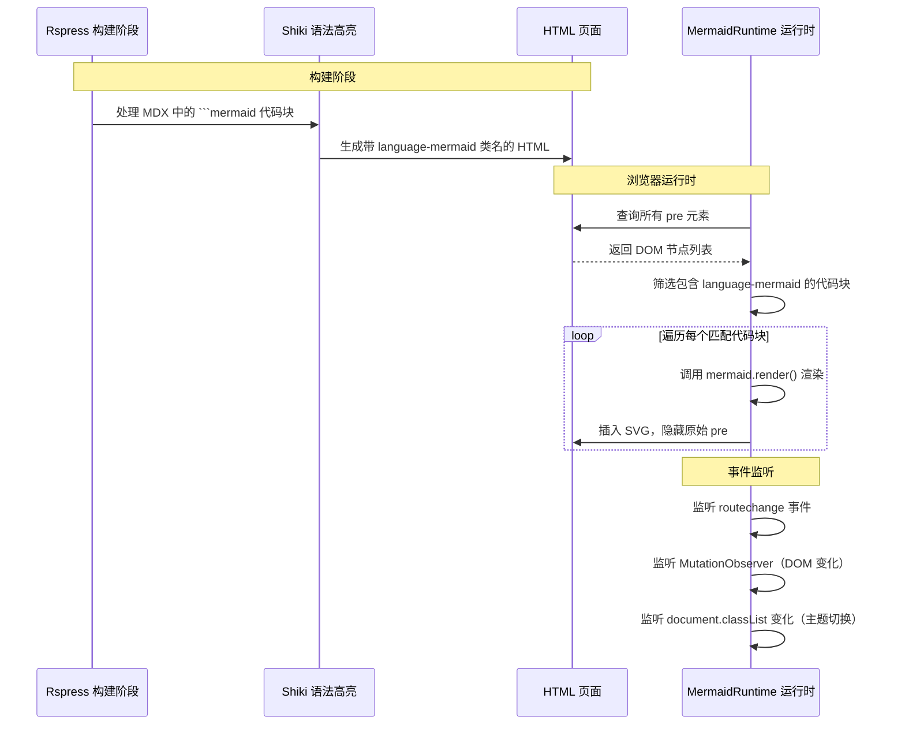

# rspress-plugin-mermaid

Rspress 插件，在文档页面中渲染 Mermaid 图表。

## 功能特性

- 支持所有 Mermaid 图表类型（流程图、时序图、状态图、类图、甘特图等）
- 自动跟随 Rspress 主题（浅色/深色）切换图表主题
- 支持 SPA 路由切换后的图表重渲染
- 响应式 SVG 输出，自适应容器宽度
- 渲染失败时显示友好的错误提示

## 核心原理

### 为什么只对 mermaid 代码块生效？

这是该插件最关键的设计点，理解它有助于你正确使用和调试。

**判断逻辑分为两层：**

**第一层：CSS 类名判断**

Rspress 使用 Shiki 进行代码高亮，Shiki 会在代码块的 `<code>` 元素上添加语言类名。格式为 `language-{语言标识符}`。因此对于 ` ```mermaid ` 代码块，Shiki 会生成：

```html
<pre>
  <code class="language-mermaid">
    flowchart TD
      A --> B
  </code>
</pre>
```

运行时脚本通过检查 `code.className` 是否包含 `mermaid` 来识别：

```typescript
const isMermaid = codeClass.includes('language-mermaid') ||
                 codeClass.includes('mermaid') ||
                 pre.getAttribute('data-language') === 'mermaid';
```

**第二层：内容前缀兜底**

如果某些情况下 Shiki 没有正确添加类名（例如自定义主题或 Shiki 配置覆盖），脚本还会检查代码内容是否以 Mermaid 图表类型关键字开头：

```typescript
if (!isMermaid && !codeContent.trim().startsWith('flowchart') &&
    !codeContent.trim().startsWith('sequenceDiagram') &&
    !codeContent.trim().startsWith('stateDiagram') &&
    // ... 更多图表类型
   ) {
  continue; // 跳过此代码块，不处理
}
```

**为什么不处理其他代码块？**

因为这两层判断都需要明确匹配。对于 ` ```java ` 或 ` ```python ` 的代码块：
- 第一层：`code.className` 是 `language-java`，不包含 `mermaid`
- 第二层：代码内容是 Java 代码，不会以 `flowchart` 等关键字开头

两个条件都不满足，脚本直接 `continue` 跳过。所以无论页面上有多少其他语言的代码块，这个插件都不会触碰它们。

### 整体工作流程



### 架构组件

| 文件 | 作用 |
|---|---|
| `index.ts` | 插件入口，定义 `pluginMermaid` 函数，注册全局样式和运行时组件 |
| `MermaidRuntime.tsx` | React 运行时组件，通过 `useEffect` 在浏览器端执行图表渲染逻辑 |
| `mermaid.css` | 图表样式，覆盖 Mermaid 默认样式以适配 Rspress 主题 |

### 为什么用 globalUIComponents 而不是 MDX 组件？

常见的 Mermaid 插件实现方式是提供 `<Mermaid>` MDX 组件，用户在文档中写 `<Mermaid>flowchart TD ...</Mermaid>`。

本插件的设计不同：它**不需要用户改变写法**，仍然使用标准的三引号代码块语法：

```md

```

这带来两个好处：
1. **IDE 友好**。三引号代码块在任何 Markdown 编辑器中都有语法高亮和自动补全，而自定义 MDX 组件通常没有。
2. **文档可移植**。如果将来迁移到其他文档框架（VitePress、Docusaurus 等），这些代码块依然是有意义的内容。

代价是必须在运行时用 JavaScript 动态渲染，而 MDX 组件方案可以在构建期完成渲染。

## 使用方式

### 安装与配置

在 `rspress.config.ts` 中引入并注册插件：

```typescript title="rspress.config.ts"
import { defineConfig } from 'rspress';
import { pluginMermaid } from './plugins/mermaid';

export default defineConfig({
  plugins: [pluginMermaid()],
});
```

### 配置选项

```typescript
interface MermaidPluginOptions {
  /** 浅色主题下的默认图表主题 */
  theme?: 'default' | 'forest' | 'neutral' | 'base';
}
```

主题会在用户未切换深色模式时使用。切换到深色模式时，图表会自动切换为 `dark` 主题。

### 支持的图表类型

插件支持 Mermaid 的所有图表类型。只需在代码块中写入对应的 Mermaid 语法：

| 图表类型 | 关键字 | 示例 |
|---|---|---|
| 流程图 | `flowchart` / `graph` | `flowchart TD\n  A --> B` |
| 时序图 | `sequenceDiagram` | `sequenceDiagram\n  A->>B: Hello` |
| 状态图 | `stateDiagram` | `stateDiagram-v2\n  [*] --> A` |
| 类图 | `classDiagram` | `classDiagram\n  class Foo` |
| 甘特图 | `gantt` | `gantt\n  title 测试` |
| 饼图 | `pie` | `pie\n  "A": 50` |
| 关系图 | `erDiagram` | `erDiagram\n  CUSTOMER \|\|--o{ ORDER` |
| Git 图表 | `gitGraph` | `gitGraph\n  commit id: "A"` |
| 思维导图 | `mindmap` | `mindmap\n  root 子孙` |
| 时间线 | `timeline` | `timeline\n  A: 2024` |
| 架构图 | `architecture` | `architecture\n  group api` |
| 用户旅程 | `journey` | `journey\n  title 我的历程` |
| 桑基图 | `sankey` | `sankey\n  A, B, 10` |

### 与 Rspress 内置 Mermaid 插件的区别

Rspress 从 v1.3 开始内置了 `@rspress/plugin-md-mermaid` 插件。本插件与内置插件的区别：

| 特性 | 内置插件 | 本插件 |
|---|---|---|
| 配置方式 | `config/mermaid` | `plugins: [pluginMermaid()]` |
| 主题切换 | 需手动配置 | 自动跟随 Rspress 主题 |
| SPA 支持 | 需额外处理 | 内置 MutationObserver |
| 样式定制 | 受限 | 可修改 `mermaid.css` |

如果内置插件已满足需求，优先使用内置插件。本插件适合需要深度定制或使用特定 Mermaid 版本的场景。

## 调试

### 确认代码块被识别

打开浏览器开发者工具，在控制台执行：

```javascript
document.querySelectorAll('pre code.language-mermaid').length
```

如果返回 `0`，说明 Shiki 没有正确添加类名，检查 `rspress.config.ts` 中的 Shiki 配置。

### 确认插件注入成功

检查页面 DOM 中是否存在 `data-mermaid-processed` 属性：

```javascript
document.querySelectorAll('[data-mermaid-processed]').length
```

### 手动触发重新渲染

在控制台执行：

```javascript
window.dispatchEvent(new Event('routechange'));
```

等待 300ms 后页面上的图表会重新渲染。

## 常见问题

### 图表在生产环境无法渲染

确保插件路径正确。如果将插件放在项目根目录下的 `plugins/mermaid`，确保 `rspress.config.ts` 中使用了正确的相对路径：

```typescript
import { pluginMermaid } from './plugins/mermaid';
```

### 深色模式下图表仍是浅色

检查页面 `<html>` 元素是否有 `dark` 类或 `data-theme="dark"` 属性。插件监听的是 `document.documentElement.classList` 变化。如果你的主题使用其他方式切换深色模式，可能需要修改 `MermaidRuntime.tsx` 中的主题检测逻辑。

### 图表渲染错位或被截断

这是 Mermaid 与 Rspress 样式冲突的已知问题。本插件通过 `mermaid.css` 中的样式覆盖尽量缓解，但某些复杂的图表布局仍可能出现溢出。可通过自定义 CSS 覆盖 `.mermaid-diagram` 和 `.mermaid-wrapper` 的样式来调整。
